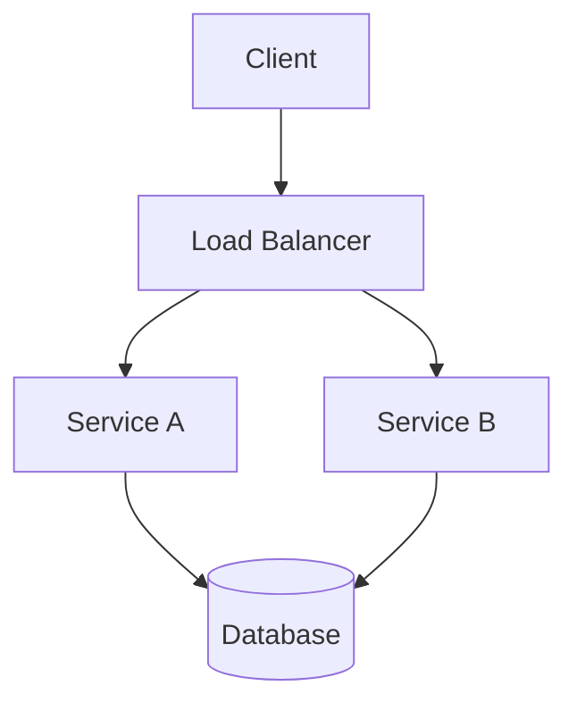

# Contributing to System Engineer Handbook

Thank you for your interest in contributing! This handbook is a community-driven resource for system engineers, network engineers, and aspiring candidates. Your contributions help keep it accurate, current, and useful.

---

## Ways to Contribute

### Content Contributions
- **Fix errors** — Typos, broken links, outdated commands, incorrect examples
- **Add depth** — Expand sections that feel rushed, add real-world context
- **New sections** — Cover topics not yet addressed (e.g., eBPF, WebAssembly, serverless patterns)
- **Case studies** — Add new real-world architecture analyses
- **Exercises** — Create practice problems with solutions
- **Translations** — Help translate to other languages

### Code & Tooling
- **Example code** — Working, tested snippets in multiple languages
- **Diagrams** — Mermaid, PlantUML, or Excalidraw diagrams
- **Scripts** — Automation for validation, link checking, formatting
- **CI/CD** — Improve build and deployment pipelines

### Review & Feedback
- **Technical review** — Validate accuracy of new content
- **Clarity feedback** — Identify confusing sections
- **Prerequisite mapping** — Suggest better learning paths

---

## Contribution Process

### 1. Find or Create an Issue
- Check existing issues for related work
- Create a new issue describing the proposed change
- For small fixes (typos, broken links), you can skip this and go straight to PR

### 2. Fork and Branch
```bash
git clone https://github.com/your-org/system-engineer-handbook.git
cd system-engineer-handbook
git checkout -b feat/your-feature-name
# or
git checkout -b fix/your-fix-description
```

### 3. Make Changes
- Follow the style guide below
- Test any code examples
- Update related cross-references
- Add yourself to CONTRIBUTORS.md if first contribution

### 4. Validate
```bash
# Check links
make link-check

# Validate markdown
make lint

# Build site (if applicable)
make build
```

### 5. Submit Pull Request
- Reference the issue number
- Describe what changed and why
- Include screenshots for visual changes
- Request review from maintainers

---

## Style Guide

### Writing Style
- **Audience**: Engineers with 2+ years experience
- **Tone**: Professional, practical, opinionated but justified
- **Structure**: Concept → Diagram/Code → Trade-offs → Exercises
- **Depth**: "Why" not just "what" — include failure modes, operational reality

### Formatting
- **Headers**: ATX style (`#`, `##`, `###`)
- **Code blocks**: Fenced with language hint (` ```python `)
- **Diagrams**: Mermaid preferred, PlantUML accepted
- **Tables**: Pipe-delimited markdown tables
- **Links**: Relative for internal, absolute for external
- **Images**: Place in `assets/images/`, reference relatively

### Terminology
- Use consistent terms (see [Glossary](../appendices/glossary.md))
- Define acronyms on first use: "Service Level Objective (SLO)"
- Prefer "primary/replica" over "master/slave"
- Prefer "allowlist/denylist" over "whitelist/blacklist"

### Code Examples
- **Complete but minimal** — Runnable without external dependencies
- **Commented** — Explain non-obvious parts
- **Idiomatic** — Follow language best practices
- **Tested** — Include `pytest`, `go test`, or equivalent in CI

### Diagrams

- Use Mermaid for flowcharts, sequence diagrams, state diagrams
- Keep diagrams readable at 800px width
- Include text fallback description

---

## Content Standards

### Accuracy
- Verify against official documentation
- Version-specific claims must note version
- Distinguish between "generally true" and "always true"
- Mark deprecated patterns clearly

### Completeness
- Each chapter: Objectives → Concepts → Diagrams → Code → Exercises → References
- Exercises must have solutions or clear evaluation criteria
- Cross-references must resolve

### Practicality
- Favor production-ready patterns over theoretical ideals
- Include operational concerns (monitoring, deployment, debugging)
- Call out common pitfalls and anti-patterns
- Provide concrete numbers where possible

### Attribution
- Cite sources for non-obvious claims
- Link to original papers, docs, blog posts
- Credit inspiration from other resources
- This handbook builds on work from:
  - [system-design-primer](https://github.com/donnemartin/system-design-primer)
  - [system-design](https://github.com/karanpratapsingh/system-design)
  - [awesome-system-design-resources](https://github.com/ashishps1/awesome-system-design-resources)
  - [System-Engineer-Cheat-Sheets](https://github.com/nduytg/System-Engineer-Cheat-Sheets)
  - [Agile Model-Based Systems Engineering Cookbook](https://github.com/PacktPublishing/Agile-Model-Based-Systems-Engineering-Cookbook)

---

## Review Process

### Maintainer Responsibilities
- Respond to PRs within 5 business days
- Ensure style guide compliance
- Verify technical accuracy
- Merge when at least one maintainer approves

### Reviewer Guidelines
- Be constructive and specific
- Distinguish between "must fix" and "suggest improvement"
- Check for consistency with existing chapters
- Validate code examples compile/run

---

## Code of Conduct

This project follows the [Contributor Covenant Code of Conduct](https://www.contributor-covenant.org/version/2/1/code_of_conduct/). By participating, you agree to uphold this code.

### Summary
- Be respectful and inclusive
- Welcome newcomers and help them succeed
- Focus on technical merit, not personal attributes
- Gracefully accept constructive criticism
- Report unacceptable behavior to maintainers

---

## Recognition

Contributors are recognized in:
- `CONTRIBUTORS.md` file
- Release notes for significant contributions
- Annual contributor spotlight (with permission)

---

## Questions?

- Open a [Discussion](https://github.com/your-org/system-engineer-handbook/discussions)
- Join our [Discord community](https://discord.gg/system-engineer)
- Email: contributors@system-engineer-handbook.dev

---

> **Thank you** for helping make this handbook better for engineers everywhere!