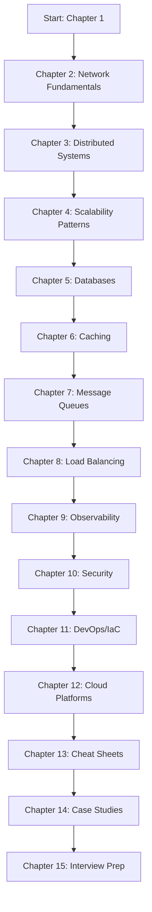

# System & Network Engineering Handbook

> **A Comprehensive Professional Guide for System Engineers, Network Engineers, and Aspiring Candidates**

[](LICENSE)
[](CHANGELOG.md)
[](CONTRIBUTING.md)

---

## 📖 About This Handbook

This handbook is a **curated, production-ready reference** designed for:

- **System Engineers** building scalable, reliable distributed systems
- **Network Engineers** designing and operating modern network infrastructures
- **Platform Engineers** building developer platforms and internal tooling
- **SREs/DevOps Engineers** focusing on reliability, observability, and automation
- **Interview Candidates** preparing for system design and network engineering interviews
- **Engineering Managers** needing technical depth for architectural decisions

### 🎯 Learning Objectives

By completing this handbook, you will:

1. **Master system design fundamentals** — from requirements gathering to production deployment
2. **Design resilient distributed systems** — understanding CAP theorem, consistency models, consensus algorithms
3. **Build scalable architectures** — horizontal scaling, caching, partitioning, load balancing strategies
4. **Operate production systems** — monitoring, alerting, incident response, chaos engineering
5. **Secure systems end-to-end** — network security, application security, zero-trust architecture
6. **Automate infrastructure** — IaC, CI/CD, GitOps, platform engineering practices
7. **Ace technical interviews** — structured approach to system design questions

---

## 📚 Table of Contents

### **Part I: Foundations**

| Chapter | Title | Est. Time | Status |
|---------|-------|-----------|--------|
| 1 | [System Design Fundamentals](./chapters/01-system-design-fundamentals.md) | 3-4 hrs | ✅ |
| 2 | [Network Engineering Fundamentals](./chapters/02-network-engineering-fundamentals.md) | 3-4 hrs | ✅ |
| 3 | [Distributed Systems Concepts](./chapters/03-distributed-systems-concepts.md) | 4-5 hrs | ✅ |

### **Part II: Core Architecture Patterns**

| Chapter | Title | Est. Time | Status |
|---------|-------|-----------|--------|
| 4 | [Scalability & Performance Patterns](./chapters/04-scalability-performance-patterns.md) | 3-4 hrs | ✅ |
| 5 | [Database Design & Selection](./chapters/05-database-design-selection.md) | 4-5 hrs | ✅ |
| 6 | [Caching Strategies](./chapters/06-caching-strategies.md) | 2-3 hrs | ✅ |
| 7 | [Message Queues & Event-Driven Architecture](./chapters/07-message-queues-event-driven.md) | 3-4 hrs | ✅ |
| 8 | [Load Balancing & Traffic Management](./chapters/08-load-balancing-traffic-management.md) | 2-3 hrs | ✅ |

### **Part III: Production Operations**

| Chapter | Title | Est. Time | Status |
|---------|-------|-----------|--------|
| 9 | [Monitoring, Observability & Alerting](./chapters/09-monitoring-observability-alerting.md) | 3-4 hrs | ✅ |
| 10 | [Security Fundamentals](./chapters/10-security-fundamentals.md) | 3-4 hrs | ✅ |
| 11 | [DevOps, CI/CD & Infrastructure as Code](./chapters/11-devops-cicd-iac.md) | 3-4 hrs | ✅ |
| 12 | [Cloud Platforms (AWS, GCP, Azure)](./chapters/12-cloud-platforms.md) | 4-5 hrs | ✅ |

### **Part IV: Reference & Practice**

| Chapter | Title | Est. Time | Status |
|---------|-------|-----------|--------|
| 13 | [System Engineer Cheat Sheets](./chapters/13-cheat-sheets.md) | 2-3 hrs | ✅ |
| 14 | [Real-World Case Studies](./chapters/14-case-studies.md) | 3-4 hrs | ✅ |
| 15 | [Interview Preparation Guide](./chapters/15-interview-preparation.md) | 3-4 hrs | ✅ |

### **Appendices**

| Appendix | Title |
|----------|-------|
| A | [Glossary of Terms](./appendices/glossary.md) |
| B | [Recommended Resources & References](./appendices/resources.md) |
| C | [Architecture Decision Record Templates](./appendices/adr-templates.md) |
| D | [System Design Checklist](./appendices/system-design-checklist.md) |

---

## 🚀 Quick Start

### For Self-Study (Recommended Path)



### For Interview Preparation (Focused Path)

1. **Week 1**: Chapters 1, 3, 4, 5 — Core system design concepts
2. **Week 2**: Chapters 6, 7, 8 — Key components (cache, queue, LB)
3. **Week 3**: Chapters 9, 10, 14 — Production concerns + case studies
4. **Week 4**: Chapter 15 — Practice problems & mock interviews

### For Network Engineers Transitioning to Systems

1. **Start**: Chapter 2 (review), Chapter 1, Chapter 3
2. **Focus**: Chapters 4, 8, 9, 11, 12
3. **Practice**: Chapter 14 (network-heavy case studies), Chapter 15

---

## 📖 How to Use This Handbook

### As a Reference
- Use the **cheat sheets (Ch. 13)** for quick lookups during design reviews
- Reference **ADR templates (Appendix C)** for documenting architectural decisions
- Use the **system design checklist (Appendix D)** before proposing architectures

### As a Course
- Each chapter includes: **Learning objectives**, **key concepts**, **diagrams**, **code examples**, **exercises**, **further reading**
- Complete the **exercises** at the end of each chapter
- Build the **capstone project** (see [Capstone Guide](./CAPSTONE.md))

### As Interview Prep
- Chapter 15 contains **50+ practice problems** with solutions
- Use the **STAR framework** (Situation, Task, Action, Result) for behavioral questions
- Practice **whiteboard design** with the templates in Appendix D

---

## 🛠 Prerequisites

### Required Knowledge
- **Programming**: Proficiency in at least one language (Go, Python, Java, Rust)
- **Linux/Unix**: Command line, processes, filesystem, permissions, networking basics
- **Databases**: SQL fundamentals, basic NoSQL concepts
- **Networking**: OSI/TCP-IP models, DNS, HTTP/HTTPS, TLS

### Recommended Background
- **Cloud**: Basic AWS/GCP/Azure console navigation
- **Containers**: Docker fundamentals, Kubernetes concepts
- **Version Control**: Git workflows, branching strategies
- **CI/CD**: Pipeline concepts (GitHub Actions, GitLab CI, Jenkins)

### Tools You'll Need
```bash
# Development
docker, docker-compose
kubectl, kind/k3d/minikube
terraform, tofu
git, gh/glab

# Observability
prometheus, grafana
jaeger/zipkin
elk/loki

# Network
wireshark, tcpdump
iperf3, netperf
curl, httpie, jq
```

---

## 🤝 Contributing

We welcome contributions! See [CONTRIBUTING.md](./CONTRIBUTING.md) for guidelines.

### Ways to Contribute
- 🐛 **Report bugs** or inaccuracies
- 📝 **Add content** — case studies, examples, exercises
- 🌍 **Translate** to other languages
- 🎨 **Improve diagrams** (Mermaid, PlantUML, Excalidraw)
- 🔗 **Add references** to latest tools, papers, blog posts

### Content Standards
- **Accuracy**: Verify against official documentation
- **Clarity**: Write for engineers with 2+ years experience
- **Depth**: Include "why" not just "what" — trade-offs, failure modes
- **Practicality**: Production-ready patterns, not theoretical ideals
- **Citations**: Link to sources (papers, docs, reputable blogs)

---

## 📄 License

This work is licensed under the **MIT License** — see [LICENSE](./LICENSE) for details.

> **Attribution**: This handbook draws inspiration and structure from excellent community resources:
> - [system-design-primer](https://github.com/donnemartin/system-design-primer) by Donne Martin
> - [system-design](https://github.com/karanpratapsingh/system-design) by Karan Pratap Singh
> - [awesome-system-design-resources](https://github.com/ashishps1/awesome-system-design-resources) by Ashish Patel
> - [System-Engineer-Cheat-Sheets](https://github.com/nduytg/System-Engineer-Cheat-Sheets) by Nguyen Duy
> - [Agile Model-Based Systems Engineering Cookbook](https://github.com/PacktPublishing/Agile-Model-Based-Systems-Engineering-Cookbook) by Packt Publishing

---

## 🙏 Acknowledgments

Special thanks to the open-source community, platform engineers, and system designers who share their knowledge publicly. This handbook stands on the shoulders of giants.

---

## 📞 Support & Community

- **Discussions**: [GitHub Discussions](https://github.com/your-org/system-engineer-handbook/discussions)
- **Issues**: [GitHub Issues](https://github.com/your-org/system-engineer-handbook/issues)
- **Discord**: [Community Server](https://discord.gg/system-engineer)
- **Newsletter**: [Monthly Digest](https://system-engineer-handbook.substack.com)

---

> **"The best way to predict the future is to design it."** — *Alan Kay*

*Start your journey: [Chapter 1: System Design Fundamentals](./chapters/01-system-design-fundamentals.md)*