# Appendix E: Exercise Solutions and Evaluation Guides

> **Status:** Complete — Chapters 1–15  
> **Last reviewed:** 2026-08-31  
> **Purpose:** Worked examples, evaluation criteria, and defensible alternatives

---

## How to Use This Appendix

Attempt an exercise before reading its solution. These are reference solutions,
not answer keys: production design depends on requirements, failure assumptions,
team capability, and measured behavior. A strong answer must state assumptions,
show its reasoning, identify failure modes, and define how the design will be
validated.

### Evaluation Scale

| Level | Evidence expected |
|-------|-------------------|
| Foundation | Correct concepts, units, terminology, and explicit assumptions |
| Applied | Coherent design, operational workflow, failure handling, and measurable acceptance criteria |
| Advanced | Alternatives, trade-offs, rollback/reconciliation, security, cost, and validation under failure |

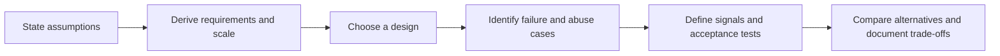

---

## Chapter 1 — System Design Fundamentals

### Solution 1.1 — Requirements Clarification

A useful first five questions for the URL shortener are:

1. Which operations are required: create, redirect, custom alias, update,
   delete, expiration, and analytics?
2. What are average and peak create/redirect rates, geographic distribution,
   growth horizon, and expected popularity skew?
3. What redirect availability and latency SLOs apply, and may a redirect serve
   stale data during a dependency failure?
4. Can destinations change or be deleted, and how quickly must cache and edge
   copies reflect that change?
5. What abuse, privacy, retention, data-residency, and cost constraints apply?

A professional discovery session also establishes ownership, launch scope,
recovery objectives, analytics accuracy, and the definition of an active user.
“Global” and “real time” are not requirements until quantified.

### Solution 1.2 — Scale Estimation

#### Assumptions

| Input | Assumption |
|-------|------------|
| Active users | 100 million/day |
| Creates | 5/user/day |
| Redirects | 50/user/day |
| Peak factor | 3× average, to be replaced by measured traffic |
| URL record | 520 bytes logical |
| Index overhead | 40% of row data |
| Replication | 3 copies |
| Redirect response | 500 bytes excluding transport overhead |
| Retention | URL records retained for one year |

```text
creates/day = 100M × 5 = 500M
average create QPS = 500M / 86,400 ≈ 5,787
peak create QPS = 5,787 × 3 ≈ 17,361

redirects/day = 100M × 50 = 5B
average redirect QPS = 5B / 86,400 ≈ 57,870
peak redirect QPS = 57,870 × 3 ≈ 173,610

logical rows/year = 500M × 365 × 520 bytes ≈ 94.9 TB
with 40% index overhead ≈ 132.9 TB
with three copies ≈ 398.6 TB

average redirect payload = 57,870 × 500 bytes ≈ 28.9 MB/s
peak redirect payload = 173,610 × 500 bytes ≈ 86.8 MB/s
```

This is a lower-bound model. Database page overhead, WAL, backups, cache fill,
TLS/IP headers, analytics events, inter-zone traffic, and compaction are separate
drivers. The 3× peak factor is an assumption, not a safety standard.

### Solution 1.3 — API Design

```http
POST   /v1/urls
GET    /r/{slug}
GET    /v1/urls/{slug}
GET    /v1/urls?cursor={cursor}&limit=50
DELETE /v1/urls/{slug}
GET    /v1/urls/{slug}/analytics?from={time}&to={time}&cursor={cursor}
```

Create requests include an authenticated owner when available, destination,
optional alias/expiry, and `Idempotency-Key`. The server binds the key to the
caller and request fingerprint and rejects reuse with different content.

```protobuf
service UrlCommandService {
  rpc CreateUrl(CreateUrlRequest) returns (CreateUrlResponse);
  rpc DeleteUrl(DeleteUrlRequest) returns (DeleteUrlResponse);
}

service RedirectEventService {
  rpc PublishRedirect(RedirectEvent) returns (PublishResult);
}
```

Redirect lookup should not synchronously wait for analytics. Emit an event to a
bounded buffer or durable stream according to the acceptable analytics-loss
budget. Deletion needs authorization, audit evidence, cache invalidation, and a
documented edge-propagation objective.

### Solution 1.4 — Architecture Choice

| Criterion | Weight | Modular monolith | Microservices | Serverless |
|-----------|-------:|-----------------:|--------------:|-----------:|
| Delivery speed | 25% | 9 | 5 | 8 |
| Operational simplicity | 20% | 8 | 3 | 7 |
| Independent redirect scaling | 20% | 5 | 9 | 9 |
| Predictable high-volume cost | 15% | 8 | 6 | 4 |
| Failure isolation | 10% | 5 | 9 | 8 |
| Team autonomy | 10% | 5 | 9 | 6 |
| **Weighted score** | **100%** | **7.1** | **6.4** | **7.2** |

**Recommendation:** begin with a modular deployment if the team is small and
traffic is not yet proven. Keep the redirect path, creation path, and analytics
pipeline as explicit modules with separate SLOs. Extract the redirect service
when its scale, deployment cadence, or failure-isolation need is measured.

Serverless narrowly wins this illustrative scoring, but the result changes with
provider pricing, latency distribution, concurrency quotas, and team expertise.
The matrix exposes assumptions; it does not make the decision automatically.

---

## Chapter 2 — Network Engineering Fundamentals

### Solution 2.1 — Subnet Design

Allocate largest networks first and keep space for growth.

| Purpose | CIDR | Usable range | Broadcast |
|---------|------|--------------|-----------|
| Web tier | `10.0.0.0/23` | `10.0.0.1`–`10.0.1.254` | `10.0.1.255` |
| App tier | `10.0.2.0/23` | `10.0.2.1`–`10.0.3.254` | `10.0.3.255` |
| DB tier | `10.0.4.0/24` | `10.0.4.1`–`10.0.4.254` | `10.0.4.255` |
| Management | `10.0.5.0/25` | `10.0.5.1`–`10.0.5.126` | `10.0.5.127` |
| P2P 1 | `10.0.5.128/30` | `.129`–`.130` | `.131` |
| P2P 2 | `10.0.5.132/30` | `.133`–`.134` | `.135` |
| P2P 3 | `10.0.5.136/30` | `.137`–`.138` | `.139` |
| P2P 4 | `10.0.5.140/30` | `.141`–`.142` | `.143` |
| P2P 5 | `10.0.5.144/30` | `.145`–`.146` | `.147` |

On platforms supporting RFC 3021, `/31` may be preferable for point-to-point
links. Before allocation, verify cloud-reserved addresses, route summarization,
overlap with connected networks, failure domains, and projected growth.

### Solution 2.2 — BGP Path Selection

Route B wins because its `LOCAL_PREF` is 200 while A and C are 100. Local
preference is evaluated before AS-path length in the common decision process.
MED is normally compared only among paths from the same neighboring AS unless
policy changes that behavior, so it does not rescue A or C here.

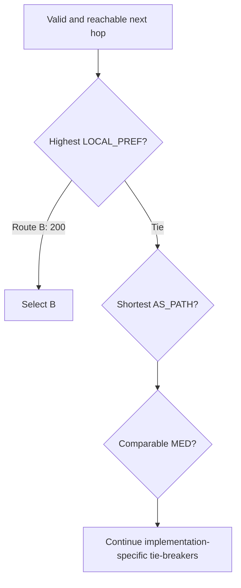

The complete answer must mention that vendor defaults and explicit routing
policy can insert or reorder decision criteria.

### Solution 2.3 — TCP Loss Estimate

Using the exercise's simplified formula:

```text
MSS = 1,460 bytes
RTT = 0.100 seconds
p = 0.15

B = (1,460 / 0.100) × (1 / sqrt(0.15))
  ≈ 37,697 bytes/s
  ≈ 302 kbit/s
```

This is an order-of-magnitude Reno-style loss model, not a BBR prediction. It
omits the usual constant, timeout behavior, receiver window, pacing, and loss
pattern. A 15% loss rate is severe: first investigate congestion, radio quality,
MTU, faulty links, or policing. Compare CUBIC and BBR with controlled `iperf3`
tests and packet captures; do not infer either result from this formula alone.

### Solution 2.4 — TLS 1.3 mTLS Migration ADR

**Decision:** support TLS 1.3 and TLS 1.2 during a measured compatibility phase,
then remove TLS 1.2 only after all required clients and intermediaries pass.
Automate workload certificate issuance and rotation; authorize the workload
identity separately from successful mTLS authentication.

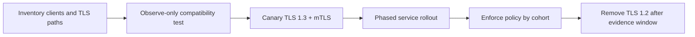

**Risks:** unsupported libraries/middleboxes, clock skew, trust-bundle mismatch,
certificate expiry, identity-policy errors, added handshake CPU, and loss of
debug visibility. **Rollback:** retain dual-protocol listeners and the previous
trust bundle during the migration window; rollback policy and routing without
reissuing every identity. **Acceptance:** handshake/error/latency metrics,
certificate-expiry alerts, negative authorization tests, and rotation tests pass.

### Solution 2.5 — Intermittent 10-Second Connection

Investigate from the client-visible timeline rather than guessing a layer:

1. Capture DNS, connect, TLS, time-to-first-byte, and total time separately.
2. Segment results by resolver, address family, region, ISP, edge, and backend.
3. Correlate slow samples with packet loss/retransmission, route changes, load
   balancer logs, backend saturation, and dependency traces.
4. Reproduce from multiple controlled vantage points.
5. Change one variable and verify the latency distribution, not one request.

| Hypothesis | Evidence | Typical remediation |
|------------|----------|---------------------|
| Broken IPv6 path with IPv4 fallback | Slow AAAA attempts; fast forced IPv4 | Repair IPv6 routing/PMTU; tune client fallback only as mitigation |
| DNS timeout or unhealthy resolver | Long DNS phase, resolver-specific failures | Fix delegation/health, add resilient authoritative/resolver design |
| Packet loss or MTU black hole | Retransmits, missing ICMP PTB, large packets stall | Correct MTU/MSS and allow required ICMP |
| Cold or overloaded backend | High upstream connect/TTFB and saturation | Readiness, warming, capacity, load shedding |
| Retry/timeout amplification | Repeated attempts near fixed deadlines | End-to-end deadline and bounded retry budget |

---

## Chapter 3 — Distributed Systems Concepts

### Solution 3.1 — Consistency Selection

| Scenario | Starting requirement | Reasoning |
|----------|----------------------|-----------|
| Bank transfer | Serializable transaction or invariant-preserving equivalent | Debit and credit must not violate conservation; retries need idempotency |
| Social post visibility | Read-your-writes for author; eventual propagation for most feeds | Global immediacy is usually not worth synchronous fanout latency |
| Flash-sale inventory | Atomic conditional reservation per stock unit | Prevent oversell; availability may be reduced for the contested item |
| User preferences | Session/read-your-writes, then eventual replication | User should see their update while regional copies converge |
| DNS | Bounded-staleness cache behavior governed by TTL | Availability and distribution are favored; change propagation is not immediate |

Consistency is selected per invariant and operation, not once for the entire
system.

### Solution 3.2 — IoT CAP Trade-off

At 100 million messages/second, ingestion should remain available during a
regional partition when readings are independently mergeable. Devices write to
regional durable logs using device ID as the partition key. Each event carries
device ID, device sequence, event time, ingestion time, schema version, and a
globally unique event ID.

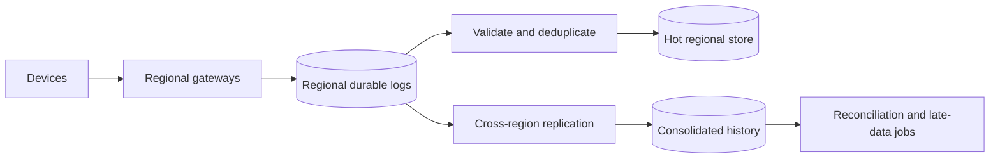

Control-plane operations such as ownership transfer, firmware rollout, or
alert acknowledgement may require quorum/CP behavior. Data-plane recovery uses
retained logs, idempotent consumers, sequence-gap detection, and reconciliation.
Cost is dominated by ingress, replication, retention, and cardinality; sampling
or aggregation must preserve the product's safety and audit requirements.

### Solution 3.3 — Raft Simulation

Use a deterministic virtual clock and explicit message queue. Model follower,
candidate, and leader states; randomized election deadlines; terms; votes; and
heartbeats. Required invariants:

- at most one leader is elected per term;
- a node grants at most one vote per term;
- a minority partition cannot elect a leader;
- a former leader steps down after observing a higher term;
- election eventually succeeds when a stable majority can communicate.

Test a five-node cluster as well as the requested three-node cluster: isolate
the leader with one follower (minority), verify the other three elect a leader,
then heal and ensure the old leader steps down. Deterministic event traces make
failures reproducible.

### Solution 3.4 — Travel Booking Saga

Use orchestration because compensations, deadlines, and customer-visible state
span three providers.

| Forward step | Durable state | Compensation |
|--------------|---------------|--------------|
| Create itinerary | `PENDING` | Mark failed/cancelled |
| Reserve flight | Flight hold ID and expiry | Release flight hold |
| Reserve hotel | Hotel hold ID and expiry | Release hotel hold |
| Reserve car | Car hold ID and expiry | Release car hold |
| Confirm payment/bookings | Provider confirmations | Refund/void and cancel where contract permits |

Each command has an idempotency key; every response is persisted before the
next command. Compensation may fail and therefore has its own retry policy,
deadline, alert, and manual-reconciliation queue. The UI exposes `PENDING`,
`CONFIRMED`, `CANCELLING`, `PARTIALLY_FAILED`, and `CANCELLED` instead of
pretending the workflow is one ACID transaction.

### Solution 3.5 — Payment Idempotency

Use a client-generated opaque random key (UUIDv4 is sufficient) scoped to
merchant/account and operation. UUIDv7 may improve index locality but exposes
rough creation order; the key is not an authorization credential.

```text
UNIQUE(account_id, operation, idempotency_key)
stored value:
  request_hash, state, payment_id, response_code, response_body,
  created_at, expires_at
```

Acquire by atomically inserting the key in PostgreSQL. On conflict:

- same request hash + completed state → return the stored response;
- same request hash + in progress → return/poll the existing operation;
- different request hash → reject as misuse.

Redis may accelerate lookups but is not the correctness boundary. Retain the
record for at least the maximum client retry and payment reconciliation window;
financial references may require longer retention under policy. A unique
constraint resolves concurrent requests, and a reconciliation job handles an
unknown outcome between the external processor and local commit.

---

## Chapter 4 — Scalability and Performance Patterns

### Solution 4.1 — Scale-Out Plan

Do not extract services while the primary database is already the measured
bottleneck. Progress through evidence gates:

| Phase | Change | Exit criterion | Rollback |
|-------|--------|----------------|----------|
| 1 | Profile queries, remove N+1 access, add justified indexes, bound pools | p99 and DB saturation meet SLO at target peak | Drop/revert indexes only after plan validation |
| 1 | Cache measured read-hot data and add request coalescing | Origin remains safe during cache failure test | Disable cache feature flag |
| 1 | Add replicas for stale-tolerant reads | Replica lag stays inside read contract | Route affected reads to primary |
| 2 | Extract only a distinct scaling/failure boundary | Independent load test and deploy reduce the measured constraint | Route back to monolith; preserve compatible schema |
| 3 | Shard after vertical/index/archival limits are proven | Rebalance, hot-key, backup and cross-shard tests pass | Dual-read verification and reversible routing during migration |

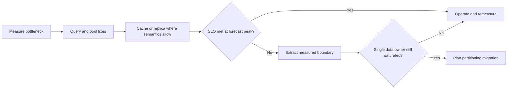

Timeline is driven by gates, not calendar promises. Each phase requires load
replay, one-instance failure, rollback rehearsal, and cost comparison.

### Solution 4.2 — SaaS Sharding Key

Start with `tenant_id` because the dominant isolation and access boundary is a
tenant. Use consistent hash or directory-based placement from tenant to shard;
the directory allows large tenants to receive dedicated shards without changing
their logical key.

| Requirement | Design response |
|-------------|-----------------|
| Tenant-local queries | Composite keys beginning with `tenant_id` |
| Uneven tenant size | Placement directory and dedicated shards for whales |
| 1B events | Partition within tenant by time/bucket only when one tenant exceeds a shard |
| Isolation | Per-tenant quotas, encryption context, audit, optional dedicated database |
| Rebalancing | Versioned placement, copy/catch-up/verify/cutover workflow |

Validate tenant-size distribution, peak QPS per tenant, cross-tenant analytics,
and regulatory placement before selecting the physical shard count.

### Solution 4.3 — Product Catalog Cache

Use CDN/browser caching for public representations, a regional distributed cache
for SKU reads, and an optional small in-process cache for immutable reference
data. Publish versioned invalidation events after the authoritative commit.

For an illustrative 2 KB cached representation and 10 million SKUs:

```text
logical hot-set ceiling = 10M × 2 KB = 20 GB
with 30% allocator/key overhead = 26 GB
with two copies = 52 GB
```

Do not cache all SKUs automatically. Measure the popularity curve and size the
hot set. Use jittered TTL, stale-while-revalidate where staleness is permitted,
negative caching for bounded misses, and request coalescing. Flash-price data
gets a separate key/version and stricter invalidation objective.

### Solution 4.4 — Search Latency Investigation

1. Confirm the SLI definition and segment p99 by region, query class, tenant,
   release, cache status, and backend.
2. Compare the week-over-week change in traffic, result size, cache hit rate,
   index/query plan, CPU/GC, queueing, downstream latency, and error/retry rate.
3. Use traces to identify the span that grew; use profiles/query plans at that
   component rather than optimizing the entire request.
4. Test likely causes with bounded experiments: revert release, force cache
   bypass/hit, replay a query cohort, or compare old/new query plans.
5. Mitigate first, verify SLI recovery, then establish root cause and prevention.

### Solution 4.5 — CQRS and Event Sourcing for Audit

Use an append-only event store with aggregate ID, sequence, event ID, event type,
schema version, actor, correlation/causation IDs, occurred/recorded timestamps,
and payload. Enforce uniqueness on `(aggregate_id, sequence)`.

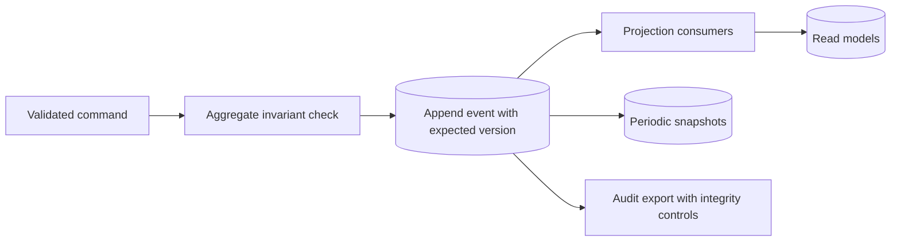

Projections are disposable and rebuildable. Snapshot only to reduce replay cost;
never make it the audit source. Upcast old events or version handlers without
rewriting history. Test deterministic replay, duplicate delivery, poison events,
projection lag, and recovery from a corrupted read model.

---

## Chapter 5 — Database Design and Selection

### Solution 5.1 — Database Shortlists

| Workload | Starting shortlist | Decision evidence |
|----------|--------------------|-------------------|
| Banking ledger | PostgreSQL or evaluated distributed SQL | Serializable invariants, audit, failover and reconciliation |
| IoT telemetry | Wide-column/time-series store plus object archive | Partition/write rate, retention, downsampling and late data |
| Social feed | KV/wide-column feed store plus durable event log | Fanout model, hot users, ranking and staleness |
| Product search | Search engine fed from product source of truth | Relevance, facets, indexing lag and rebuild |
| Real-time analytics | Columnar OLAP plus streaming ingestion | Query shape, ingest, freshness and retention |
| Shopping cart | Relational or strongly consistent KV | Conditional updates, expiry, merge and checkout invariant |

These are shortlists, not automatic winners. Benchmark representative data and
failure behavior before committing.

### Solution 5.2 — Schema Design Patterns

For multi-tenant SaaS, put `tenant_id` in every tenant-owned primary/unique key
and index; enforce tenant context in authorization and optionally row-level
security. For commerce, separate `orders`, immutable `order_lines`, `payments`,
and inventory reservations; do not overwrite the product price used by an order.
For IoT, partition by bounded time range and device bucket, retain raw data for a
defined period, and write downsampled aggregates through replayable jobs.

| Access path | Example index/partition |
|-------------|-------------------------|
| Recent tenant users | `(tenant_id, created_at DESC, id)` |
| Order history | `(tenant_id, customer_id, created_at DESC, id)` |
| Active reservation expiry | Partial index on `expires_at` for active rows |
| Device time range | Partition by time; index `(device_id, event_time)` |

### Solution 5.3 — Database Migration

Both migrations use assess → schema conversion → bulk copy → CDC catch-up →
shadow verification → cohort cutover → rollback window. PostgreSQL-to-distributed
SQL also tests isolation differences, unsupported SQL, sequences, hotspots, and
cross-region latency. MySQL-to-Vitess tests VSchema/routing, shard key quality,
cross-shard queries, resharding, and operational ownership.

Cut over only when row counts, checksums by stable ranges, business aggregates,
CDC lag, error rate, and performance meet thresholds. Keep the old system
authoritative until rollback no longer meets the agreed RPO; after that point,
rollback becomes a forward reconciliation migration rather than a DNS switch.

### Solution 5.4 — Slow PostgreSQL Query

First capture `EXPLAIN (ANALYZE, BUFFERS)` safely on representative data. Useful
indexes may include `users(created_at, id) INCLUDE (email)` and
`orders(user_id)`; whether they help depends on selectivity and table statistics.

```sql
SELECT u.id, u.email, COUNT(o.id) AS order_count
FROM users AS u
LEFT JOIN orders AS o ON o.user_id = u.id
WHERE u.created_at > $1
GROUP BY u.id, u.email
ORDER BY order_count DESC
LIMIT 100;
```

If most users qualify, pre-aggregate order counts or maintain a rebuildable
summary. Never estimate the improvement without the old/new execution plans,
buffer reads, runtime distribution, write overhead, and representative load.

### Solution 5.5 — Financial DR

RPO 0 must define acknowledged transactions and failure scope. Use synchronous
replication to a failure-independent site where latency permits, quorum/fencing
to prevent dual primary, immutable backups plus PITR for corruption, and a
tested promotion runbook. Global routing changes only after the new primary is
writable and dependencies/keys/policies are validated.

The five-minute RTO includes detection, decision, fencing, promotion, dependency
checks, routing, application recovery, and validation. Quarterly or risk-based
game days must prove the objective; measure actual RPO/RTO and reconcile external
payment side effects after recovery.

---

## Chapter 6 — Caching Strategies

### Solution 6.1 — Pattern Selection

| Scenario | Starting pattern | Key concern |
|----------|------------------|-------------|
| Product catalog | Cache-aside + event invalidation | Popularity skew and update propagation |
| User session | Authoritative distributed session store | Security, expiry and revocation |
| Shopping cart | Durable source + versioned cache | Concurrent tabs and checkout correctness |
| API response | HTTP cache/CDN where authorization permits | `Vary`, tenant scope and invalidation |
| Search result | Cache-aside by normalized query/version | Cardinality and low reuse |

### Solution 6.2 — Stampede Protection

Use staggered TTLs, stale-while-revalidate, and one refresh owner per key. Other
requests receive acceptable stale content or a bounded response; they do not all
wait on the origin. Add negative caching and an origin concurrency budget.

```text
if fresh: return value
if stale-but-servable:
    try acquire short refresh lease
    if acquired: refresh asynchronously with fencing/version check
    return stale value
if missing: coalesce callers behind one bounded origin request
```

Test simultaneous expiry at 10K QPS, Redis loss, slow origin, refresh-owner
death, and a hot key. Acceptance is based on origin load and user SLO, not hit
ratio alone.

### Solution 6.3 — Price Invalidation

Use `product:{id}:price:{version}` or a product representation carrying a price
version. Commit the authoritative price and an outbox event atomically; consumers
invalidate regional/L1 keys. Flash-sale reads may require direct authoritative
validation at checkout even when browsing uses a short, jittered TTL.

Monitor invalidation age, event lag, stale-price detections, origin load, and
version mismatch. Reconcile by scanning source versions against cached metadata.

### Solution 6.4 — Multi-Tier Global Cache

| Tier | Suitable data | Invalidation |
|------|---------------|--------------|
| Browser/CDN | Public immutable/versioned assets and safe GET responses | Versioned URL, purge for exceptions |
| Edge compute | Regional public or correctly partitioned variants | Tag/version event and bounded TTL |
| In-region cache | Hot database objects and computed results | Outbox event, version check, TTL fallback |

Never cache private responses at a shared tier without correct cache keys and
headers. A deletion/privacy workflow needs a measured purge objective across all
tiers and evidence that failed purges are retried.

### Solution 6.5 — L1 Coherence

After committing the database update, publish an invalidation through a durable
outbox. Each instance evicts the key; L1 values also have bounded TTL and carry a
source version. During a pub/sub partition, instances may serve only within the
declared staleness window or bypass L1 for correctness-sensitive reads. During
Redis loss, use request coalescing and origin budgets rather than unrestricted
database fallback. A periodic version/reconciliation check repairs missed events.

---

## Chapter 7 — Message Queues and Event-Driven Architecture

### Solution 7.1 — Pattern Selection

| Scenario | Candidate | Reason |
|----------|-----------|--------|
| Image jobs | Durable work queue | Competing consumers, retry and DLQ |
| Multiplayer state | Purpose-built low-latency pub/sub | Freshness often matters more than replay |
| Trade audit | Durable replicated event log + immutable archive | Ordered partition history and retention |
| Notifications | Queue per channel/priority | Provider isolation, rate control and retry |
| IoT telemetry | Partitioned streaming log | High ingest, replay and consumer groups |

### Solution 7.2 — Idempotent Order Consumer

In one database transaction, insert the event/business key into a table with a
unique constraint and apply the order transition. A conflict means the outcome
already exists. Advance the broker offset only after commit, or store the source
offset in the same transaction and derive consumption from it. Retry transient
failures with jitter; quarantine permanent schema/business failures with original
metadata, owner, replay tooling, and audit.

### Solution 7.3 — Backpressure

At 200K records/s and 5K records/s per consumer, the theoretical minimum is 40
fully utilized consumers. At a 65% target utilization:

```text
required consumers = ceil(200,000 / (5,000 × 0.65)) = 62
```

Partition count must support the required parallelism and key-order constraint.
Scale on lag age and processing rate, not lag count alone. Apply producer quotas,
bounded in-flight work, batch tuning, pause/resume, priority isolation, and an
admission policy when retention could expire before recovery.

### Solution 7.4 — Cross-Region Reliability

Prefer independent regional clusters with asynchronous replication for disaster
recovery unless synchronous cross-region latency is explicitly acceptable.
Define topic ownership, replicated topics, consumer offset translation, schema
registry recovery, duplicate behavior, and failback.

Broker loss inside a region should use in-sync replica election according to the
durability policy. Producers use bounded retries/idempotence; consumers may
reprocess and therefore remain idempotent. A regional failover is declared only
after fencing the old writer or establishing conflict handling. Regular drills
measure data lag, RTO, duplicate rate, and reconciliation completeness.

---

## Chapter 8 — Load Balancing and Traffic Management

### Solution 8.1 — Algorithm Selection

Use least-request/least-connections with slow-start and outlier detection as the
starting point because request duration varies from 50 ms to four seconds. Plain
round robin can accumulate long requests on unlucky backends. Validate with the
real protocol: multiplexed HTTP/2 connections may make connection count a weak
proxy, so active-request or latency-aware balancing can be better.

### Solution 8.2 — Health Checks

Liveness checks only process-local deadlock/progress. Readiness checks whether
the instance can serve its traffic class; do not restart it merely because
PostgreSQL or Redis is unavailable. Use a shallow frequent probe plus a deeper
synthetic/dependency monitor. Derive interval, timeout, and thresholds from the
detection objective and flapping risk. Test dependency loss, probe storms, slow
responses, recovery, and partial pool removal.

### Solution 8.3 — Global Routing

Route reads to the nearest healthy region only when replica lag satisfies the
read contract. Route writes to the US primary through an explicit write hostname
or L7 operation policy. During US failure, freeze writes unless a replica has
been promoted after fencing and its RPO is accepted; then update write routing.

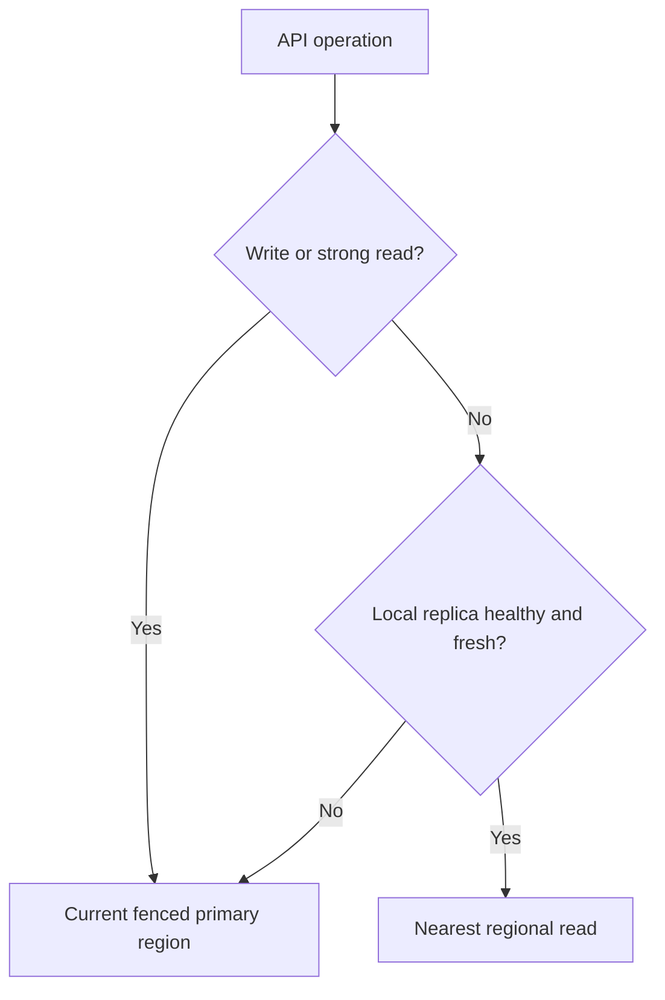

### Solution 8.4 — Post-Scale Latency

Compare old/new cohorts for cold caches/JIT, image or config differences,
readiness timing, connection storms, database pool multiplication, retry load,
CPU throttling, DNS/service discovery, and uneven balancing. Trace edge → LB →
queue → application → dependency, correlate saturation and upstream timing, then
remove the new cohort or reduce traffic as a safe mitigation. Verify recovery
before selecting the root cause.

### Solution 8.5 — Reverse Proxy Design

Use separate listeners for HTTP redirect and TLS; route normalized paths to
explicit upstreams; reject ambiguous paths/headers; set end-to-end deadlines and
body/header limits. Rate-limit primarily by authenticated identity, with guarded
IP fallback. WAF rules are risk-reduction controls, not complete OWASP Top 10
protection. Readiness, slow-start, draining, structured access logs, metrics, and
trace propagation are mandatory operational elements.

Validate configuration syntax, negative routing/auth tests, canary traffic,
large/slow requests, backend loss, certificate rotation, drain behavior, and
rollback to the previous signed configuration artifact.

---

## Chapter 9 — Monitoring, Observability, and Alerting

### Solution 9.1 — Checkout SLIs, SLOs, and Error Budget

Define eligibility before choosing targets. Count valid checkout attempts at the
API boundary; exclude explicitly documented client errors such as malformed
requests, but count server errors, timeouts, and invalid dependency responses.
Do not silently exclude overload or deployments.

| Signal | Proposed objective | Measurement |
|--------|--------------------|-------------|
| Availability | 99.95% successful eligible requests over rolling 30 days | Good events / eligible events |
| Latency | 99% below 300 ms and 99.9% below 1 s over rolling 30 days | Successful requests measured at gateway |
| Saturation | No SLO; alerting indicator | Queue age, worker utilization, pool wait, CPU throttling |

At a constant 150,000 requests/minute for 30 days:

```text
eligible requests = 150,000 × 60 × 24 × 30 = 6,480,000,000
bad-event fraction = 1 - 0.9995 = 0.0005
availability error budget = 6,480,000,000 × 0.0005 = 3,240,000 requests
```

This request-based budget is not “21.6 minutes of downtime.” That time value is
the equivalent only for a time-based 99.95% objective under continuous traffic.
Compute latency budgets separately: up to 1% may exceed 300 ms, while only 0.1%
may exceed 1 s.

Page on sustained, multi-window error-budget burn with user impact; create a
business-hours ticket for slow burn. A burn rate of 1 consumes the entire budget
at exactly the SLO-window rate. Use paired short/long windows to resist spikes,
and tune thresholds against replayed incidents rather than copying constants.
Saturation alerts page only when they predict imminent SLO impact and have an
actionable runbook. Review the SLO after traffic mix or product semantics change.

### Solution 9.2 — Payment Logging Schema

Use a versioned schema and stable event names. Required fields include timestamp,
severity, service/version/environment, event name and schema version, trace/span
IDs, request ID, payment/merchant references, operation, outcome, error class,
duration, region, and retry attempt. Tokenize or hash identifiers when correlation
does not require clear text.

```json
{"timestamp":"2026-08-31T09:15:22.418Z","severity":"INFO","service.name":"payment-api","service.version":"4.8.2","deployment.environment":"prod","event.name":"payment.authorized","event.schema_version":"1.0","trace_id":"4bf92f3577b34da6a3ce929d0e0e4736","span_id":"00f067aa0ba902b7","request_id":"req_7c2f","payment_id":"pay_018f","merchant_id_hash":"sha256:7f...","currency":"EUR","amount_minor":2599,"provider":"provider_a","outcome":"success","duration_ms":184,"region":"eu-west","retry_attempt":0}
```

```json
{"timestamp":"2026-08-31T09:16:03.091Z","severity":"WARN","service.name":"payment-api","service.version":"4.8.2","deployment.environment":"prod","event.name":"payment.authorization_failed","event.schema_version":"1.0","trace_id":"9a...","span_id":"31...","request_id":"req_7c30","payment_id":"pay_0190","merchant_id_hash":"sha256:7f...","provider":"provider_a","outcome":"failure","error.type":"provider_timeout","error.retryable":true,"duration_ms":2002,"region":"eu-west","retry_attempt":1}
```

Never log PAN, CVV, secrets, bearer tokens, raw JWTs, or unrestricted provider
bodies. Amounts need a documented policy because they may be sensitive business
data. Apply allow-list serialization, redaction tests, access controls, retention,
tamper evidence, and deletion/legal-hold policy. Metrics should carry bounded
labels; high-cardinality IDs belong in logs/traces.

### Solution 9.3 — OpenTelemetry Call Chain

```mermaid
sequenceDiagram
    participant C as Client
    participant G as API Gateway
    participant U as User Service
    participant D as PostgreSQL
    C->>G: HTTP request + trace context
    activate G
    Note over G: SERVER span: HTTP route
    G->>G: INTERNAL span: validate JWT
    G->>U: CLIENT span + propagated context
    activate U
    Note over U: SERVER span: GetUser
    U->>D: CLIENT span: SELECT users
    D-->>U: result
    U-->>G: user response
    deactivate U
    G-->>C: HTTP response
    deactivate G
```

Follow stable OpenTelemetry semantic conventions: record normalized HTTP route,
method, response status, server address, service identity/version, deployment
environment, and database system/operation. Avoid raw URLs, SQL values, JWTs,
email addresses, and unbounded tenant/user attributes. Add events for meaningful
state changes such as `jwt.validation_failed` or `db.retry`; ordinary function
calls do not need spans. Mark span status as error only when the operation itself
failed, and record a sanitized exception.

Continue an accepted `traceparent`; generate a new trace when absent or invalid.
Use a low baseline head-sampling rate for healthy traffic plus collector-side tail
sampling for errors and slow/rare paths, while preserving coherent trace decisions
and capacity limits. Security audit logs remain independently durable because
trace sampling can discard them. Validate propagation, cardinality, redaction,
sampling bias, and telemetry behavior when the collector is unavailable.

### Solution 9.4 — Deployment Latency Incident

1. Declare impact from the p99 SLI, identify owner, freeze rollout, and compare
   new versus old instances. Roll back or remove the new cohort if safe.
2. Check request rate, errors, latency distribution, saturation, queueing, and
   dependency health. Segment by release, route, region, tenant, and instance.
3. Select slow trace exemplars from the affected cohort and locate the span that
   grew. Correlate trace IDs with structured logs and deployment/config events.
4. Test leading hypotheses: query-plan/index change, cache miss, cold runtime,
   connection-pool expansion, CPU throttling, GC, lock contention, retries, or a
   larger response. Change one variable at a time.
5. Verify p99 and error-budget burn recovery, then preserve evidence and write a
   causal timeline, contributing factors, and prevention actions.

Average latency can remain healthy while p99 is broken. A rollback that restores
service proves mitigation correlation, not necessarily the root cause.

### Solution 9.5 — Alert Classification

| Candidate | Class | Rationale and action |
|-----------|-------|----------------------|
| Checkout burns availability budget rapidly across short and long windows | Page | Active user impact; responder can mitigate traffic or release |
| TLS certificate expires in 21 days and automated renewal has failed | Business-hours ticket | Ample lead time; owner repairs renewal before urgency |
| Backup restore drill checksum mismatch | Ticket | Durability risk needs tracked remediation, but no current outage |
| One pod restarted once; service SLO and capacity remain healthy | Suppress | Non-actionable symptom already handled by orchestration |
| Payment settlement reconciliation exceeds its contractual deadline | Page | Time-critical financial/business invariant even if HTTP is healthy |

“Ticket” and “business-hours ticket” may be the same queue with different SLA.
Every retained alert needs an owner, user or business impact, threshold rationale,
runbook, deduplication, and escalation path. Review noisy and never-firing alerts
after incidents and at a fixed cadence.

---

## Chapter 10 — Security Fundamentals

### Solution 10.1 — Payment API STRIDE Model

Trust boundaries exist at client → edge, edge → service, service → payment
provider, service → database/queue, and operator → production control plane.

| STRIDE | Example threat | Primary controls |
|--------|----------------|------------------|
| Spoofing | Stolen customer or workload token | Phishing-resistant MFA for staff, short-lived tokens, workload identity, audience/issuer validation |
| Tampering | Amount/currency changed in transit or queue | TLS, server-side price calculation, signed/provider-bound messages, schema validation, immutable audit |
| Repudiation | Merchant disputes issuing a refund | Authenticated actor, correlation IDs, append-only audit, trusted timestamps, retention |
| Information disclosure | PAN/token appears in logs or traces | Data minimization, tokenization, field allow-list, encryption, scoped access |
| Denial of service | Expensive authorize calls exhaust pools/provider quota | Edge quotas, identity limits, bounded queues, deadlines, load shedding |
| Elevation of privilege | Support role invokes refund/admin endpoint | Deny-by-default object/action authorization, separation of duties, just-in-time elevation |

Implementation also requires replay protection and idempotency for money-moving
operations, dependency threat modeling, key rotation, negative authorization
tests, abuse cases, and explicit PCI DSS scope. Revisit the model after changes
to data flow, identity, provider integration, or trust boundaries.

### Solution 10.2 — Zero-Trust Admin Access

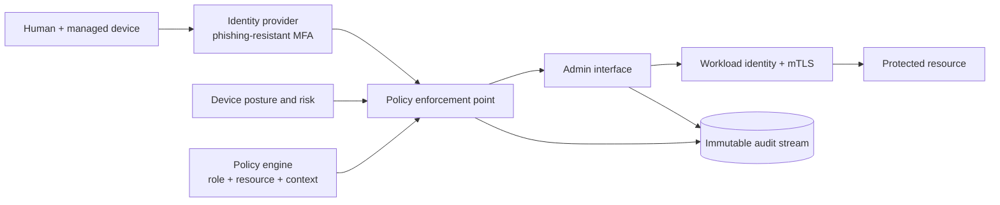

Network location grants no implicit trust. The enforcement point evaluates human
identity, managed-device posture, requested resource/action, session risk, and
time-bound entitlement. Use short sessions, reauthentication for destructive
actions, just-in-time roles, approval for high-impact changes, and workload
identity between services. Authorization is checked on every relevant request,
not only at login.

Record actor, device, policy decision/reason, target, action, result, change or
ticket reference, and trace ID without recording credentials. Contain breach with
resource-level policies, separate admin planes, rapid session/credential revoke,
egress restrictions, canary credentials, and rehearsed break-glass accounts that
are offline-protected and heavily alerted. This follows NIST's resource- and
identity-centered model rather than a trusted-network perimeter.

### Solution 10.3 — Secrets Lifecycle

| Dependency | Preferred credential | Rotation and failure behavior |
|------------|----------------------|-------------------------------|
| PostgreSQL | Dynamic, short-lived DB role | Renew before expiry; drain old connections; overlap only for migration window |
| Redis | Workload identity or scoped ACL credential | Dual credential slots if supported; fail closed for writes requiring auth |
| Payment gateway | Provider API key/mTLS key | Create-test-switch-revoke; preserve idempotency and stop unsafe retries |
| Analytics | Write-only scoped token | Buffer within bounded policy or drop approved telemetry; never block payment |

Provision secrets through an authenticated workload identity into memory or a
restricted ephemeral volume; never bake them into images, source, Terraform
state, logs, or environment dumps. Inventory owner, purpose, scope, creation,
expiry, last use, rotation capability, and revocation evidence. Rotation is a
state machine: issue → distribute → verify new → shift → observe → revoke old →
prove rejection. Audit metadata and access, not secret values.

### Solution 10.4 — Production Audit and Rotation

Automate inventory reconciliation, expiry/unused detection, policy checks,
issuance, application reload, canary validation, revocation, and evidence export.
Require human approval for root/tenant-wide credentials, irreversible provider
changes, break-glass use, and exceptions beyond policy; routine low-risk rotation
should not wait for a person.

If the secret manager is temporarily unavailable, existing unexpired credentials
may continue from a protected in-memory cache for a bounded period. New workloads
fail closed unless an explicitly risk-accepted sealed emergency path exists.
Never fall back to a static credential embedded in configuration. Define which
business operations degrade, stop, or buffer; alert before leases expire.

Test rotation under load, partial rollout, consumer restart, old-key revocation,
manager outage, regional isolation, and clock skew. Exceptions require owner,
risk, compensating controls, expiry date, approval, and automatic escalation.

---

## Chapter 11 — DevOps, CI/CD, and Infrastructure as Code

### Solution 11.1 — Stateless API Delivery Pipeline

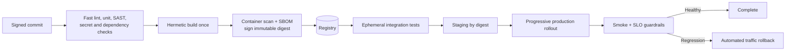

Promote the same signed digest; do not rebuild per environment. Use ephemeral CI
identity, protected production promotion, provenance, policy-as-code, migration
compatibility checks, and environment-specific configuration outside the image.
Rollback traffic to the previous known-good digest, but forward-fix database
changes that are not backward compatible. Test rollback and credential failure.

Measure the current five DORA delivery metrics in context: change lead time,
deployment frequency, failed deployment recovery time, change fail rate, and
deployment rework rate. Use them to improve one system over time, not as team
quotas or comparisons between unlike services.

### Solution 11.2 — Multi-Account AWS Terraform

```text
live/
  organization/                 # OUs, accounts, organization policies
  shared-network/prod/          # transit, inspection, DNS, shared endpoints
  workloads/prod/payment-api/   # composition root, pinned module versions
  workloads/stage/payment-api/
modules/
  network-spoke/
  kubernetes-or-compute/
  database/
  observability-baseline/
  service-stack/
```

Separate production, non-production, security/log archive, and shared-network
accounts; subdivide by blast radius and ownership rather than creating accounts
only from environment names. CI assumes narrowly scoped deployment roles through
federated identity. Organization policies, region restrictions, encryption,
mandatory tags, public-access prohibitions, and logging are preventative controls.

Use a remote backend with encryption, versioning, access logging, recovery, and
state locking supported by that backend. Keep state boundaries small enough to
limit credentials, lock contention, and blast radius; never expose sensitive
outputs casually. Pin providers/modules, review plans, apply only the reviewed
commit, and detect drift. A module represents a reusable capability; environment
directories compose it without a maze of conditional flags.

### Solution 11.3 — Production Kubernetes GitOps

```text
app-source/          application, tests, image build
platform-config/     cluster add-ons and policies by cluster
delivery-config/
  base/payment-api/
  environments/dev/
  environments/stage/
  environments/prod-eu/
```

CI builds/signs the image and opens a promotion change that updates an immutable
digest. Review and policy checks precede merge; the in-cluster reconciler pulls
the desired state. Promote a tested artifact through environments rather than
merging long-lived environment branches. Separate application, platform, and
secret references by ownership; encrypting a secret in Git does not eliminate
access, rotation, or audit requirements.

Use canary or blue/green traffic with analysis of SLOs and business invariants.
Rollback is a reviewed Git revert or controller-supported abort to the previous
digest; emergency changes must be immediately captured back into Git. Database
migrations use expand/migrate/contract and remain compatible with both releases.
Test reconciliation, bad manifests, controller outage, failed canary, and revert.

### Solution 11.4 — Drift Control

| Drift source | Detection | Response |
|--------------|-----------|----------|
| Manual object edit | Continuous GitOps reconciliation and audit event | Revert safe fields; alert repeated/high-risk edits |
| Mutable image tag | Admission policy and registry evidence | Reject; require digest and verified signature |
| Missing security policy | Admission plus scheduled conformance scan | Block new workload; carefully remediate existing workload |
| Runtime mutation/compromise | Runtime detection and workload identity telemetry | Isolate/redeploy; preserve forensic evidence |
| Cloud resource change | Scheduled IaC plan and provider audit logs | Reviewed remediation; never blind auto-delete |

Enforce namespaces, resource requests/limits, non-root execution, allowed
registries, network policy, and privileged-capability restrictions at admission.
Continuously reconcile declarative state and run deeper hourly/daily conformance
checks according to risk. Auto-remediate only reversible, well-tested cases;
destructive or stateful corrections require review.

An exception is a versioned policy object with requester, justification, exact
scope, compensating controls, approver, expiry, and ticket. It is visible in the
same reports, automatically expires, and cannot become an undocumented permanent
allow-list.

---

## Chapter 12 — Cloud Platforms

### Solution 12.1 — AWS Multi-Tier Application

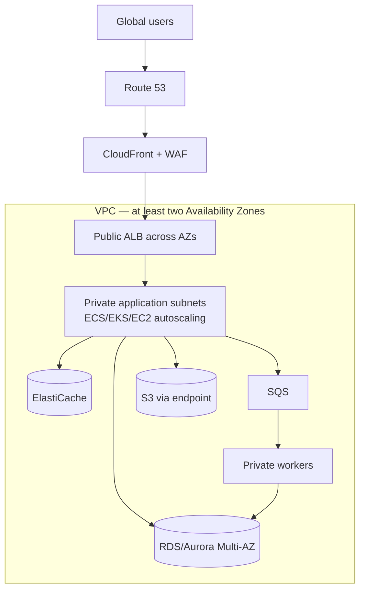

Only the edge/load-balancer tier is public. Application, worker, cache, and
database resources use private subnets and least-privilege security groups; use
private service endpoints where practical and controlled per-AZ egress where
needed. Route 53 supplies DNS/health policy, CloudFront edge delivery, WAF L7
filtering, and ALB L7 routing. Choose ECS, EKS, or EC2 from workload and team
requirements—not fashion. SQS decouples work; ElastiCache serves only data whose
consistency model permits caching; RDS/Aurora owns relational truth.

Multi-AZ protects against selected zonal failures, not regional disaster or
application defects. Define backups, restore tests, quotas, encryption/key
recovery, observability, and cost allocation. Load-test dependency loss and a
full-AZ evacuation.

### Solution 12.2 — Multi-Region Payment Recovery

Use two independently deployable, multi-zone regions. Active/passive is the safer
starting point when payment writes require a single ordered authority. Global
routing sends normal traffic to the active region; the standby receives database
replication, required configuration, images, keys, provider allow-listing, and
continuous synthetic checks.

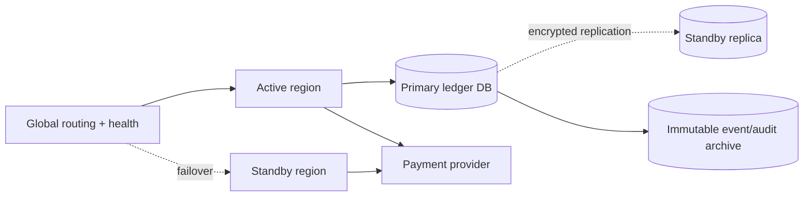

Define RPO/RTO per failure mode and choose synchronous or asynchronous replication
from those requirements and measured latency. Data residency may prohibit copying
customer/payment data outside an approved jurisdiction; deploy jurisdictional
stamps rather than bypassing policy. Global health must test the transaction path,
not only return HTTP 200.

Failover: declare incident → stop/fence old writers → assess replication loss →
promote standby → validate keys, dependencies, sequences and provider connectivity
→ enable writes for a canary → shift traffic → reconcile unknown payment outcomes.
Failback is a planned migration after the old region is rebuilt and resynchronized.
Regular game days must measure real RPO, RTO, duplicates, and reconciliation.

### Solution 12.3 — Multi-Cloud Governance

Create separate production, non-production, security/logging, and connectivity
accounts/projects/subscriptions in each cloud, grouped under organization-level
management. A central platform team owns federation, policy baselines, network
transit, DNS, audit export, and cost taxonomy; workload teams own explicitly
delegated service boundaries.

Use hub-and-spoke connectivity per cloud with redundant private interconnects or
VPN as appropriate. Do not create one unrestricted transitive network across all
environments: segment routes, inspect controlled crossings, prevent overlapping
CIDRs, and test loss of the hub. Federate workforce identity from one IdP using
short-lived role assumption; use native workload identity within each provider
instead of distributing cross-cloud long-lived keys.

Apply equivalent outcomes—not superficially identical products—for encryption,
logging, public exposure, region allow-lists, vulnerability policy, backups, and
break-glass access. Normalize mandatory owner/product/environment/cost-center tags,
export billing to a common model, allocate shared costs explicitly, set anomaly
alerts and budgets, and retain provider-native detail. Multi-cloud needs a stated
business reason because it adds policy, networking, skills, and recovery cost.

### Solution 12.4 — PostgreSQL and Kafka Managed Migration

1. **Discover:** inventory versions, extensions, SQL, storage/IOPS, replication,
   Kafka protocols, topics, partitions, retention, schemas, ACLs, throughput, and
   client compatibility. Select managed offerings only after gap analysis.
2. **Prepare:** create private connectivity, identities, encryption, monitoring,
   backups, quotas, parameter baselines, schemas/topics, and capacity tests.
3. **Move:** bulk-load PostgreSQL, then CDC/logical replication; replicate Kafka
   topics with offsets/keys/timestamps preserved where tooling supports it.
4. **Verify:** compare stable-range row counts/checksums and business aggregates;
   compare topic end offsets, keyed samples, schema compatibility, ordering scope,
   consumer lag, and end-to-end side effects.
5. **Cut over:** freeze incompatible changes, reduce DNS/client cache where useful,
   drain or pause writers, reach the agreed lag, switch a canary cohort, then all
   producers and consumers. Observe through a defined soak period.

Rollback while reverse synchronization is proven and divergence is inside the
agreed RPO; triggers include correctness mismatch, sustained SLO failure, missing
features, or unrecoverable lag. After both systems accept independent writes, a
simple endpoint rollback is unsafe—reconcile or perform a forward migration.

Managed does not remove responsibility for schema design, capacity, access,
backup verification, client compatibility, quotas, or recovery testing. Current
offerings evolve; validate provider limits and migration features during design,
not from a static service-name comparison.

### Verification Sources for Chapters 9–12

- [Google SRE — The Art of SLOs](https://sre.google/static/pdf/art-of-slos-handbook-a4.pdf)
- [OpenTelemetry semantic conventions](https://opentelemetry.io/docs/concepts/semantic-conventions/)
- [NIST SP 800-207 — Zero Trust Architecture](https://csrc.nist.gov/pubs/sp/800/207/final)
- [NIST SP 800-207A — Cloud-Native Zero Trust](https://csrc.nist.gov/pubs/sp/800/207/a/final)
- [HashiCorp — Terraform state and locking](https://developer.hashicorp.com/terraform/language/state/locking)
- [DORA — Current delivery performance metrics](https://dora.dev/guides/dora-metrics/)
- [AWS Well-Architected — Highly available public endpoints](https://docs.aws.amazon.com/wellarchitected/latest/framework/rel_planning_network_topology_ha_conn_users.html)
- [Azure Well-Architected — Reliability targets](https://learn.microsoft.com/en-us/azure/well-architected/reliability/metrics)
- [Google Cloud — Managed Service for Apache Kafka](https://docs.cloud.google.com/managed-service-for-apache-kafka/docs/overview)

---

## Chapter 13 — System Engineer Cheat Sheets

### Solution 13.1 — Payments API Performance Triage

Prioritize preservation of service and evidence before deep diagnosis.

| Time | Action | Evidence or decision |
|------|--------|----------------------|
| 0–5 min | Confirm SLI, customer impact, scope, and error-budget burn; assign incident lead | Is this real, ongoing, and isolated by route/region/version? |
| 5–10 min | Freeze rollout; compare old/new cohorts; rollback a correlated release if safe | Did latency and errors recover without creating data risk? |
| 10–20 min | Check RED signals at load balancer/app and USE signals for runtime | Rate, errors, duration; CPU, memory, GC, throttling, queue/pool wait |
| 20–30 min | Follow slow trace exemplars into database, queue, and network | Which span or wait state accounts for the extra tail latency? |
| 30+ min | Apply bounded mitigation; preserve timeline and evidence | Capacity, load shedding, feature disable, query kill, provider failover |

At the load balancer, inspect target health, retries, response codes, connection
age, uneven distribution, and upstream timing. In the application/runtime, inspect
release/config cohorts, work queues, thread/event-loop pools, GC, CPU throttling,
memory pressure, and deadline propagation. In PostgreSQL, examine pool wait, locks,
slow queries, plan changes, I/O, connections, and replica lag. For messaging,
measure oldest-message age, publish/consume failures, retries, and poison records.
For networking, separate DNS, connect, TLS, retransmission, and time-to-first-byte.

Do not run broad packet captures, restart all instances, flush every cache, or add
unbounded retries during initial triage. Each can destroy evidence or amplify load.

### Solution 13.2 — Feature Flag Service Design

Clarify whether flags control release safety, experiments, entitlements, or
configuration; their consistency and audit needs differ. Assume 80 services,
100 instances each, 1,000 flags, 10 evaluations/request, 20K peak requests/s,
and SDK-local evaluation:

```text
evaluations = 20,000 × 10 = 200,000/s
distribution clients = 80 × 100 = 8,000
```

The evaluation rate is not control-plane QPS when SDKs evaluate a versioned local
snapshot. The service needs a strongly controlled write path and a high-availability
distribution path.

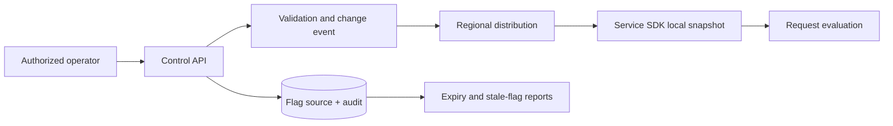

Every flag has owner, purpose, type, targeting schema, default, creation/expiry,
version, and emergency behavior. Writes require authorization, validation,
optimistic concurrency, audit, and progressive rollout. SDKs use streaming or
polling plus version/checksum reconciliation; they retain a last-known-good
snapshot and a safe boot default. A distribution outage must not add a synchronous
dependency to every request.

Test malformed rules, partial propagation, old SDK compatibility, control-plane
loss, snapshot corruption, region isolation, and emergency disable. Monitor
propagation age, connected clients, evaluation errors, stale snapshots, change
rate, flag age, and business guardrails. Flags are temporary operational debt;
automatically report expired and permanently settled flags.

### Solution 13.3 — 02:00 Latency Runbook

```text
Trigger: multi-window latency SLO burn alert
Inputs: dashboard, deploy/config timeline, trace exemplars, service catalog
Authority: incident commander; named application/database/platform responders
```

1. Acknowledge, open the incident channel/timeline, confirm user impact, identify
   the affected routes/regions/releases, and check related availability burn.
2. Freeze changes. If one recent release cohort is worse and rollback is data-safe,
   drain it and revert traffic. Verify recovery against the SLI.
3. If overloaded, shed optional work, enforce admission/rate limits, reduce costly
   features, and scale only when the bottleneck can use capacity safely.
4. If a dependency dominates traces, apply its documented circuit breaker or
   fallback. Do not retry non-idempotent payment operations blindly.
5. Escalate when the error budget, financial invariant, security, or data integrity
   threshold in the incident policy is crossed.

Rollback when the regression is correlated with a reversible release and the
previous version remains schema/protocol compatible. Stop rollback if it could
reverse an irreversible migration, duplicate money movement, or violate a newer
contract; isolate traffic and forward-fix instead.

Post-incident review: impact and SLO consumption, detection, UTC timeline,
technical and organizational contributing factors, what helped/hindered,
mitigation/recovery, evidence-backed causal analysis, and owned actions with due
dates. Validate actions through a test or drill, not document completion alone.

---

## Chapter 14 — Real-World Case Studies

### Solution 14.1 — First Microservice Extraction

Twitter's 2007 engineering account says Rails enabled a very small team to move
quickly and that traffic forced architectural rethinking because a messaging
system differs from a content-management system. It does **not** establish that
Ruby or Rails alone caused the scaling problem, nor does it document every later
service boundary. That distinction matters when extracting lessons.

| Evidence-backed lesson | Application to a first extraction |
|------------------------|-----------------------------------|
| Early delivery economics matter | Keep a modular monolith while team and domain are still changing |
| Workload shape can outgrow a general path | Extract the measured hot path, not arbitrary nouns |
| Architecture evolves with constraints | Define an exit criterion rather than predicting final topology |
| Distribution adds operating cost | Require ownership, SLO, tracing, deployment and on-call readiness |

Choose one boundary with clear ownership and distinct scaling or failure needs.
Create a contract and observability first; move reads, then writes using an
outbox/CDC or another reconciliation-capable migration. Avoid a shared writable
database as the permanent boundary. Canary traffic, compare results, and retain
route-back capability. Success means reduced constraint or improved autonomy
without worse reliability—not a larger service count.

### Solution 14.2 — Meta and X Feed Comparison

Public descriptions are partial and historical, so this is a requirements-driven
comparison rather than a claim about either company's complete 2026 internals.
Meta has publicly described on-demand retrieval from its graph store, extensive
personalized ML ranking, and a general feed stack. X/Twitter's public history
emphasizes messaging/timeline workload and rapid distribution. Both products can
combine materialization, retrieval, caching, and ranking.

| Requirement pressure | Likely architectural consequence |
|----------------------|----------------------------------|
| Highly personalized ranking across graph/context | Retrieve candidates and features, then rank near read time |
| Low-latency chronological following feed | Precompute or incrementally maintain ordinary-user timelines |
| Celebrity/high-fanout producer | Avoid synchronous write fanout to every follower; merge hot posts on read |
| Ads, integrity, freshness, multiple media types | Multi-stage candidate generation/ranking with policy filters |
| Mobile bandwidth and rendering cost | Pagination, prefetch controls, compact payloads, client instrumentation |

The robust answer is hybrid fanout: push for normal relationships, pull/merge for
high-fanout producers and late personalization, then rank and filter. Validate
write amplification, timeline freshness, cache pressure, ranking latency, deleted
content propagation, and behavior for users who follow many celebrity accounts.

### Solution 14.3 — Travel Search and Dispatch

Flights, hotels, and cars resemble marketplace search but are not one inventory
model. Build provider adapters behind a normalized query/result contract, retain
provider-specific attributes, and treat search results as quotes—not reservations.

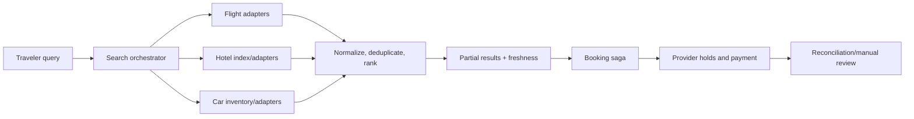

Use parallel calls with end-to-end deadlines, provider-specific concurrency
budgets, circuit breakers, cached/static enrichment, and partial-result semantics.
Ranking considers price, availability confidence, location, policy, and commercial
rules with explainable experiments. Dispatch means selecting providers/adapters
from capability, geography, health, quota, and measured latency—not merely nearest.

Highest risks are stale price/inventory, combinatorial query explosion, provider
outage/rate limits, duplicate booking after unknown outcome, inconsistent location
models, and compensation failure. Mitigate with quote expiry, revalidation before
purchase, request collapsing, bounded expansion, idempotency, durable saga state,
provider confirmation IDs, and reconciliation. Never promise atomic rollback from
an external provider whose contract only offers compensating cancellation.

### Solution 14.4 — Cloudflare July 2, 2019 Outage

Cloudflare's public postmortem reports that a WAF rule containing a poorly
performing regular expression exhausted CPUs across its network after global
deployment. The company rolled back the rule; the postmortem distinguishes the
trigger from process and testing weaknesses.

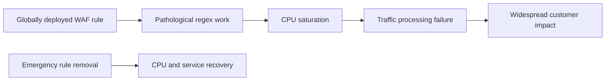

Mapped patterns: unbounded computational work on an untrusted input path,
high-blast-radius configuration deployment, insufficient performance testing,
and failure of progressive delivery. A single “preventive” control is inadequate.
The strongest package is static/complexity analysis plus representative worst-case
benchmarks, a small canary with CPU/SLO guardrails, automatic rollout halt, and a
separate rapid kill path. Per-request execution budgets could reduce impact even
if earlier gates miss a rule. Verify controls by injecting a deliberately expensive
test rule into a non-production and canary environment.

---

## Chapter 15 — Interview Preparation Guide

### Solution 15.1 — 30-Minute Web Crawler Design

Use the first three minutes to clarify scope: general or domain-limited crawl,
freshness, content types, scale, politeness, robots policy, duplicate definition,
and whether indexing/search are included. Example assumptions: discover and fetch
1 billion pages/month, average fetched body 500 KB, 30-day raw retention, and 3×
peak traffic.

```text
average fetch rate = 1B / (30 × 86,400) ≈ 386 pages/s
peak fetch rate ≈ 1,158 pages/s
raw transfer/month ≈ 500 TB before compression/protocol overhead
```

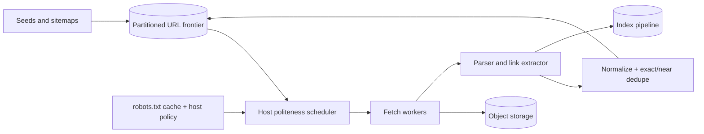

Partition the frontier by normalized host so one scheduler enforces per-host
concurrency and delay. Use DNS and robots caches with policy-aware expiry; RFC
9309 standardizes the Robots Exclusion Protocol, but robots rules are not access
control. Prevent SSRF by blocking private/link-local destinations after every DNS
resolution and redirect, restrict protocols/ports, cap body/time/redirects, and
sandbox parsing. Deduplicate canonical URLs before fetch and content hashes after
fetch; keep discovered/fetched timestamps and retry state durable.

Discuss at-least-once work, idempotent storage, 429/5xx backoff, poison pages,
JavaScript rendering as a costly separate queue, freshness prioritization, and
regional/legal boundaries. Measure frontier age, fetch success/status, bytes,
host fairness, robots failures, duplicate ratio, parser errors, and index lag.

### Solution 15.2 — Behavioral STAR Practice

Prepare four stories rather than inventing one per question: outage/ownership,
ambiguous project, disagreement/influence, and failure/learning. For each, spend
roughly 10% on Situation, 10% on Task, 60% on Actions, and 20% on Results and
learning. The proportions are guidance, not a scoring standard.

The partner checks: Was the candidate's responsibility explicit? Were decisions
and alternatives concrete? Did “we” hide individual contribution? Were results
quantified without fabricated precision? Was the lesson applied later? After each
answer, ask two adversarial follow-ups such as “What would your colleague dispute?”
and “What signal would have changed your decision?” Record, review, shorten, and
repeat the weakest story.

### Solution 15.3 — Three Written Design Answers

Use these compact outlines as evaluation targets; a full answer expands the
riskiest component after requirements and estimates.

| Problem | Core design | Numbers to derive | Deep-dive trade-off |
|---------|-------------|-------------------|----------------------|
| URL shortener | ID/slug service, authoritative mapping store, cache/CDN, async analytics | Create/read QPS, annual rows/bytes, hot-key skew | Mutable destinations versus immutable/versioned caching |
| Chat service | Gateway/session routing, conversation log, per-recipient delivery, push notifications | Concurrent sockets, messages/s, retention, fanout | Ordering per conversation, offline sync, duplicate delivery |
| Metrics platform | Regional ingest, durable log, validation/aggregation, time-series/columnar stores | Samples/s, bytes/day, cardinality, query concurrency | Raw retention versus rollups; tenant quotas and late data |

Every diagram shows clients, API/edge, state ownership, async boundary, and failure
domain. Every answer states consistency, partition key, idempotency, overload,
security, observability, deployment, and disaster recovery. Estimates are derived
from declared assumptions and checked for units; they are not memorized internet
traffic figures.

### Solution 15.4 — Behavioral Mock Interview

Run 40 minutes: 5 minutes context, three 8-minute questions, 6 minutes follow-ups,
and 5 minutes feedback. Cover ownership (“production failure you owned”), ambiguity
(“unclear requirements”), and technical influence (“decision without authority”).

Score 1–4 on structure, individual action, technical judgment, stakeholder/risk
management, evidence of result, reflection, and concise communication. Require the
interviewer to cite a sentence or omission for every score. A strong candidate can
describe disagreement respectfully, acknowledge uncertainty, explain what they
would change, and avoid exposing confidential information. Repeat the lowest
dimension with a different story within one week.

### Solution 15.5 — Three-Month Study Plan

Begin with a timed baseline and select at most three weak dimensions. Example plan:

| Weeks | Focus | Deliberate practice | Exit evidence |
|-------|-------|---------------------|---------------|
| 1–2 | Baseline and fundamentals | Two designs, Linux/network diagnosis, four STAR drafts | Rubric identifies top three gaps |
| 3–4 | Estimation and data | Three 20-minute estimates; DB/cache/queue trade-offs | Units correct; assumptions and invariants explicit |
| 5–6 | Reliability and operations | Incident tabletop, SLO/error budget, DR review | Can propose detection, mitigation, rollback and test |
| 7–8 | Architecture depth | Four timed designs; one written ADR per week | Alternatives compared with measurable criteria |
| 9–10 | Communication | Weekly peer mock plus behavioral recording | Answers fit timebox; follow-ups remain structured |
| 11 | Full simulation | Two complete interview loops under realistic timing | No critical rubric dimension below target |
| 12 | Consolidation | Reattempt baseline, review errors, taper workload | Demonstrated improvement and sustainable review list |

Track attempts and rubric dimensions, not hours watched. Use spaced reattempts and
an error log. If scores plateau for two cycles, change feedback source or exercise
type. Keep one rest day weekly and reduce volume before interviews; fatigue is not
evidence of readiness.

### Verification Sources for Chapters 13–15

- [X Engineering — Rolling on Rails: Under the Hood at Twitter](https://blog.x.com/en_us/a/2007/rolling-on-rails-under-the-hood-at-twitter)
- [Meta Engineering — TAO: The Power of the Graph](https://engineering.fb.com/2013/06/25/core-infra/tao-the-power-of-the-graph/)
- [Meta Engineering — News Feed ranking](https://engineering.fb.com/2021/01/26/ml-applications/news-feed-ranking/)
- [Meta Engineering — Facebook video/feed delivery](https://engineering.fb.com/2024/12/10/video-engineering/inside-facebooks-video-delivery-system/)
- [Cloudflare — July 2, 2019 outage postmortem](https://blog.cloudflare.com/details-of-the-cloudflare-outage-on-july-2-2019/)
- [RFC 9309 — Robots Exclusion Protocol](https://www.rfc-editor.org/rfc/rfc9309.html)
- [Google — Crawl budget management](https://developers.google.com/crawling/docs/crawl-budget)
- [Google SRE — Anatomy of an Incident](https://sre.google/static/pdf/Anatomy_Of_An_Incident.pdf)

---

> **Appendix status:** Complete for all exercises in Chapters 1–15. Revisit
> solutions when chapter exercises, standards, or provider capabilities change.
