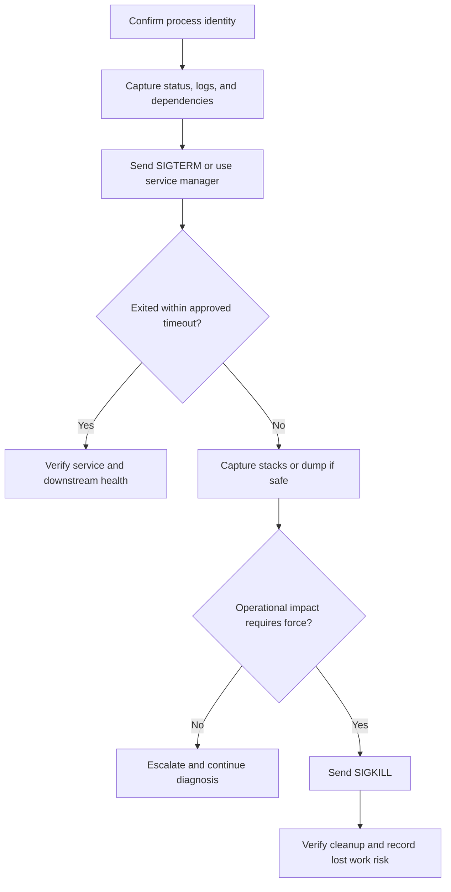
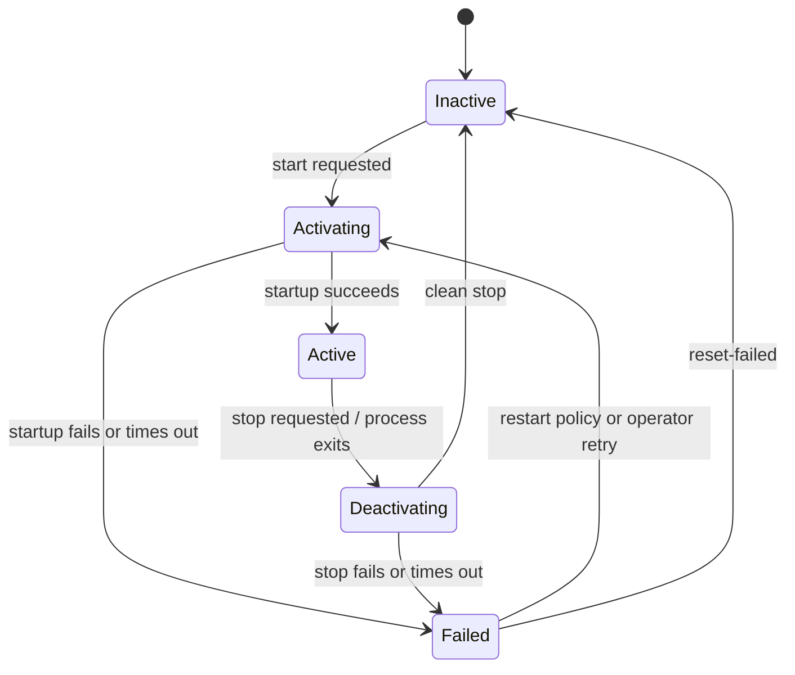
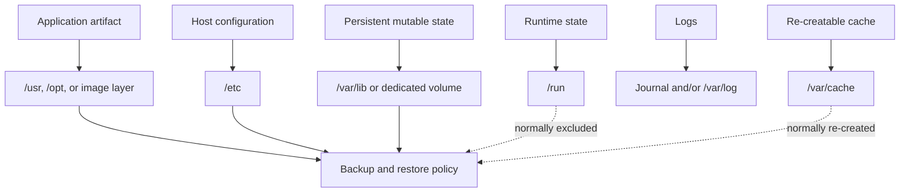
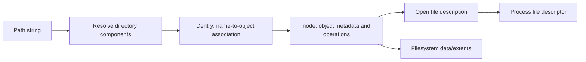
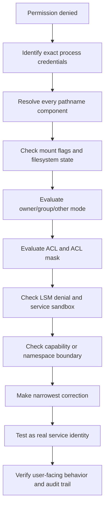
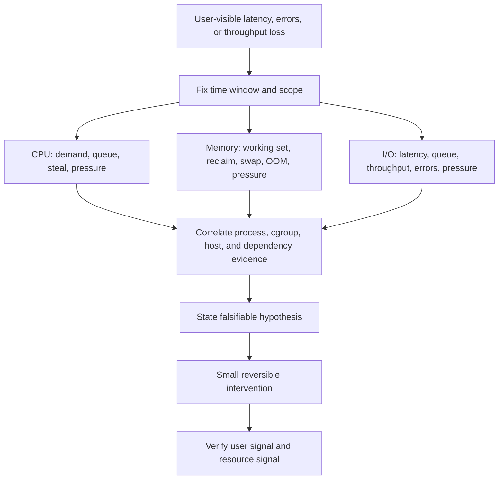
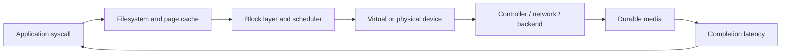
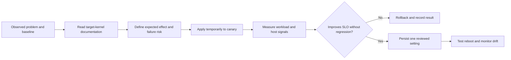
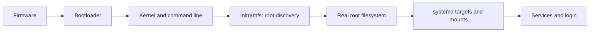

# Appendix H: Linux Administration

> **Status:** Complete — Parts 1–3  
> **Coverage:** Runtime, storage, identity, resources, kernel policy, and recovery  
> **Audience:** Junior engineers who completed Chapters 1–15  
> **Last verified:** 2026-08-31

Linux administration is not command memorization. It is the ability to form a
model of a running host, collect evidence without destroying it, make the
smallest safe change, and prove that the system recovered.

This appendix develops that ability progressively. Part 1 follows one causal
chain: the kernel runs processes, signals influence them, systemd supervises
services, and the journal preserves evidence about their behavior.

## Learning outcomes

After this part, you should be able to:

- explain how a program becomes a process and how parent/child relationships work;
- distinguish running, sleeping, stopped, uninterruptible, and zombie states;
- inspect a process through `ps`, `pstree`, `pgrep`, and `/proc`;
- choose a signal deliberately and avoid premature `SIGKILL` use;
- explain terminals, sessions, process groups, and shell job control;
- distinguish systemd activation, ordering, dependency, and enablement;
- create, validate, operate, and troubleshoot a service unit;
- query journal data by unit, boot, time, priority, PID, and structured field;
- investigate a failed or restarting service with an evidence-first workflow.
- explain pathname, dentry, inode, file descriptor, and mount relationships;
- diagnose capacity, inode, deleted-open-file, and mount failures;
- calculate effective mode-bit, special-bit, and POSIX ACL access;
- apply ownership changes without unsafe recursive operations;
- explain Linux capabilities and choose narrower privilege delegation;
- operate local users, groups, and sudo policy with validation and auditability.

## Lab safety and notation

Run write operations only in a disposable VM with systemd as PID 1. Containers,
WSL distributions, and minimal images may not run a system instance of systemd.
Confirm the environment before the lab:

```bash
ps -p 1 -o pid,comm,args=
systemctl --version
```

Commands marked **inspect** are read-only. Commands marked **change** alter
process or service state. Do not experiment on a production host without an
approved change, rollback plan, and owner.

## 1. The operating model

At boot, firmware and the bootloader prepare the machine and load the kernel.
The kernel initializes memory, scheduling, devices, and filesystems, then starts
the first userspace process. On a systemd host, that process is normally systemd
with PID 1. PID 1 builds a dependency graph and starts units needed for the
selected target. Services then create more processes and threads.


This is a responsibility map, not a strictly serial timeline. Modern boot is
parallel where dependencies permit it.

## 2. Process fundamentals

A **program** is executable code and data stored on disk. A **process** is a
running instance with an address space, credentials, environment, open file
descriptors, signal dispositions, and scheduling state. Multiple processes can
run the same program independently.

On Unix-like systems, a process commonly creates a child with `fork()` or a
related primitive. The child may then replace its program image with `execve()`.
The resulting process retains its PID across `execve()` but now runs different
code. Linux threads are schedulable tasks that share selected resources, such
as an address space and open files.

### 2.1 Identity and ancestry

| Field | Meaning | Why it matters |
|---|---|---|
| PID | Process identifier in the current PID namespace | Targets inspection and signals |
| PPID | Parent PID | Explains ownership and process trees |
| UID/GID | Real and effective user/group identities | Determines access checks |
| PGID | Process group ID | Lets a shell signal an entire foreground job |
| SID | Session ID | Groups jobs associated with a login or terminal |
| TTY | Controlling terminal, if one exists | Explains interactive job behavior |

PIDs are reused after processes exit. Do not assume that a PID recorded long
ago still identifies the same process. Reconfirm command, start time, owner,
and—when relevant—cgroup before taking action.

Useful **inspect** commands:

```bash
ps -eo user,pid,ppid,pgid,sid,stat,lstart,comm,args --sort=ppid
pstree -aps
pgrep -a -u "$USER" 'python|java|node'
```

`pgrep` matches process names or command lines according to its options; review
the result before passing PIDs to another command. Avoid fragile pipelines such
as `ps | grep | awk | kill`.

### 2.2 Process states

The state shown by `ps` is a snapshot. A healthy process may alternate between
running and sleeping thousands of times per second.

| State | Typical `ps` code | Interpretation | First questions |
|---|---:|---|---|
| Running/runnable | `R` | Executing or waiting for CPU | Is CPU demand sustained? Is the run queue growing? |
| Interruptible sleep | `S` | Waiting for an event; can receive signals | Is it normally idle or waiting too long on a dependency? |
| Uninterruptible sleep | `D` | Usually waiting in kernel I/O | Which device, mount, or kernel stack is involved? |
| Stopped/traced | `T`/`t` | Suspended by job control or a tracer | Was `SIGSTOP`, Ctrl+Z, or a debugger involved? |
| Zombie | `Z` | Exited; parent has not collected status | Which parent is failing to call `wait()`? |
| Dead | `X` | Terminal internal state, rarely observed | Treat as a transient observation |

A zombie consumes a process-table entry, not the full memory of a live process.
Killing the zombie cannot help because it has already exited. Diagnose its
parent. A persistent `D` state also cannot simply be assumed to be “a hung
process”; inspect storage, network filesystems, kernel messages, and wait stacks.

```bash
# inspect
ps -eo pid,ppid,stat,wchan:24,etime,comm,args | less
ps -eo stat= | cut -c1 | sort | uniq -c
```

### 2.3 `/proc`: the kernel's process view

Linux exposes process and kernel information through the proc pseudo-filesystem.
Access can be restricted by credentials, namespaces, security policy, or the
`hidepid` mount option.

```bash
target_pid=1234

# inspect; replace 1234 deliberately instead of copying this variable blindly
cat /proc/1234/status
tr '\0' ' ' < /proc/1234/cmdline
readlink /proc/1234/exe
ls -l /proc/1234/fd
cat /proc/1234/limits
cat /proc/1234/cgroup
```

Important distinctions:

- `VmSize` is virtual address space, not physical memory currently resident.
- `VmRSS` is resident memory but is still a point-in-time accounting view.
- `/proc/PID/io` separates bytes passed through syscalls from bytes attributed
  to storage I/O; interpret its fields before comparing them.
- `/proc/PID/fd` reveals files, pipes, sockets, and deleted-but-open files.
- A process can exit between any two reads. Treat `/proc` inspection as racy.

## 3. Signals and controlled termination

A signal is an asynchronous notification. `kill` is unfortunately named: it
sends a signal and does not necessarily terminate anything.

| Signal | Number on Linux | Default effect | Common engineering intent |
|---|---:|---|---|
| `SIGTERM` | 15 | Terminate | Request graceful shutdown |
| `SIGINT` | 2 | Terminate | Interactive interrupt, commonly Ctrl+C |
| `SIGHUP` | 1 | Terminate | Conventionally reload or terminal disconnect; app-specific |
| `SIGQUIT` | 3 | Core dump | Diagnostic termination; runtime behavior varies |
| `SIGSTOP` | 19 | Stop | Uncatchable suspension |
| `SIGCONT` | 18 | Continue | Resume a stopped process |
| `SIGKILL` | 9 | Terminate | Uncatchable last resort |

Signal numbers can vary across architectures; prefer names in scripts and
runbooks. `SIGKILL` and `SIGSTOP` cannot be caught, blocked, or ignored. Other
signals may be caught or ignored, and applications may assign conventional
meanings such as configuration reload to `SIGHUP`. Confirm application docs.

### 3.1 Evidence-first termination ladder



For a managed service, prefer `systemctl stop name.service`; systemd understands
the unit's cgroup, stop timeout, and configured kill behavior. For an unmanaged
process, the basic **change** sequence is:

```bash
kill -TERM 1234
while kill -0 1234 2>/dev/null; do sleep 1; done
```

That loop has no timeout and is therefore a teaching fragment, not a production
script. A real runbook needs a deadline, identity revalidation to handle PID
reuse, and an escalation decision. Do not use `kill -9` first: it prevents the
application from flushing buffers, completing transactions, removing temporary
state, or emitting shutdown diagnostics.

## 4. Terminals, sessions, and shell jobs

A terminal provides interactive input and output. A session contains one or
more process groups, and the terminal has one foreground process group. The
shell uses this structure to implement jobs:

```bash
long_command &       # start in background
jobs -l              # list jobs owned by this shell
fg %1                # move job 1 to foreground
bg %1                # continue stopped job 1 in background
disown %1            # remove job from this shell's job table (shell-specific)
```

Ctrl+C normally causes the terminal driver to send `SIGINT` to the foreground
process group. Ctrl+Z normally sends `SIGTSTP`. A background process that tries
to read from its controlling terminal may be stopped.

`nohup` changes hangup handling and redirects output in common implementations;
it does not provide health checks, dependency ordering, restart policy, resource
controls, identity isolation, or structured lifecycle management. Use systemd,
a container orchestrator, or another supervisor for long-lived production work.

## 5. systemd mental model

systemd manages **units**, not only daemons. Common unit types include services,
sockets, timers, paths, mounts, devices, targets, scopes, and slices. PID 1
constructs a transaction from requested units and their relationships.



This diagram is simplified. A service's exact transitions depend on `Type=`,
restart policy, timeouts, watchdog behavior, and process exit status.

### 5.1 Four concepts that must not be confused

| Concept | Question answered | Example |
|---|---|---|
| Activation | Is it running now? | `systemctl is-active app.service` |
| Enablement | Should an install relationship start it in a future target/boot? | `systemctl is-enabled app.service` |
| Requirement | Should starting/failure of another unit affect this transaction? | `Requires=` or weaker `Wants=` |
| Ordering | Which unit's start/stop job is ordered first? | `After=` / `Before=` |

`After=database.service` does **not** pull the database into the transaction.
Pair ordering with `Wants=` or `Requires=` only when that dependency is actually
part of the service contract. Likewise, `enable --now` combines two distinct
actions: it creates enablement links and starts the unit now.

### 5.2 Unit locations and overrides

System units are commonly provided by packages under `/usr/lib/systemd/system`
(some distributions use `/lib/systemd/system`). Administrator units and
drop-ins belong under `/etc/systemd/system`; runtime-generated overrides may
appear under `/run/systemd/system`. `/etc` has higher precedence than vendor
configuration.

Do not edit a package-owned unit in place. Create an override:

```bash
# change
sudo systemctl edit example.service

# inspect the merged configuration and source files
systemctl cat example.service
systemctl show example.service
```

An empty assignment may be required before replacing a list-valued directive.
Always inspect the merged result because drop-ins from several locations can
combine.

### 5.3 A production-oriented service skeleton

```ini
[Unit]
Description=Example API service
Documentation=https://docs.example.invalid/runbooks/example-api
Wants=network-online.target
After=network-online.target

[Service]
Type=exec
User=example-api
Group=example-api
WorkingDirectory=/srv/example-api
ExecStart=/srv/example-api/bin/server --config /etc/example-api/config.yaml
Restart=on-failure
RestartSec=5s
TimeoutStartSec=45s
TimeoutStopSec=30s
NoNewPrivileges=yes
PrivateTmp=yes
ProtectSystem=strict
ProtectHome=yes
ReadWritePaths=/var/lib/example-api

[Install]
WantedBy=multi-user.target
```

Design notes:

- `Type=exec` reports failure if the executable cannot be invoked. Confirm it is
  supported by the systemd versions in your deployment fleet.
- Use an unprivileged, dedicated identity. File ownership must match it.
- `Restart=on-failure` is useful, but repeated crashes need rate limiting and an
  alert; restart is not recovery if the cause persists.
- Hardening directives can break legitimate access. Add them incrementally,
  test the real workload, and inspect `systemd-analyze security` as guidance—not
  as proof of application security.
- `network-online.target` can delay boot and its exact meaning depends on the
  network manager. A resilient network client should also handle later loss and
  restoration of connectivity.
- A readiness protocol such as `Type=notify` is stronger than assuming that a
  spawned process is ready, but the application must implement it correctly.

Validate before activation:

```bash
# inspect
systemd-analyze verify /etc/systemd/system/example-api.service
systemctl cat example-api.service

# change, then inspect
sudo systemctl daemon-reload
sudo systemctl start example-api.service
systemctl status example-api.service --no-pager --full
systemctl is-active example-api.service
```

`daemon-reload` makes PID 1 reread unit definitions and rebuild dependencies; it
does not restart the service. A changed running service needs a separately
planned reload or restart.

### 5.4 Operator command map

```bash
# inspect
systemctl status example.service --no-pager --full
systemctl is-active example.service
systemctl is-enabled example.service
systemctl show example.service -p ActiveState -p SubState -p Result -p MainPID
systemctl list-dependencies example.service
systemctl list-dependencies --reverse example.service
systemctl list-units --failed

# change
sudo systemctl start example.service
sudo systemctl stop example.service
sudo systemctl reload example.service     # only if the unit supports reload
sudo systemctl restart example.service
sudo systemctl reset-failed example.service
```

`status` is a summary with recent logs, not a complete diagnosis. `reload` asks
the application to reread configuration without a full restart; support and
semantics are application-specific. Never substitute restart for investigation
when it would erase useful evidence or interrupt users.

## 6. journald as structured evidence

`systemd-journald` collects records from service stdout/stderr, syslog, kernel
messages, audit integration where available, and native journal clients. Each
record can contain fields such as timestamp, priority, boot ID, PID, UID, unit,
executable, and message. This makes the journal more than a text file.

### 6.1 High-value queries

```bash
# Current and previous boot
journalctl -b --no-pager
journalctl -b -1 --no-pager

# Unit, time window, priority, live follow
journalctl -u example.service --since '15 minutes ago' --no-pager
journalctl -u example.service --since '2026-08-31 14:00:00' --until '2026-08-31 14:15:00'
journalctl -u example.service -p warning..emerg --no-pager
journalctl -fu example.service

# Kernel and structured fields
journalctl -k -b --no-pager
journalctl _PID=1234 --no-pager
journalctl -u example.service -o json-pretty --no-pager

# Storage inspection
journalctl --disk-usage
journalctl --list-boots
```

Use absolute timestamps with an explicit host timezone in incident notes. A
query such as “15 minutes ago” is convenient during live triage but is not a
reproducible incident artifact.

### 6.2 Persistence and retention

Journal storage can be persistent under `/var/log/journal` or volatile under
`/run/log/journal`, depending on distribution defaults and configuration.
Confirm rather than assume:

```bash
systemctl status systemd-journald --no-pager
journalctl --disk-usage
grep -R '^[[:space:]]*Storage=' /etc/systemd/journald.conf /etc/systemd/journald.conf.d 2>/dev/null
```

Retention is constrained by settings such as maximum use, free-space reserve,
file size, and maximum retention time. `journalctl --vacuum-*` is a destructive
maintenance action: archive required evidence first, confirm retention and
compliance obligations, and understand that active journal files may not be
removed until rotated.

Rate limiting protects the host from log floods but can suppress repetitive
records exactly when a service is failing rapidly. Correlate journal notices,
application metrics, restart counters, and upstream telemetry.

## 7. Service failure playbook

Use this order for `example.service`:

### Step 1 — Establish scope and impact

```bash
systemctl is-active example.service
systemctl show example.service -p ActiveState -p SubState -p Result -p NRestarts -p MainPID
systemctl list-units --failed
```

Record host, boot ID, time window, user impact, last known good state, and recent
changes. Do not restart yet unless impact policy explicitly requires it.

### Step 2 — Read the unit and its relationships

```bash
systemctl cat example.service
systemctl list-dependencies example.service
systemctl list-dependencies --reverse example.service
systemd-analyze verify example.service
```

Look for invalid directives, missing executables, wrong users, unavailable
working directories, ordering assumptions, and unexpected drop-ins.

### Step 3 — Read the complete event window

```bash
journalctl -u example.service --since '30 minutes ago' --no-pager --full
journalctl -b -p warning..emerg --since '30 minutes ago' --no-pager
```

The first error may be more causal than the last error. A final timeout often
describes the consequence, not the source.

### Step 4 — Test hypotheses at boundaries

| Symptom | Evidence to collect | Common hypotheses |
|---|---|---|
| `203/EXEC` | `ExecStart`, path, permissions, mount flags, interpreter | Missing/non-executable binary, bad shebang, `noexec` mount |
| `217/USER` | `User=`, identity lookup, NSS logs | Missing user or unavailable identity provider |
| Address in use | Socket owner and unit sockets | Duplicate instance, socket activation, stale process |
| Restart loop | `NRestarts`, exit status, first failure | Invalid config, dependency failure, crash, too-aggressive policy |
| Start timeout | readiness protocol, dependency latency, stacks | Deadlock, slow migration, unreachable dependency |
| Permission denied | effective identity, path traversal permissions, MAC logs | Ownership/mode, SELinux/AppArmor, systemd sandbox |
| `D` state | `wchan`, kernel logs, storage/network health | Blocked local or remote I/O |

Do not disable SELinux/AppArmor or remove sandboxing globally as a diagnostic
shortcut. Collect the denial, identify the required access, and make the
narrowest policy or service correction.

### Step 5 — Recover and prove health

After the approved fix:

```bash
sudo systemctl daemon-reload          # only if unit files changed
sudo systemctl restart example.service
systemctl is-active example.service
systemctl show example.service -p Result -p NRestarts -p MainPID
journalctl -u example.service --since '5 minutes ago' --no-pager
```

Then verify the service from the user-facing boundary: connect to its socket,
run a safe query, check dependency health, and observe error/latency/saturation
signals. “Active” proves only systemd's current state assessment.

## 8. Guided lab: supervised transient service

This lab creates a temporary unit and requires `sudo`. It does not write a unit
file or enable anything at boot.

### 8.1 Start and inspect

```bash
# change: runs for five minutes unless stopped
sudo systemd-run --unit=handbook-process-lab \
  --property=Type=exec \
  --property=RuntimeMaxSec=5min \
  /usr/bin/sleep 300

# inspect
systemctl status handbook-process-lab.service --no-pager --full
systemctl show handbook-process-lab.service \
  -p FragmentPath -p LoadState -p ActiveState -p SubState -p MainPID -p ControlGroup
systemctl cat handbook-process-lab.service
journalctl -u handbook-process-lab.service --no-pager
```

Expected observations:

- `FragmentPath` may be empty because the unit is transient;
- it is active but not enabled for future boots;
- the main process belongs to the unit's cgroup;
- the journal contains lifecycle records even though `sleep` emits no output.

### 8.2 Correlate systemd with `/proc`

```bash
systemctl show handbook-process-lab.service -p MainPID --value
# Replace PID below with the value you observed.
cat /proc/PID/status
cat /proc/PID/cgroup
ls -l /proc/PID/fd
```

Explain which facts come from the kernel and which policy/lifecycle facts come
from systemd.

### 8.3 Stop and clean up

```bash
# change
sudo systemctl stop handbook-process-lab.service
sudo systemctl reset-failed handbook-process-lab.service

# verify
systemctl status handbook-process-lab.service --no-pager || true
journalctl -u handbook-process-lab.service --no-pager
```

`systemctl status` returning non-zero for an inactive or absent transient unit is
expected; `|| true` is used only so a teaching shell session can continue. Do
not hide failures this way in validation automation.

## 9. Exercises

### Part 1 foundation

1. Draw the relationship among PID, PPID, PGID, SID, and TTY for an interactive
   pipeline. Verify it with `ps`.
2. Explain why a zombie cannot be repaired with `kill -9` and identify the
   process that must be investigated.
3. Find one sleeping process and use `/proc/PID/status`, `fd`, and `cgroup` to
   describe who owns it, what it is waiting under, and who supervises it.

### Part 1 applied

4. Run the transient-unit lab. Capture `systemctl show`, `/proc/PID/status`, and
   the unit journal, then build a one-page evidence timeline.
5. Create a disposable service that fails with an invalid executable path.
   Diagnose it without editing first; then correct it, reload unit definitions,
   start it, and prove recovery. Remove all lab artifacts.
6. Compare an active-but-disabled transient unit with an enabled-but-inactive
   installed unit. Explain why monitoring only one state is insufficient.

### Part 1 production judgment

7. A service enters a restart loop after a configuration deployment. Write a
   recovery plan that preserves evidence, bounds user impact, validates rollback,
   and prevents the loop from exhausting a dependency.
8. A service remains in `deactivating` until systemd sends `SIGKILL`. Identify
   at least four hypotheses and the evidence needed to distinguish them.
9. Design journald retention for a small server with limited disk while meeting
   an incident-evidence requirement. State assumptions, sizing inputs, alerting,
   and failure behavior; do not propose unexplained fixed values.

## 10. Completion checklist

- [ ] I can identify a process and revalidate it before signaling it.
- [ ] I can distinguish a zombie from an uninterruptible task.
- [ ] I can explain why `SIGKILL` is a last resort.
- [ ] I can explain jobs, process groups, sessions, and terminals.
- [ ] I can distinguish active, enabled, required, and ordered units.
- [ ] I can use an override instead of modifying a vendor unit.
- [ ] I can validate unit syntax and inspect merged configuration.
- [ ] I can query the journal by unit, boot, time, priority, PID, and kernel scope.
- [ ] I can troubleshoot a failed service before restarting it.
- [ ] I can prove recovery from the user-facing boundary.

## 11. What comes next

Part 3 below completes the appendix with CPU/memory/I/O observation, resource
limits, cgroups, kernel parameters, package lifecycle, boot recovery, and
integrated failure labs.

## 12. Verified references

- [Linux kernel: `/proc` filesystem](https://www.kernel.org/doc/html/latest/filesystems/proc.html)
- [Linux man-pages: signals](https://man7.org/linux/man-pages/man7/signal.7.html)
- [Linux man-pages: waiting for child state changes](https://man7.org/linux/man-pages/man2/waitpid.2.html)
- [Linux man-pages: systemd unit configuration](https://man7.org/linux/man-pages/man5/systemd.unit.5.html)
- [systemd: network synchronization points](https://systemd.io/NETWORK_ONLINE/)
- [systemd: file hierarchy requirements](https://systemd.io/SYSTEMD_FILE_HIERARCHY_REQUIREMENTS/)
- [Debian systemd man pages: journalctl](https://manpages.debian.org/testing/systemd/journalctl.1.en.html)

Version-sensitive directives and commands must be checked against `man` pages
installed on the target host. Distribution packaging, unit paths, systemd
versions, security policies, and defaults differ.

---

## Part 2: Filesystems, permissions, and identity

Part 1 answered “what is running and who supervises it?” Part 2 answers “what
can it see, modify, mount, and execute—and under whose authority?” These
questions meet at every production incident involving configuration, state,
credentials, storage, or access denial.

## 13. Filesystem hierarchy as an operational contract

Linux exposes one directory tree rooted at `/`, even when its subtrees come
from different devices, remote servers, memory-backed filesystems, or kernel
pseudo-filesystems. The Filesystem Hierarchy Standard (FHS) provides placement
conventions, but distributions and immutable/container-oriented systems differ.
Inspect the target rather than assuming every path exists or is separate.

| Path | Operational purpose | Common failure or mistake |
|---|---|---|
| `/etc` | Host-specific configuration | Secrets or generated state mixed with configuration |
| `/run` | Volatile runtime state since boot | Assuming PID/socket files survive reboot |
| `/var/lib` | Persistent application state | Backing up config but omitting service state |
| `/var/log` | Persistent logs where used | Disk exhaustion or duplicate retention with journald |
| `/var/cache` | Re-creatable cache | Treating it as authoritative data |
| `/usr` | Distribution/vendor software and read-only data | Editing package-owned files directly |
| `/usr/local` | Locally administered software | Losing ownership/version provenance |
| `/opt` | Add-on application packages | Mixing mutable state into application binaries |
| `/srv` | Site-specific data served by the host | Assuming all distributions/packages use it |
| `/tmp` | Temporary data, often shared and sometimes memory-backed | Predictable names, secret leakage, capacity abuse |
| `/proc` | Process and kernel interface | Treating pseudo-files as ordinary disk files |
| `/sys` | Device/kernel object interface | Writing tunables without rollback or scope knowledge |
| `/dev` | Device nodes and special files | Confusing a device node with the device's stored data |

The useful design distinction is **static versus variable** and **persistent
versus runtime**. It informs read-only mounts, backup scope, image construction,
configuration management, and disaster recovery.



Backup classification is workload-specific. For example, a cache may contain
expensive-to-rebuild state, and `/etc` alone may not capture dynamically managed
configuration. The diagram is a starting model, not an automatic backup policy.

## 14. From pathnames to open files

The Virtual Filesystem (VFS) gives applications a common interface across
filesystems. A simplified lookup is:



- A **pathname** is how a process asks to find an object, relative to its root
  and mount namespace.
- A **dentry** associates a name in a directory with an inode and is cached in
  memory by the VFS.
- An **inode** represents a filesystem object and stores metadata such as type,
  owner, mode, timestamps, link count, size, and block mapping. The filename is
  not stored as the inode's identity.
- An **open file description** records state such as current offset and flags.
- A **file descriptor** is a small integer in one process that refers to an
  open file description. Descriptors may be duplicated or inherited.

Inspect these layers:

```bash
namei -l /var/lib/example-api/data.db
stat /var/lib/example-api/data.db
stat -c 'device=%D inode=%i links=%h mode=%A owner=%U:%G size=%s blocks=%b' \
  /var/lib/example-api/data.db
ls -l /proc/PID/fd
lsof -p PID
```

`lsof` may not be installed and its system-wide scan can be expensive. Narrow
the query and use `/proc/PID/fd` when appropriate.

### 14.1 Hard links, symbolic links, and deletion

| Property | Hard link | Symbolic link |
|---|---|---|
| Refers to | Same inode | Stored pathname |
| Crosses filesystem boundary | No | Yes |
| Usually links directories | No | Can point to one |
| Survives original name removal | Yes | Becomes dangling if target path disappears |
| Own inode | No new target inode | Yes, for the symlink object |

`unlink()` removes a directory entry. File data can remain allocated while
another hard link exists or a process still holds the file open. This explains
the classic incident where `rm` appears to succeed but free space does not
return:

```bash
# inspect deleted files still held open; may require elevated visibility
sudo lsof +L1
findmnt --target /var/log
df -h /var/log
```

Do not truncate `/proc/PID/fd/N` blindly. Identify the owning service, confirm
the descriptor, decide whether safe rotation/reopen or controlled restart is
supported, and preserve incident evidence.

### 14.2 Capacity has multiple dimensions

```bash
df -hT
df -i
du -xhd1 /var 2>/dev/null | sort -h
findmnt -o TARGET,SOURCE,FSTYPE,OPTIONS,PROPAGATION
```

- `df` reports filesystem-level allocation; `du` walks reachable directory
  entries. They legitimately differ because of deleted-open files, snapshots,
  reserved blocks, sparse files, mount boundaries, and concurrent writes.
- Free bytes do not imply free inodes. Millions of tiny files can exhaust inode
  capacity while byte usage is low on filesystems with a bounded inode pool.
- Apparent file size and allocated blocks differ for sparse, compressed,
  deduplicated, reflinked, or snapshot-managed storage.
- `du -x` stays on one filesystem and avoids accidentally walking remote or
  nested mounts; it can still be I/O intensive.

## 15. Mounts and filesystem boundaries

A mount attaches a filesystem tree at a directory within a mount namespace.
The directory's previous contents are hidden while another filesystem is
mounted there; they are not deleted. Containers may see a different mount tree
from the host.

Prefer `findmnt` over parsing human-oriented `mount` output:

```bash
findmnt
findmnt --target /var/lib/example-api
findmnt --verify --verbose
cat /proc/self/mountinfo
lsns -t mnt
```

Common mount option intentions include:

| Option | Intention | Boundary |
|---|---|---|
| `ro` | Prevent normal writes | Not a substitute for authorization or immutable design |
| `nodev` | Do not interpret device nodes | Relevant only where device nodes could otherwise be used |
| `nosuid` | Ignore setuid/setgid executable effects and file capabilities where applicable | Behavior depends on kernel/filesystem context |
| `noexec` | Disallow direct execution | Interpreters may still read scripts; not a complete code-control boundary |
| `relatime`/`noatime` | Reduce access-time writes | May affect software that relies on atime semantics |

### 15.1 Safe persistent mount workflow

For a new data filesystem in a disposable environment:

1. Identify it by stable UUID or another appropriate stable identifier—not a
   device name that may change across boots.
2. Confirm filesystem type, existing signatures, ownership, and backup status.
3. Create the intended mount point and define least-permissive useful options.
4. Validate the configuration before reboot.
5. Mount and test read/write behavior as the actual service identity.
6. Test boot or an equivalent recovery path and document failure behavior.

```bash
# inspect
lsblk -f
blkid
findmnt --verify --verbose
systemd-analyze verify local-fs.target

# change only after review of /etc/fstab
sudo mount -a

# verify
findmnt --target /srv/example-data
sudo -u example-api test -w /srv/example-data
```

`mount -a` can affect every eligible entry, so it is not risk-free. On a remote
host, keep recovery access available. Decide explicitly whether an unavailable
noncritical mount may permit boot (`nofail` and timeout semantics) or whether
starting without authoritative data would be more dangerous.

Unmounting requires that the mount is not busy:

```bash
findmnt --target /srv/example-data
sudo fuser -vm /srv/example-data
```

Lazy or forced unmount can hide an unresolved dependency and risk application
errors or data loss. Stop or move legitimate users of the filesystem first.

## 16. Ownership and mode bits

Linux discretionary access control first considers process credentials and the
object's ownership/mode. The kernel selects one class—owner, group, or other—
rather than accumulating permissions across all three classes. ACLs and Linux
Security Modules can then refine or deny access.

```text
             owner       group       other
symbolic       rwx         r-x         ---
octal           7           5           0
```

| Bit | File meaning | Directory meaning |
|---|---|---|
| Read (`r`, 4) | Read file content | List directory entries |
| Write (`w`, 2) | Modify file content | Create/remove/rename entries, usually with execute |
| Execute (`x`, 1) | Execute as a program if format/mount permits | Traverse/search the directory |

Directory write permission controls names in that directory. Therefore a user
may delete a file they cannot write if the parent directory permits it (subject
to sticky bit and other controls). Conversely, reading a known file path needs
directory execute permission on every parent, not necessarily directory read.

Inspect path traversal one component at a time:

```bash
namei -l /srv/example-api/config/app.yaml
stat -c '%A %a %U:%G %n' /srv/example-api/config/app.yaml
id example-api
sudo -u example-api test -r /srv/example-api/config/app.yaml
```

### 16.1 `chmod`, `chown`, and `umask`

```bash
# explicit modes are clearer in runbooks
chmod 0640 app.yaml
chmod u=rw,g=r,o= app.yaml
chown example-api:example-api app.yaml

# inspect creation mask in the current shell
umask
umask -S
```

`umask` removes permission bits from the mode requested at creation; it does not
retroactively change existing files. Applications may request narrower modes,
and default ACLs can alter the final result.

Avoid unreviewed recursive commands such as `chmod -R 777`, `chown -R`, or
`find ... -exec chmod`. They can cross unexpected content, change symlink-related
targets depending on tool/options, remove special bits, expose secrets, and make
rollback difficult. Resolve and inventory the exact tree, remain on the intended
filesystem when required, separate file and directory policies, preview results,
and back up metadata for material changes.

### 16.2 Special mode bits

| Bit | Typical use | Risk/constraint |
|---|---|---|
| setuid on executable | Run with file owner's effective UID | High-impact privilege boundary; scripts generally not honored safely |
| setgid on executable | Run with file group's effective GID | Still expands authority |
| setgid on directory | New entries inherit directory group | Useful for shared team/service trees |
| sticky bit on directory | Only permitted owners/privileged users remove entries | Used on shared writable directories such as `/tmp` |

Audit rather than assume:

```bash
# potentially expensive; scope to a filesystem
sudo find / -xdev -type f -perm /6000 -print
find /srv/shared -maxdepth 1 -printf '%M %u:%g %p\n'
```

## 17. POSIX ACLs

Mode bits allow one owner, one group, and everyone else. POSIX access ACLs add
named users and groups; default ACLs on directories influence newly created
children.

```bash
getfacl -p /srv/shared/report.csv
setfacl -m u:analyst:r-- /srv/shared/report.csv
setfacl -m d:g:operators:rwx /srv/shared
setfacl -x u:analyst /srv/shared/report.csv
```

The ACL **mask** limits the effective permissions of named users, named groups,
and the owning-group entry. `getfacl` may show a requested permission beside a
narrower `effective:` permission. Changing group mode bits with `chmod` can
change the ACL mask, so troubleshoot the complete ACL—not only `ls -l`.

Default ACL inheritance is not the same as recursively changing existing
children. Cross-platform filesystems, NFS versions, SMB mappings, backup tools,
and archive formats may preserve or translate ACLs differently. Test backup and
restore of metadata explicitly:

```bash
getfacl -R -p /srv/shared > shared.acl.backup
# Review the backup; restoration is a separate, change-controlled action.
```

## 18. Linux capabilities

Historically, UID 0 bypassed many checks. Linux capabilities divide portions of
that authority into per-thread capability sets and optional file capabilities.
Examples include binding privileged ports (`CAP_NET_BIND_SERVICE`) and changing
file ownership (`CAP_CHOWN`). `CAP_SYS_ADMIN` is extremely broad and is not a
meaningful least-privilege shortcut.

```bash
# inspect process and file capabilities
getpcaps PID
getcap -r /usr/bin /usr/sbin 2>/dev/null
grep '^Cap' /proc/PID/status
capsh --decode=0000000000000000
```

Capability sets include permitted, effective, inheritable, bounding, and
ambient sets. Their transformation across `execve()`, user namespaces, file
attributes, and `no_new_privs` is subtle. A file capability can silently stop
working when a mount uses `nosuid`, metadata is lost during copying, or a
container runtime bounds the capability.

For systemd services, prefer manager-level controls that are visible beside the
service definition:

```ini
[Service]
User=web
AmbientCapabilities=CAP_NET_BIND_SERVICE
CapabilityBoundingSet=CAP_NET_BIND_SERVICE
NoNewPrivileges=yes
```

Even a narrow capability may enable more than the application requires. First
consider an unprivileged port behind a proxy/socket unit, filesystem ownership,
or a small privileged helper. Then test the selected design under the actual
kernel, filesystem, container, and service-manager policy.

## 19. Users, groups, and identity lifecycle

The kernel makes access decisions with numeric UIDs and GIDs. Names are resolved
through the Name Service Switch (NSS), which may consult local files, LDAP,
SSSD, or other sources. A name lookup failure does not prove that the numeric
identity or running process disappeared.

```bash
id example-api
getent passwd example-api
getent group example-api
getent hosts dependency.internal
```

Use `getent` when testing NSS resolution; directly searching `/etc/passwd` sees
only the local file. Local account-management flags vary across distributions,
so inspect installed manuals before changes:

```bash
man useradd
man usermod
man userdel
man groupadd
```

### 19.1 Service identity lifecycle

1. Allocate a dedicated non-login service identity according to distribution
   policy or use systemd `DynamicUser=` where its storage model fits.
2. Give it only required group memberships and filesystem access.
3. Ensure secrets and writable paths are provisioned before service start.
4. Test access as that identity, not as root.
5. Monitor ownership drift and unexpected interactive use.
6. During retirement, stop workloads and find owned processes/files before
   deleting the account. Numeric ownership remains after name removal.

```bash
ps -u example-api -f
sudo find /srv /var/lib /var/log -xdev -uid "$(id -u example-api)" -print
sudo -u example-api -- test -r /etc/example-api/config.yaml
```

Do not run an unrestricted search across every local and remote filesystem
during an incident. Scope it, account for bind mounts and namespaces, and avoid
interpolating unvalidated values into privileged commands.

## 20. Safe privilege delegation with sudo

`sudo` is a policy enforcement and audit point, not merely a prefix for becoming
root. Prefer task-specific delegation over a general root shell.

Edit policy with `visudo`, which locks and validates syntax:

```bash
sudo visudo -f /etc/sudoers.d/example-operators
sudo visudo -c
sudo -l -U operator
```

A narrow example:

```sudoers
User_Alias EXAMPLE_OPERATORS = alice, bob
Cmnd_Alias EXAMPLE_SERVICE = /usr/bin/systemctl status example-api.service, \
                              /usr/bin/systemctl restart example-api.service
EXAMPLE_OPERATORS ALL=(root) EXAMPLE_SERVICE
```

Policy judgment is still required:

- A permitted command may have flags, environment variables, configuration,
  plugins, editors, pagers, or child-process features that allow command escape.
- Wildcards in command arguments can match more than expected.
- Granting an editor, shell, package manager, interpreter, or arbitrary service
  control often amounts to root-equivalent access.
- `NOPASSWD` changes authentication friction, not authorization scope; justify
  it for automation and protect the calling identity.
- Preserve centralized sudo/I/O logs where required, but treat logs as sensitive
  because commands and terminal data may contain secrets.

For automation, a purpose-built root-owned helper with strict input validation,
a systemd D-Bus policy, or configuration-management workflow can be safer than
granting a flexible general command.

## 21. Access-denied troubleshooting playbook



Evidence sequence:

```bash
systemctl show example-api.service -p User -p Group -p SupplementaryGroups -p MainPID
id example-api
namei -l /srv/example-api/config/app.yaml
getfacl -p /srv/example-api/config/app.yaml
findmnt --target /srv/example-api/config/app.yaml
systemctl cat example-api.service
journalctl -k --since '10 minutes ago' --no-pager
```

On SELinux systems, inspect relevant audit events and labels; on AppArmor
systems, inspect kernel/audit denials and the loaded profile. A denial can arise
even when mode bits show `777`. Do not “fix” it by globally disabling mandatory
access control. Determine whether the application path, label, profile, mount,
or service sandbox violates the intended policy.

## 22. Guided lab: shared directory with least privilege

Use a disposable VM. The lab creates local groups/users and files; substitute
names only after checking that they do not already exist.

### 22.1 Prepare and observe

```bash
# inspect first; these should report no existing identities
getent group handbook-lab
getent passwd handbook-writer
getent passwd handbook-reader

# change; options may vary, so check local man pages
sudo groupadd handbook-lab
sudo useradd --system --no-create-home --shell /usr/sbin/nologin handbook-writer
sudo useradd --system --no-create-home --shell /usr/sbin/nologin handbook-reader
sudo usermod -aG handbook-lab handbook-writer
sudo usermod -aG handbook-lab handbook-reader

sudo install -d -o root -g handbook-lab -m 2770 /srv/handbook-lab
sudo -u handbook-writer -- sh -c 'umask 0007; printf "%s\n" "lab evidence" > /srv/handbook-lab/evidence.txt'

stat -c '%A %a %U:%G %n' /srv/handbook-lab /srv/handbook-lab/evidence.txt
```

Explain why the directory uses setgid, why its group is inherited, and why the
file's mode also depends on the process's requested creation mode and `umask`.

### 22.2 Add a narrower exception with ACL

If `getfacl`/`setfacl` are installed and the filesystem supports ACLs:

```bash
sudo setfacl -m u:handbook-reader:r-- /srv/handbook-lab/evidence.txt
getfacl -p /srv/handbook-lab/evidence.txt
sudo -u handbook-reader -- cat /srv/handbook-lab/evidence.txt
sudo -u handbook-reader -- sh -c 'printf x >> /srv/handbook-lab/evidence.txt'
```

The read should succeed and the append should fail. Capture the exit status and
effective ACL. Then change the ACL mask to demonstrate how it constrains a named
entry, restore the intended mask, and explain both observations.

### 22.3 Cleanup

Before deletion, verify exact targets and ensure no unrelated content exists:

```bash
findmnt --target /srv/handbook-lab
sudo find /srv/handbook-lab -xdev -maxdepth 2 -printf '%M %U:%G %p\n'
getent passwd handbook-writer handbook-reader
getent group handbook-lab
```

Then remove only the lab file/directory and the two lab identities/group using
the distribution's account tools. This handbook intentionally does not provide
a copy-paste recursive deletion command: target validation and deliberate
cleanup are part of the exercise.

## 23. Part 2 exercises

### Part 2 foundation

1. Map `/etc`, `/run`, `/var/lib`, `/var/cache`, and `/usr` to persistence,
   mutability, backup, and ownership expectations for one installed service.
2. Create a file, hard link, and symbolic link in a temporary filesystem. Record
   inode/link counts before and after removing each name.
3. Explain the different meanings of `rwx` on a file and directory. Construct a
   safe temporary example in which a known filename is readable without listing
   the directory.

### Part 2 applied

4. Reconcile a deliberate `df`/`du` discrepancy caused by a deleted-open file.
   Recover space through the owning process's supported lifecycle and preserve
   a timeline of evidence.
5. Complete the shared-directory lab and demonstrate the ACL mask's effect.
6. Review one service's mount options, ownership, ACL, systemd sandbox, and
   capabilities. Produce an effective-access explanation, not just command output.
7. Draft and validate a sudoers rule for one narrowly defined operational task.
   Identify at least three possible escape paths before deciding whether the
   delegation is safe.

### Part 2 production judgment

8. An application reports `ENOSPC`, but `df -h` shows 40% free. Build a decision
   tree covering inodes, quotas, reserved space, filesystem read-only state,
   thin provisioning, deleted-open files, and the application's actual mount
   namespace.
9. A configuration file is mode `0644`, yet a systemd service gets permission
   denied. List the evidence needed across parent directories, credentials, ACL,
   mount options, SELinux/AppArmor, systemd hardening, and namespaces.
10. Design identity retirement for a service moving to another platform. Cover
    processes, scheduled work, files, ACLs, secrets, sudo policy, remote identity,
    audit retention, numeric UID reuse, validation, and rollback.

## 24. Part 2 completion checklist

- [ ] I can explain pathname → dentry → inode → open file → descriptor.
- [ ] I can distinguish hard links, symbolic links, and open-file references.
- [ ] I check byte, inode, quota, mount, and deleted-open-file evidence for ENOSPC.
- [ ] I can validate persistent mounts and state their boot failure policy.
- [ ] I calculate file and directory mode effects separately.
- [ ] I understand setuid, setgid, sticky bit, `umask`, and their risks.
- [ ] I inspect effective ACL permissions including the mask.
- [ ] I treat capabilities as privileged authority and bound them narrowly.
- [ ] I distinguish numeric kernel identity from NSS name resolution.
- [ ] I validate sudo policy and analyze command-escape paths.
- [ ] I test access as the real service identity and retain an audit trail.

## 25. Part 2 verified references

- [Linux kernel: Virtual Filesystem overview](https://docs.kernel.org/filesystems/vfs.html)
- [Linux kernel: filesystem documentation index](https://docs.kernel.org/filesystems/)
- [Linux Foundation: Filesystem Hierarchy Standard 3.0](https://refspecs.linuxfoundation.org/FHS_3.0/fhs-3.0.html)
- [Linux man-pages: findmnt](https://man7.org/linux/man-pages/man8/findmnt.8.html)
- [Linux man-pages: capabilities](https://man7.org/linux/man-pages/man7/capabilities.7.html)
- [sudo project: sudoers manual](https://www.sudo.ws/docs/man/1.9.14/sudoers.man.pdf)

Consult the target host's `acl(5)`, `chmod(1)`, `chown(1)`, `mount(8)`,
`fstab(5)`, `useradd(8)`, `sudoers(5)`, and security-policy manuals. Filesystem,
distribution, NSS, LSM, and container behavior can change the effective result.

---

## Part 3: Resources, kernel policy, and recovery

Resource troubleshooting is causal analysis, not a hunt for one “high” number.
Start from user impact, align a time window, measure demand and contention at
system and workload boundaries, form a falsifiable hypothesis, then make one
bounded change and verify the result.

## 26. A resource investigation framework

The USE method is a useful first pass for every resource:

- **Utilization:** how much of the resource was busy or allocated?
- **Saturation:** how much work waited because the resource was constrained?
- **Errors:** what operations failed, retried, timed out, or were corrected?



Collect a baseline without installing or tuning anything:

```bash
date --iso-8601=seconds
uptime
uname -a
cat /etc/os-release
systemd-detect-virt
systemctl --failed
vmstat 1 5
cat /proc/pressure/cpu
cat /proc/pressure/memory
cat /proc/pressure/io
```

Command availability and output vary. `sysstat` commonly supplies `iostat`,
`pidstat`, and `sar`; `procps` commonly supplies `vmstat`. Installing a tool
during an incident changes the host and may require network/package-manager
access, so pre-provision approved observability tools.

## 27. CPU demand, scheduling, and load

CPU utilization answers how much time CPUs spent in categories. It does not
alone show whether useful work completed, whether tasks waited, or whether a VM
lost time to its hypervisor.

```bash
lscpu
uptime
cat /proc/loadavg
mpstat -P ALL 1 5
pidstat -u -w 1 5
ps -eo pid,ppid,ni,stat,psr,pcpu,comm,args --sort=-pcpu | head -20
cat /proc/pressure/cpu
```

### 27.1 Interpret the signals

| Signal | What it can indicate | What it cannot prove alone |
|---|---|---|
| `%usr` | Userspace execution | Productive application work |
| `%sys` | Kernel execution | Which syscall, interrupt, or workload caused it |
| `%iowait` | CPU idle time associated with outstanding I/O | Storage utilization or a specific task's wait time |
| `%steal` | VM time taken by the hypervisor | Exact noisy neighbor or provider cause |
| Run queue | Runnable scheduling demand | Whether latency is CPU-caused without correlation |
| Context switches | Scheduling/coordination activity | A universal “too high” threshold |
| CPU PSI `some` | Time at least some work was delayed for CPU | Which process should receive more CPU |

Linux load average includes runnable tasks and tasks in uninterruptible wait,
commonly I/O wait. Therefore high load with low CPU utilization can be real.
Compare load to CPU count only as an initial clue, then inspect task states,
per-CPU balance, PSI, I/O, and workload latency.

### 27.2 CPU diagnosis sequence

1. Confirm whether the impact is host-wide, one service, one cgroup, or one CPU.
2. Separate demand from throttling and steal time.
3. Identify processes and threads; do not stop at the process total.
4. Check whether runnable work is productive, spinning, retrying, or contending.
5. Correlate with releases, traffic, dependency failures, IRQ load, and quotas.

`nice` changes scheduler weight for appropriate policies; it does not reserve
CPU, solve locks, or override cgroup ceilings. CPU affinity can reduce migration
or isolate work, but careless pinning creates hotspots and reduces scheduler
freedom. Profile before changing either.

## 28. Memory, reclaim, swap, and OOM

Linux deliberately uses otherwise idle memory for caches. A low `MemFree` value
is not itself a memory incident. Begin with `MemAvailable`, workload working
sets, reclaim activity, swap behavior, PSI, allocation failures, and OOM events.

```bash
free -h
grep -E 'MemTotal|MemFree|MemAvailable|Buffers|Cached|Swap|Slab|SReclaimable|Dirty|Writeback' /proc/meminfo
vmstat 1 10
ps -eo pid,ppid,rss,vsz,maj_flt,min_flt,comm,args --sort=-rss | head -20
cat /proc/pressure/memory
journalctl -k -b | grep -Ei 'out of memory|oom|killed process'
```

### 28.1 Memory concepts that must stay separate

| Concept | Meaning |
|---|---|
| RSS | Resident pages attributed to a process; shared-page accounting complicates totals |
| Virtual size | Address space mapped or reserved, not equivalent to physical usage |
| Page cache | File data cached in memory and generally reclaimable under pressure |
| Anonymous memory | Heap/stack and other non-file-backed memory |
| Swap | Backing for reclaimable anonymous pages; activity and latency matter more than mere presence |
| Major fault | Fault requiring storage I/O, often more expensive than a minor fault |
| Memory PSI | Time tasks stall because of memory contention/reclaim |
| OOM kill | Kernel/cgroup recovery action after allocation cannot be satisfied under policy |

Do not “fix” memory pressure by dropping caches in production. It destroys a
useful cache, can increase I/O and latency, and does not correct a leak or an
undersized limit. Similarly, disabling swap is not a universal performance
rule; it changes reclaim and failure behavior. Test policy against latency,
working set, storage performance, and recovery requirements.

### 28.2 OOM investigation

Distinguish a global OOM from a cgroup-local OOM. A host can have available
memory while one service exceeds `MemoryMax=`. Capture:

```bash
systemctl show example.service -p MemoryCurrent -p MemoryPeak -p MemoryHigh -p MemoryMax -p OOMPolicy
systemctl status example.service --no-pager --full
journalctl -u example.service -b --no-pager
journalctl -k -b --no-pager
```

An OOM victim is selected using kernel policy and context, not simply “the
largest process.” Preserve the kernel OOM report, cgroup events, application
timeline, traffic, and deployment state before restarting.

## 29. Storage I/O and latency

Storage incidents require both block-device and workload evidence. High
throughput can be healthy; low throughput can coexist with severe latency from
small random I/O, queueing, errors, throttling, remote storage, or synchronous
writes.

```bash
lsblk -o NAME,TYPE,SIZE,FSTYPE,MOUNTPOINTS,ROTA,MODEL
iostat -xz 1 5
pidstat -d 1 5
vmstat 1 5
cat /proc/diskstats
cat /proc/pressure/io
journalctl -k -b -p warning..emerg --no-pager
```

Interpret `iostat` fields using the installed version's manual. Device `%util`
is not a universal saturation percentage for modern parallel devices and
virtual storage. Look at operation latency, queue depth, request size,
throughput, errors, PSI, application latency, and the storage architecture.



A slow NFS or distributed volume may surface as processes in `D` state while
local block statistics look normal. Trace the actual mount and dependency path.
Never benchmark an unknown production device with destructive write tools.

## 30. Resource limits: rlimits and cgroups

Two limit families answer different questions:

- **rlimits** constrain properties of a process, such as open descriptors,
  process count, core size, locked memory, or address space.
- **cgroups** organize processes hierarchically and distribute or constrain CPU,
  memory, I/O, and process count across a workload.

```bash
ulimit -a
prlimit --pid PID
cat /proc/PID/limits
systemctl show example.service -p LimitNOFILE -p TasksCurrent -p TasksMax
```

Raising `LimitNOFILE=` does not enlarge application connection pools, database
limits, kernel-wide file tables, or dependency capacity. Identify the exhausted
layer and account for descriptors used by files, sockets, pipes, event APIs,
and libraries.

### 30.1 cgroup v2 model

cgroup v2 uses one hierarchy. Every process belongs to exactly one cgroup, and
resource policy is hierarchical: a child cannot escape an ancestor constraint.
On a systemd host, units map naturally to cgroups; use systemd rather than
manually moving service PIDs under `/sys/fs/cgroup`.

```bash
findmnt -t cgroup2
systemd-cgls
systemd-cgtop
systemctl show example.service -p ControlGroup
cat /proc/PID/cgroup
```

Common systemd controls:

| Objective | systemd directive | Important behavior |
|---|---|---|
| Relative CPU share | `CPUWeight=` | Competes within hierarchy; not a fixed CPU reservation |
| CPU bandwidth ceiling | `CPUQuota=` | Can throttle even when other CPUs appear idle |
| Memory pressure boundary | `MemoryHigh=` | Reclaim/throttling pressure; useful before a hard ceiling |
| Hard memory ceiling | `MemoryMax=` | Allocation can end in cgroup OOM |
| I/O share | `IOWeight=` | Support depends on hierarchy/device/controller |
| Task count | `TasksMax=` | Counts tasks/threads, not only traditional processes |

Example override, values intentionally omitted because sizing must come from
measurement:

```ini
[Service]
CPUWeight=<measured-relative-weight>
MemoryHigh=<tested-throttle-boundary>
MemoryMax=<tested-hard-boundary>
TasksMax=<validated-task-ceiling>
```

Test ceilings under realistic load, dependency failure, startup peaks, and
graceful shutdown. Alert on pressure and throttling before a hard limit becomes
an outage.

## 31. Kernel parameters and sysctl discipline

`sysctl` exposes selected runtime kernel parameters, generally backed by
`/proc/sys`. Names, availability, defaults, namespaces, and semantics depend on
kernel configuration and version.

```bash
sysctl kernel.hostname
sysctl vm.swappiness
sysctl net.ipv4.ip_forward
sysctl --system --dry-run 2>/dev/null || true
systemd-analyze cat-config sysctl.d
```

Do not copy a “performance tuning” block from the internet. A safe lifecycle is:



For a temporary **change**, record the old value first:

```bash
sysctl vm.example_parameter
sudo sysctl -w vm.example_parameter=<validated-value>
```

`vm.example_parameter` is deliberately fictional. Use only a documented
parameter present on the target host. Persist administrator policy in an
appropriately named file under `/etc/sysctl.d/`, check precedence and duplicate
definitions, validate with the system's loader, and maintain rollback.

Kernel command-line parameters are different from runtime sysctls and normally
require bootloader/initramfs-aware change procedures and a reboot. Always keep a
known-good boot entry and console/recovery access.

## 32. Package and update lifecycle

Package management is a state transition affecting files, services, libraries,
boot artifacts, and sometimes databases. Commands differ across Debian/Ubuntu
(`apt`/`dpkg`), Fedora/RHEL-family (`dnf`/RPM), transactional/immutable systems,
and container images. Use the target distribution's supported workflow.

A production update should answer:

1. Which repositories and signing keys establish package provenance?
2. What exact versions and dependency changes are proposed?
3. Which services restart, and is a reboot or kernel transition required?
4. Are configuration files locally modified, replaced, or merged?
5. Is rollback technically supported, or does state/schema migration prevent it?
6. How will canary health, user signals, and fleet convergence be verified?

Read-only inventory examples:

```bash
# Debian-family
dpkg-query -W -f='${binary:Package}\t${Version}\n' 2>/dev/null | head
apt-cache policy 2>/dev/null | head -40

# RPM-family
rpm -qa --qf '%{NAME}\t%{VERSION}-%{RELEASE}.%{ARCH}\n' 2>/dev/null | head
dnf repolist 2>/dev/null
```

Do not run unattended blanket upgrades merely to “see what happens.” Take a
reproducible inventory, review advisories and transaction output, validate
capacity and backups, canary, observe, then expand. A package downgrade is not
guaranteed to reverse configuration, data, firmware, or database changes.

## 33. Boot diagnosis and recovery

Boot failures are best approached as stages:



Identify the last successful stage before changing anything.

```bash
journalctl --list-boots
journalctl -b -1 -p warning..emerg --no-pager
journalctl -k -b -1 --no-pager
systemd-analyze time
systemd-analyze critical-chain
systemctl --failed
systemctl get-default
cat /proc/cmdline
findmnt --verify --verbose
```

`systemd-analyze blame` reports unit activation duration, not proof that the
unit delayed the boot critical path. Use `critical-chain`, dependency evidence,
and timestamps together.

### 33.1 Rescue versus emergency

- `rescue.target` normally brings up more of the base system and a rescue shell.
- `emergency.target` is more minimal; the root filesystem may be read-only and
  fewer mounts/services are available.

Entering either target disrupts workloads and may terminate sessions. Use an
approved console path. Bootloader edits, initramfs rebuilds, filesystem repair,
and root remounts are high-risk actions: preserve the previous boot entry,
confirm the exact device/filesystem, and have out-of-band recovery.

Common branches:

| Last successful stage | Evidence | Likely domains |
|---|---|---|
| Bootloader only | Console, selected entry, boot variables | Missing/wrong entry, disk/firmware issue |
| Kernel starts, root absent | Kernel log, command line, initramfs shell | Driver, UUID, encryption, LVM/RAID, initramfs |
| Root mounted, emergency mode | Journal, failed mounts, `fstab` validation | Bad mount, filesystem, dependency, unit |
| Multi-user target incomplete | Failed units and dependency graph | Service config, identity, network, resource limit |
| Login works, application fails | Unit journal and application probes | Workload-specific problem, not host boot |

## 34. Integrated failure laboratories

Use a disposable VM with console access. Record baseline, hypothesis, evidence,
change, rollback, and verification for every lab.

### Lab A — CPU pressure inside a bounded transient unit

Start a short CPU workload only if `sha256sum` and `/dev/zero` are available:

```bash
sudo systemd-run --unit=handbook-cpu-lab \
  --property=RuntimeMaxSec=60s \
  --property=CPUQuota=25% \
  /bin/sh -c 'sha256sum /dev/zero >/dev/null'

systemctl show handbook-cpu-lab.service -p CPUUsageNSec -p CPUQuotaPerSecUSec -p ControlGroup
systemd-cgtop
cat /proc/pressure/cpu
journalctl -u handbook-cpu-lab.service --no-pager
```

Observe host CPU, cgroup placement, quota, and PSI. Explain why `25%` means a
bandwidth quota relative to one CPU's time rather than “25% of the entire host”
in every interpretation. Stop/reset the transient unit if it remains.

### Lab B — File descriptor exhaustion without host-wide tuning

Run a disposable shell with a low soft/hard descriptor limit:

```bash
prlimit --nofile=32:32 /bin/sh
ulimit -n
```

Inside that shell, use a small, reviewed program or shell exercise to open files
until `EMFILE`, while another terminal observes `/proc/PID/fd` and
`/proc/PID/limits`. Exit the shell to roll back automatically. Explain why a
service-level failure should not be “fixed” first with a global kernel limit.

### Lab C — Boot and mount configuration validation

Do not deliberately break the real root boot. Instead:

1. Copy a small sample `fstab` into a lab directory.
2. Add one valid and one invalid noncritical entry using nonexistent lab mount
   points/devices.
3. Use tools that accept an alternate file or analyze the sample manually;
   never replace `/etc/fstab` for this exercise.
4. Compare the failure implications of required, `nofail`, automount, and device
   timeout choices.
5. Produce a console recovery runbook for a hypothetical bad real entry.

### Lab D — Cross-layer service failure

Create a disposable service whose unprivileged identity writes to a controlled
lab directory and has tested `MemoryHigh=`, `MemoryMax=`, `TasksMax=`, and
`LimitNOFILE=` values. Introduce one failure at a time:

- remove directory traversal permission;
- constrain descriptors below startup requirements;
- set a memory ceiling below a measured startup peak;
- point the service at a missing noncritical mount.

For each failure, diagnose from user symptom through systemd result, journal,
credentials/path, limits/cgroup events, and mount evidence. Restore only the
fault introduced, prove recovery, and remove all artifacts after exact-target
validation.

## 35. Part 3 exercises

### Part 3 foundation

1. Explain why load average is not CPU percentage and construct two hypotheses
   for high load with mostly idle CPUs.
2. Annotate `/proc/meminfo` with working-set, reclaim, swap, and writeback
   questions. Explain why `MemFree` alone is insufficient.
3. Map `LimitNOFILE=`, `TasksMax=`, `CPUWeight=`, `CPUQuota=`, `MemoryHigh=`, and
   `MemoryMax=` to the failure each is intended to control.

### Part 3 applied

4. Complete Labs A and B, graph or tabulate a short time series, and correlate
   workload outcome with host and cgroup evidence.
5. Diagnose a synthetic `ENOSPC`, `EMFILE`, CPU-throttle, or cgroup-OOM event
   without restarting first. Produce a causal timeline.
6. Audit one persistent sysctl: source file, precedence, runtime value,
   documentation, namespace, business reason, test evidence, owner, and rollback.
7. Build an update runbook for one package that owns a systemd service. Include
   provenance, transaction preview, configuration merge, restart, schema/state
   compatibility, canary, rollback boundary, and verification.

### Part 3 production judgment

8. A VM has high latency, 50% idle CPU, rising load, and I/O PSI. Design the
   minimum evidence set that distinguishes local disk, remote mount, memory
   writeback, cgroup I/O policy, and hypervisor/backend contention.
9. A fleet update boots on the canary but 10% of hosts enter emergency mode.
   Design containment, evidence capture, recovery, rollback, and prevention;
   account for console access and hardware/storage variation.
10. Define resource policy for a critical API and a best-effort batch worker on
    one host. Explain hierarchy, weights, hard limits, pressure alerts, overload
    behavior, shutdown headroom, and how you will test for starvation.

## 36. Final Linux administration competency gate

The appendix is complete when the learner can demonstrate—not merely recognize—
the following:

- [ ] Trace a service from PID 1 through unit, cgroup, process, files, and logs.
- [ ] Preserve evidence before signaling, restarting, unmounting, or tuning.
- [ ] Diagnose CPU demand, scheduling delay, memory reclaim/OOM, and I/O latency.
- [ ] Distinguish utilization, saturation, pressure, errors, and user impact.
- [ ] Explain and test rlimits and hierarchical cgroup v2 controls.
- [ ] Change a sysctl only with documentation, baseline, canary, rollback, and reboot/drift validation.
- [ ] Operate filesystem access across modes, ACLs, capabilities, LSMs, and namespaces.
- [ ] Plan package changes as reversible, observable state transitions.
- [ ] Locate a boot failure stage and choose rescue or emergency access safely.
- [ ] Complete the integrated lab with an evidence timeline and verified cleanup.
- [ ] Write a runbook another junior engineer can execute without hidden assumptions.

## 37. Part 3 verified references

- [Linux kernel: control group v2](https://docs.kernel.org/admin-guide/cgroup-v2.html)
- [Linux kernel: Pressure Stall Information](https://docs.kernel.org/accounting/psi.html)
- [Linux kernel: sysctl documentation](https://docs.kernel.org/admin-guide/sysctl/)
- [Linux kernel: command-line parameters](https://docs.kernel.org/admin-guide/kernel-parameters.html)
- [Linux man-pages: load average](https://man7.org/linux/man-pages/man5/proc_loadavg.5.html)
- [Linux man-pages: prlimit](https://man7.org/linux/man-pages/man1/prlimit.1.html)
- [systemd: resource-control manual source](https://cgit.freedesktop.org/systemd/systemd/tree/man/systemd.resource-control.xml)
- [systemd: debugging and recovery targets](https://freedesktop.org/wiki/Software/systemd/Debugging/)

Use the installed kernel, systemd, util-linux, procps, sysstat, package-manager,
bootloader, and distribution manuals as the final authority for the target
fleet. Feature presence and defaults are not uniform across supported systems.
