# Appendix I: Network Lab Guide

> **Status:** Parts 1–5 content and source audit complete  
> **Current scope:** Linux networking through enterprise campus, MPLS/L3VPN, vendor operations, and production change engineering  
> **Audience:** Junior engineers who completed Chapter 2 and Appendix H  
> **Lab platform:** Disposable Linux VM with systemd and iproute2  
> **Last verified:** 2026-09-01

Network engineering becomes operational when you can predict a packet path,
observe each boundary, introduce one fault, and prove why the correction works.
This guide builds that skill from Linux primitives to enterprise and
service-provider scenarios.

The learning loop for every laboratory is:


## 1. Guide structure

| Part | Progress | Outcome |
|---|---|---|
| 1 — Linux network foundations | Complete | Namespace, veth, bridge, neighbor, routing, VLAN, and NAT reasoning |
| 2 — Services, transport, and packets | Complete | DNS, DHCP, TCP, UDP, MTU/PMTUD, TLS, and packet analysis |
| 3 — Containerlab and FRRouting | Complete | Static routing, OSPF, BGP, ECMP, policy, and convergence |
| 4 — Integrated operations | Complete | Cross-layer failure scenarios and foundation competency gate |
| 5 — Enterprise and service-provider operations | Complete | Campus, MPLS/L3VPN, Cisco/Juniper CLI, and production change engineering |

All five parts meet the content acceptance criteria. Commands that require a
Linux lab, Containerlab, FRR/MPLS support, licensed vendor images, or physical
hardware retain their explicit environment-gated execution status.

## 2. Safety contract

Use a disposable Linux VM with console access. The labs require elevated
network-administration privileges inside that VM. Do not run them on a production
host, a shared jump server, or a workstation whose network state you cannot
restore.

The guide uses a dedicated `se-lab-` resource prefix. Before creating anything:

```bash
# [HOST] Inspect only.
ip netns list
ip -br link
ip -br address
ip route show table main
```

Stop if any existing resource begins with `se-lab-`. It may belong to another
session or user. Never delete an unfamiliar namespace or interface merely
because its name resembles the guide.

These foundational labs must not change:

- the host default route or primary interfaces;
- persistent sysctl files;
- global DNS configuration;
- production firewall policy;
- NetworkManager or systemd-networkd profiles.

Packet captures may contain credentials, identifiers, and unrelated traffic.
Capture only on the named lab interface, limit duration and size, and protect or
delete capture files according to policy.

## 3. Execution notation

Commands are labeled by context:

- **[HOST]** — the VM's initial network namespace;
- **[NS:CLIENT]** — namespace `se-lab-client`;
- **[NS:SERVER]** — namespace `se-lab-server`;
- **[ANALYSIS]** — interpretation rather than a command context.

Labels are not literal shell prompts. Namespace commands use
`ip netns exec <name> <command>` explicitly so the execution boundary remains
visible.

## 4. Foundation Lab 1 — Two hosts over a veth link

### 4.1 Objective

Build two isolated network stacks joined by a virtual Ethernet pair. By the end,
you should be able to explain:

- which network state belongs to each namespace;
- why each veth endpoint appears in only one namespace;
- how a connected route is created from an address and prefix;
- how IPv4 neighbor resolution precedes the first ICMP exchange;
- why link state, addressing, routing, and neighbor state are separate layers;
- where to capture packets when a test fails.

### 4.2 Topology and address plan

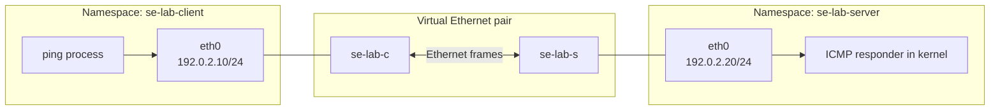

| Namespace | Interface | IPv4 address | Connected prefix | Default route |
|---|---|---|---|---|
| `se-lab-client` | `eth0` | `192.0.2.10/24` | `192.0.2.0/24` | None |
| `se-lab-server` | `eth0` | `192.0.2.20/24` | `192.0.2.0/24` | None |

`192.0.2.0/24` is the TEST-NET-1 documentation prefix defined by RFC 5737.
It is used only inside this isolated topology and must not be advertised or
treated as globally reachable space.

### 4.3 Prerequisites

Run these read-only checks:

```bash
# [HOST]
uname -r
ip -Version
command -v ip
command -v ping
command -v tcpdump || true
findmnt -t nsfs || true
```

Required:

- a Linux kernel with network namespace and veth support;
- iproute2 (`ip`);
- an IPv4-capable `ping` implementation;
- `sudo` or an equivalent authorized root session inside the disposable VM.

`tcpdump` is optional for the first pass but required for the packet-observation
exercise. Exact command output differs by kernel and iproute2 version.

### 4.4 Mental model

A network namespace isolates networking resources including interfaces, routes,
neighbor tables, firewall state, `/proc/net`, selected `/proc/sys/net` settings,
and sockets. It does not create a VM: processes still share the host kernel and
other resources unless additional namespace mechanisms are used.

| Resource | Separate per network namespace? | Operational consequence |
|---|---|---|
| Interfaces and addresses | Yes | Moving a veth endpoint makes it disappear from the source namespace |
| Routing and policy-routing tables | Yes | The same destination can select different paths in each namespace |
| Neighbor table | Yes | ARP/ND success in one namespace says nothing about another |
| TCP/UDP port space | Yes | Two namespaces can bind the same address/port when their local state permits |
| Netfilter rules | Yes | Packet policy must be inspected in the namespace that processes the packet |
| Selected network sysctls | Yes | Forwarding can be enabled in a router namespace without enabling host forwarding |
| Kernel, CPU, memory, and filesystem | No, not from netns alone | A network namespace is isolation, not a complete security/resource boundary |

A named namespace created by `ip netns add` is represented through a bind mount
under `/run/netns`. The `ip netns exec` command starts a process whose network
namespace reference is changed before executing the requested command. That
process sees the namespace's interfaces, routes, sockets, and related network
views; the shell from which you invoked it remains in the host namespace.

A veth pair acts like a virtual cable with two Ethernet endpoints. A frame sent
into one endpoint emerges from its peer. Moving an endpoint into another network
namespace makes the pair a connection between two isolated network stacks.

The loopback interface exists independently in each namespace and begins down in
a newly created named namespace. Bringing it up is good operational hygiene even
though this lab's ICMP path uses `eth0`.

### 4.4.1 Address mathematics

For `192.0.2.10/24`, the `/24` mask contains 24 network bits and 8 host bits:

```text
Address:   192.0.2.10       11000000.00000000.00000010.00001010
Mask:      255.255.255.0    11111111.11111111.11111111.00000000
Network:   192.0.2.0        11000000.00000000.00000010.00000000
Broadcast: 192.0.2.255      11000000.00000000.00000010.11111111
Hosts:     192.0.2.1 through 192.0.2.254
```

Both endpoints calculate the same connected prefix, so neither needs a gateway
to reach the other. A gateway becomes necessary when the destination does not
match a more-specific local route and a route names a next hop.

### 4.5 Build the topology

Create only the named lab resources:

```bash
# [HOST] Change: create two named namespaces.
sudo ip netns add se-lab-client
sudo ip netns add se-lab-server

# [HOST] Verify immediately.
ip netns list

# [HOST] Change: create the two connected veth endpoints.
sudo ip link add se-lab-c type veth peer name se-lab-s

# [HOST] Verify both endpoints exist before moving them.
ip -br link show type veth

# [HOST] Change: move one endpoint into each namespace.
sudo ip link set se-lab-c netns se-lab-client
sudo ip link set se-lab-s netns se-lab-server
```

After the move, the endpoints disappear from the host's interface list because
they now belong to different namespaces:

```bash
# [HOST]
ip link show se-lab-c 2>&1 || true

# [NS:CLIENT] and [NS:SERVER]
sudo ip netns exec se-lab-client ip -br link
sudo ip netns exec se-lab-server ip -br link
```

Rename the endpoints to the conventional `eth0`, assign addresses, and bring
the interfaces up:

```bash
# [NS:CLIENT] Change.
sudo ip netns exec se-lab-client ip link set se-lab-c name eth0
sudo ip netns exec se-lab-client ip address add 192.0.2.10/24 dev eth0
sudo ip netns exec se-lab-client ip link set lo up
sudo ip netns exec se-lab-client ip link set eth0 up

# [NS:SERVER] Change.
sudo ip netns exec se-lab-server ip link set se-lab-s name eth0
sudo ip netns exec se-lab-server ip address add 192.0.2.20/24 dev eth0
sudo ip netns exec se-lab-server ip link set lo up
sudo ip netns exec se-lab-server ip link set eth0 up
```

### 4.6 Establish a baseline before testing traffic

Do not begin with `ping`. Prove the configuration layers first:

```bash
# [NS:CLIENT]
sudo ip netns exec se-lab-client ip -br link
sudo ip netns exec se-lab-client ip -br address
sudo ip netns exec se-lab-client ip route
sudo ip netns exec se-lab-client ip route get 192.0.2.20
sudo ip netns exec se-lab-client ip neighbour show

# [NS:SERVER]
sudo ip netns exec se-lab-server ip -br link
sudo ip netns exec se-lab-server ip -br address
sudo ip netns exec se-lab-server ip route
sudo ip netns exec se-lab-server ip route get 192.0.2.10
sudo ip netns exec se-lab-server ip neighbour show
```

Expected client route reasoning:

```text
Destination 192.0.2.20 matches connected prefix 192.0.2.0/24.
The packet leaves eth0 directly; no gateway or default route is required.
Before the first IPv4 unicast frame can be sent, the client needs the server's
Ethernet address, so it performs ARP neighbor resolution.
```

### 4.7 Observe the first packet exchange

Open two terminals. Start a narrowly scoped capture before the first ping:

```bash
# [NS:SERVER] Terminal 1; stop with Ctrl+C after a few packets.
sudo ip netns exec se-lab-server \
  tcpdump -ni eth0 -c 8 'arp or icmp'
```

Then generate bounded traffic:

```bash
# [NS:CLIENT] Terminal 2.
sudo ip netns exec se-lab-client ping -c 3 -W 2 192.0.2.20
```

Inspect learned neighbor state on both sides:

```bash
sudo ip netns exec se-lab-client ip neighbour show dev eth0
sudo ip netns exec se-lab-server ip neighbour show dev eth0
```

You should normally observe ARP request/reply followed by ICMP echo
request/reply. A warm neighbor cache may omit ARP from a later capture. Flush
only this lab neighbor entry if you need to repeat the observation:

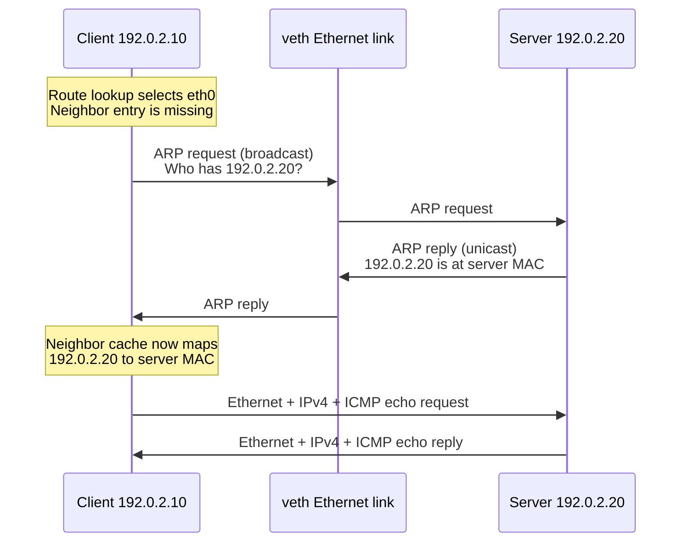

The layers carried on the wire are:

| Frame/packet field | First ARP request | ICMP echo request |
|---|---|---|
| Ethernet destination | Broadcast `ff:ff:ff:ff:ff:ff` | Learned server MAC |
| Ethernet source | Client MAC | Client MAC |
| EtherType | ARP | IPv4 |
| Network-layer intent | Resolve `192.0.2.20` | Reach `192.0.2.20` from `192.0.2.10` |
| Transport payload | None; ARP is not carried in IP | ICMP, which is not TCP or UDP |

This distinction matters: failure to resolve a neighbor prevents construction
of the unicast Ethernet frame even when the IP route is correct.

```bash
# [NS:CLIENT] Change, narrowly scoped to one lab neighbor.
sudo ip netns exec se-lab-client ip neighbour del 192.0.2.20 dev eth0
```

Neighbor states are a state machine, not a permanent health label. `REACHABLE`,
`STALE`, `DELAY`, and `PROBE` can all occur during normal operation. Interpret
them with recent traffic and packet evidence.

### 4.8 Evidence record

For every test, capture:

| Evidence | Question answered |
|---|---|
| `ip -br link` | Does the interface exist and is its administrative state up? |
| `ip -br address` | Is the expected address/prefix bound to the correct interface? |
| `ip route` | Which prefixes and gateways are installed? |
| `ip route get` | Which route would this destination actually use? |
| `ip neighbour` | Has L3-to-L2 neighbor resolution succeeded? |
| `tcpdump` | Which frames/packets crossed this exact observation point? |
| bounded `ping` | Did this ICMP transaction complete within the test window? |

`ping` success proves only that ICMP worked across this path at that moment. It
does not prove DNS, TCP, TLS, application authorization, throughput, or
production availability.

## 5. Controlled failure exercises

Change one variable at a time. Restore the baseline and verify it before moving
to the next failure.

### 5.1 Failure A — Administrative link down

Inject:

```bash
# [NS:SERVER] Change.
sudo ip netns exec se-lab-server ip link set eth0 down
```

Predict before testing:

- server `eth0` reports `DOWN`;
- the peer may report loss of carrier/lower-layer readiness;
- neighbor and ping symptoms follow from the link failure;
- changing routes cannot repair an interface that is administratively down.

Collect evidence from both namespaces, then recover:

```bash
sudo ip netns exec se-lab-client ip -br link
sudo ip netns exec se-lab-server ip -br link
sudo ip netns exec se-lab-client ip route get 192.0.2.20
sudo ip netns exec se-lab-client ping -c 2 -W 1 192.0.2.20 || true

# [NS:SERVER] Recover.
sudo ip netns exec se-lab-server ip link set eth0 up
```

Verify link, route, neighbor resolution, and bounded ping again.

```text
Cause: server interface administratively down
  → veth path cannot carry normal traffic
  → existing IP configuration may still be visible
  → neighbor reachability fails or ages out
  → ICMP transaction times out/fails

Smallest correction: restore server eth0 to UP
Not justified: add a default route, alter DNS, or disable a firewall
```

### 5.2 Failure B — Incorrect prefix length

Replace the client address with a `/32` address, which does not create the
original `/24` connected route:

```bash
# [NS:CLIENT] Change.
sudo ip netns exec se-lab-client ip address replace 192.0.2.10/32 dev eth0
```

Observe before attempting a correction:

```bash
sudo ip netns exec se-lab-client ip -br address
sudo ip netns exec se-lab-client ip route
sudo ip netns exec se-lab-client ip route get 192.0.2.20 2>&1 || true
```

The interface can be up while no usable route exists for the peer. Recover the
intended address/prefix:

```bash
sudo ip netns exec se-lab-client ip address replace 192.0.2.10/24 dev eth0
```

Verify the connected route reappears before running ping.

```text
Cause: client prefix changed from /24 to /32
  → client no longer installs 192.0.2.0/24 as connected
  → route lookup for 192.0.2.20 has no matching route
  → neighbor resolution is not the first failed boundary

Smallest correction: restore the intended /24 address assignment
```

### 5.3 Failure C — Wrong peer address

Move the server outside the client's connected prefix:

```bash
# [NS:SERVER] Change.
sudo ip netns exec se-lab-server ip address replace 198.51.100.20/24 dev eth0
```

The client may continue trying to resolve `192.0.2.20` because its local route
says that address is on-link, but no endpoint now owns it. Capture ARP and inspect
`FAILED`/`INCOMPLETE` neighbor behavior:

```bash
sudo ip netns exec se-lab-client ip neighbour del 192.0.2.20 dev eth0 2>/dev/null || true
sudo ip netns exec se-lab-server tcpdump -ni eth0 -c 4 arp
# Run the bounded client ping in another terminal.
```

Recover:

```bash
sudo ip netns exec se-lab-server ip address replace 192.0.2.20/24 dev eth0
```

Verify address, route, neighbor, capture, and ping. Explain why adding a default
route would not be the smallest correction for this topology.

```text
Cause: server owns 198.51.100.20 instead of 192.0.2.20
  → client still considers 192.0.2.20 on-link
  → client broadcasts ARP for 192.0.2.20
  → no endpoint answers for that address
  → neighbor entry becomes INCOMPLETE/FAILED and ICMP cannot be sent normally

Smallest correction: restore the server's intended 192.0.2.20/24 address
```

## 6. Cleanup and residue verification

List exact resources before removal:

```bash
# [HOST] Inspect.
ip netns list
sudo ip netns exec se-lab-client ip -br link
sudo ip netns exec se-lab-server ip -br link
sudo ip netns pids se-lab-client
sudo ip netns pids se-lab-server
```

Stop any capture or shell you intentionally left inside the namespaces. Then
remove only these exact lab namespaces:

```bash
# [HOST] Change.
sudo ip netns delete se-lab-client
sudo ip netns delete se-lab-server
```

Deleting each namespace removes the interface it owns; the paired veth is also
destroyed when its peer disappears. Prove cleanup:

```bash
ip netns list
ip -br link | grep 'se-lab-' || true
ip -br address
ip route show table main
```

The final host address and route views should match the recorded pre-lab
baseline. If namespace deletion reports a busy resource, do not force unrelated
processes to exit. Inspect `ip netns pids`, identify ownership, stop only the lab
process, and retry.

## 7. Foundation Lab 1 exercises

### Foundation

1. Explain why the two namespaces can both use an interface named `eth0`.
2. From the `/24` prefix, calculate network, broadcast, and usable host range.
3. Explain why the first ping may be slower and why later captures may not show ARP.
4. Show the interface index, MAC address, MTU, qdisc, and operational state on
   both endpoints and explain which fields must agree.

### Applied

5. Capture on both endpoints simultaneously. Build a four-event ARP/ICMP
   timeline using timestamps, MAC addresses, and IP addresses.
6. Introduce each controlled failure without looking at its explanation. Use a
   fixed evidence order and identify the first layer whose state differs from
   baseline.
7. Start a bounded UDP or TCP listener in the server namespace using an
   available standard tool. Prove that socket tables are namespace-local, then
   stop it and verify no listener remains.

### Production judgment

8. A teammate proposes `ping`, then `ip route add default`, then disabling the
   firewall for every failure. Explain how this sequence can hide root cause and
   design a safer evidence ladder.
9. Design a naming and cleanup policy that allows two engineers to run similar
   labs concurrently without deleting one another's resources.
10. Write a runbook for partial construction failure after only one endpoint was
    moved. It must inventory both host and namespace state before cleanup.

## 8. Foundation Lab 1 competency check

- [ ] I can explain which network resources a namespace isolates.
- [ ] I can create, move, rename, address, and activate a veth endpoint.
- [ ] I inspect interface, address, and route state before testing traffic.
- [ ] I can predict the connected route created by a prefix.
- [ ] I can observe ARP and ICMP at a deliberate capture point.
- [ ] I distinguish link, address, route, neighbor, and application evidence.
- [ ] I can diagnose link-down, wrong-prefix, and wrong-address failures.
- [ ] I restore one changed variable at a time and prove recovery.
- [ ] I remove only exact lab resources and verify host state against baseline.

## 9. Foundation Lab 2 — Three-host Ethernet segment

### 9.1 Objective

Build a fully isolated Ethernet switch and attach three network namespaces.
Observe how a Linux bridge learns source MAC addresses, forwards known unicast,
floods broadcast and unknown unicast, and remains independent of IP routing.
Then compare IPv4 ARP with IPv6 Neighbor Discovery (ND).

This lab adds a fourth namespace, `se-lab-switch`, so the bridge and its ports do
not alter the host namespace. The three endpoint namespaces represent hosts, not
containers or virtual machines.

### 9.2 Topology

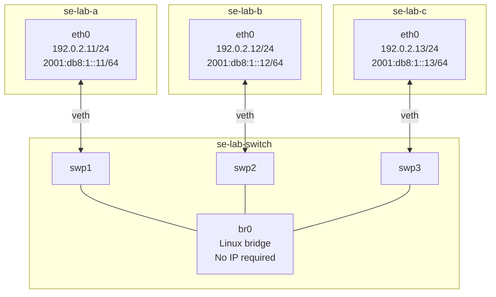

| Host | IPv4 | IPv6 documentation address | Switch port |
|---|---|---|---|
| `se-lab-a` | `192.0.2.11/24` | `2001:db8:1::11/64` | `swp1` |
| `se-lab-b` | `192.0.2.12/24` | `2001:db8:1::12/64` | `swp2` |
| `se-lab-c` | `192.0.2.13/24` | `2001:db8:1::13/64` | `swp3` |

All endpoints share one L2 broadcast domain and have on-link prefixes. No
router, default gateway, NAT, or bridge IP address is needed. The IPv6 prefix is
from RFC 3849 and is used only for documentation/lab traffic.

### 9.3 Bridge forwarding model

A transparent bridge makes a forwarding decision from the Ethernet destination
MAC address, while learning from the Ethernet source MAC address.

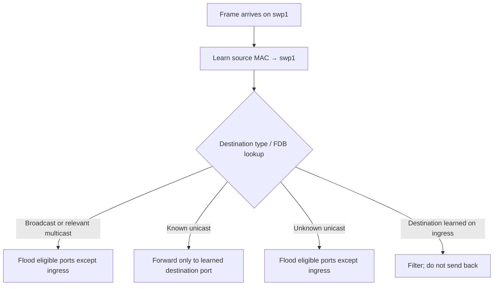

The forwarding database (FDB) is not the ARP/ND neighbor table:

| Table | Layer and key | Maps to | Maintained by |
|---|---|---|---|
| Bridge FDB | L2 destination MAC, optionally VLAN | Egress bridge port | Bridge learning, static config, control plane |
| IPv4 neighbor table | IPv4 address | Link-layer address and reachability state | ARP and neighbor subsystem |
| IPv6 neighbor table | IPv6 address | Link-layer address and reachability state | ICMPv6 Neighbor Discovery |
| Route table | IP prefix | Next hop/interface and route attributes | Connected config, operator, routing protocol |

A complete path may need both a route decision and a neighbor mapping at the
endpoint, followed by an FDB decision at the bridge.

### 9.4 Preflight and exact-name check

Foundation Lab 1 must already be cleaned up. Stop if any target name exists:

```bash
# [HOST] Inspect only.
ip netns list
for ns in se-lab-a se-lab-b se-lab-c se-lab-switch; do
  ip netns list | grep -F "${ns}" && echo "STOP: ${ns} already exists"
done
```

The loop is an inventory aid, not proof of exclusive ownership. If it prints a
match, investigate rather than deleting it.

### 9.5 Build namespaces and links

```bash
# [HOST] Change: create four isolated network namespaces.
sudo ip netns add se-lab-a
sudo ip netns add se-lab-b
sudo ip netns add se-lab-c
sudo ip netns add se-lab-switch

# [HOST] Change: create three veth pairs.
sudo ip link add se-lab-a0 type veth peer name se-lab-p1
sudo ip link add se-lab-b0 type veth peer name se-lab-p2
sudo ip link add se-lab-c0 type veth peer name se-lab-p3

# [HOST] Change: move endpoint and switch-side ports.
sudo ip link set se-lab-a0 netns se-lab-a
sudo ip link set se-lab-b0 netns se-lab-b
sudo ip link set se-lab-c0 netns se-lab-c
sudo ip link set se-lab-p1 netns se-lab-switch
sudo ip link set se-lab-p2 netns se-lab-switch
sudo ip link set se-lab-p3 netns se-lab-switch
```

Rename and configure endpoints:

```bash
# [NS:A]
sudo ip netns exec se-lab-a ip link set se-lab-a0 name eth0
sudo ip netns exec se-lab-a ip link set lo up
sudo ip netns exec se-lab-a ip address add 192.0.2.11/24 dev eth0
sudo ip netns exec se-lab-a ip -6 address add 2001:db8:1::11/64 dev eth0
sudo ip netns exec se-lab-a ip link set eth0 up

# [NS:B]
sudo ip netns exec se-lab-b ip link set se-lab-b0 name eth0
sudo ip netns exec se-lab-b ip link set lo up
sudo ip netns exec se-lab-b ip address add 192.0.2.12/24 dev eth0
sudo ip netns exec se-lab-b ip -6 address add 2001:db8:1::12/64 dev eth0
sudo ip netns exec se-lab-b ip link set eth0 up

# [NS:C]
sudo ip netns exec se-lab-c ip link set se-lab-c0 name eth0
sudo ip netns exec se-lab-c ip link set lo up
sudo ip netns exec se-lab-c ip address add 192.0.2.13/24 dev eth0
sudo ip netns exec se-lab-c ip -6 address add 2001:db8:1::13/64 dev eth0
sudo ip netns exec se-lab-c ip link set eth0 up
```

Create the switch without assigning L3 addresses:

```bash
# [NS:SWITCH] Change.
sudo ip netns exec se-lab-switch ip link set se-lab-p1 name swp1
sudo ip netns exec se-lab-switch ip link set se-lab-p2 name swp2
sudo ip netns exec se-lab-switch ip link set se-lab-p3 name swp3
sudo ip netns exec se-lab-switch ip link add br0 type bridge
sudo ip netns exec se-lab-switch ip link set swp1 master br0
sudo ip netns exec se-lab-switch ip link set swp2 master br0
sudo ip netns exec se-lab-switch ip link set swp3 master br0
sudo ip netns exec se-lab-switch ip link set lo up
sudo ip netns exec se-lab-switch ip link set br0 up
sudo ip netns exec se-lab-switch ip link set swp1 up
sudo ip netns exec se-lab-switch ip link set swp2 up
sudo ip netns exec se-lab-switch ip link set swp3 up
```

Why both the bridge and its ports are brought up: a port's administrative state,
veth carrier state, bridge membership, and bridge state are distinct. A correct
IP address on the far endpoint cannot compensate for a down or detached switch
port.

### 9.6 Verify L2 baseline before generating traffic

```bash
# [NS:SWITCH]
sudo ip netns exec se-lab-switch ip -br link
sudo ip netns exec se-lab-switch bridge link show
sudo ip netns exec se-lab-switch bridge fdb show br br0

# [NS:A/B/C]
sudo ip netns exec se-lab-a ip -br address
sudo ip netns exec se-lab-b ip -br address
sudo ip netns exec se-lab-c ip -br address
sudo ip netns exec se-lab-a ip route
sudo ip netns exec se-lab-a ip -6 route
```

Before host traffic, the FDB mostly contains local/permanent entries associated
with the bridge and ports. Do not memorize exact output: kernel and iproute2
versions format flags differently.

IPv6 performs Duplicate Address Detection (DAD) after address assignment unless
policy disables it. Wait until the global addresses are no longer marked
`tentative` before the IPv6 test:

```bash
sudo ip netns exec se-lab-a ip -6 address show dev eth0
sudo ip netns exec se-lab-b ip -6 address show dev eth0
sudo ip netns exec se-lab-c ip -6 address show dev eth0
```

### 9.7 Observe FDB learning and flooding

Record each endpoint MAC:

```bash
sudo ip netns exec se-lab-a cat /sys/class/net/eth0/address
sudo ip netns exec se-lab-b cat /sys/class/net/eth0/address
sudo ip netns exec se-lab-c cat /sys/class/net/eth0/address
```

Start captures on `swp2` and `swp3`, then send the first A→B ping:

```bash
# [NS:SWITCH] Terminal 1.
sudo ip netns exec se-lab-switch tcpdump -eni swp2 -c 10 'arp or icmp'

# [NS:SWITCH] Terminal 2.
sudo ip netns exec se-lab-switch tcpdump -eni swp3 -c 6 'arp or icmp'

# [NS:A] Terminal 3.
sudo ip netns exec se-lab-a ping -c 3 -W 2 192.0.2.12
```

Expected reasoning:

1. A emits a broadcast ARP request; the bridge learns A's source MAC on `swp1`.
2. Broadcast is flooded to `swp2` and `swp3`; B answers because it owns the IP.
3. The reply lets the bridge learn B's source MAC on `swp2`.
4. Subsequent known-unicast ICMP frames between A and B use `swp1` and `swp2`;
   C's port should not receive those ordinary known-unicast frames.

Inspect the learned state:

```bash
sudo ip netns exec se-lab-switch bridge fdb show br br0
sudo ip netns exec se-lab-switch bridge -s link show
sudo ip netns exec se-lab-a ip neighbour show dev eth0
sudo ip netns exec se-lab-b ip neighbour show dev eth0
sudo ip netns exec se-lab-c ip neighbour show dev eth0
```

The bridge learns from source MACs, so merely addressing C does not guarantee a
dynamic C entry. Generate traffic from C if you want the bridge to learn it.
Dynamic FDB entries age according to bridge policy; disappearance after an idle
period is normal, not proof of link failure.

### 9.8 Compare ARP and IPv6 Neighbor Discovery

ARP is a separate Ethernet protocol used for IPv4 address-to-MAC resolution.
IPv6 ND is carried in ICMPv6 and also performs router discovery, reachability
detection, redirect processing, and address-related functions.

| Property | IPv4 ARP | IPv6 Neighbor Discovery |
|---|---|---|
| Encapsulation | Ethernet EtherType ARP | ICMPv6 inside IPv6 |
| Initial request destination | Ethernet broadcast | Solicited-node IPv6 multicast and mapped multicast MAC |
| Request message | ARP Request | Neighbor Solicitation (NS), ICMPv6 type 135 |
| Reply message | ARP Reply | Neighbor Advertisement (NA), ICMPv6 type 136 |
| Duplicate-address role | Gratuitous/probe behavior outside base ARP resolution | DAD uses Neighbor Solicitation behavior |
| Security assumption | No authentication in base protocol | Base ND is also not inherently trusted; SEND is separate |

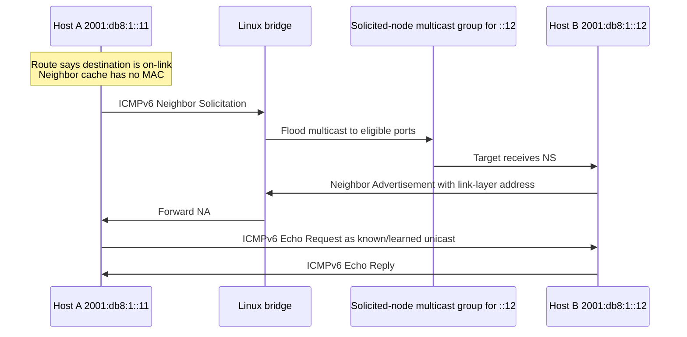

Observe it:

```bash
# [NS:A] Clear only the B neighbor entry if it already exists.
sudo ip netns exec se-lab-a ip -6 neighbour del 2001:db8:1::12 dev eth0 2>/dev/null || true

# [NS:SWITCH] Capture on A-facing port; stop after bounded packets.
sudo ip netns exec se-lab-switch \
  tcpdump -eni swp1 -c 12 'icmp6'

# [NS:A] In another terminal.
sudo ip netns exec se-lab-a ping -6 -c 3 -W 2 2001:db8:1::12

# [NS:A] Inspect the resulting neighbor entry.
sudo ip netns exec se-lab-a ip -6 neighbour show dev eth0
```

Do not describe the solicited-node group as broadcast. IPv6 has no broadcast;
ND narrows delivery with multicast, although a simple bridge may still flood
that multicast to multiple eligible ports depending on multicast state.

## 10. Foundation Lab 2 controlled failures

### 10.1 Failure A — Bridge port detached

Detach B's switch port without changing B's endpoint address:

```bash
# [NS:SWITCH] Change.
sudo ip netns exec se-lab-switch ip link set swp2 nomaster
```

Evidence order:

```bash
sudo ip netns exec se-lab-switch bridge link show
sudo ip netns exec se-lab-switch bridge fdb show br br0
sudo ip netns exec se-lab-switch ip -br link
sudo ip netns exec se-lab-a ip route get 192.0.2.12
sudo ip netns exec se-lab-a ping -c 2 -W 1 192.0.2.12 || true
```

The physical-like veth carrier and endpoint IP can remain present, but `swp2` is
no longer a port of `br0`, so the bridge cannot switch frames to B.

Recover and verify membership before connectivity:

```bash
sudo ip netns exec se-lab-switch ip link set swp2 master br0
sudo ip netns exec se-lab-switch bridge link show
sudo ip netns exec se-lab-a ping -c 2 -W 2 192.0.2.12
```

### 10.2 Failure B — Port administratively down

```bash
# [NS:SWITCH] Change.
sudo ip netns exec se-lab-switch ip link set swp3 down
```

Compare `ip -br link`, `bridge link`, FDB state, endpoint carrier, and captures.
An old dynamic FDB entry may temporarily remain even though the current data
path is unusable; control-plane tables can be stale relative to physical state.

Recover:

```bash
sudo ip netns exec se-lab-switch ip link set swp3 up
```

### 10.3 Failure C — Duplicate IPv4 address

Temporarily give C the same IPv4 address as B:

```bash
# [NS:C] Change.
sudo ip netns exec se-lab-c ip address replace 192.0.2.12/24 dev eth0
```

This creates ambiguous ownership. Symptoms can vary with timing and neighbor
cache state: replies may alternate, a cache may pin one MAC, and traffic may be
misdelivered. Capture ARP from A and compare endpoint MACs rather than declaring
the network “flaky.”

```bash
sudo ip netns exec se-lab-a ip neighbour del 192.0.2.12 dev eth0 2>/dev/null || true
sudo ip netns exec se-lab-switch tcpdump -eni swp1 -c 12 arp
# Generate bounded A→192.0.2.12 traffic in another terminal.
```

Recover the intended C address, clear only the affected A neighbor entry, and
verify all three endpoint identities:

```bash
sudo ip netns exec se-lab-c ip address replace 192.0.2.13/24 dev eth0
sudo ip netns exec se-lab-a ip neighbour del 192.0.2.12 dev eth0 2>/dev/null || true
sudo ip netns exec se-lab-a ping -c 2 -W 2 192.0.2.12
sudo ip netns exec se-lab-a ping -c 2 -W 2 192.0.2.13
```

### 10.4 Lab 2 cleanup

Inventory exact namespaces and processes first:

```bash
for ns in se-lab-a se-lab-b se-lab-c se-lab-switch; do
  echo "=== ${ns} ==="
  sudo ip netns pids "${ns}"
  sudo ip netns exec "${ns}" ip -br link
done
```

Stop only intentional lab processes, then remove the exact namespace names:

```bash
sudo ip netns delete se-lab-a
sudo ip netns delete se-lab-b
sudo ip netns delete se-lab-c
sudo ip netns delete se-lab-switch
```

Verify no prefixed namespace/interface remains and compare host addresses/routes
with the pre-lab baseline. Do not turn a scripted cleanup loop into a wildcard
delete operation.

### 10.5 Lab 2 exercises

#### Foundation

1. Explain why `br0` needs no IP address to switch IPv4 and IPv6 frames.
2. Identify which table maps destination MAC→port and which maps IP→MAC.
3. Predict what A, B, and C capture during the first A→B IPv4 ping.
4. Explain why IPv6 ND multicast is not broadcast.

#### Applied

5. Record the FDB before traffic, after A→B traffic, and after C transmits.
   Explain every new dynamic entry using a captured source MAC.
6. Measure dynamic FDB aging without changing the default. Correlate observation
   time with the bridge's configured aging policy.
7. Capture IPv4 ARP and IPv6 NS/NA for the same pair. Produce a side-by-side
   protocol sequence with frame destination addresses.
8. Diagnose each injected failure using the same order: link, bridge membership,
   FDB, route, neighbor, capture, transaction.

#### Production judgment

9. Explain why flushing the entire FDB and neighbor tables first can destroy
   evidence and create a misleading temporary recovery.
10. Design monitoring for MAC movement that distinguishes an expected VM move
    from a loop, duplicate attachment, or spoofing event.
11. A bridge sees unknown-unicast flooding on every port. Develop hypotheses for
    normal first traffic, FDB aging, asymmetric observation, learning disabled,
    MAC churn, and table pressure.

### 10.6 Lab 2 competency check

- [ ] I can construct an isolated three-host bridge topology.
- [ ] I explain source learning and destination lookup separately.
- [ ] I distinguish broadcast, multicast, unknown unicast, and known unicast.
- [ ] I correlate FDB entries with captured source MAC addresses.
- [ ] I distinguish route, neighbor, and bridge forwarding tables.
- [ ] I compare ARP with IPv6 NS/NA without calling IPv6 multicast broadcast.
- [ ] I diagnose detached, down, and duplicate-address failure modes.
- [ ] I preserve evidence before clearing dynamic state.
- [ ] I validate exact resources before cleanup.

## 11. Foundation Lab 3 — Routing between two subnets

### 11.1 Objective

Build a client, router, and server in three namespaces. The router has one
interface in each subnet and forwards IPv4 packets between them. You will
separate four decisions that are often collapsed into “routing”:

1. the source host selects a matching route and next hop;
2. the source resolves the next hop's MAC—not the remote destination's MAC;
3. the router accepts the frame, decrements TTL, and performs a new route lookup;
4. the destination uses an independent return route.

### 11.2 Topology and address plan

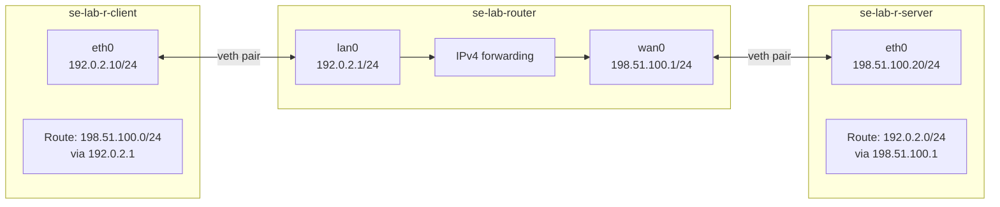

| Node | Interface | Address | Connected network | Explicit remote route |
|---|---|---|---|---|
| Client | `eth0` | `192.0.2.10/24` | `192.0.2.0/24` | `198.51.100.0/24 via 192.0.2.1` |
| Router | `lan0` | `192.0.2.1/24` | `192.0.2.0/24` | None required |
| Router | `wan0` | `198.51.100.1/24` | `198.51.100.0/24` | None required |
| Server | `eth0` | `198.51.100.20/24` | `198.51.100.0/24` | `192.0.2.0/24 via 198.51.100.1` |

The two RFC 5737 documentation prefixes represent separate L2 segments. No
NAT, default route, DNS, or external interface participates.

### 11.3 Routing is hop-by-hop

```mermaid
sequenceDiagram
    participant C as Client
    participant R1 as Router lan0
    participant R2 as Router wan0
    participant S as Server
    Note over C: LPM selects remote-prefix route<br/>Next hop = 192.0.2.1
    C->>R1: ARP for router lan0 MAC
    R1-->>C: ARP reply
    C->>R1: Ethernet dst=router-lan MAC<br/>IP dst=198.51.100.20, TTL=N
    Note over R1,R2: Remove incoming L2 header<br/>decrement TTL; route lookup
    R2->>S: ARP for server MAC
    S-->>R2: ARP reply
    R2->>S: New Ethernet header<br/>same IP destination, TTL=N-1
    Note over S: Return route selects<br/>next hop 198.51.100.1
```

The IP source/destination normally remain client/server across this no-NAT
router. The Ethernet source/destination are rewritten for each L2 segment.
TTL decreases at the forwarding hop to bound routing loops.

### 11.4 Longest-prefix match

The kernel compares a destination against available prefixes and selects the
most specific matching route before later tie-breakers. Conceptually:

| Candidate | Matches `198.51.100.20`? | Prefix length | Preferred? |
|---|---:|---:|---:|
| `0.0.0.0/0` | Yes | 0 | No, if a more-specific usable route exists |
| `198.51.0.0/16` | Yes | 16 | No |
| `198.51.100.0/24` | Yes | 24 | Yes |
| `198.51.100.20/32` | Yes | 32 | Yes if installed and usable |

This lab installs only the `/24` remote route. Use `ip route get`, not visual
guessing, to ask the kernel which route it would use.

### 11.5 Preflight

Foundation Lab 2 must be cleaned up. Verify required tools and exact names:

```bash
# [HOST] Inspect.
command -v ip
command -v sysctl
command -v ping
command -v tcpdump || true
ip netns list
```

Stop if `se-lab-r-client`, `se-lab-router`, or `se-lab-r-server` already exists.
Do not reuse or delete a namespace without establishing ownership.

### 11.6 Build the three namespaces and two links

```bash
# [HOST] Change.
sudo ip netns add se-lab-r-client
sudo ip netns add se-lab-router
sudo ip netns add se-lab-r-server

sudo ip link add se-lab-cl type veth peer name se-lab-rl
sudo ip link add se-lab-rw type veth peer name se-lab-sv

sudo ip link set se-lab-cl netns se-lab-r-client
sudo ip link set se-lab-rl netns se-lab-router
sudo ip link set se-lab-rw netns se-lab-router
sudo ip link set se-lab-sv netns se-lab-r-server
```

Configure client and server endpoints:

```bash
# [NS:CLIENT] Change.
sudo ip netns exec se-lab-r-client ip link set se-lab-cl name eth0
sudo ip netns exec se-lab-r-client ip link set lo up
sudo ip netns exec se-lab-r-client ip address add 192.0.2.10/24 dev eth0
sudo ip netns exec se-lab-r-client ip link set eth0 up

# [NS:SERVER] Change.
sudo ip netns exec se-lab-r-server ip link set se-lab-sv name eth0
sudo ip netns exec se-lab-r-server ip link set lo up
sudo ip netns exec se-lab-r-server ip address add 198.51.100.20/24 dev eth0
sudo ip netns exec se-lab-r-server ip link set eth0 up
```

Configure both router interfaces:

```bash
# [NS:ROUTER] Change.
sudo ip netns exec se-lab-router ip link set se-lab-rl name lan0
sudo ip netns exec se-lab-router ip link set se-lab-rw name wan0
sudo ip netns exec se-lab-router ip link set lo up
sudo ip netns exec se-lab-router ip address add 192.0.2.1/24 dev lan0
sudo ip netns exec se-lab-router ip address add 198.51.100.1/24 dev wan0
sudo ip netns exec se-lab-router ip link set lan0 up
sudo ip netns exec se-lab-router ip link set wan0 up
```

### 11.7 Verify direct links before enabling forwarding

First prove each independent segment:

```bash
# Client reaches only its directly connected router interface.
sudo ip netns exec se-lab-r-client ping -c 2 -W 2 192.0.2.1

# Server reaches only its directly connected router interface.
sudo ip netns exec se-lab-r-server ping -c 2 -W 2 198.51.100.1

# Inspect all connected routes and neighbors.
sudo ip netns exec se-lab-r-client ip route
sudo ip netns exec se-lab-router ip route
sudo ip netns exec se-lab-r-server ip route
sudo ip netns exec se-lab-r-client ip neighbour
sudo ip netns exec se-lab-router ip neighbour
sudo ip netns exec se-lab-r-server ip neighbour
```

At this stage client→server should not work: no remote host routes have been
installed and router forwarding should retain the new namespace's host default.
Recording this negative baseline is part of the lab.

### 11.8 Add remote routes deliberately

```bash
# [NS:CLIENT] Route to server subnet via the on-link router address.
sudo ip netns exec se-lab-r-client \
  ip route add 198.51.100.0/24 via 192.0.2.1 dev eth0

# [NS:SERVER] Return route to client subnet.
sudo ip netns exec se-lab-r-server \
  ip route add 192.0.2.0/24 via 198.51.100.1 dev eth0
```

Inspect kernel decisions:

```bash
sudo ip netns exec se-lab-r-client ip route get 198.51.100.20
sudo ip netns exec se-lab-r-server ip route get 192.0.2.10
sudo ip netns exec se-lab-router ip route get 198.51.100.20
sudo ip netns exec se-lab-router ip route get 192.0.2.10
```

The `via` address must itself be reachable on-link through the selected
interface. A next hop is not a magic remote destination; the sender must resolve
its link-layer address.

### 11.9 Enable forwarding only in the router namespace

Inspect host and router values separately:

```bash
# [HOST]
sysctl net.ipv4.ip_forward

# [NS:ROUTER]
sudo ip netns exec se-lab-router sysctl net.ipv4.ip_forward
```

Enable forwarding inside the disposable router namespace:

```bash
# [NS:ROUTER] Change, namespace-scoped and non-persistent.
sudo ip netns exec se-lab-router sysctl -w net.ipv4.ip_forward=1
```

The Linux kernel documents `ip_forward` as a special switch: changing it can
reset relevant IPv4 configuration parameters toward host/router defaults in
that network namespace. Therefore configure it deliberately and re-inspect
effective network sysctls when other policy depends on them. This lab does not
write `/etc/sysctl*` and does not enable host-namespace forwarding.

### 11.10 Observe a forwarded transaction

Run captures on both router interfaces:

```bash
# [NS:ROUTER] Terminal 1.
sudo ip netns exec se-lab-router \
  tcpdump -eni lan0 -c 12 'arp or icmp'

# [NS:ROUTER] Terminal 2.
sudo ip netns exec se-lab-router \
  tcpdump -eni wan0 -c 12 'arp or icmp'

# [NS:CLIENT] Terminal 3.
sudo ip netns exec se-lab-r-client ping -c 3 -W 2 198.51.100.20
```

Correlate captures:

| Field | `lan0` ingress | `wan0` egress |
|---|---|---|
| IP source | `192.0.2.10` | `192.0.2.10` |
| IP destination | `198.51.100.20` | `198.51.100.20` |
| Ethernet source | Client MAC | Router `wan0` MAC |
| Ethernet destination | Router `lan0` MAC | Server MAC |
| TTL | Original value | Original minus one |

Exact capture order depends on warm/cold neighbor caches. If necessary, delete
only the relevant lab neighbor entries before repeating; do not flush every
table as a first response.

### 11.11 TTL and ICMP Time Exceeded

Send one probe with TTL 1. The router decrements it to zero, discards it, and
normally returns ICMP Time Exceeded:

```bash
# [NS:CLIENT]
sudo ip netns exec se-lab-r-client ping -c 1 -W 2 -t 1 198.51.100.20 || true
```

Capture on `lan0` to see both the expiring echo request and returned ICMP error.
The server should not receive this echo request. Then use the normal ping again
to prove that the topology itself remains healthy.

If `traceroute` is installed, a bounded comparison is useful:

```bash
sudo ip netns exec se-lab-r-client \
  traceroute -n -m 3 -w 1 -q 1 198.51.100.20
```

Traceroute behavior depends on probe protocol, firewall policy, ICMP handling,
and implementation. Asterisks do not by themselves prove forwarding failure.

## 12. Foundation Lab 3 controlled failures

### 12.1 Failure A — Forwarding disabled

```bash
# [NS:ROUTER] Change.
sudo ip netns exec se-lab-router sysctl -w net.ipv4.ip_forward=0
```

Expected boundary:

- client and server can still reach their local router interface;
- all route tables can remain correct;
- the router can receive packets addressed to itself;
- it does not forward transit traffic between interfaces.

Collect link, address, route, neighbor, sysctl, and both-interface captures.
Recover with `net.ipv4.ip_forward=1`, re-inspect the value, then verify the
end-to-end transaction.

### 12.2 Failure B — Client remote route removed

```bash
# [NS:CLIENT] Change.
sudo ip netns exec se-lab-r-client ip route del 198.51.100.0/24
```

`ip route get 198.51.100.20` should now fail unless some other route exists.
The router should see no attempted transit packet because the source cannot
select an egress path. Restore the exact route:

```bash
sudo ip netns exec se-lab-r-client \
  ip route add 198.51.100.0/24 via 192.0.2.1 dev eth0
```

### 12.3 Failure C — Server return route removed

```bash
# [NS:SERVER] Change.
sudo ip netns exec se-lab-r-server ip route del 192.0.2.0/24
```

The echo request can cross both router interfaces and arrive at the server, but
the server cannot select a route back to `192.0.2.10`. This is asymmetric
routing at the route-availability level, not packet loss on the forward path.
Captures at both router interfaces distinguish it from disabled forwarding.

Restore:

```bash
sudo ip netns exec se-lab-r-server \
  ip route add 192.0.2.0/24 via 198.51.100.1 dev eth0
```

### 12.4 Symptom-to-boundary comparison

| Failure | Client route lookup | Router sees request on `lan0` | Router sends on `wan0` | Server sees request | Reply path |
|---|---|---:|---:|---:|---|
| Client remote route missing | Fails | No | No | No | Never begins |
| Router forwarding disabled | Succeeds | Yes | No | No | Never begins |
| Server return route missing | Succeeds | Yes | Yes | Yes | Fails at server route lookup |

All three can appear to the user as a ping timeout. Evidence location—not the
surface symptom—identifies the failed boundary.

### 12.5 Cleanup

Confirm forwarding and exact resources before deletion:

```bash
sudo ip netns exec se-lab-router sysctl net.ipv4.ip_forward
for ns in se-lab-r-client se-lab-router se-lab-r-server; do
  echo "=== ${ns} ==="
  sudo ip netns pids "${ns}"
  sudo ip netns exec "${ns}" ip -br address
  sudo ip netns exec "${ns}" ip route
done
```

Stop only lab captures/shells, then delete exact namespace names:

```bash
sudo ip netns delete se-lab-r-client
sudo ip netns delete se-lab-router
sudo ip netns delete se-lab-r-server
```

Verify no `se-lab-r-` resource remains and compare host address, route, and
`net.ipv4.ip_forward` state with the original host baseline. Deleting the router
namespace removes its namespace-scoped forwarding setting; it must not have
changed the host value.

### 12.6 Lab 3 exercises

#### Foundation

1. Explain why the client ARPs for `192.0.2.1`, not `198.51.100.20`.
2. Identify which header fields change at the router and which remain unchanged.
3. Explain why both forward and return routes are required for request/reply.
4. Given `/0`, `/16`, `/24`, and `/32` candidates, apply longest-prefix match.

#### Applied

5. Capture a cold-cache ping on both router interfaces and annotate every ARP
   and ICMP frame with ingress/egress MAC, IP, and TTL.
6. Complete all three failure cases without reading the symptom table. State a
   falsifiable hypothesis before each capture.
7. Add a deliberately less-specific route alongside the `/24` and prove which
   route wins with `ip route get`; remove only the added exercise route.
8. Use a TTL-1 probe to prove the router boundary and explain the ICMP response.

#### Production judgment

9. Design an evidence plan for an asymmetric route that exists only during
   failover. Include synchronized captures and control-plane snapshots.
10. Explain why enabling forwarding globally on a multi-purpose host can expand
    its security role and why interface/firewall policy still matters.
11. A route is present but marked unusable or its next hop cannot resolve.
    Explain why “route exists” is not equivalent to “forwarding works.”

### 12.7 Lab 3 competency check

- [ ] I distinguish source routing, next-hop resolution, transit forwarding, and return routing.
- [ ] I use `ip route get` to prove longest-prefix route selection.
- [ ] I explain per-hop Ethernet rewriting and TTL decrement.
- [ ] I enable forwarding only inside the intended router namespace.
- [ ] I capture the same packet path at router ingress and egress.
- [ ] I distinguish missing source route, disabled forwarding, and missing return route.
- [ ] I restore only the injected fault and verify the complete transaction.
- [ ] I prove cleanup did not change host forwarding or routes.

## 13. Foundation Lab 4 — VLAN access and trunk links

### 13.1 Objective

Build two VLAN-aware Linux bridges joined by an 802.1Q trunk. Attach two hosts
to VLAN 10 access ports on different switches and one host to a VLAN 20 access
port. Observe untagged access frames, tagged trunk frames, VLAN-scoped FDB
entries, and the absence of inter-VLAN forwarding without a router.

### 13.2 Topology

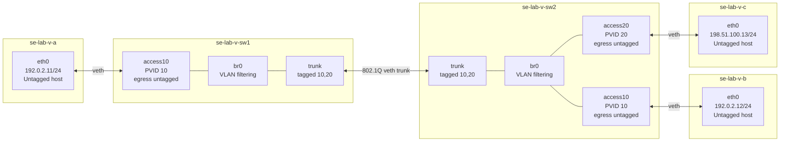

| Port | Role | Ingress untagged classification | Allowed VLANs | Egress form |
|---|---|---:|---|---|
| SW1 `access10` | Access | PVID 10 | 10 | VLAN 10 untagged |
| SW1 `trunk` | Trunk | None | 10, 20 | VLAN 10/20 tagged |
| SW2 `trunk` | Trunk | None | 10, 20 | VLAN 10/20 tagged |
| SW2 `access10` | Access | PVID 10 | 10 | VLAN 10 untagged |
| SW2 `access20` | Access | PVID 20 | 20 | VLAN 20 untagged |

### 13.3 Mental model: classify, forward, transform

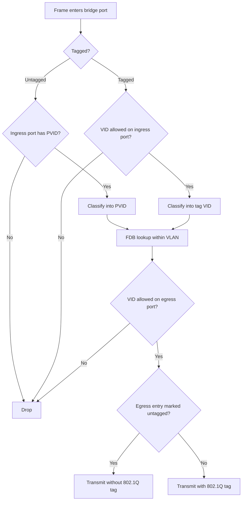

- **PVID** classifies untagged/priority-tagged ingress traffic into a VLAN.
- **untagged** controls whether that VLAN leaves the port without an 802.1Q tag.
- A trunk in this lab has no PVID, so unexpected untagged ingress is rejected.
- VLAN membership constrains both learning/forwarding domains. The same MAC can
  conceptually exist in different VLAN contexts.
- VLANs create separate L2 broadcast domains; they do not route between IP
  subnets. Inter-VLAN communication needs an L3 function and policy.

An 802.1Q tag adds a Tag Protocol Identifier (normally EtherType `0x8100`) and
Tag Control Information containing priority, drop eligibility, and a 12-bit VLAN
identifier. VLAN IDs are not tenant authentication or encryption.

### 13.4 Preflight and isolation

Clean Foundation Lab 3 first. Confirm bridge VLAN support:

```bash
# [HOST] Inspect.
ip -Version
bridge -Version
bridge vlan help 2>&1 | head -30
ip netns list
```

Stop if any of these exact names exists: `se-lab-v-a`, `se-lab-v-b`,
`se-lab-v-c`, `se-lab-v-sw1`, or `se-lab-v-sw2`.

### 13.5 Create namespaces and veth pairs

```bash
# [HOST] Change.
sudo ip netns add se-lab-v-a
sudo ip netns add se-lab-v-b
sudo ip netns add se-lab-v-c
sudo ip netns add se-lab-v-sw1
sudo ip netns add se-lab-v-sw2

sudo ip link add se-lab-va type veth peer name se-lab-s1a
sudo ip link add se-lab-vb type veth peer name se-lab-s2b
sudo ip link add se-lab-vc type veth peer name se-lab-s2c
sudo ip link add se-lab-t1 type veth peer name se-lab-t2

sudo ip link set se-lab-va netns se-lab-v-a
sudo ip link set se-lab-vb netns se-lab-v-b
sudo ip link set se-lab-vc netns se-lab-v-c
sudo ip link set se-lab-s1a netns se-lab-v-sw1
sudo ip link set se-lab-s2b netns se-lab-v-sw2
sudo ip link set se-lab-s2c netns se-lab-v-sw2
sudo ip link set se-lab-t1 netns se-lab-v-sw1
sudo ip link set se-lab-t2 netns se-lab-v-sw2
```

Configure untagged endpoint interfaces:

```bash
# [NS:A]
sudo ip netns exec se-lab-v-a ip link set se-lab-va name eth0
sudo ip netns exec se-lab-v-a ip link set lo up
sudo ip netns exec se-lab-v-a ip address add 192.0.2.11/24 dev eth0
sudo ip netns exec se-lab-v-a ip link set eth0 up

# [NS:B]
sudo ip netns exec se-lab-v-b ip link set se-lab-vb name eth0
sudo ip netns exec se-lab-v-b ip link set lo up
sudo ip netns exec se-lab-v-b ip address add 192.0.2.12/24 dev eth0
sudo ip netns exec se-lab-v-b ip link set eth0 up

# [NS:C]
sudo ip netns exec se-lab-v-c ip link set se-lab-vc name eth0
sudo ip netns exec se-lab-v-c ip link set lo up
sudo ip netns exec se-lab-v-c ip address add 198.51.100.13/24 dev eth0
sudo ip netns exec se-lab-v-c ip link set eth0 up
```

### 13.6 Create VLAN-aware switches

Create each bridge with filtering enabled and default PVID disabled. This avoids
implicit VLAN 1 membership:

```bash
# [NS:SW1]
sudo ip netns exec se-lab-v-sw1 ip link set se-lab-s1a name access10
sudo ip netns exec se-lab-v-sw1 ip link set se-lab-t1 name trunk
sudo ip netns exec se-lab-v-sw1 \
  ip link add br0 type bridge vlan_filtering 1 vlan_default_pvid 0
sudo ip netns exec se-lab-v-sw1 ip link set access10 master br0
sudo ip netns exec se-lab-v-sw1 ip link set trunk master br0

# [NS:SW2]
sudo ip netns exec se-lab-v-sw2 ip link set se-lab-s2b name access10
sudo ip netns exec se-lab-v-sw2 ip link set se-lab-s2c name access20
sudo ip netns exec se-lab-v-sw2 ip link set se-lab-t2 name trunk
sudo ip netns exec se-lab-v-sw2 \
  ip link add br0 type bridge vlan_filtering 1 vlan_default_pvid 0
sudo ip netns exec se-lab-v-sw2 ip link set access10 master br0
sudo ip netns exec se-lab-v-sw2 ip link set access20 master br0
sudo ip netns exec se-lab-v-sw2 ip link set trunk master br0
```

Program port membership explicitly:

```bash
# [NS:SW1] VLAN 10 access; VLANs 10 and 20 tagged on trunk.
sudo ip netns exec se-lab-v-sw1 \
  bridge vlan add dev access10 vid 10 pvid untagged
sudo ip netns exec se-lab-v-sw1 bridge vlan add dev trunk vid 10
sudo ip netns exec se-lab-v-sw1 bridge vlan add dev trunk vid 20

# [NS:SW2] VLAN 10/20 access; both tagged on trunk.
sudo ip netns exec se-lab-v-sw2 \
  bridge vlan add dev access10 vid 10 pvid untagged
sudo ip netns exec se-lab-v-sw2 \
  bridge vlan add dev access20 vid 20 pvid untagged
sudo ip netns exec se-lab-v-sw2 bridge vlan add dev trunk vid 10
sudo ip netns exec se-lab-v-sw2 bridge vlan add dev trunk vid 20
```

Bring up loopback, bridge, and member ports:

```bash
for sw in se-lab-v-sw1 se-lab-v-sw2; do
  sudo ip netns exec "$sw" ip link set lo up
  sudo ip netns exec "$sw" ip link set br0 up
  sudo ip netns exec "$sw" ip link set access10 up
  sudo ip netns exec "$sw" ip link set trunk up
done
sudo ip netns exec se-lab-v-sw2 ip link set access20 up
```

### 13.7 Validate configuration before traffic

```bash
# [NS:SW1]
sudo ip netns exec se-lab-v-sw1 ip -d link show br0
sudo ip netns exec se-lab-v-sw1 bridge link show
sudo ip netns exec se-lab-v-sw1 bridge vlan show

# [NS:SW2]
sudo ip netns exec se-lab-v-sw2 ip -d link show br0
sudo ip netns exec se-lab-v-sw2 bridge link show
sudo ip netns exec se-lab-v-sw2 bridge vlan show
```

Expected invariants:

- access ports show one VLAN with `PVID Egress Untagged`;
- trunks show VLANs 10 and 20 without `PVID` or `Untagged`;
- no port silently depends on default VLAN 1;
- bridges have `vlan_filtering 1`;
- endpoint routes are connected only; no gateway exists.

### 13.8 Observe access versus trunk frames

Run simultaneous captures on SW1 access and trunk ports:

```bash
# [NS:SW1] Terminal 1: access side.
sudo ip netns exec se-lab-v-sw1 \
  tcpdump -eni access10 -c 10 'arp or icmp'

# [NS:SW1] Terminal 2: trunk side.
sudo ip netns exec se-lab-v-sw1 \
  tcpdump -eni trunk -c 10 'vlan 10 and (arp or icmp)'

# [NS:A] Terminal 3.
sudo ip netns exec se-lab-v-a ping -c 3 -W 2 192.0.2.12
```

Expected transformation:

| Observation point | A→B VLAN identity | On-wire tag |
|---|---:|---|
| Host A `eth0` / SW1 `access10` | Classified as VLAN 10 at ingress | None |
| SW1↔SW2 trunk | VLAN 10 | 802.1Q VID 10 |
| SW2 `access10` / Host B `eth0` | VLAN 10 selected for untagged egress | None |

Capture formatting and NIC offload can obscure tags on physical systems. This
veth lab normally exposes them clearly, but in production correlate capture
location, offload state, switch counters, and SPAN behavior.

Inspect per-VLAN learning:

```bash
sudo ip netns exec se-lab-v-sw1 bridge fdb show br br0
sudo ip netns exec se-lab-v-sw2 bridge fdb show br br0
```

### 13.9 Prove VLAN isolation

A and B share VLAN 10 and an IPv4 prefix, so they communicate at L2. C belongs
to VLAN 20 and a different prefix. There is no router or switched virtual
interface:

```bash
sudo ip netns exec se-lab-v-a ping -c 2 -W 2 192.0.2.12
sudo ip netns exec se-lab-v-a ping -c 2 -W 1 198.51.100.13 || true
sudo ip netns exec se-lab-v-c ping -c 2 -W 1 192.0.2.11 || true
```

The cross-VLAN tests can fail at route selection immediately because each host
has only its connected subnet. Adding a route alone would still not create an
L3 forwarding function. A valid inter-VLAN design needs a router interface in
each VLAN (or equivalent routed gateway), forwarding policy, and return routes.

## 14. Foundation Lab 4 controlled failures

### 14.1 Failure A — VLAN 10 removed from one trunk

```bash
# [NS:SW2] Change.
sudo ip netns exec se-lab-v-sw2 bridge vlan del dev trunk vid 10
```

Host interfaces, access VLANs, and the physical-like trunk can all remain up,
but SW2 no longer admits/forwards VLAN 10 on its trunk. Evidence:

```bash
sudo ip netns exec se-lab-v-sw1 bridge vlan show dev trunk
sudo ip netns exec se-lab-v-sw2 bridge vlan show dev trunk
sudo ip netns exec se-lab-v-sw1 tcpdump -eni trunk -c 6 'vlan 10'
sudo ip netns exec se-lab-v-b ip neighbour show
```

Recover the exact membership:

```bash
sudo ip netns exec se-lab-v-sw2 bridge vlan add dev trunk vid 10
```

### 14.2 Failure B — Access port assigned to the wrong VLAN

Move B's access port from VLAN 10 to VLAN 20:

```bash
# [NS:SW2] Change.
sudo ip netns exec se-lab-v-sw2 bridge vlan del dev access10 vid 10
sudo ip netns exec se-lab-v-sw2 \
  bridge vlan add dev access10 vid 20 pvid untagged
```

B keeps `192.0.2.12/24`, but its untagged traffic is now classified into VLAN
20. An IP address does not override switch segmentation. Compare access/trunk
captures and VLAN-scoped FDB entries.

Recover in a deliberate order:

```bash
sudo ip netns exec se-lab-v-sw2 bridge vlan del dev access10 vid 20
sudo ip netns exec se-lab-v-sw2 \
  bridge vlan add dev access10 vid 10 pvid untagged
```

### 14.3 Failure C — PVID removed from an access port

```bash
# [NS:SW1] Change.
sudo ip netns exec se-lab-v-sw1 bridge vlan del dev access10 vid 10
sudo ip netns exec se-lab-v-sw1 bridge vlan add dev access10 vid 10
```

The port is a VLAN 10 member but has no PVID. Because Host A sends untagged
frames, ingress classification fails and traffic is dropped. Membership and
ingress classification are related but not identical.

Recover:

```bash
sudo ip netns exec se-lab-v-sw1 bridge vlan del dev access10 vid 10
sudo ip netns exec se-lab-v-sw1 \
  bridge vlan add dev access10 vid 10 pvid untagged
```

### 14.4 Failure comparison

| Failure | Link state | Access membership | Trunk membership | First failed boundary |
|---|---|---|---|---|
| VLAN 10 missing on SW2 trunk | Up | Correct | Mismatch | SW2 trunk ingress/egress VLAN policy |
| B access port placed in VLAN 20 | Up | Wrong PVID/membership | Correct | SW2 access classification |
| A access PVID absent | Up | VID allowed, no untagged classification | Correct | SW1 access ingress classification |

### 14.5 Cleanup

Inventory VLAN tables, links, and namespace processes:

```bash
for sw in se-lab-v-sw1 se-lab-v-sw2; do
  echo "=== ${sw} ==="
  sudo ip netns exec "$sw" bridge vlan show
  sudo ip netns exec "$sw" bridge fdb show br br0
  sudo ip netns pids "$sw"
done
```

Stop only lab processes. Delete exact namespaces:

```bash
sudo ip netns delete se-lab-v-a
sudo ip netns delete se-lab-v-b
sudo ip netns delete se-lab-v-c
sudo ip netns delete se-lab-v-sw1
sudo ip netns delete se-lab-v-sw2
```

Verify no `se-lab-v-` namespace/interface remains and host routes/interfaces
match baseline.

### 14.6 Lab 4 exercises

#### Foundation

1. Explain PVID and egress-untagged as separate directions/actions.
2. Explain why a VLAN-aware bridge can switch without an IP address.
3. Predict tags at Host A, SW1 access, trunk, SW2 access, and Host B.
4. Explain why VLAN 10 and VLAN 20 require routing to communicate.

#### Applied

5. Capture the same ARP request on access and trunk, then annotate the 802.1Q
   difference and VLAN-scoped FDB learning.
6. Complete all three failures using `bridge vlan show` before packet capture.
7. Add a second host in VLAN 20 on SW1 so VLAN 20 crosses the trunk; verify and
   remove only the exercise resources.
8. Demonstrate that permitting a VLAN on only one side of a trunk is insufficient.

#### Production judgment

9. Design a trunk change procedure that prevents accidental native/PVID mismatch
   and preserves management access.
10. Compare VLAN segmentation with authentication, authorization, encryption,
    and a firewall; explain what VLANs do not provide.
11. A hypervisor capture shows no tags while the switch reports tagged traffic.
    Develop hypotheses covering access placement, offload, capture point, VLAN
    upper devices, and SPAN configuration.

### 14.7 Lab 4 competency check

- [ ] I configure VLAN-aware bridges without implicit VLAN 1 dependence.
- [ ] I explain ingress PVID classification and egress tag removal separately.
- [ ] I verify access and trunk membership with `bridge vlan show`.
- [ ] I capture untagged access frames and tagged trunk frames.
- [ ] I understand that FDB learning is VLAN-scoped.
- [ ] I distinguish VLAN segmentation from inter-VLAN routing and security policy.
- [ ] I diagnose missing trunk VLAN, wrong access VLAN, and missing PVID.
- [ ] I restore exact membership and prove complete cleanup.

## 15. Foundation Lab 5 — Stateful source NAT

### 15.1 Objective and topology

Build an inside client, NAT router, and outside server. First prove that plain
routing reaches the server but cannot return because the server has no route to
the inside prefix. Then add one explicit nftables SNAT rule and correlate the
original packet, translated packet, reply, and reverse translation.

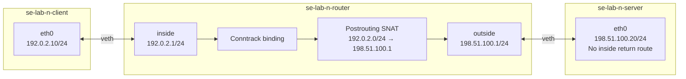

| Observation point | Request source | Request destination |
|---|---|---|
| Client and router `inside` | `192.0.2.10` | `198.51.100.20` |
| Router `outside` and server | `198.51.100.1` | `198.51.100.20` |
| Reply before reverse NAT | `198.51.100.20` | `198.51.100.1` |
| Reply after reverse NAT | `198.51.100.20` | `192.0.2.10` |

Both prefixes are documentation space; “inside” and “outside” describe lab
policy roles, not public/private address status.

### 15.2 Stateful NAT model

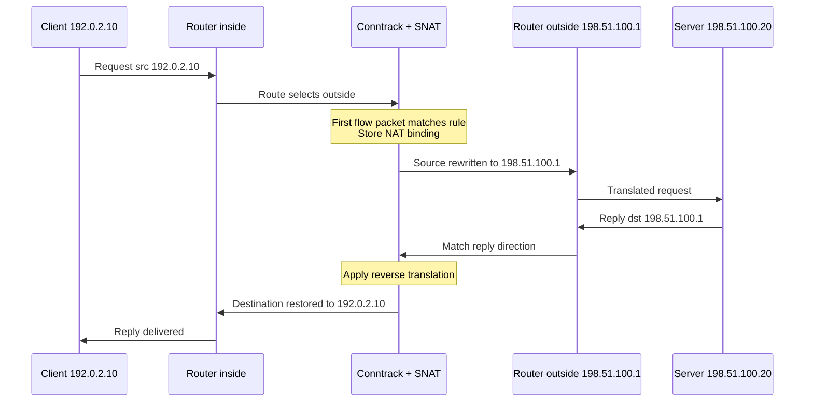

Stateful NAT normally evaluates the NAT chain on the first packet of a flow and
stores a binding in conntrack. Follow-up packets use that binding; NAT rule
counters therefore need not increment once per packet.

NAT, routing, forwarding, and filtering are separate. This lab creates no filter
chain. A production gateway requires explicit forwarding policy, anti-spoofing,
logging, state-capacity planning, and ownership.

### 15.3 Preflight and build

Clean Lab 4. Require `ip`, `sysctl`, `nft`, and `ping`; `tcpdump` and the
`conntrack` CLI are used for deeper observation. Stop if any target namespace
already exists.

```bash
# [HOST] Inspect.
command -v nft
command -v conntrack || true
nft --version
ip netns list

# [HOST] Change.
sudo ip netns add se-lab-n-client
sudo ip netns add se-lab-n-router
sudo ip netns add se-lab-n-server
sudo ip link add se-lab-ni type veth peer name se-lab-ri
sudo ip link add se-lab-ro type veth peer name se-lab-no
sudo ip link set se-lab-ni netns se-lab-n-client
sudo ip link set se-lab-ri netns se-lab-n-router
sudo ip link set se-lab-ro netns se-lab-n-router
sudo ip link set se-lab-no netns se-lab-n-server
```

```bash
# [NS:CLIENT]
sudo ip netns exec se-lab-n-client ip link set se-lab-ni name eth0
sudo ip netns exec se-lab-n-client ip link set lo up
sudo ip netns exec se-lab-n-client ip address add 192.0.2.10/24 dev eth0
sudo ip netns exec se-lab-n-client ip link set eth0 up
sudo ip netns exec se-lab-n-client \
  ip route add 198.51.100.0/24 via 192.0.2.1 dev eth0

# [NS:ROUTER]
sudo ip netns exec se-lab-n-router ip link set se-lab-ri name inside
sudo ip netns exec se-lab-n-router ip link set se-lab-ro name outside
sudo ip netns exec se-lab-n-router ip link set lo up
sudo ip netns exec se-lab-n-router ip address add 192.0.2.1/24 dev inside
sudo ip netns exec se-lab-n-router ip address add 198.51.100.1/24 dev outside
sudo ip netns exec se-lab-n-router ip link set inside up
sudo ip netns exec se-lab-n-router ip link set outside up
sudo ip netns exec se-lab-n-router sysctl -w net.ipv4.ip_forward=1

# [NS:SERVER] Intentionally only a connected route.
sudo ip netns exec se-lab-n-server ip link set se-lab-no name eth0
sudo ip netns exec se-lab-n-server ip link set lo up
sudo ip netns exec se-lab-n-server ip address add 198.51.100.20/24 dev eth0
sudo ip netns exec se-lab-n-server ip link set eth0 up
```

Verify all links, addresses, routes, direct router adjacencies, and namespace
forwarding before introducing NAT.

### 15.4 Negative baseline without NAT

Capture `inside` and `outside`, then send a bounded client ping. The request
should reach the server with source `192.0.2.10`; the server cannot route its
reply to that prefix.

```bash
# [NS:ROUTER] Two capture terminals.
sudo ip netns exec se-lab-n-router tcpdump -eni inside -c 8 'arp or icmp'
sudo ip netns exec se-lab-n-router tcpdump -eni outside -c 8 'arp or icmp'

# [NS:CLIENT] Third terminal.
sudo ip netns exec se-lab-n-client ping -c 2 -W 1 198.51.100.20 || true

# [NS:SERVER] Prove the missing return route.
sudo ip netns exec se-lab-n-server ip route
sudo ip netns exec se-lab-n-server ip route get 192.0.2.10 2>&1 || true
```

This is not evidence that NAT is required universally. Adding a return route
would also permit plain routing. The lab uses SNAT to teach translation state.

### 15.5 Add explicit SNAT

Create one uniquely named table inside the router namespace:

```bash
# [NS:ROUTER] Change.
sudo ip netns exec se-lab-n-router nft add table ip se_lab_nat
sudo ip netns exec se-lab-n-router nft \
  'add chain ip se_lab_nat postrouting { type nat hook postrouting priority srcnat; policy accept; }'
sudo ip netns exec se-lab-n-router nft \
  'add rule ip se_lab_nat postrouting ip saddr 192.0.2.0/24 oifname "outside" counter snat to 198.51.100.1'

# Inspect exact policy and hook.
sudo ip netns exec se-lab-n-router nft -a list table ip se_lab_nat
sudo ip netns exec se-lab-n-router nft list hooks
```

Explicit SNAT is clearer than `masquerade` here because the egress address is
static. Masquerade derives translation from the egress interface and is commonly
used when that address is dynamic.

Repeat both captures with a new ping process. Confirm original source
`192.0.2.10` on `inside`, translated source `198.51.100.1` on `outside`, and a
successful reverse-translated reply.

If installed, inspect state without flushing it:

```bash
sudo ip netns exec se-lab-n-router conntrack -L -f ipv4
```

Identify original/reply directions, addresses, protocol state, and SNAT status.
Treat conntrack output as potentially sensitive operational data.

### 15.6 What NAT does not provide

| Misconception | Correct boundary |
|---|---|
| NAT is a firewall | Translation is not an authorization policy |
| NAT fixes all routing | Links, routes, forwarding, and usable next hops remain necessary |
| Every packet re-evaluates the SNAT rule | A stateful binding governs follow-up packets |
| Shared address identifies a client | Correlation also needs protocol, ports/identifiers, and accurate time |
| NAT capacity is unlimited | Conntrack memory, new-flow rate, tuple/port space, and CPU can saturate |
| Rule changes instantly affect existing flows | Stored bindings may survive rule changes until state expires/deletes |

## 16. Foundation Lab 5 controlled failures

### 16.1 Wrong source match

Delete only `ip se_lab_nat`, recreate the same chain, but match
`203.0.113.0/24`. A new client flow remains untranslated; the rule counter stays
zero and outside capture shows source `192.0.2.10`.

```bash
sudo ip netns exec se-lab-n-router nft delete table ip se_lab_nat
sudo ip netns exec se-lab-n-router nft add table ip se_lab_nat
sudo ip netns exec se-lab-n-router nft \
  'add chain ip se_lab_nat postrouting { type nat hook postrouting priority srcnat; policy accept; }'
sudo ip netns exec se-lab-n-router nft \
  'add rule ip se_lab_nat postrouting ip saddr 203.0.113.0/24 oifname "outside" counter snat to 198.51.100.1'
```

Recover by deleting/recreating only the lab table with the intended source rule.
Never flush the namespace's complete ruleset.

### 16.2 Unowned translation address

Recreate the rule with `snat to 198.51.100.99`. The server receives a request
from `.99`, then tries ARP for the on-link reply address. No lab endpoint owns
`.99`, so return neighbor resolution fails unless unexpected proxy behavior is
present. Prove rule match, outside packet, server ARP, and router addresses.

```bash
sudo ip netns exec se-lab-n-router nft delete table ip se_lab_nat
sudo ip netns exec se-lab-n-router nft add table ip se_lab_nat
sudo ip netns exec se-lab-n-router nft \
  'add chain ip se_lab_nat postrouting { type nat hook postrouting priority srcnat; policy accept; }'
sudo ip netns exec se-lab-n-router nft \
  'add rule ip se_lab_nat postrouting ip saddr 192.0.2.0/24 oifname "outside" counter snat to 198.51.100.99'
sudo ip netns exec se-lab-n-router nft -a list table ip se_lab_nat
sudo ip netns exec se-lab-n-server ip neighbour show dev eth0
```

Recover to `198.51.100.1`; do not assign the incorrect address just to suppress
the symptom.

### 16.3 Forwarding disabled with valid NAT

Set router `net.ipv4.ip_forward=0` while the correct NAT rule remains. The packet
arrives on `inside` but does not reach postrouting/`outside`; a new NAT binding is
not established. Restore forwarding, inspect it, and create a new flow.

```bash
# [NS:ROUTER] Inject, observe, then recover.
sudo ip netns exec se-lab-n-router sysctl -w net.ipv4.ip_forward=0
sudo ip netns exec se-lab-n-router sysctl net.ipv4.ip_forward
# Run the bounded test and both captures here.
sudo ip netns exec se-lab-n-router sysctl -w net.ipv4.ip_forward=1
sudo ip netns exec se-lab-n-router sysctl net.ipv4.ip_forward
```

After Failure A or B, restore the exact intended NAT policy before continuing:

```bash
sudo ip netns exec se-lab-n-router nft delete table ip se_lab_nat
sudo ip netns exec se-lab-n-router nft add table ip se_lab_nat
sudo ip netns exec se-lab-n-router nft \
  'add chain ip se_lab_nat postrouting { type nat hook postrouting priority srcnat; policy accept; }'
sudo ip netns exec se-lab-n-router nft \
  'add rule ip se_lab_nat postrouting ip saddr 192.0.2.0/24 oifname "outside" counter snat to 198.51.100.1'
sudo ip netns exec se-lab-n-router nft -a list table ip se_lab_nat
```

### 16.4 Existing-state trap

Changing a NAT rule may not change an existing tracked flow. Stop the generator
and start a new flow. If exact state deletion is necessary, use a documented
tuple-specific command and verify the target. Never use `conntrack -F` as a
routine repair; it destroys unrelated connection state in that namespace.

### 16.5 Cleanup

Inspect and delete only the named table, then verify it is absent:

```bash
sudo ip netns exec se-lab-n-router nft -a list table ip se_lab_nat
sudo ip netns exec se-lab-n-router nft delete table ip se_lab_nat
sudo ip netns exec se-lab-n-router nft list tables
```

Inventory namespace processes, addresses, routes, and forwarding; stop lab
captures, then delete exact namespaces:

```bash
sudo ip netns delete se-lab-n-client
sudo ip netns delete se-lab-n-router
sudo ip netns delete se-lab-n-server
```

Prove no `se-lab-n-` resource remains and host nftables, routes, interfaces, and
forwarding match baseline.

### 16.6 Exercises and competency

#### Foundation

1. Explain how SNAT makes the server's connected return route sufficient.
2. Annotate source/destination addresses before and after both translations.
3. Distinguish SNAT, masquerade, DNAT, redirect, filtering, and routing.
4. Explain first-packet NAT evaluation and stored flow behavior.

#### Applied

5. Correlate two captures, nft counter, and conntrack original/reply tuples.
6. Complete all three failures and identify their first failed boundary.
7. Remove NAT, add a server return route, and prove plain routing works; restore
   the documented baseline before cleanup.
8. Demonstrate why a rule change can require a new flow for valid testing.

#### Production judgment

9. Size NAT from concurrent state, new-flow rate, timeout mix, tuple/port demand,
   memory, CPU, logging, and failover—not bandwidth alone.
10. Explain established-flow behavior when HA failover does not replicate state.
11. Design privacy-safe NAT correlation logs with clock, retention, and access controls.

- [ ] I establish routing evidence before NAT.
- [ ] I explain postrouting SNAT and conntrack reverse translation.
- [ ] I correlate inside/outside captures with rule and state evidence.
- [ ] I distinguish translation from forwarding/filter authorization.
- [ ] I diagnose wrong match, unowned translation, and disabled forwarding.
- [ ] I preserve unrelated nftables and conntrack state.
- [ ] I prove exact table and namespace cleanup.

## 17. Part 1 integrated troubleshooting gate

Complete a blind scenario containing one fault from each boundary category:

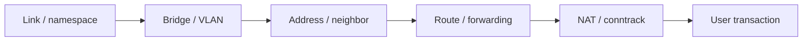

Record topology/time, test bottom-up without clearing state, state and falsify
hypotheses at two observation points, correct one variable, verify every layer,
clean exact resources, and produce an incident timeline plus prevention action.

## 18. Part 1 completion checklist

- [ ] Labs 1–5 were executed in a disposable Linux VM.
- [ ] Link, VLAN/FDB, neighbor, route, forwarding, and NAT evidence are distinguishable.
- [ ] ARP, IPv6 ND, VLAN tags, routed headers, and NAT tuples can be explained.
- [ ] Forward and return failures are independently localized.
- [ ] No blanket FDB, route, ruleset, or conntrack flush was used.
- [ ] One integrated blind failure was diagnosed and documented.
- [ ] Exact cleanup restored the recorded host baseline.

## 19. Part 2 — Services, transport, and packet evidence

Part 1 established the packet path. Part 2 keeps that path constant while the
learner changes one service or transport property at a time. All names and
addresses remain inside disposable namespaces; no host resolver, firewall, or
default route is changed.

### 19.1 Shared topology and prerequisites

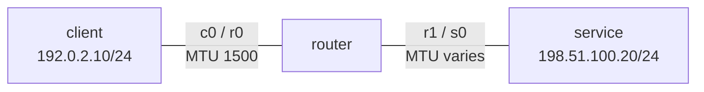

The routed topology from Lab 3 is reused with the prefix `nli2-`. Use a fresh
VM snapshot or recreate it with these names; never rename or reuse Part 1
resources. Required baseline tools are `iproute2`, `tcpdump`, `python3`,
`openssl`, `dig` (or `kdig`), and `ncat`/`nc`. DNS Lab 6 additionally uses a
BIND 9 `named` package. `socat`, `tracepath`, Wireshark, and DHCP tooling are
optional. Verify actual flags with each installed tool's `--help` output.

```bash
# [HOST] Inspect only. Stop if any exact lab name already exists.
for n in nli2-client nli2-router nli2-service; do
  ip netns list | grep -Fxq "$n" && { echo "STOP: $n exists"; exit 1; }
done
command -v ip tcpdump python3 openssl dig

# [HOST] Change: build only the isolated lab topology.
ip netns add nli2-client
ip netns add nli2-router
ip netns add nli2-service
ip link add nli2-c0 type veth peer name nli2-r0
ip link add nli2-r1 type veth peer name nli2-s0
ip link set nli2-c0 netns nli2-client
ip link set nli2-r0 netns nli2-router
ip link set nli2-r1 netns nli2-router
ip link set nli2-s0 netns nli2-service
ip -n nli2-client addr add 192.0.2.10/24 dev nli2-c0
ip -n nli2-router addr add 192.0.2.1/24 dev nli2-r0
ip -n nli2-router addr add 198.51.100.1/24 dev nli2-r1
ip -n nli2-service addr add 198.51.100.20/24 dev nli2-s0
ip -n nli2-client link set lo up
ip -n nli2-router link set lo up
ip -n nli2-service link set lo up
ip -n nli2-client link set nli2-c0 up
ip -n nli2-router link set nli2-r0 up
ip -n nli2-router link set nli2-r1 up
ip -n nli2-service link set nli2-s0 up
ip -n nli2-client route add 198.51.100.0/24 via 192.0.2.1
ip -n nli2-service route add 192.0.2.0/24 via 198.51.100.1
ip netns exec nli2-router sysctl -q -w net.ipv4.ip_forward=1

# [HOST] Baseline: both directions and all state boundaries must pass.
ip -n nli2-client route get 198.51.100.20
ip -n nli2-service route get 192.0.2.10
ip netns exec nli2-client ping -c 2 -W 1 198.51.100.20
ip -br -n nli2-client address
ip -br -n nli2-router address
ip -br -n nli2-service address
```

Capture only lab interfaces with bounded counts or timeouts. A `.pcapng` can
contain payloads, names, certificates, tokens, and timing metadata; keep it out
of version control and delete it when its evidence purpose is complete.

## 20. Service Lab 6 — DNS authority, recursion, and cache state

### 20.1 Objective and model

The learner distinguishes a stub resolver, recursive resolver, authoritative
server, referral, positive/negative cache entry, TTL, and transport. One
successful `dig` proves only that a particular server answered a particular
question at that time; it does not prove that an application used that server.

For this lab, `service` runs a lab-only BIND instance on `198.51.100.20:5300`.
Its root configuration is authoritative for `lab.example.` and permits
recursion only from `192.0.2.0/24`. Keeping port 53 unused avoids collision with
namespace-local resolver services. Exact BIND paths differ by distribution, so
create the two files in a disposable directory and pass the configuration path
explicitly to `named`.

```text
client stub/dig → recursive listener → authoritative zone
192.0.2.10         198.51.100.20:5300   lab.example.
```

### 20.2 Build and baseline

Create `/tmp/nli2-dns/named.conf` and `/tmp/nli2-dns/db.lab.example` with root
ownership and no secrets. The configuration is intentionally lab-bound:

```conf
options {
    directory "/tmp/nli2-dns";
    listen-on port 5300 { 198.51.100.20; };
    listen-on-v6 { none; };
    recursion yes;
    allow-query { 192.0.2.0/24; 198.51.100.0/24; };
    allow-recursion { 192.0.2.0/24; };
    dnssec-validation no;
};
zone "lab.example" IN {
    type primary;
    file "db.lab.example";
};
```

```dns
$TTL 30
@ IN SOA ns.lab.example. hostmaster.lab.example. (
  2026090101 60 30 3600 30 )
  IN NS ns.lab.example.
ns  IN A 198.51.100.20
app IN A 198.51.100.20
```

```bash
# [NS:SERVICE] Validate before starting; exact binary user varies by package.
ip netns exec nli2-service named-checkconf /tmp/nli2-dns/named.conf
ip netns exec nli2-service named-checkzone lab.example /tmp/nli2-dns/db.lab.example
ip netns exec nli2-service named -g -c /tmp/nli2-dns/named.conf

# [NS:CLIENT] Baseline, in another terminal.
ip netns exec nli2-client dig @198.51.100.20 -p 5300 app.lab.example A +noall +answer +comments
ip netns exec nli2-client dig @198.51.100.20 -p 5300 lab.example SOA +noall +answer

# [NS:SERVICE] Correlate UDP request/response and TCP fallback capability.
ip netns exec nli2-service tcpdump -ni nli2-s0 -c 8 'port 5300'
ip netns exec nli2-client dig @198.51.100.20 -p 5300 app.lab.example A +tcp
```

Record `status`, `aa`, `ra`, answer owner/type/value, server endpoint, elapsed
time, and TTL. `AA` describes authority for this answer; `RA` advertises
recursion availability. Neither flag means the answer is fresh or correct.

### 20.3 Controlled faults

**Wrong server/port.** Query port 53 instead of 5300. A timeout plus an empty
capture on 5300 falsifies a zone-data hypothesis; `ss -lunp` in `service`
locates the actual listener. Recover by specifying the intended port.

**Stale positive cache (two-process extension).** A server answers its own
primary zone from authoritative data, not its recursive cache. Therefore run a
second, lab-only resolver on a different address/port and forward
`lab.example.` to the authority on port 5300. Query only the resolver, change
`app` to `198.51.100.21`, increment the SOA serial, validate, and reload the
authority. Compare direct authoritative and recursive answers until the cached
TTL expires. Do not "fix" this by flushing every cache in a real environment;
wait or invalidate the exact supported entry.

**Negative cache (same extension).** Query `missing.lab.example` through the
separate resolver, then add it to the authoritative zone and reload. Explain why
NXDOMAIN may persist according to the SOA negative-caching parameters. Preserve
the authority and resolver responses with timestamps.

**UDP-only assumption.** Compare normal and `+tcp` queries. Blocking TCP/53
(5300 here) can break large or truncated responses even when small UDP answers
work. Do not infer universal behavior from one small A record.

### 20.4 DHCP observation boundary

DHCP is optional because a server and client may mutate routes, DNS settings,
and lease files. In a disposable VM only, capture `udp port 67 or 68` on an
isolated L2 segment and identify Discover, Offer, Request, and ACK plus `xid`,
client identifier, offered address, lease time, router, and DNS options.
Disable any pre-existing network manager for only the lab interface. Never run
a rogue DHCP server on a bridged corporate, home, or cloud network.

Acceptance evidence is a DORA sequence or an explicit environment-gated note;
DHCP is not a blocker for the remaining Part 2 labs.

## 21. Transport Lab 7 — TCP state and UDP evidence limits

### 21.1 Baseline TCP transaction

```bash
# [NS:SERVICE] Terminal 1: bounded HTTP server.
ip netns exec nli2-service python3 -m http.server 8080 --bind 198.51.100.20

# [NS:ROUTER] Terminal 2: both path legs, bounded capture.
ip netns exec nli2-router tcpdump -ni any -c 30 'host 192.0.2.10 and tcp port 8080'

# [NS:CLIENT] Terminal 3.
ip netns exec nli2-client curl --max-time 3 http://198.51.100.20:8080/
ip netns exec nli2-client ss -tan dst 198.51.100.20
```

Identify the SYN, SYN-ACK, ACK, request bytes, response bytes, and FIN/ACK
exchange. Sequence and acknowledgment numbers describe byte-stream progress;
packet boundaries are not application-message boundaries. Compare packet
evidence with `ss` state and the HTTP outcome.

### 21.2 Failure comparison

| Fault | Expected packet evidence | Socket/application symptom |
|---|---|---|
| No listener on 8081 | SYN followed by RST/ACK | Immediate connection refusal |
| Service address unreachable | ARP retries or routing/ICMP evidence | Timeout or network error |
| One SYN silently dropped | Repeated SYN with backoff | Delayed timeout |
| Server exits mid-flow | FIN or RST depends on close/state | EOF or reset |

Inject only the no-listener case first:

```bash
# [NS:SERVICE] Prove absence before the test.
ip netns exec nli2-service ss -ltn 'sport = :8081'

# [NS:CLIENT] Correlate error duration with capture.
ip netns exec nli2-client curl -v --connect-timeout 2 http://198.51.100.20:8081/
```

For loss/retransmission practice, use `tc netem` only on `nli2-r1`, record its
existing qdisc, add one bounded impairment, then remove that exact root qdisc:

```bash
# [NS:ROUTER] Inspect, inject, verify, recover.
ip netns exec nli2-router tc qdisc show dev nli2-r1
ip netns exec nli2-router tc qdisc add dev nli2-r1 root netem loss 20%
ip netns exec nli2-router tc -s qdisc show dev nli2-r1
# Repeat several bounded HTTP requests and capture retransmissions.
ip netns exec nli2-router tc qdisc del dev nli2-r1 root
```

Random loss is nondeterministic: record seed/tool support if available and do
not claim that a single successful request disproves loss.

### 21.3 UDP comparison

Run `ncat -u -l 9090` (syntax varies) in `service`, send a timestamped datagram
from `client`, and capture both path legs. Then stop the listener and repeat.
An emitted UDP datagram has no transport handshake or delivery acknowledgment.
An ICMP Port Unreachable may reveal a closed port, but its absence does not
prove delivery, processing, or application success.

Acceptance requires the learner to distinguish refusal, timeout, reset,
retransmission, orderly close, and "UDP sent" from "UDP processed."

## 22. Path Lab 8 — MTU, MSS, fragmentation, and PMTUD

### 22.1 Create a narrow transit link

Keep `client` at MTU 1500 and reduce only the router-to-service link to 1300.
The effective path MTU is therefore 1300.

```bash
# [NS:ROUTER/SERVICE] Change and verify both ends of one L2 link.
ip -n nli2-router link set nli2-r1 mtu 1300
ip -n nli2-service link set nli2-s0 mtu 1300
ip -d -n nli2-router link show nli2-r1
ip -d -n nli2-service link show nli2-s0

# [NS:CLIENT] IPv4 payload + 20-byte IP + 8-byte ICMP header.
ip netns exec nli2-client ping -c 2 -M do -s 1272 198.51.100.20
ip netns exec nli2-client ping -c 2 -M do -s 1273 198.51.100.20
ip -n nli2-client route get 198.51.100.20
```

The first probe should fit 1300 bytes; the second should elicit ICMP
Fragmentation Needed and update route/PMTU state on a supporting Linux kernel.
Offload can make captures on endpoints appear larger than wire packets; prefer
the router's egress capture and state the observation point.

### 22.2 TCP MSS evidence

Capture a fresh HTTP handshake and inspect both MSS options. The advertised MSS
is a receiver constraint and is directional; it is not itself the measured
end-to-end PMTU. Observe how the sender segments after PMTU feedback. Do not
modify global MSS clamping as a shortcut.

### 22.3 Controlled PMTU black hole

In a disposable VM, add one namespace-local nftables rule that drops only ICMP
type `destination-unreachable` code `fragmentation-needed` returning toward the
client. Save the exact rule handle and remove it immediately after the bounded
test. If nftables syntax/support differs, treat this fault as environment-gated.

Expected pattern: small traffic works, the TCP handshake may work, a larger
transfer stalls or retransmits, and the sender lacks useful PMTU feedback. The
smallest recovery is restoring the required ICMP signal (or deploying validated
PLPMTUD), not lowering MTU everywhere. Verify the large user transaction after
removal, then restore both lab interfaces to MTU 1500.

## 23. Security Lab 9 — TLS identity, trust, and time

### 23.1 Generate disposable lab identity

Generate keys only inside `/tmp/nli2-tls`; never commit private keys. Use an
OpenSSL configuration that gives the server certificate
`subjectAltName=DNS:app.lab.example,IP:198.51.100.20`. Create a disposable lab
CA, sign the leaf certificate, and inspect it before starting the server:

```bash
# [HOST] Offline analysis; exact config commands are OpenSSL-version dependent.
openssl x509 -in /tmp/nli2-tls/server.crt -noout -subject -issuer -dates -ext subjectAltName
openssl verify -CAfile /tmp/nli2-tls/ca.crt /tmp/nli2-tls/server.crt

# [NS:SERVICE] Lab listener. Stop with Ctrl+C.
ip netns exec nli2-service openssl s_server -accept 198.51.100.20:8443 \
  -cert /tmp/nli2-tls/server.crt -key /tmp/nli2-tls/server.key -www

# [NS:CLIENT] Trust and name are separate checks.
ip netns exec nli2-client openssl s_client -connect 198.51.100.20:8443 \
  -servername app.lab.example -verify_hostname app.lab.example \
  -verify_return_error -CAfile /tmp/nli2-tls/ca.crt </dev/null
```

Capture `tcp port 8443` and correlate TCP establishment, ClientHello/SNI,
ServerHello, certificate exchange, encrypted application data, and teardown.
TLS 1.3 encrypts more handshake content than earlier versions; a capture without
session keys cannot reveal all application or handshake details.

### 23.2 Controlled faults

1. **Unknown CA:** omit `-CAfile` while keeping `-verify_return_error`. Expected:
   TCP succeeds, certificate path validation fails.
2. **Wrong name:** use `-verify_hostname wrong.lab.example`. Expected: the chain
   may be trusted but endpoint identity fails.
3. **Validity time:** inspect `notBefore/notAfter`; use OpenSSL's verification
   time option offline if supported. Never change the VM or host clock merely to
   create this fault.
4. **Missing intermediate:** when extending the exercise to a two-tier CA, have
   the server omit the intermediate. Compare the sent chain with local trust;
   do not assume clients will download a missing issuer.
5. **Optional mTLS:** start a separate listener that requires a client
   certificate. Distinguish server authentication from client authentication.

Recovery changes one boundary: provide the correct trust anchor/chain, connect
with the intended verified name, renew a validity-broken certificate, or supply
an authorized client identity. `-servername` sends SNI; it does not by itself
enable hostname verification. Successful encryption without verification is
not a secure identity result.

## 24. Analysis Lab 10 — Correlating evidence across layers

### 24.1 Capture discipline

Before capture, write the question, interfaces, filter, duration/count, clock,
and expected flow tuple. Capture near both sides of a suspected boundary when
possible. Use `-nn` to prevent name/service lookup from contaminating analysis,
`-s 0` for full packets only when payload handling is authorized, and `-w` when
offline Wireshark analysis is needed.

```bash
# [NS:ROUTER] Bounded metadata capture; file remains local and sensitive.
ip netns exec nli2-router timeout 15 tcpdump -ni any -nn -s 128 \
  -w /tmp/nli2-part2.pcap 'host 192.0.2.10 and (port 5300 or port 8080 or port 8443)'

# [ANALYSIS] Verify file, then use display filters without altering capture.
capinfos /tmp/nli2-part2.pcap
tshark -r /tmp/nli2-part2.pcap -Y 'dns || tcp.analysis.retransmission || tls.alert_message'
```

A capture filter limits what is stored; a Wireshark display filter changes only
what is shown. Preserve the original file hash when evidence has operational or
audit value. Packet absence is meaningful only if the capture point, direction,
filter, timing, offload, namespace, and packet count were correct.

### 24.2 Evidence ladder

For one DNS-to-HTTPS transaction, collect and timestamp:

1. resolver question/answer and TTL;
2. `ip route get` and neighbor state;
3. listener plus client socket state from `ss`;
4. packets on both router legs;
5. TLS verification result;
6. application status and response boundary.

Introduce one prior fault without telling the learner. The diagnosis must name
the first failing boundary, cite confirming evidence, cite one falsified
alternative, apply the smallest reversible recovery, repeat the user-facing
transaction, and remove or protect all capture artifacts.

## 25. Part 2 cleanup and residue verification

Stop `named`, HTTP, OpenSSL, `ncat`, tcpdump, and any optional DHCP process by
their recorded lab PIDs. Remove only the exact `nli2-` resources:

```bash
# [HOST] Inventory first.
ip netns pids nli2-client
ip netns pids nli2-router
ip netns pids nli2-service
ip netns list

# [HOST] Change only after inspecting the PID list.
ip netns del nli2-client
ip netns del nli2-router
ip netns del nli2-service

# [HOST] Residue proof.
ip netns list | grep -E '^nli2-' && echo 'STOP: residue remains' || echo 'No nli2 namespace residue'
ip link show | grep -E 'nli2-' && echo 'STOP: link residue remains' || echo 'No nli2 link residue'
```

Delete `/tmp/nli2-dns`, `/tmp/nli2-tls`, and captures only after confirming
they contain no evidence that must be retained. Temporary files may outlive a
namespace and require their own explicit retention or deletion decision.

## 26. Part 2 exercises and competency gate

### Foundation

1. Explain `AA`, `RA`, TTL, NXDOMAIN, and UDP-to-TCP DNS behavior from captures.
2. Label a TCP open, refusal, timeout, reset, retransmission, and orderly close.
3. Calculate the largest ICMP payload for MTUs 1500, 1400, and 1280 over IPv4.
4. Separate TLS transport, chain trust, name, validity-time, and application checks.

### Applied

5. Produce a two-point capture proving where a request stops.
6. Diagnose a stale DNS answer without changing global resolver configuration.
7. Demonstrate a PMTU failure where small probes pass but a large transfer fails.
8. Compare the evidence from a closed TCP port and an unused UDP port.

### Production judgment

9. Define a privacy-safe packet-capture approval, retention, and access policy.
10. Explain why flushing caches/state or disabling certificate verification
    destroys evidence and increases risk.
11. Write an incident timeline that separates observation, inference, action,
    result, and remaining uncertainty.

- [ ] DNS authority, recursion, positive/negative cache, and transport are distinct.
- [ ] TCP state is correlated with packets and the application boundary.
- [ ] UDP delivery claims do not exceed the available evidence.
- [ ] MTU, MSS, PMTU feedback, fragmentation, and offload are distinguished.
- [ ] TLS trust, identity, time, and optional client identity are verified separately.
- [ ] Captures are bounded, correctly filtered, and handled as sensitive data.
- [ ] One blind layered fault was diagnosed and recovered from evidence.
- [ ] All processes, namespaces, links, qdiscs, rules, and temporary artifacts were inventoried.

## 27. Part 3 — Containerlab and FRRouting

Part 3 moves from Linux forwarding primitives to a declarative topology and
dynamic control planes. Containerlab creates links and container lifecycle;
FRR creates routing state. Neither tool proves that an intended prefix is
reachable—the learner must correlate protocol RIB, zebra RIB, kernel FIB,
nexthop resolution, packets, and the end transaction.

### 27.1 Environment and version boundary

Run Part 3 only on an authorized disposable Linux host or VM with hardware
virtualization, Docker-compatible container runtime, and Containerlab. The
committed topology uses `quay.io/frrouting/frr:10.2.2`; treat the tag as the
tested curriculum boundary, inspect the image source/digest before use, and do
not silently substitute `latest`.

```bash
# [HOST] Inspect only.
containerlab version
docker version
docker image inspect quay.io/frrouting/frr:10.2.2 \
  --format '{{index .RepoDigests 0}}'
sudo containerlab inspect \
  --topo examples/network-labs/containerlab/frr-routing.clab.yml
```

If the image is not already present, pulling it is an explicit network and
supply-chain action. Record version, immutable digest, source, time, and host
kernel. Stop if exact `clab-nli3-*` containers, `nli3` bridges, or a lab with
the same name already exists; inspect ownership instead of deleting it.

### 27.2 Topology and address plan

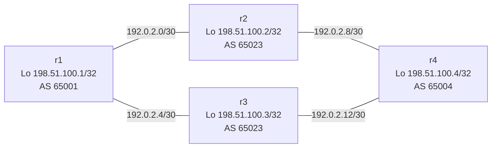

| Link | First endpoint | Second endpoint |
|---|---|---|
| r1–r2 | r1 `eth1` = `192.0.2.1/30` | r2 `eth1` = `192.0.2.2/30` |
| r1–r3 | r1 `eth2` = `192.0.2.5/30` | r3 `eth1` = `192.0.2.6/30` |
| r2–r4 | r2 `eth2` = `192.0.2.9/30` | r4 `eth1` = `192.0.2.10/30` |
| r3–r4 | r3 `eth2` = `192.0.2.13/30` | r4 `eth2` = `192.0.2.14/30` |

The diamond offers two equal-hop paths without extra nodes. The shared middle
ASN is deliberate for the BGP ECMP exercise; r2 and r3 are separate routers in
the same administrative domain and do not peer with each other in this lab.

### 27.3 Deploy and prove the empty control-plane baseline

```bash
# [HOST] Change. Run from the repository root.
sudo containerlab deploy \
  --topo examples/network-labs/containerlab/frr-routing.clab.yml

# [HOST] Verify inventory and configuration mounts.
sudo containerlab inspect \
  --topo examples/network-labs/containerlab/frr-routing.clab.yml
docker ps --filter 'name=clab-nli3-' --format '{{.Names}} {{.Image}} {{.Status}}'

# [NODE:r1] Repeat equivalent checks on r2–r4.
docker exec clab-nli3-r1 vtysh -c 'show version'
docker exec clab-nli3-r1 vtysh -c 'show interface brief'
docker exec clab-nli3-r1 vtysh -c 'show ip route'
docker exec clab-nli3-r1 ip -br address
docker exec clab-nli3-r1 ip route
```

All four loopbacks and four connected links must exist. No OSPF adjacency or
BGP session should exist yet. Test each directly connected peer before adding
routes. A failure here is topology/interface state, not a routing-protocol
problem.

## 28. Routing Lab 11 — Static routing baseline

### 28.1 Build the primary path

Configure one explicit path r1→r2→r4 and its return path. Do not add defaults;
specific routes make each dependency visible.

```text
[NODE:r1]
configure terminal
 ip route 198.51.100.4/32 192.0.2.2
end

[NODE:r2]
configure terminal
 ip route 198.51.100.1/32 192.0.2.1
 ip route 198.51.100.4/32 192.0.2.10
end

[NODE:r4]
configure terminal
 ip route 198.51.100.1/32 192.0.2.9
end
```

Execute each block through `docker exec -it clab-nli3-rN vtysh`; the labels are
not literal commands. Verify control-plane and data-plane installation:

```bash
# [NODE:r1]
docker exec clab-nli3-r1 vtysh -c 'show ip route 198.51.100.4/32'
docker exec clab-nli3-r1 ip route get 198.51.100.4
docker exec clab-nli3-r1 ping -I 198.51.100.1 -c 3 198.51.100.4
docker exec clab-nli3-r1 traceroute -n -s 198.51.100.1 198.51.100.4
```

`S>*` in FRR means static, selected, and installed in the FIB. Still compare
with the kernel route and the sourced transaction.

### 28.2 Floating backup and controlled faults

Add a higher-distance backup on r1 via r3 and the matching forwarding/return
routes on r3/r4. It must remain inactive while the primary is valid:

```text
[NODE:r1] ip route 198.51.100.4/32 192.0.2.6 200
[NODE:r3] ip route 198.51.100.1/32 192.0.2.5
[NODE:r3] ip route 198.51.100.4/32 192.0.2.14
[NODE:r4] ip route 198.51.100.1/32 192.0.2.13 200
```

Inject one fault at a time:

1. Shut r1 `eth1`; observe primary nexthop loss and backup selection.
2. Restore the link but remove r2's route to r1; forward traffic arrives at r4
   while return traffic fails. A valid r1 route alone does not prove symmetry.
3. Configure a next hop outside all connected prefixes. Compare configuration,
   zebra rejection/inactive state, and kernel absence.

Recover the smallest changed object, prove the primary is preferred again, and
remove every static route before Lab 12. Redeploying the committed baseline is
the simplest deterministic reset.

## 29. Routing Lab 12 — OSPF adjacency, SPF, and convergence

### 29.1 Configure area 0

Start from a clean deploy. On each router, set the stated router ID, make all
interfaces passive by default, enable OSPF for the loopback prefix, and make
only its two transit interfaces non-passive. Example for r1:

```text
[NODE:r1]
configure terminal
 router ospf
  ospf router-id 198.51.100.1
  passive-interface default
  no passive-interface eth1
  no passive-interface eth2
  network 198.51.100.1/32 area 0.0.0.0
  network 192.0.2.0/30 area 0.0.0.0
  network 192.0.2.4/30 area 0.0.0.0
 exit
end
```

Repeat with the exact connected prefixes and router IDs for r2–r4. Use the same
reference bandwidth on every router if you change it; otherwise explicit
interface costs are clearer for this small lab.

```bash
# [NODE:r1] State before reachability claim.
docker exec clab-nli3-r1 vtysh -c 'show ip ospf neighbor'
docker exec clab-nli3-r1 vtysh -c 'show ip ospf interface brief'
docker exec clab-nli3-r1 vtysh -c 'show ip ospf database'
docker exec clab-nli3-r1 vtysh -c 'show ip route ospf'
docker exec clab-nli3-r1 ip route get 198.51.100.4
docker exec clab-nli3-r1 ping -I 198.51.100.1 -c 3 198.51.100.4
```

Expected r1 neighbors are r2 and r3 in `Full` state. Router LSAs describe
topology; SPF selects paths; zebra offers selected routes to the kernel. These
are related but separate states.

### 29.2 Cost and ECMP

With equal costs, r1 should have two equal-cost OSPF paths to r4's loopback.
Verify both nexthops in FRR and the kernel. Do not expect per-packet alternation:
Linux normally hashes flows, and a single ping flow may stay on one path.

Set r1 `eth2` OSPF cost to 100. Confirm that the r2 path becomes preferred;
then remove the explicit cost and confirm ECMP returns. Record before/after RIB,
FIB, traceroute samples, and timestamps.

### 29.3 Adjacency failures

1. **Hello/dead mismatch:** change the hello interval on only one side. Capture
   OSPF protocol 89 and compare received parameters; recover by restoring equal
   timers.
2. **Area mismatch:** move one side of one link to area `0.0.0.1`. Show that the
   link remains up while adjacency fails; recover the exact interface/statement.
3. **Passive interface:** make a transit interface passive. Confirm Hellos stop
   on that interface without claiming that OSPF globally failed.

### 29.4 Link failure and convergence evidence

Before failure, record wall-clock time, neighbors, route JSON if supported,
kernel nexthops, and a bounded continuous probe. Shut r1 `eth1`, observe neighbor
loss and traffic movement to r3, then restore it. Convergence is not just the
time until a neighbor disappears: report detection, SPF/RIB change, FIB change,
packet loss window, and user-transaction recovery separately.

Remove OSPF configuration or destroy/redeploy before BGP.

## 30. Routing Lab 13 — eBGP advertisement, policy, and ECMP

### 30.1 Establish directly connected sessions

Use private-use ASNs: r1 `65001`, r2/r3 `65023`, and r4 `65004`. Configure only
directly connected peers and advertise only each router's loopback `/32`.
Example r1 configuration:

```text
[NODE:r1]
configure terminal
 router bgp 65001
  bgp router-id 198.51.100.1
  no bgp ebgp-requires-policy
  neighbor 192.0.2.2 remote-as 65023
  neighbor 192.0.2.6 remote-as 65023
  address-family ipv4 unicast
   network 198.51.100.1/32
   maximum-paths 2
  exit-address-family
 exit
end
```

Configure r2 with peers `192.0.2.1 remote-as 65001` and
`192.0.2.10 remote-as 65004`; r3 with `192.0.2.5` and `192.0.2.14`; and r4
with peers `192.0.2.9`/`192.0.2.13 remote-as 65023`. Set the matching local
ASN/router ID, advertise the local loopback, and set `maximum-paths 2` on r4.

`no bgp ebgp-requires-policy` is explicit lab simplification, not a production
recommendation. Production eBGP must use intentional import/export policy and
prefix limits.

```bash
# [NODE:r1]
docker exec clab-nli3-r1 vtysh -c 'show bgp ipv4 unicast summary'
docker exec clab-nli3-r1 vtysh -c 'show bgp ipv4 unicast 198.51.100.4/32'
docker exec clab-nli3-r1 vtysh -c 'show ip route bgp'
docker exec clab-nli3-r1 ip route get 198.51.100.4
docker exec clab-nli3-r1 ping -I 198.51.100.1 -c 3 198.51.100.4
```

For every session record peer address, remote ASN, state, uptime, prefixes
received, and message counters. `Established` proves a BGP transport/session;
it does not prove that a desired prefix was accepted, selected, installed, or
reachable.

### 30.2 Best path and multipath

r1 can receive r4's `/32` through r2 and r3 with equal AS paths. Confirm both
paths in the BGP table and whether both nexthops reach the FIB. If only one is
installed, inspect FRR multipath eligibility and version behavior before adding
`bgp bestpath as-path multipath-relax`; never add knobs until evidence shows
which equality test prevented multipath.

Generate multiple distinct TCP/UDP flows and compare counters on both outgoing
links. ECMP is normally flow-hashed; equal route presence does not guarantee
equal byte distribution.

### 30.3 Explicit export policy

Replace the lab-wide policy relaxation on r1 with an outbound prefix list and
route map that permits only `198.51.100.1/32`, then apply it to both peers.
Perform an equivalent inbound policy on r1 that accepts only the four lab
loopbacks. Verify advertised and received routes before and after policy.

Use a final deny and counters/route inspection. A route map that exists but is
not attached changes nothing; an attached policy in the wrong address family
also changes nothing.

### 30.4 Controlled BGP faults

1. **Wrong remote ASN:** change one neighbor's expected ASN. Correlate TCP/179,
   BGP notification/log evidence, and session state; restore the exact ASN.
2. **Prefix filtered:** deny r4's `/32` on one r1 path. The session stays
   Established while the path disappears—separate session health from NLRI.
3. **Route withdrawal:** remove r4's `network` statement. Timestamp withdrawal,
   BGP RIB change, FIB removal, and transaction impact; then restore it.
4. **Link down:** shut r1–r2 and observe session loss plus survival through r3.
   Restore and distinguish session re-establishment from prefix reconvergence.

Avoid `clear bgp *`, daemon restarts, and container restarts during diagnosis;
they destroy evidence and affect healthy peers. Use neighbor-specific soft
policy refresh only when supported and justified.

## 31. Part 3 integrated troubleshooting gate

Starting from a clean deploy, another operator introduces exactly one of these:

- interface/address mismatch;
- missing static return route;
- OSPF timer, area, passive-interface, or cost error;
- BGP ASN, address-family, network-origination, or policy error;
- failed link with a valid alternate path.

The learner must inventory topology and versions, draw the expected packet and
control-plane path, establish the directly connected baseline, inspect protocol
state without clearing it, compare RIB and FIB, capture only the suspected link,
state a falsifiable root cause, correct one variable, verify convergence and the
sourced transaction, and produce a timestamped incident record.

## 32. Part 3 cleanup and residue verification

Save only sanitized evidence and intended configuration. `write memory` changes
the container-mounted integrated configuration and is unnecessary for the
ephemeral exercises; do not use it unless persistence is explicitly intended.

```bash
# [HOST] Inventory before destruction.
sudo containerlab inspect \
  --topo examples/network-labs/containerlab/frr-routing.clab.yml
docker ps -a --filter 'name=clab-nli3-' --format '{{.Names}} {{.Status}}'

# [HOST] Remove only this declared topology.
sudo containerlab destroy \
  --topo examples/network-labs/containerlab/frr-routing.clab.yml --cleanup

# [HOST] Prove residue state.
docker ps -a --filter 'name=clab-nli3-' --format '{{.Names}}'
ip -br link | grep -E 'nli3|clab-nli3' || echo 'No nli3 link residue'
```

Do not prune all containers, networks, volumes, or images. Image removal is a
separate ownership/caching decision and is not required for lab cleanup.

## 33. Part 3 exercises and competency check

### Foundation

1. Map Containerlab endpoint names to Linux and FRR interfaces.
2. Explain connected, static, OSPF, and BGP route codes plus RIB/FIB selection.
3. Predict the path and return path for all four loopback pairs.
4. Explain why OSPF Full or BGP Established is necessary but insufficient.

### Applied

5. Create and verify a floating static route without defaults.
6. Change one OSPF cost and prove route/FIB/user impact.
7. Demonstrate BGP policy failure while both sessions remain Established.
8. Measure convergence in protocol, FIB, packet-loss, and transaction terms.

### Production judgment

9. Define image provenance, version pinning, upgrade, and rollback evidence.
10. Explain why broad clears/restarts are unsafe diagnostic shortcuts.
11. Design eBGP import/export policy and prefix limits for this topology.

- [ ] The committed topology deploys only after explicit environment validation.
- [ ] Direct links are proven before routing protocols are blamed.
- [ ] Static primary, floating backup, and asymmetric return failure are diagnosed.
- [ ] OSPF neighbor, LSDB, RIB, FIB, ECMP, cost, and convergence are correlated.
- [ ] BGP session, NLRI, best path, policy, withdrawal, and ECMP are distinguished.
- [ ] At least one alternate-path failure preserves the user transaction.
- [ ] Configuration changes are exact, reversible, and evidence preserving.
- [ ] Topology destruction leaves no `nli3` container or link residue.

## 34. Part 4 — Integrated network operations

Parts 1–3 taught individual boundaries. Part 4 removes the chapter labels from
the symptom. The learner receives a service-impact brief, not the fault name,
and must decide which evidence reduces uncertainty fastest. These scenarios
reuse the earlier topologies and commands; they add no new dependency.

### 34.1 Roles and blind-exercise contract

Use two people where possible:

- the **facilitator** selects one fault card, records the exact baseline change,
  and keeps the recovery command ready;
- the **operator** owns diagnosis, communication, correction, verification, and
  cleanup without reading the selected card;
- an optional **observer** records timing, unsafe shortcuts, hypothesis quality,
  and handoff clarity without giving hints.

For solo practice, randomly select a card, place its details out of view, wait
at least ten minutes, then begin from the symptom brief. Do not combine faults
until each single-fault scenario can be solved reliably.

### 34.2 Mandatory safety and stop conditions

Before injection, both people confirm the disposable lab identity, exact
resource inventory, baseline transaction, clock, evidence path, fault command,
recovery command, time box, and cleanup owner. Stop and roll back immediately
if any command targets the host namespace, an undeclared interface/container,
global firewall/resolver state, a non-lab address, or an unrecorded resource.

The facilitator must not use destructive shortcuts such as flushing all routes,
neighbors, FDB entries, conntrack state, nftables rules, DNS caches, or BGP
sessions. One exercise changes one intended variable.

### 34.3 Evidence ledger

Every observation and action goes into one chronological ledger:

| Time | Source/context | Observation or action | Fact/inference | Hypothesis affected | Result |
|---|---|---|---|---|---|
| `T+00:00` | User transaction | HTTPS request timed out | Fact | Establish symptom | Failure reproduced |
| `T+00:45` | `[NS:CLIENT]` route | Intended next hop selected | Fact | Weakens local-route fault | Continue downstream |

Use monotonic elapsed time for sequence and synchronized wall-clock time for
cross-system correlation. Record command, context, relevant output, and exit
status; do not paste unbounded logs or secrets. An inference must be labeled as
an inference until independent evidence confirms it.

### 34.4 Diagnostic control loop

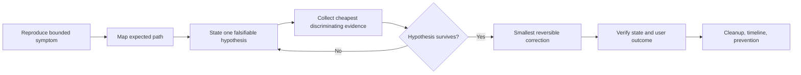

The operator may skip a layer only by citing evidence that already proves it.
`ping` is neither a universal first step nor a completion test.

## 35. Incident Lab 14 — Duplicate address and neighbor instability

### 35.1 Operator brief

On the Part 1 Lab 2 Ethernet segment, host A intermittently reaches the service
address. Responses sometimes carry different source MAC addresses. No planned
address or topology change exists. Restore stable reachability without clearing
the entire neighbor table or bridge FDB.

### 35.2 Facilitator fault cards

Choose exactly one:

1. assign B's IPv4 address to C;
2. retain unique IPs but configure a static wrong neighbor entry on A;
3. move B's switch-side port down/up after pre-populating A's neighbor state.

Record the original value and exact recovery before injection. Card 3 teaches
stale-state timing but must not be described as a duplicate-address incident.

### 35.3 Required evidence and recovery gate

The operator must correlate ARP requests/replies, Ethernet source addresses,
`ip neigh`, bridge FDB, interface state, and bounded user transactions. A
duplicate-IP conclusion requires evidence that two distinct MAC addresses claim
one IPv4 address; neighbor churn alone is insufficient.

Recover only the duplicate address, wrong static entry, or affected link. Verify
stable neighbor ownership across repeated transactions and normal FDB learning,
then prove exact Lab 2 cleanup.

## 36. Incident Lab 15 — VLAN boundary and asymmetric return path

### 36.1 Operator brief

A client can reach its local gateway but not an application in another segment.
Some capture points see the request; the client sees no valid response. Local
link state is up. Determine the first failing boundary and avoid changing every
trunk or route at once.

### 36.2 Facilitator fault cards

Choose one on the appropriate Part 1 VLAN/routing topology:

1. remove VLAN 10 from one trunk egress policy;
2. place one access port into VLAN 20 while leaving its host address unchanged;
3. remove only the server's return route;
4. leave routes intact but disable forwarding on the router namespace.

### 36.3 Discriminating evidence

An absent tagged frame at a trunk points before routing; a request at the server
with no returning route points after forward delivery; both router interfaces
seeing traffic in only one direction supports asymmetry. Require bridge VLAN/FDB
state, route lookup at both endpoints, forwarding state, two-point capture, and
the application transaction.

Recovery changes the exact VLAN membership, return route, or forwarding state.
Verify access-frame tagging behavior, both route directions, and user response.

## 37. Incident Lab 16 — DNS delegation, TTL, and negative cache

### 37.1 Operator brief

`app.lab.example` was changed during an approved deployment. Direct checks can
find the new address, but some clients still fail or receive the previous
answer. Determine whether the fault is authority, delegation/forwarding,
positive cache, negative cache, transport, or application resolver behavior.

### 37.2 Facilitator fault cards

Use the two-process authority/resolver extension from Lab 6 and choose one:

1. change zone data without incrementing the SOA serial/reloading authority;
2. point the resolver's lab-zone forward rule at the wrong port;
3. pre-populate a positive answer, change authority, and retain the valid TTL;
4. pre-populate NXDOMAIN, add the record, and retain the negative TTL;
5. allow small UDP queries but make the lab TCP listener unavailable.

### 37.3 Required comparison

Query authority and resolver explicitly, without modifying `/etc/resolv.conf`.
Record server endpoint, status, flags, SOA serial, TTL, transport, answer, and
time. Then prove which resolver the application actually uses. A stale but
unexpired cached answer is expected state, not corruption.

Recovery reloads valid authority data, corrects the exact forward endpoint,
waits/invalidates the supported exact cache entry, or restores DNS TCP. Verify
both protocol answer and application transaction.

## 38. Incident Lab 17 — TCP listener, loss, and backlog boundary

### 38.1 Operator brief

Clients report one of three externally similar symptoms: immediate refusal,
slow timeout, or connections that establish but do not complete useful work.
Identify which transport/application boundary failed.

### 38.2 Facilitator fault cards

Choose one:

1. stop the service listener;
2. apply bounded `tc netem` loss to one lab egress interface;
3. bind the service only to loopback instead of its lab address;
4. suspend the serving process after the handshake;
5. environment-gated: constrain a disposable listener backlog and create a
   bounded connection burst without exhausting host-wide resources.

### 38.3 Evidence and limits

Correlate `ss -ltnp`, client socket state, SYN/SYN-ACK/RST/retransmission/FIN,
process state, qdisc counters, server logs, and one timed application request.
Do not infer backlog exhaustion merely from timeouts; prove queue/listener and
resource evidence. Do not run unbounded connection generators.

Restore the exact listener binding, process state, or qdisc. Verify a fresh
connection and application response; an established old socket is not enough.

## 39. Incident Lab 18 — MTU black hole with misleading small probes

### 39.1 Operator brief

DNS, TCP handshake, and small responses work. A larger HTTPS response stalls or
retransmits. The route remains installed and interfaces are up. Find the
packet-size boundary without lowering MTU across the environment.

### 39.2 Facilitator fault cards

Choose one:

1. reduce one transit MTU and drop only the required IPv4 Fragmentation Needed
   feedback toward the sender;
2. create an MTU mismatch but leave ICMP feedback working;
3. restore MTU but leave an unjustified, narrow MSS clamp from a prior exercise
   (only where the lab platform supports an exact reversible rule).

### 39.3 Required proof

Show the largest passing and smallest failing DF probe, actual interface MTUs,
route/PMTU state, TCP MSS options, retransmissions, and router-egress capture.
Account for checksum/segmentation offload before interpreting endpoint captures.

Recovery restores required ICMP signaling or the intended link/rule value.
Verify the original large HTTPS transaction, not only a smaller ping.

## 40. Incident Lab 19 — TLS trust, identity, chain, and time

### 40.1 Operator brief

TCP connects to port 8443, yet the client rejects the secure transaction.
Determine whether failure is chain trust, endpoint name, validity time, missing
intermediate, client identity, or the application after successful TLS.

### 40.2 Facilitator fault cards

Choose one from Lab 9:

1. remove the intended lab CA from the client's explicit verification command;
2. verify a hostname absent from the certificate SAN;
3. present a leaf outside its validity window using offline verification time;
4. omit a required intermediate from a two-tier chain;
5. require mTLS but omit or replace the authorized client certificate;
6. keep TLS valid but return an application error.

### 40.3 Recovery and security boundary

Require certificate chain/SAN/dates, SNI, verification return code, TLS alert,
client-certificate requirement, and application response evidence as relevant.
Never use `-k`, disable verification, trust an arbitrary certificate globally,
or change the system clock as recovery.

Fix the exact trust, identity, chain, validity, or authorization boundary and
repeat strict verification plus the user transaction.

## 41. Incident Lab 20 — OSPF adjacency and BGP policy

### 41.1 Operator brief

On the Part 3 diamond, the desired loopback route is missing or single-pathed.
Some protocol sessions may still appear healthy. Determine whether the fault is
link, OSPF adjacency/cost, BGP session, origination, policy, best-path, or FIB.

### 41.2 Facilitator fault cards

Start from a recorded clean OSPF or BGP state—never both—and choose one:

1. OSPF hello/dead or area mismatch on one link;
2. unintended OSPF cost that removes ECMP without losing adjacency;
3. wrong BGP remote ASN on one peer;
4. withdraw r4's loopback `network` statement;
5. attach an outbound route map that denies only r4's `/32` on one path;
6. keep both BGP paths but remove/disable multipath eligibility.

### 41.3 State ladder and recovery

The operator must inspect physical/direct reachability, protocol neighbor or
session, LSDB/BGP paths, selected protocol route, zebra RIB, kernel FIB, path
capture/counters, and sourced transaction. `Full` and `Established` are not
route acceptance proofs; a protocol RIB entry is not a FIB proof.

Avoid broad clears. Restore the exact timer/area/cost/ASN/origination/policy or
multipath property and record reconvergence at each boundary.

## 42. Incident timeline, communication, and handoff

### 42.1 Operational updates

Each update answers five questions without speculation disguised as fact:

1. What user capability is affected and since when?
2. What is confirmed, and from which evidence?
3. What remains unknown or falsified?
4. What is the next bounded action, risk, and stop condition?
5. When is the next update or escalation?

Do not promise a recovery time from protocol intuition alone. Report measured
recovery separately from detection, control-plane convergence, and full service
stability.

### 42.2 Handoff packet

A handoff must let another operator continue without repeating risky actions:

- incident owner, severity, user scope, start/current time;
- topology/version/change context and expected packet path;
- confirmed facts, active hypotheses, and falsified hypotheses;
- commands/actions already run with results and side effects;
- preserved evidence locations, hashes, sensitivity, and retention;
- current mitigation, residual risk, stop/rollback condition;
- exact next action, required authority, and next communication time.

Secrets, private keys, tokens, and unrelated payloads are referenced through an
approved secure evidence system, not copied into the handoff.

### 42.3 Post-incident learning

Separate root cause, trigger, contributing conditions, detection gap, response
gap, and recovery mechanism. Corrective actions need an owner, measurable done
condition, and verification method. Avoid attributing a system failure to one
person's mistake when guardrails, review, tests, observability, or rollback were
also absent.

## 43. Final foundation practical assessment

### 43.1 Assessment format

The facilitator selects three single faults across distinct layers:

- one L2/address/VLAN fault from Labs 14–15;
- one service/transport/security fault from Labs 16–19;
- one routing control-plane fault from Lab 20.

Run them sequentially, restoring and proving baseline between cases. Combining
them is an advanced extension and is not part of the foundation score.

### 43.2 Required deliverables

For each case, the learner submits:

1. initial impact statement and safety boundary;
2. expected topology and forward/return packet path;
3. evidence ledger with facts separated from inference;
4. at least two falsifiable hypotheses and discriminating tests;
5. root cause tied to the first failing boundary;
6. smallest reversible correction and rollback condition;
7. protocol/system verification plus the original user outcome;
8. cleanup/residue proof, handoff, and one prevention action.

### 43.3 Scoring rubric

| Dimension | 0 — Unsafe/absent | 1 — Partial | 2 — Competent | 3 — Operationally strong |
|---|---|---|---|---|
| Safety | Unscoped mutation | Boundary stated late | Exact scope and rollback | Stop conditions actively enforced |
| Reasoning | Guess/restart | Layer checklist only | Falsifiable evidence path | Efficient uncertainty reduction |
| Evidence | `ping`/claim only | Single source | Multi-boundary correlation | Time-aligned, limitations stated |
| Recovery | Broad reset | Fix without rollback | Smallest reversible fix | Risk-controlled correction/canary |
| Verification | State only | Transaction only | State plus user outcome | Stability and negative checks |
| Communication | No record | Unstructured notes | Clear timeline/handoff | Decision-ready, uncertainty explicit |
| Cleanup | Residue unknown | Partial inventory | Exact residue proof | Evidence retention also resolved |

A passing result requires at least `2` in every dimension for all three cases.
One unsafe host/global mutation, fabricated evidence, disabled TLS verification,
or unauthorized target is an automatic stop and reassessment after remediation.

### 43.4 Part 4 completion checklist

- [ ] Each scenario began from a recorded healthy baseline.
- [ ] The operator was blind to the selected single fault.
- [ ] Evidence was gathered before state-destructive recovery.
- [ ] Facts, inference, uncertainty, and falsified hypotheses were separated.
- [ ] Forward and return paths were evaluated independently.
- [ ] The smallest reversible correction restored the original user outcome.
- [ ] Timeline, handoff, prevention action, and cleanup proof were produced.
- [ ] Three-layer final assessment passed every rubric dimension at level 2+.

## 44. Part 5 — Enterprise and service-provider operations

Part 5 expands the failure domain from one lab path to shared enterprise and
provider infrastructure. The goal is not memorizing a vendor CLI. The learner
must translate service intent into control-plane and forwarding state, identify
blast radius, preserve management access, make a reversible change, and verify
the user outcome.

All vendor commands are illustrative and environment-gated. Cisco examples
assume Catalyst IOS XE 17.x-style switching; Juniper examples assume an EX/QFX
platform using current ELS-style Junos configuration. Feature availability,
defaults, interface names, licensing, scale, and exact syntax vary by product
and release. Check the device's release documentation and lab-validate the
candidate before use.

### 44.1 Enterprise role boundaries

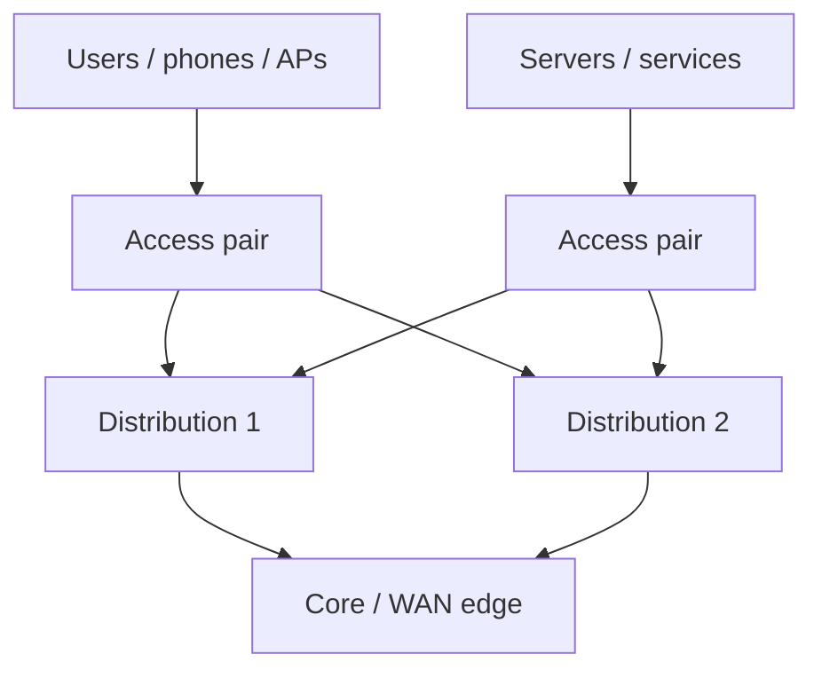

- **Access** authenticates endpoints, assigns segmentation and policy, supplies
  PoE where required, and limits L2 fault propagation.
- **Distribution** terminates campus L2/L3 boundaries, supplies default-gateway
  redundancy, aggregates policy, and controls route exchange.
- **Core** provides resilient, low-complexity transport between distribution,
  data-center, WAN, internet, and shared-service boundaries.

These are responsibilities, not mandatory boxes. A small campus may collapse
core and distribution; a routed-access design may move the L3 boundary closer
to users. Document where VLAN, STP, gateway, routing, security, QoS, and failure
domains actually terminate.

## 45. Campus Lab 21 — Segmentation, trunks, and loop prevention

### 45.1 Objective and topology

Build or simulate two access switches dual-connected to two distribution
switches. Provide VLAN 10 `USERS`, VLAN 20 `VOICE`, and VLAN 99 `MGMT`. One
logical root is primary for VLAN 10 and the other for VLAN 20 where the selected
STP mode supports per-instance placement.

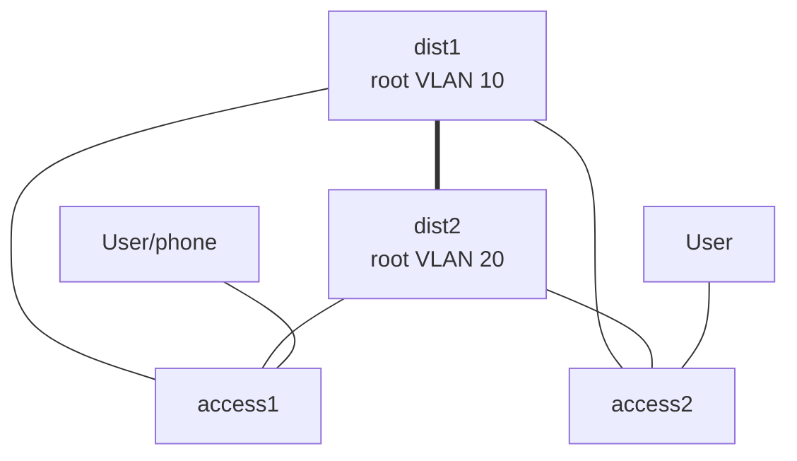

The diagram contains intentional physical redundancy. STP/RSTP/MST must leave
a loop-free active topology; link aggregation can turn parallel member links
between the same two systems into one logical port. A LAG does not combine links
that terminate on independent switches unless those switches implement and
support a multichassis system.

### 45.2 Baseline inventory

Record before change:

- switch/platform/release, STP mode, bridge/root IDs, instance/VLAN mapping;
- interface operational/admin state, access/native/allowed VLAN policy;
- MAC table location and move counters;
- LAG actor/partner keys, member collecting/distributing state, and minimum links;
- interface errors, discards, utilization, broadcast/multicast rate;
- management path and out-of-band recovery.

Prove each intended VLAN end to end and prove that unintended VLANs are absent
from trunks. Do not use "allow all" to avoid maintaining an explicit contract.

### 45.3 STP state reasoning

For each switch/VLAN or MST instance, identify root bridge, root port,
designated port, alternate port, port cost, and edge status. RSTP accelerates
agreement but does not eliminate loops created by wrong edge/guard settings,
unmanaged bridges, inconsistent VLAN mappings, or multichassis mistakes.

Safe edge policy combines an explicitly identified endpoint-facing port with
rapid edge transition and BPDU protection. Never enable edge/PortFast merely
because a port is currently blocking; an inter-switch link must exchange BPDUs.

### 45.4 LACP state reasoning

Verify configuration symmetry before bundling: member speed/duplex/MTU, L2/L3
mode, native and allowed VLANs, LACP mode, system ID/key, and minimum-links
policy. At least one side must actively transmit LACP for an active/passive pair;
passive/passive does not negotiate.

One large flow normally hashes to one member. Test multiple flow tuples and
compare per-member counters; do not promise a single flow the sum of bandwidth.

### 45.5 MST region boundary

MST maps many VLANs into a smaller number of spanning-tree instances. Every
switch intended to share one region must agree on region name, revision, and
VLAN-to-instance mapping; the resulting configuration digest identifies the
region. A mismatch creates a region boundary even when links and VLAN trunks
remain up.

Record the digest, regional root and port role for each instance, plus the
Common and Internal Spanning Tree boundary state. Change one VLAN-to-instance
mapping on one lab switch, verify the boundary and changed path behavior, then
restore the exact mapping. Do not assume a shared region from a matching name
alone.

### 45.6 Controlled faults

Inject one in a lab or approved simulator:

1. remove VLAN 20 from one trunk while leaving the port operational;
2. create a native VLAN mismatch and capture tagged/untagged behavior;
3. raise the intended root's priority so root placement changes;
4. set one LACP member to an incompatible bundle policy;
5. disconnect the active uplink and measure STP/LACP plus user convergence;
6. create an MST region mapping mismatch on one switch;
7. environment-gated: connect a small unmanaged bridge to a protected edge port
   and verify BPDU guard/loop-protection behavior.

Recovery restores the exact VLAN/root/LAG/guard property. Verify protocol state,
MAC learning, all required VLAN transactions, prohibited VLAN isolation, path
selection, and stable counters after recovery.

## 46. Campus Lab 22 — First-hop availability and routed boundaries

### 46.1 Gateway model

Hosts use one virtual default-gateway address while two distribution devices
coordinate active/standby or active roles with HSRP/VRRP or a platform-specific
equivalent. The virtual IP, virtual MAC, control protocol, tracked uplinks, ARP/ND
updates, and downstream route all contribute to availability.

Gateway redundancy alone cannot detect every upstream black hole. Track a
meaningful object only when its failure correlates with inability to forward the
protected service; poorly designed tracking can cause needless role churn.

### 46.2 Baseline and failure sequence

Record group ID, virtual IP, active/primary and standby/backup, priority,
preemption policy/delay, timers, authentication where supported, tracked objects,
and virtual MAC learning. Run a bounded user transaction through the active
gateway while capturing gateway control and ARP behavior.

Inject one fault:

1. shut the active distribution's client-facing SVI/logical interface;
2. fail its tracked upstream while leaving the client VLAN up;
3. create equal/misordered priorities without changing timers;
4. remove the return route only on the new active device.

Measure detection, role transition, gratuitous ARP/neighbor update, MAC movement,
FIB readiness, packet-loss window, and transaction recovery separately. Restore
the original device and observe preemption behavior; avoid repeated failback if
the upstream is unstable.

## 47. Campus Lab 23 — Access security and QoS boundaries

### 47.1 DHCP snooping and Dynamic ARP Inspection

DHCP snooping establishes a binding database from observed leases and blocks
unauthorized server messages on untrusted ports. DAI can validate ARP against
that database. Static hosts, relays, option handling, database persistence, LAGs,
and platform trust defaults require explicit design.

Before enablement, inventory DHCP server/relay paths, trusted uplinks, client
VLANs, existing bindings, static-IP devices, lease duration, option 82 policy,
database storage, and failover behavior. Enabling DAI before valid bindings or
static exceptions can isolate legitimate endpoints.

Controlled faults:

1. send an Offer from an untrusted lab access port and verify it is dropped;
2. send ARP whose IP/MAC differs from the valid lab binding;
3. remove the trusted status from the real server-facing path;
4. expire/remove a binding for a static-host exercise.

Correlate DHCP messages, snooping database, DAI counters/logs, ARP capture,
client lease, neighbor state, and user transaction. Recovery corrects trust or
binding policy—not a blanket disabling of inspection.

### 47.2 802.1X and NAC state machine

802.1X separates supplicant, authenticator, and authentication server. Track at
least: link, EAPOL exchange, method/certificate, RADIUS request/response, policy
result, assigned VLAN/role/ACL, accounting, and user transaction.

Design explicit behavior for authentication-server unavailable, authentication
failure, non-802.1X devices, phones with downstream clients, reauthentication,
CoA, and critical/guest/remediation access. Fail-open versus fail-closed is a
risk decision, not a convenience default.

Never troubleshoot by globally disabling NAC. Use one authorized lab port and
compare failure at link/EAP, RADIUS transport, identity, policy, enforcement,
and application boundaries.

### 47.3 Campus QoS

QoS manages contention; it does not create bandwidth. Define the trust boundary,
classifiers, markings, queues, scheduling, shaping/policing, congestion behavior,
and verification counters from application requirements. Do not trust endpoint
DSCP universally.

For a lab voice/data mix, generate bounded competing flows, observe latency,
jitter, loss, queue depth/drop, and interface utilization, then apply the minimal
classification/queuing policy. Verify both priority traffic and starvation
protection for other classes. Remove the policy and prove baseline restoration.

## 48. Campus design and failure competency gate

Given an unfamiliar campus diagram, the learner must:

1. mark L2 domains, L3 boundaries, STP roots, active/alternate paths, LAGs,
   gateway ownership, DHCP trust, NAC enforcement, and QoS trust boundaries;
2. predict the impact of each single link/device/control-plane failure;
3. identify fate-sharing and dual-homing that is only visually redundant;
4. propose pre-checks and a reversible migration to the intended state;
5. inject one trunk/STP/LACP and one gateway/security fault in simulation;
6. prove recovery with protocol, forwarding, security, and user evidence.

Passing requires loop prevention, segmentation, first-hop availability, access
security, failure convergence, and exact rollback evidence—not diagram quality.

## 49. Service-provider Lab 24 — MPLS forwarding and LDP

### 49.1 Roles and packet model

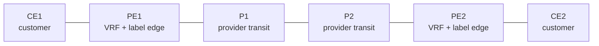

- **CE** exchanges customer routes with a PE and need not understand MPLS.
- **PE** separates customer routing in VRFs, exchanges VPN reachability, and
  pushes/pops service/transport labels.
- **P** carries provider transport labels and normally has no customer VRF.

Ingress classification selects a forwarding equivalence class. An MPLS label is
locally significant; each hop uses its incoming label table to pop, swap, or
push. The outer transport label reaches the egress PE; a VPN/service label
identifies the destination VRF or service. Penultimate-hop popping may remove the
transport label before the egress PE, subject to protocol/platform behavior.

### 49.2 Environment gate

This lab needs a Linux kernel/platform with MPLS forwarding, an FRR build with
`ldpd`, appropriate modules/sysctls, and an image that exposes them. Validate
support before mutation:

```bash
# [HOST/NODE] Inspect only; availability varies.
uname -r
lsmod | grep -E '^mpls_(router|iptunnel|gso)'
sysctl net.mpls.platform_labels
vtysh -c 'show running-config' | grep -E 'mpls|ldp'
```

If these checks fail, complete the lab as control-plane/table analysis. Do not
load host modules or change host-wide label capacity without explicit owner
approval and rollback.

### 49.3 Underlay before labels

Build a PE1–P1–P2–PE2 routed underlay with unique loopbacks. Use OSPF or IS-IS
to make every provider loopback reachable. Prove adjacency, IGP RIB, kernel FIB,
and sourced loopback transaction before enabling LDP.

Enable LDP only on provider-facing links, using stable loopbacks as router and
transport addresses. Never enable it toward a customer interface by accident.
Then record:

- discovery Hellos and LDP TCP session;
- neighbor/transport address and uptime;
- local and remote label bindings for provider loopbacks;
- LFIB incoming label, action, outgoing label/interface/nexthop;
- labeled packet capture at ingress, transit, penultimate, and egress points.

An LDP neighbor proves label exchange, not that the IGP nexthop, LFIB action, or
customer service is correct.

### 49.4 Controlled provider-path fault

Use two provider paths where the lab platform supports them. Record IGP, LDP,
LFIB, label stack, and a continuous bounded service transaction. Fail one P link
and measure IGP detection/SPF, LDP/label change, LFIB programming, packet loss,
and service recovery independently.

Restore the link and verify stable reconvergence. Do not clear all LDP neighbors
or label tables. Explain how LDP–IGP synchronization or fast-reroute mechanisms
could reduce black-hole windows, but do not claim protection unless configured
and measured.

## 50. Service-provider Lab 25 — VRF, MP-BGP, and L3VPN

### 50.1 Route separation model

A VRF provides an independent routing table. A Route Distinguisher (RD) makes
overlapping customer IPv4/IPv6 prefixes unique in VPN address families; it does
not define import policy. Route Targets (RTs) are extended communities used by
policy to export/import VPN routes. Equal RTs are a common topology pattern, not
a requirement that RD and RT values match.

```text
CE route → PE VRF RIB → VPNv4 route (RD + prefix, RT, VPN label)
         → MP-BGP → remote PE RT import → remote VRF RIB → CE route
```

### 50.2 Baseline build sequence

1. Create `BLUE` VRF on PE1 and PE2 with unique RDs and intentional import/export
   RT `65000:100`.
2. Attach only the correct CE-facing interface to each VRF.
3. Establish CE–PE routing using static or eBGP inside the VRF.
4. Establish PE loopback MP-iBGP for VPNv4 over the working labeled underlay.
5. Activate VPNv4 and exchange extended communities.
6. Verify local VRF route export, remote VPN route, RT import, VPN label, remote
   VRF route, LFIB, and CE1→CE2 transaction in both directions.

Do not leak a default or global route into a customer VRF unless explicitly
required and filtered. Overlapping customer prefixes are evidence that global
table tests are insufficient; always label commands with the VRF.

### 50.3 Controlled faults

1. **Wrong RT import:** MP-BGP remains Established and VPN route exists globally,
   but the remote VRF does not import it.
2. **Duplicate/wrong RD:** distinguish VPN NLRI identity and operational policy;
   correct the unique intended RD without assuming the RT changes.
3. **Interface in wrong VRF:** link stays up but connected route appears in the
   wrong table.
4. **Missing extended-community propagation:** route advertisement exists but
   import policy lacks its RT signal.
5. **Transport-label failure:** VPN control plane can retain routes while the
   provider data plane cannot reach the egress PE.
6. **Provider-path failure:** repeat Lab 24 failure and prove the VPN service,
   not only PE loopback reachability.

The diagnosis ladder is CE route → local VRF → VPN RIB/attributes → MP-BGP
session → remote import → remote VRF → transport/VPN labels → remote CE return
path. Recovery changes one RD/RT/interface/session/label boundary and verifies
customer isolation plus bidirectional service.

### 50.4 Introductory traffic-engineering boundary

IGP cost, ECMP, RSVP-TE, Segment Routing, explicit paths, bandwidth constraints,
fast reroute, and policy can influence provider paths. Part 5 requires the
learner to state intent and failure trade-offs, not deploy a production TE
system. Any claimed latency, protection, or bandwidth guarantee must be measured
under failure and include shared-risk/fate-sharing analysis.

## 51. Vendor-neutral intent to Cisco and Juniper operations

The following mappings teach translation. They are not complete device
templates. Replace interface names, VLANs, addresses, authentication, timers,
and platform-specific statements only after release-specific validation.

### 51.1 VLAN access and explicit trunk

**Intent:** endpoint port in VLAN 10; LACP trunk carries only VLANs 10,20,99.

```text
! Cisco IOS XE 17.x-style illustration
vlan 10
 name USERS
interface GigabitEthernet1/0/10
 switchport mode access
 switchport access vlan 10
 spanning-tree portfast
 spanning-tree bpduguard enable
interface range TenGigabitEthernet1/1/1-2
 channel-group 10 mode active
interface Port-channel10
 switchport mode trunk
 switchport trunk allowed vlan 10,20,99
```

```text
# Junos EX/QFX ELS-style illustration
set vlans USERS vlan-id 10
set interfaces ge-0/0/10 unit 0 family ethernet-switching interface-mode access
set interfaces ge-0/0/10 unit 0 family ethernet-switching vlan members USERS
set protocols rstp interface ge-0/0/10 edge
set protocols rstp bpdu-block-on-edge
set chassis aggregated-devices ethernet device-count 1
set interfaces ge-0/0/47 ether-options 802.3ad ae0
set interfaces ge-0/0/48 ether-options 802.3ad ae0
set interfaces ae0 aggregated-ether-options lacp active
set interfaces ae0 unit 0 family ethernet-switching interface-mode trunk
set interfaces ae0 unit 0 family ethernet-switching vlan members [ USERS VOICE MGMT ]
```

Verification is semantic, not command-count parity:

| Intent/state | Cisco IOS XE examples | Junos ELS examples |
|---|---|---|
| VLAN/port membership | `show vlan brief`, `show interfaces switchport` | `show vlans`, `show ethernet-switching interfaces` |
| STP role/root | `show spanning-tree vlan 10` | `show spanning-tree bridge`, `show spanning-tree interface` |
| LACP/bundle | `show etherchannel summary`, `show lacp neighbor` | `show interfaces ae0 extensive`, `show lacp interfaces` |
| MAC learning | `show mac address-table` | `show ethernet-switching table` |

Rollback removes only the new member/config statements and restores the reviewed
prior allowed-VLAN list. Capture the old list before change; `no switchport trunk
allowed vlan ...` may restore a broad default rather than the intended prior
policy.

### 51.2 First-hop redundancy

**Intent:** virtual gateway `192.0.2.1/24`, preferred device priority 110,
preemption only after stability.

```text
! Cisco IOS XE HSRP illustration; exact version/group syntax varies
interface Vlan10
 ip address 192.0.2.2 255.255.255.0
 standby 10 ip 192.0.2.1
 standby 10 priority 110
 standby 10 preempt delay minimum 60
```

```text
# Junos VRRP illustration
set interfaces irb unit 10 family inet address 192.0.2.2/24
set interfaces irb unit 10 family inet address 192.0.2.2/24 vrrp-group 10 virtual-address 192.0.2.1
set interfaces irb unit 10 family inet address 192.0.2.2/24 vrrp-group 10 priority 110
set interfaces irb unit 10 family inet address 192.0.2.2/24 vrrp-group 10 preempt
```

Use `show standby brief` or `show vrrp`, then verify virtual IP/MAC, peer role,
tracking, route/FIB, ARP update, and transaction. HSRP and VRRP are not wire-level
equivalents in every feature; translate intent and measured outcome.

### 51.3 DHCP snooping and DAI

**Intent:** inspect VLAN 10, trust only the reviewed server-facing uplink, and
validate ARP against known bindings.

```text
! Cisco IOS XE illustration
ip dhcp snooping
ip dhcp snooping vlan 10
ip arp inspection vlan 10
interface Port-channel10
 ip dhcp snooping trust
 ip arp inspection trust
```

```text
# Junos ELS-style conceptual illustration; verify platform hierarchy
set vlans USERS forwarding-options dhcp-security
set vlans USERS forwarding-options dhcp-security arp-inspection
```

Cisco verification commonly includes `show ip dhcp snooping binding` and
`show ip arp inspection`; Junos verification includes DHCP security bindings and
DAI statistics available on the specific platform. Confirm default trust rules:
Junos ELS access and trunk behavior can differ from Cisco and from non-ELS Junos.
Configure any required per-interface trust override only through the hierarchy
documented for that exact platform/release; do not infer it from Cisco syntax.

### 51.4 Change and rollback mechanics

On Cisco IOS XE, capture `show running-config`, relevant operational tables, and
the exact candidate diff through the approved management system. Prefer a
platform-supported configuration archive/replace or scheduled reload safeguard
that has been lab-tested; blindly pasting inverse `no` commands is not always a
true rollback because defaults and generated state differ.

On Junos:

```text
configure private
show | compare
commit check
commit confirmed 5
# Run post-checks through an independent management path.
commit
```

If validation fails, allow confirmed commit to roll back or explicitly load the
reviewed prior revision according to procedure. `rollback 0` discards pending
candidate changes; returning to an older committed configuration requires the
appropriate rollback index/revision followed by commit. Know which operation is
being used before relying on it.

## 52. Troubleshooting comparison — intent before syntax

| Symptom | Vendor-neutral evidence order | Common unsafe shortcut |
|---|---|---|
| VLAN works on one access switch only | endpoint VLAN → MAC → trunk allowed/native → STP path → gateway | Allow all VLANs everywhere |
| LAG partially forwards | member compatibility → actor/partner → collecting/distributing → hash/counters | Rebuild the whole bundle |
| Gateway failover black-holes | group role → tracking → virtual MAC/ARP → route/FIB → return path | Force repeated preemption |
| DHCP clients fail after security change | DORA capture → trust → bindings → option/relay → DAI counters | Disable snooping/DAI globally |
| MPLS VPN route missing | CE → VRF → VPN RIB/RT → MP-BGP → remote import → labels | Reset all BGP/LDP peers |
| VPN route present, traffic fails | VRF FIB → VPN label → transport LFIB → MTU → remote return | Change RD/RT without evidence |

Vendor logs and `show` output are observations. Always relate them to the
expected state transition and packet path.

## 53. Production change engineering

### 53.1 Authorization and discovery gate

No real-device change begins without named ownership and authorization. The
change record must define business/service intent, devices/interfaces/VRFs/VLANs,
dependencies, blast radius, affected users, maintenance window/time zone,
implementer, peer reviewer, incident/escalation contacts, and approval evidence.

Discovery includes topology, neighbor protocols, routing, STP/LAG/gateway roles,
security/QoS policy, management path, config drift, hardware/software capacity,
known alarms, current incidents, backup validity, and recent/overlapping changes.
If discovered state contradicts the plan, stop and re-review; do not improvise.

### 53.2 Change packet

Every production exercise produces:

1. **Intent and invariants:** what changes and what must remain true.
2. **Exact diff:** per-device ordered commands/config and dependency sequence.
3. **Pre-checks:** commands, expected values, timestamps, and acceptance limits.
4. **Canary:** smallest representative device/site/VLAN/VRF and observation time.
5. **Risk controls:** OOB access, console validation, peer review, backups,
   monitoring owner, communication and freeze conflicts.
6. **Stop/rollback triggers:** measurable thresholds, not "if problems occur."
7. **Rollback:** exact prior revision/config, execution order, time estimate,
   state implications, and independent access path.
8. **Post-checks:** protocol plus user/business outcomes and negative isolation.
9. **Evidence record:** who/what/when/result and configuration revision/hash.

### 53.3 Pre-check matrix

| Boundary | Example evidence | Stop condition example |
|---|---|---|
| Device/control | CPU/memory, redundancy, alarms, config session | Unstable supervisor/RE or active major alarm |
| Physical/L2 | optics/errors, LACP, STP topology changes | Rising errors or unexpected single-homing |
| L3/control | neighbors, RIB/FIB, ECMP, gateway roles | Missing baseline peer/path |
| Security | bindings, NAC/RADIUS, ACL counters | Authentication dependency unhealthy |
| Service | DNS/TLS/application synthetic | Baseline transaction already failing |
| Operations | OOB, backup, reviewer, monitoring | No tested recovery path or owner |

Baseline anomalies are not accepted merely because the window started.

### 53.4 Execution loop

```text
announce → verify pre-checks → apply one bounded unit → verify local state
→ verify dependent control planes → verify canary user outcome
→ observe for agreed interval → continue or stop/rollback
```

Keep a timestamped command/action log. Do not combine unrelated cleanup,
upgrades, and policy changes. A successful parser/commit confirms configuration
validity, not service correctness.

### 53.5 Rollback decision

Rollback triggers can include management-path degradation, unexpected neighbor
loss, loss/error/latency above threshold, route/label count deviation, security
bypass, isolation violation, canary failure, or inability to explain observed
state within the time box.

Rollback itself is a change. Verify access, config revision, protocol recovery,
FIB, stateful-session implications, and user outcome afterward. Escalate rather
than repeatedly rolling forward/back when the system does not return to baseline.

### 53.6 Post-check and closure

Repeat comparable pre-checks, plus intended delta and negative tests. Observe
long enough to cover protocol timers, cache/lease behavior, traffic cycles, and
failover where required. Confirm monitoring/alerts, redundancy restored, no lab
or debug residue, temporary accounts/files removed, and evidence retained under
policy.

Close with actual start/end, implementer/reviewer, revision IDs, deviations,
measured impact, rollback status, unresolved risk, follow-up owner/due condition,
and user/business validation. Never rewrite the plan to make execution appear as
planned; deviations are operational evidence.

## 54. Production change simulation

Prepare a reviewed migration that adds VLAN 20 across a dual-homed campus,
enables its redundant gateway, permits it on one LAG, and applies DHCP
snooping/DAI after valid bindings are available. Perform only in simulation.

The assessment requires:

- dependency-ordered Cisco IOS XE and Junos ELS intent mappings;
- exact pre/post state and rollback for each platform;
- canary on one access block before wider rollout;
- protection against VLAN leakage, STP root change, LAG inconsistency, gateway
  role churn, rogue DHCP, and invalid ARP;
- a failed-canary branch that invokes rollback;
- handoff and auditable final record.

The facilitator injects one discovered-state conflict—such as an unexpected
native VLAN, single-member LAG, wrong STP root, missing OOB access, or absent
DHCP binding persistence. Passing requires stopping and revising the plan, not
forcing the approved commands through an invalid baseline.

## 55. Part 5 exercises and competency gate

### Foundation

1. Mark campus L2/L3, STP, LAG, gateway, DHCP/NAC, and QoS boundaries.
2. Explain MPLS push/swap/pop and distinguish transport from VPN labels.
3. Distinguish VRF, RD, RT, VPN NLRI, MP-BGP, and LFIB roles.
4. Map one access/trunk/LAG intent to Cisco and Juniper verification state.

### Applied

5. Diagnose an allowed-VLAN fault without opening every trunk.
6. Measure first-hop failover through the original user transaction.
7. Diagnose an L3VPN wrong-RT import and a provider transport failure.
8. Produce a change packet with canary, stop, rollback, and post-check evidence.

### Production judgment

9. Identify when L2 stretch, multichassis LAG, gateway preemption, or fail-open
   NAC increases rather than reduces risk.
10. Define MPLS VPN isolation tests that include overlapping customer prefixes.
11. Explain why config success, protocol adjacency, FIB installation, and user
    success are separate gates.

- [ ] Campus loop prevention, redundancy, segmentation, and failure paths are proven.
- [ ] LACP member and flow-hash behavior are verified rather than assumed.
- [ ] First-hop role, tracking, ARP/MAC update, route, and transaction are correlated.
- [ ] DHCP snooping, DAI, 802.1X/NAC, and QoS failure boundaries are explained.
- [ ] MPLS underlay, LDP, LFIB, label stack, and provider failure are correlated.
- [ ] VRF/RD/RT/MP-BGP/VPN-label state proves L3VPN import and isolation.
- [ ] Cisco and Juniper examples preserve the same intent with platform caveats.
- [ ] Every production exercise includes authority, OOB, peer review, canary,
      stop/rollback criteria, post-checks, and an auditable record.

## 56. Sprint 6 final competency assessment

The final assessment combines five stations without requiring proprietary
hardware for the first four:

1. Linux L2/L3/VLAN/NAT build and fault recovery;
2. DNS/TCP/PMTUD/TLS evidence correlation;
3. Containerlab/FRR OSPF and BGP failure recovery;
4. blind integrated incident with timeline and handoff;
5. enterprise/MPLS design review plus simulated production change.

For every executed station, the learner must prove baseline, controlled fault,
evidence-led diagnosis, smallest recovery, user outcome, cleanup, and reflection.
Environment-gated vendor/MPLS commands are graded on state reasoning and change
safety unless the required authorized platform is available.

Sprint 6 content was declared complete after the full appendix structure, links,
addresses, commands, references, README, ROADMAP, and CHANGELOG passed the final
source audit. Lab execution remains the learner's environment-specific evidence;
the Windows authoring host cannot substitute for it.

## 57. Verified references

- [Linux man-pages: network namespaces](https://man7.org/linux/man-pages/man7/network_namespaces.7.html)
- [iproute2 manual: `ip-netns`](https://man7.org/linux/man-pages/man8/ip-netns.8.html)
- [iproute2 manual: `ip-link`](https://man7.org/linux/man-pages/man8/ip-link.8.html)
- [iproute2 manual: `ip-route`](https://man7.org/linux/man-pages/man8/ip-route.8.html)
- [iproute2 manual: `ip-neighbour`](https://man7.org/linux/man-pages/man8/ip-neighbour.8.html)
- [Linux kernel: Ethernet bridging](https://docs.kernel.org/networking/bridge.html)
- [RFC 5737: IPv4 address blocks for documentation](https://www.rfc-editor.org/rfc/rfc5737)
- [RFC 3849: IPv6 address prefix reserved for documentation](https://www.rfc-editor.org/rfc/rfc3849)
- [RFC 4861: IPv6 Neighbor Discovery](https://www.rfc-editor.org/rfc/rfc4861)
- [Linux kernel: IPv4 sysctl and forwarding](https://docs.kernel.org/networking/ip-sysctl.html)
- [RFC 1812: Requirements for IPv4 routers](https://www.rfc-editor.org/rfc/rfc1812)
- [iproute2 manual: bridge and bridge VLAN](https://man7.org/linux/man-pages/man8/bridge.8.html)
- [IEEE 802.1Q overview: Bridges and Bridged Networks](https://www.ieee802.org/1/pages/802.1Q.html)
- [Netfilter nftables manual](https://netfilter.org/projects/nftables/manpage.html)
- [nftables stateful NAT](https://wiki.nftables.org/wiki-nftables/index.php/Performing_Network_Address_Translation_%28NAT%29)
- [Linux kernel conntrack Netlink specification](https://docs.kernel.org/netlink/specs/conntrack.html)
- [RFC 1034: Domain Names — Concepts and Facilities](https://www.rfc-editor.org/rfc/rfc1034)
- [RFC 1035: Domain Names — Implementation and Specification](https://www.rfc-editor.org/rfc/rfc1035)
- [RFC 2308: Negative Caching of DNS Queries](https://www.rfc-editor.org/rfc/rfc2308)
- [RFC 2131: Dynamic Host Configuration Protocol](https://www.rfc-editor.org/rfc/rfc2131)
- [RFC 9293: Transmission Control Protocol](https://www.rfc-editor.org/rfc/rfc9293)
- [RFC 8085: UDP Usage Guidelines](https://www.rfc-editor.org/rfc/rfc8085)
- [RFC 1191: Path MTU Discovery for IPv4](https://www.rfc-editor.org/rfc/rfc1191)
- [RFC 8201: Path MTU Discovery for IPv6](https://www.rfc-editor.org/rfc/rfc8201)
- [RFC 8899: Packetization Layer PMTUD for Datagram Transports](https://www.rfc-editor.org/rfc/rfc8899)
- [RFC 8446: TLS 1.3](https://www.rfc-editor.org/rfc/rfc8446)
- [OpenSSL `s_client` documentation](https://docs.openssl.org/3.0/man1/openssl-s_client/)
- [OpenSSL `s_server` documentation](https://docs.openssl.org/3.0/man1/openssl-s_server/)
- [Linux manual: `ss`](https://man7.org/linux/man-pages/man8/ss.8.html)
- [tcpdump manual](https://www.tcpdump.org/manpages/tcpdump.1.html)
- [Wireshark display-filter reference](https://www.wireshark.org/docs/dfref/)
- [Containerlab topology definition](https://containerlab.dev/manual/topo-def-file/)
- [Containerlab node configuration](https://containerlab.dev/manual/nodes/)
- [Containerlab deploy command](https://containerlab.dev/cmd/deploy/)
- [Containerlab destroy command](https://containerlab.dev/cmd/destroy/)
- [FRRouting 10.2 documentation](https://docs.frrouting.org/en/stable-10.2/)
- [FRRouting zebra and kernel RIB](https://docs.frrouting.org/en/stable-10.2/zebra.html)
- [FRRouting OSPFv2](https://docs.frrouting.org/en/stable-10.2/ospfd.html)
- [FRRouting BGP](https://docs.frrouting.org/en/stable-10.2/bgp.html)
- [RFC 2328: OSPF Version 2](https://www.rfc-editor.org/rfc/rfc2328)
- [RFC 4271: Border Gateway Protocol 4](https://www.rfc-editor.org/rfc/rfc4271)
- [RFC 6996: Autonomous System Number reservation](https://www.rfc-editor.org/rfc/rfc6996)
- [IEEE 802.1 working-group standards overview](https://www.ieee802.org/1/)
- [IEEE 802.1X port-based network access control](https://1.ieee802.org/security/802-1x/)
- [RFC 5798: Virtual Router Redundancy Protocol](https://www.rfc-editor.org/rfc/rfc5798)
- [Cisco IOS XE Dynamic ARP Inspection](https://www.cisco.com/c/en/us/td/docs/switches/lan/catalyst9600/software/release/17-17/configuration_guide/sec/b_1717_sec_9600_cg/configuring_dynamic_arp_inspection.html)
- [Juniper RSTP configuration](https://www.juniper.net/documentation/us/en/software/junos/stp-l2/topics/topic-map/spanning-tree-configuring-rstp.html)
- [Juniper aggregated Ethernet and LACP](https://www.juniper.net/documentation/us/en/software/junos/interfaces-ethernet/topics/topic-map/aggregated-ethernet-interfaces-lacp-configure.html)
- [Juniper DHCP snooping](https://www.juniper.net/documentation/us/en/software/junos/dhcp/topics/topic-map/dhcp-snooping.html)
- [Juniper Dynamic ARP Inspection](https://www.juniper.net/documentation/us/en/software/junos/security-services/topics/topic-map/understanding-and-using-dai.html)
- [Juniper VRRP configuration](https://www.juniper.net/documentation/us/en/software/junos/high-availability/topics/topic-map/vrrp-configuring.html)
- [Juniper confirmed commit](https://www.juniper.net/documentation/us/en/software/junos/cli-reference/topics/ref/command/commit.html)
- [Juniper configuration rollback](https://www.juniper.net/documentation/us/en/software/junos/cli-reference/topics/ref/command/rollback.html)
- [RFC 3031: Multiprotocol Label Switching Architecture](https://www.rfc-editor.org/rfc/rfc3031)
- [RFC 5036: LDP Specification](https://www.rfc-editor.org/rfc/rfc5036)
- [RFC 4364: BGP/MPLS IP VPNs](https://www.rfc-editor.org/rfc/rfc4364)
- [FRRouting 10.2 LDP](https://docs.frrouting.org/en/stable-10.2/ldpd.html)

Use the installed kernel, iproute2, ping, and tcpdump manuals as the final
authority for the lab VM. Output and feature availability vary by distribution
and version.
