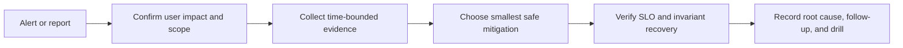

# Appendix F: Troubleshooting Playbooks

> **Status:** Initial release — reviewed 2026-08-31  
> **Scope:** Safe first response for common production failure modes

These playbooks are decision aids, not permission to run commands in production.
Before changing state, confirm the incident owner, blast radius, maintenance
window, rollback path, and data-safety constraints. Capture UTC timestamps and
raw evidence. Prefer reversible, narrow mitigations; never restart or retry every
component “to see if it helps.”

## Universal incident loop



For every incident record: symptom, start time, affected users/regions/releases,
current hypothesis, commands and outputs, mitigation owner, decision log, and
exit criteria. A mitigation is not a root cause; keep investigating after service
recovers unless the incident policy explicitly hands off the analysis.

## F.1 HTTP 5xx spike

**Confirm:** graph 5xx by route, status code, region, release, upstream, and
request class. Compare request rate, latency, retries, saturation, and dependency
errors. Check whether the error is generated by the edge, load balancer, gateway,
or application.

```bash
curl -sv --max-time 5 https://api.example.test/healthz -o /dev/null
kubectl get deploy,pods -l app=api
kubectl logs deploy/api --since=10m --all-containers --prefix
```

**Mitigate:** stop a correlated rollout; route away only from a demonstrably
unhealthy cohort; disable an optional feature; enforce bounded deadlines and
load-shed noncritical work. For payment or write endpoints, do not add blind
retries. Preserve failed request IDs and trace IDs for reconciliation.

**Verify:** 5xx rate, p99, business success rate, queue age, and dependency error
rate recover across at least one meaningful observation window. Re-enable traffic
gradually and document whether failed writes were committed.

## F.2 DNS failure or stale resolution

Separate authoritative failure, recursive resolver failure, DNSSEC validation,
negative caching, and an unhealthy endpoint. Query from two networks and inspect
TTL, answer set, CNAME chain, and address family.

```bash
dig +stats api.example.com
dig +trace api.example.com
dig @1.1.1.1 api.example.com
dig @8.8.8.8 api.example.com
```

**Mitigate:** restore the last known-good record or healthy target set through the
approved DNS change path. Do not lower TTL expecting already-cached answers to
change immediately; recursive caches retain prior TTL decisions. If only one
address family fails, repair that path or use a documented temporary routing
policy. Do not use `/etc/hosts` as an untracked fleet-wide fix.

**Verify:** authoritative and recursive answers converge within the measured TTL
window; synthetic checks from independent regions resolve and connect; record
DNSSEC validation status if enabled.

## F.3 TCP timeout, reset, or connection storm

Break the request into DNS, connect, TLS, time-to-first-byte, and transfer phases.
Inspect client retries, SYN backlog, ephemeral ports, NAT state, load-balancer
health, packet loss, MTU, and backend accept queues.

```bash
curl -sS -o /dev/null -w 'dns=%{time_namelookup} connect=%{time_connect} tls=%{time_appconnect} ttfb=%{time_starttransfer} total=%{time_total}\n' https://api.example.com/
ss -s
ip route get <address>
mtr --report --report-cycles 20 <host>
```

**Mitigate:** stop retry amplification, apply bounded exponential backoff and
jitter, remove only failing targets, and protect the backend with admission
limits. Avoid increasing timeouts globally: this can multiply concurrent work.
Correct MTU, routing, or security-group policy through a reviewed change.

**Verify:** connection success and phase latency recover; SYN/retransmit and pool
wait fall; no secondary queue or retry storm appears.

## F.4 CPU or memory saturation

Correlate host/container CPU throttling, run queue, RSS, heap/GC, OOM kills,
working-set pressure, request concurrency, and recent code/config changes.

```bash
kubectl top pods -l app=api
kubectl describe pod <pod>
kubectl get events --sort-by=.lastTimestamp | Select-Object -Last 30
```

**Mitigate:** stop the causative rollout, shed optional work, cap concurrency,
scale within tested limits, or drain a sick instance. For memory, capture a safe
profile/heap signal before restart when possible. Do not “fix” CPU by removing
limits without checking node capacity and noisy-neighbor impact.

**Verify:** saturation returns below the operating envelope, latency/error budget
recovers, OOM/throttle events stop, and the added capacity is sustainable. Create
a capacity or leak regression test from the evidence.

## F.5 Disk full or inode exhaustion

Confirm whether blocks, inodes, or a single mount (for example, a container
overlay, WAL volume, or log filesystem) is exhausted. Check growth rate and the
largest safe consumers before deleting anything.

```bash
df -h
df -i
du -xhd1 /var 2>/dev/null | sort -h
journalctl --disk-usage
```

**Mitigate:** stop the producer of unbounded data, rotate/compress logs through
the approved policy, extend the volume, or remove only identified disposable
artifacts. Do not delete database files, WAL, container layers, or logs needed
for the incident. A full disk can prevent the command used to fix it from
starting, so keep a small emergency reserve.

**Verify:** free blocks and inodes remain above the operating threshold, writes,
WAL/checkpoints, and logging recover, and growth/retention alerts are active.
Document what was removed and whether it is recoverable.

## F.6 Database connection-pool exhaustion

Distinguish pool wait from database connection refusal, server max-connections,
lock wait, and a slow dependency holding connections too long.

```sql
SELECT state, wait_event_type, wait_event, count(*)
FROM pg_stat_activity
GROUP BY state, wait_event_type, wait_event;

SELECT pid, now() - query_start AS age, wait_event, query
FROM pg_stat_activity
WHERE state <> 'idle'
ORDER BY age DESC
LIMIT 20;
```

**Mitigate:** stop the source of unbounded concurrency; reduce request admission
or disable an expensive feature. Cancel a demonstrably runaway query only with
owner approval and awareness of transaction effects. Do not increase every pool
size: total connections across replicas must fit database CPU, memory, and
`max_connections`/proxy limits.

**Verify:** pool wait, transaction age, lock wait, database CPU/IO, and application
latency recover. Check that retries did not duplicate writes and that replicas are
not lagging. Follow up with query-plan and pool-budget analysis.

## F.7 Kafka consumer lag

Measure lag age (oldest event), records behind, consumer throughput, producer
rate, partition distribution, rebalance frequency, processing latency, broker
health, and downstream saturation. Record whether ordering or key affinity limits
parallelism.

**Mitigate:** pause low-priority producers or consumers, scale consumers only when
partitions and downstream capacity permit, quarantine poison messages, and reduce
batch size if processing time causes heartbeat loss. Do not skip offsets to make a
dashboard green unless the data-loss decision is explicit and recoverable.

**Verify:** oldest-event age trends down, no partition remains hot, commits occur
after durable side effects, DLQ volume is explained, and consumer-group stability
returns. Reconcile duplicates and missing business effects after recovery.

## F.8 Kubernetes CrashLoopBackOff

```bash
kubectl describe pod <pod>
kubectl logs <pod> --previous
kubectl get events --field-selector involvedObject.name=<pod> --sort-by=.lastTimestamp
kubectl rollout history deployment/<name>
```

Check exit code, termination reason, probe failures, image/config/secret changes,
resource pressure, volume mounts, service-account permissions, and dependency
reachability. `CrashLoopBackOff` is a backoff state, not a diagnosis.

**Mitigate:** pause the rollout or undo to a known-good immutable image when the
change is correlated and schema-compatible. Fix configuration or secret delivery;
do not make liveness depend on a database that can have a transient outage.
Temporarily increase `startupProbe` grace only when startup time is understood.

**Verify:** readiness succeeds, restart count stabilizes, rollout completes, and
business probes—not merely process liveness—work. Preserve the failed image,
manifest, logs, and events for analysis.

## F.9 Certificate expiration or trust failure

Check the certificate actually served at each edge/region, SAN/hostname, validity
window, issuer chain, trust bundle, clock skew, and mTLS client certificate. Test
both directions when mutual TLS is used.

```bash
openssl s_client -connect api.example.com:443 -servername api.example.com -showcerts </dev/null
```

**Mitigate:** renew through the automated issuer and canary the new chain; retain
the previous valid certificate until verification. For a trust-bundle incident,
roll back the bundle or deploy an overlapping root/intermediate according to the
rotation plan. Never disable certificate verification globally.

**Verify:** expiry horizon, hostname validation, chain building, mTLS identity
authorization, handshake errors, and all client cohorts pass. Confirm old
credentials are revoked only after the overlap window and audit evidence exists.

## F.10 BGP route loss or unexpected path

Compare control-plane advertisements, RPKI/ROV state, AS path, local preference,
MED, next-hop reachability, and data-plane probes from multiple vantage points.
An absent route, rejected route, and blackholed route are different failures.

```text
show bgp summary
show bgp <prefix>
show route <prefix> detail
ping <next-hop>
traceroute <destination>
```

**Mitigate:** use the approved provider/peer rollback or withdraw a bad
announcement; confirm authorization before advertising a prefix. Do not change
local preference globally to hide a single-peer fault. Coordinate with the
upstream and preserve timestamps, update IDs, and RPKI validation evidence.

**Verify:** the intended prefix is accepted at independent collectors, traffic
follows the designed path, packet loss/latency recover, and failover does not
overload the remaining links. Add route-policy and leak-prevention tests.

## F.11 Cache failure or stampede

Separate cache unavailability, hit-rate collapse, stale/incoherent data, hot-key
contention, and origin overload. Graph hit ratio together with origin QPS, key
cardinality, refresh latency, evictions, connection errors, and stale age.

**Mitigate:** enable bounded stale-while-revalidate and single-flight refresh;
protect the origin with concurrency/rate limits; bypass only selected keys or
tiers. Do not flush the entire cache during peak load. For private data, verify
tenant/authorization key scope before serving stale content.

**Verify:** origin load and p99 recover, refresh ownership remains bounded, stale
age stays inside the declared contract, and invalidation/version reconciliation
completes. Test cache loss again at controlled load.

## Source and practice references

- [Kubernetes: probes and container lifecycle](https://kubernetes.io/docs/concepts/configuration/liveness-readiness-startup-probes/)
- [PostgreSQL: monitoring statistics](https://www.postgresql.org/docs/current/monitoring-stats.html)
- [Kafka consumer groups and lag concepts](https://kafka.apache.org/documentation/#intro_consumers)
- [OpenTelemetry semantic conventions](https://opentelemetry.io/docs/concepts/semantic-conventions/)
- [RFC 9309: BGP route origin validation](https://www.rfc-editor.org/rfc/rfc6811.html)
- [Google SRE: Anatomy of an Incident](https://sre.google/static/pdf/Anatomy_Of_An_Incident.pdf)
