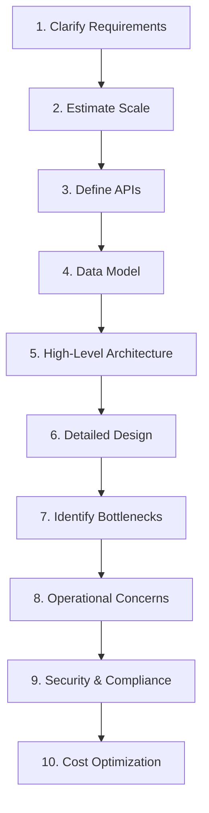
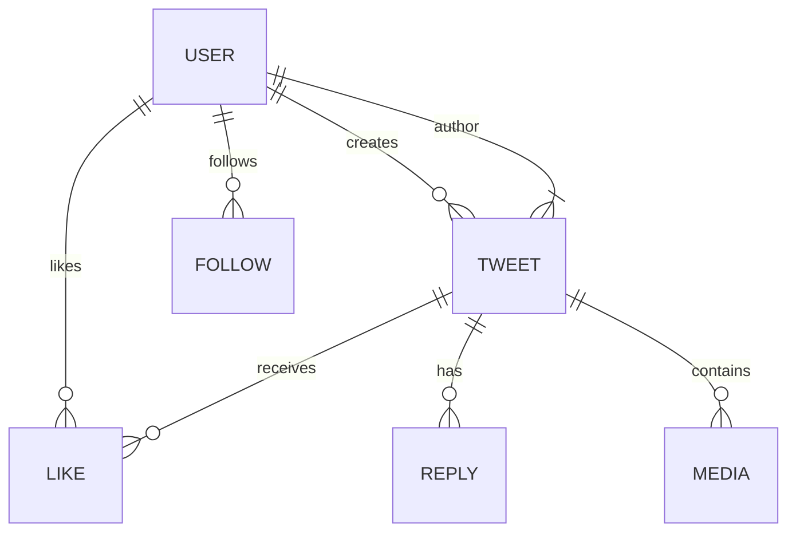
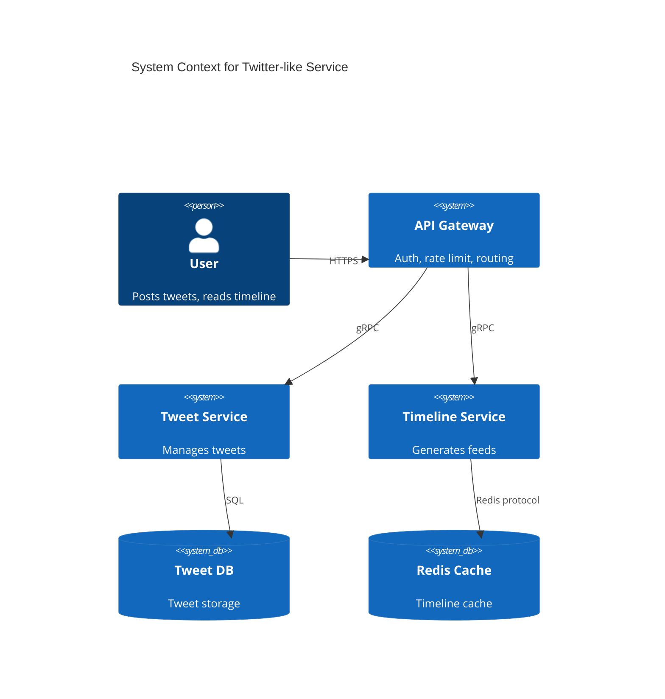

# Chapter 1: System Design Fundamentals

> **Estimated Time: 3-4 hours** | **Prerequisites: Basic programming, Linux, networking**

---

## 🎯 Learning Objectives

By the end of this chapter, you will be able to:

1. **Define system design** and distinguish it from software design
2. **Apply the system design process** from requirements to deployment
3. **Identify and analyze** functional and non-functional requirements
4. **Estimate system capacity** using back-of-the-envelope calculations
5. **Create architecture diagrams** using standard notation
6. **Evaluate trade-offs** using structured decision frameworks

---

## 1.1 What Is System Design?

### Definition

**System Design** is the process of defining the architecture, components, modules, interfaces, and data for a system to satisfy specified requirements. It bridges the gap between *business needs* and *technical implementation*.

```
┌─────────────────────────────────────────────────────────────────┐
│                    SYSTEM DESIGN SCOPE                          │
├─────────────────────────────────────────────────────────────────┤
│  ┌──────────────┐  ┌──────────────┐  ┌──────────────┐          │
│  │   HIGH-LEVEL │  │   LOW-LEVEL  │  │  OPERATIONAL │          │
│  │  ARCHITECTURE│  │   DESIGN     │  │   DESIGN     │          │
│  ├──────────────┤  ├──────────────┤  ├──────────────┤          │
│  │ • Services   │  │ • APIs       │  │ • Deployment │          │
│  │ • Data flow  │  │ • Schemas    │  │ • Monitoring │          │
│  │ • Protocols  │  │ • Algorithms │  │ • Scaling    │          │
│  │ • Boundaries │  │ • Patterns   │  │ • Recovery   │          │
│  └──────────────┘  └──────────────┘  └──────────────┘          │
└─────────────────────────────────────────────────────────────────┘
```

### System Design vs. Software Design

| Aspect | Software Design | System Design |
|--------|-----------------|---------------|
| **Scope** | Single application/module | Multiple services, infrastructure |
| **Focus** | Code structure, patterns | Architecture, scalability, reliability |
| **Concerns** | Classes, functions, modules | Services, networks, databases, queues |
| **Scale** | Thousands of lines | Millions of requests, petabytes |
| **Team** | 1-10 developers | Cross-functional teams |
| **Lifecycle** | Code → Test → Deploy | Design → Provision → Operate → Evolve |

---

## 1.2 The System Design Process

### Step-by-Step Framework



### 1. Clarify Requirements

**Functional Requirements** — What the system *does*:
- User registration, login, profile management
- Post creation, feed generation, comments
- Real-time messaging, notifications
- Search, filtering, recommendations

**Non-Functional Requirements (NFRs)** — How the system *behaves*:

| Category | Metrics | Example Targets |
|----------|---------|-----------------|
| **Availability** | Uptime, MTTR, MTBF | 99.99% (52 min/yr downtime) |
| **Latency** | p50, p95, p99 | p99 < 200ms for API calls |
| **Throughput** | QPS, TPS, MB/s | 100K reads/s, 10K writes/s |
| **Consistency** | Strong, eventual, causal | Strong for payments, eventual for feeds |
| **Durability** | Data loss probability | 11 nines (99.999999999%) |
| **Scalability** | Horizontal/vertical limits | Auto-scale to 10x traffic |
| **Security** | Encryption, auth, audit | TLS 1.3, mTLS, SOC2 Type II |

> **💡 Pro Tip**: Always ask clarifying questions! "How many daily active users?" "What's the read/write ratio?" "Any regulatory requirements?"

### 2. Estimate Scale — Back-of-the-Envelope Calculations

#### Power of Two Reference

| Power | Value | Approximation |
|-------|-------|---------------|
| 2¹⁰ | 1,024 | 1 thousand (1K) |
| 2²⁰ | 1,048,576 | 1 million (1M) |
| 2³⁰ | 1,073,741,824 | 1 billion (1B) |
| 2⁴⁰ | 1,099,511,627,776 | 1 trillion (1T) |

#### Latency Numbers Every Engineer Should Know

| Operation | Time | Notes |
|-----------|------|-------|
| L1 cache reference | 0.5 ns | ~1 CPU cycle |
| L2 cache reference | 7 ns | |
| L3 cache reference | 20 ns | |
| Main memory reference | 100 ns | |
| Compress 1KB with Zstd | 10 µs | |
| Send 1KB over 1 Gbps network | 10 µs | |
| Read 1MB from SSD | 150 µs | |
| Round trip in same datacenter | 0.5 ms | |
| Round trip across continents | 150 ms | |

#### Example: Twitter-like Service Estimation

```
Assumptions:
- 300M monthly active users (MAU)
- 50% DAU = 150M daily active users
- Each user: 10 tweets/day, 200 timeline reads/day
- Tweet: 280 chars + metadata ≈ 500 bytes
- Media: 10% tweets with images (500KB avg)

Calculations:
┌────────────────────────────────────────────────────────┐
│ WRITE PATH                                             │
├────────────────────────────────────────────────────────┤
│ Tweets/day = 150M × 10 = 1.5B tweets/day               │
│ Write QPS = 1.5B / 86400s ≈ 17,361 writes/sec          │
│ Peak factor (3x) = ~52K writes/sec                     │
│ Data/day = 1.5B × 500B = 750 GB/day                    │
│ Media/day = 150M × 500KB = 75 TB/day                   │
├────────────────────────────────────────────────────────┤
│ READ PATH                                              │
├────────────────────────────────────────────────────────┤
│ Reads/day = 150M × 200 = 30B reads/day                 │
│ Read QPS = 30B / 86400s ≈ 347K reads/sec               │
│ Peak factor (3x) = ~1M reads/sec                       │
└────────────────────────────────────────────────────────┘

Storage (1 year):
- Tweets: 750 GB × 365 ≈ 274 TB
- Media: 75 TB × 365 ≈ 27 PB
- With replication (3x): ~82 PB tweets, ~81 PB media
```

### 3. Define APIs

**API Design Principles**:

```yaml
# RESTful Example
POST   /api/v1/tweets              # Create tweet
GET    /api/v1/tweets/{id}         # Get tweet
PATCH  /api/v1/tweets/{id}         # Update tweet
DELETE /api/v1/tweets/{id}         # Delete tweet
GET    /api/v1/users/{id}/tweets   # User's tweets
GET    /api/v1/timeline            # Home timeline (cursor pagination)

# gRPC Example (for internal services)
service TweetService {
  rpc CreateTweet(CreateTweetRequest) returns (Tweet);
  rpc GetTweet(GetTweetRequest) returns (Tweet);
  rpc ListTweets(ListTweetsRequest) returns (stream Tweet);
  rpc DeleteTweet(DeleteTweetRequest) returns (google.protobuf.Empty);
}
```

**API Best Practices**:
- **Versioning**: URL path (`/v1/`) or header (`Accept: application/vnd.api.v1+json`)
- **Pagination**: Cursor-based for large datasets, offset for small
- **Rate limiting**: Token bucket, return `429` with `Retry-After`
- **Idempotency**: `Idempotency-Key` header for POST/PATCH
- **Observability**: Request IDs, structured logging, distributed tracing

### 4. Data Model

**Entity Relationship Diagram** (Twitter example):



**Schema Design Decisions**:

| Decision | Options | Trade-offs |
|----------|---------|------------|
| **Primary Key** | UUID vs ULID vs Auto-increment | UUID: distributed, no coordination; ULID: sortable, time-based |
| **Timestamps** | `created_at`, `updated_at` | Always include; use UTC |
| **Soft Deletes** | `deleted_at` vs hard delete | Soft: recovery, audit; Hard: storage, GDPR |
| **Denormalization** | Embedded vs referenced | Embed: read performance; Reference: consistency, storage |

---

## 1.3 High-Level Architecture Patterns

### Monolithic Architecture

```
┌────────────────────────────────────────────┐
│           MONOLITH                         │
│  ┌──────┐ ┌──────┐ ┌──────┐ ┌──────┐      │
│  │ Auth │ │ User │ │ Tweet│ │ Feed │      │
│  │ Mod  │ │ Mod  │ │ Mod  │ │ Mod  │      │
│  └──────┘ └──────┘ └──────┘ └──────┘      │
│         │    │    │    │                   │
│         └────┴────┴────┘                   │
│              ▼                              │
│        ┌──────────┐                         │
│        │ Database │                         │
│        └──────────┘                         │
└────────────────────────────────────────────┘
```

| Pros | Cons |
|------|------|
| Simple development, testing, deployment | Scaling = scaling everything |
| ACID transactions easy | Single point of failure |
| Low latency (in-process calls) | Technology lock-in |
| Easy debugging | Large team coordination overhead |

### Microservices Architecture

```
┌─────────────────────────────────────────────────────────────┐
│                      API GATEWAY                            │
│                    (Auth, Rate Limit, Route)                │
└─────────────────────────────────────────────────────────────┘
          │           │           │           │
    ┌─────▼────┐ ┌────▼────┐ ┌────▼────┐ ┌───▼────┐
    │  Auth   │ │  User   │ │  Tweet  │ │ Feed   │
    │ Service │ │ Service │ │ Service │ │ Service│
    └────┬────┘ └────┬────┘ └────┬────┘ └────┬────┘
         │           │           │           │
    ┌────▼────┐ ┌────▼────┐ ┌────▼────┐ ┌────▼────┐
    │Auth DB  │ │User DB  │ │Tweet DB │ │Feed DB  │
    └─────────┘ └─────────┘ └─────────┘ └─────────┘
         │           │           │           │
         └───────────┴───────────┴───────────┘
                         │
              ┌──────────▼──────────┐
              │   MESSAGE BROKER    │
              │  (Kafka, RabbitMQ)  │
              └─────────────────────┘
```

| Pros | Cons |
|------|------|
| Independent deployability | Distributed system complexity |
| Technology diversity | Network latency, failures |
| Team autonomy | Data consistency challenges |
| Granular scaling | Operational overhead |

### Service-Oriented Architecture (SOA)

Middle ground — coarser-grained services, shared infrastructure (ESB).

### Modular Monolith

```
┌────────────────────────────────────────────┐
│         MODULAR MONOLITH                   │
│  ┌────────┐ ┌────────┐ ┌────────┐         │
│  │ Auth   │ │ User   │ │ Tweet  │  ...    │
│  │ Module │ │ Module │ │ Module │         │
│  └────┬───┘ └────┬───┘ └────┬───┘         │
│       │          │          │              │
│       └──────────┼──────────┘              │
│                  ▼                          │
│         ┌────────────────┐                  │
│         │  Shared Kernel │                  │
│         │  (Domain Model)│                  │
│         └───────┬────────┘                  │
│                 ▼                           │
│         ┌────────────────┐                  │
│         │   Database     │                  │
│         │ (Single Schema)│                  │
│         └────────────────┘                  │
└────────────────────────────────────────────┘
```

> **Recommendation**: Start with **modular monolith** → extract services when scaling/organizational needs demand it.

---

## 1.4 Key Design Principles

### SOLID Principles (Applied to Systems)

| Principle | System Design Application |
|-----------|---------------------------|
| **Single Responsibility** | Each service owns one business capability |
| **Open/Closed** | Extend via new services, not modifying existing |
| **Liskov Substitution** | API versions backward compatible |
| **Interface Segregation** | Fine-grained APIs per consumer need |
| **Dependency Inversion** | Services depend on abstractions (events, interfaces) |

### CAP Theorem

```
        CONSISTENCY
           /\
          /  \
         /    \
    AVAILABILITY  PARTITION TOLERANCE
       (AP)          (CP)
```

**In practice**: Network partitions *will* happen. Choose between:
- **CP** (Consistency + Partition Tolerance): Traditional RDBMS, etcd, Consul — sacrifice availability during partition
- **AP** (Availability + Partition Tolerance): Cassandra, DynamoDB, Riak — sacrifice strong consistency

> **Reality**: Most systems need **both** at different times. Use **tunable consistency** (Cassandra, Cosmos DB) or **hybrid approaches** (strong for payments, eventual for feeds).

### PACELC Theorem

Extends CAP: **P**artition → **A**vailability vs **C**onsistency; **E**lse **L**atency vs **C**onsistency

| System | Classification | Notes |
|--------|----------------|-------|
| DynamoDB | PA/EC | Tunable |
| Cassandra | PA/EC | Tunable |
| MongoDB | PC/EC | Default strong |
| PostgreSQL | PC/EC | Strong consistency |
| Cosmos DB | PA/EC | 5 consistency levels |

### BASE vs ACID

| ACID (Traditional) | BASE (Distributed) |
|-------------------|-------------------|
| **A**tomicity | **B**asically **A**vailable |
| **C**onsistency | **S**oft state |
| **I**solation | **E**ventual consistency |
| **D**urability | |

### Design for Failure

```
┌─────────────────────────────────────────────────────────────┐
│                    FAILURE MODES                            │
├─────────────────────────────────────────────────────────────┤
│  □ Network partition    □ Disk failure     □ CPU overload  │
│  □ Memory leak          □ GC pause         □ Clock skew    │
│  □ Dependency timeout   □ Cascading failure□ Byzantine     │
│  □ Config error         □ Deployment bug   □ Human error   │
└─────────────────────────────────────────────────────────────┘

MITIGATION PATTERNS:
┌─────────────────────────────────────────────────────────────┐
│  ✓ Timeouts & Retries (exponential backoff + jitter)       │
│  ✓ Circuit Breakers (fail fast, prevent cascade)           │
│  ✓ Bulkheads (isolate failures, limit blast radius)        │
│  ✓ Idempotency (safe retries)                              │
│  ✓ Graceful Degradation (reduced functionality vs down)    │
│  ✓ Health Checks (liveness, readiness, startup)            │
│  ✓ Chaos Engineering (proactive failure injection)         │
└─────────────────────────────────────────────────────────────┘
```

---

## 1.5 Architecture Documentation

### Architecture Decision Records (ADRs)

```markdown
# ADR 001: Use Event Sourcing for Audit Trail

## Status: Accepted

## Context
Financial transactions require complete audit trail with
temporal queries. Current CRUD approach loses history.

## Decision
Adopt Event Sourcing for Transaction Service:
- Store events in append-only log (Kafka/EventStoreDB)
- Project read models for queries
- Replay for new projections

## Consequences
+ Complete history, temporal queries, debugging
+ Easy to add new read models
- Increased complexity, eventual consistency
- Event schema evolution required
- Storage growth (mitigate: snapshots, compaction)
```

### C4 Model for Diagrams

**Level 1: System Context**


**Level 2: Container Diagram** — Services, databases, message brokers
**Level 3: Component Diagram** — Internal structure of a service
**Level 4: Code Diagram** — Classes, functions (generated from code)

---

## 1.6 Trade-off Analysis Framework

### Decision Matrix Template

| Criteria | Weight | Option A: Microservices | Option B: Modular Monolith | Option C: Serverless |
|----------|--------|------------------------|---------------------------|---------------------|
| Time to Market | 25% | 6 | 9 | 8 |
| Operational Complexity | 20% | 4 | 8 | 7 |
| Scaling Granularity | 15% | 9 | 5 | 10 |
| Team Autonomy | 15% | 9 | 5 | 6 |
| Debugging/Observability | 10% | 5 | 8 | 6 |
| Cost (at scale) | 10% | 6 | 7 | 5 |
| **Weighted Score** | **100%** | **6.4** | **7.3** | **7.1** |

> **Rule**: No perfect architecture exists — only trade-offs aligned with *current* context.

---

## 1.7 Exercises

### Exercise 1: Requirements Clarification
**Scenario**: Design a URL shortener (bit.ly clone).

**Questions to ask**:
1. _________________________________________________
2. _________________________________________________
3. _________________________________________________
4. _________________________________________________
5. _________________________________________________

### Exercise 2: Scale Estimation
**Given**: 100M DAU, each creates 5 short URLs/day, 50 redirects/day per URL.
**Calculate**: Write QPS, Read QPS, Storage/year (assume 20 bytes/URL + metadata).

### Exercise 3: API Design
Design REST + gRPC APIs for the URL shortener. Include:
- Create short URL
- Redirect (with analytics)
- List user's URLs
- Delete URL

### Exercise 4: Architecture Choice
For the URL shortener, choose between:
- Monolith
- Modular Monolith
- Microservices
- Serverless (Cloud Functions + DynamoDB)

**Justify your choice** with a decision matrix.

---

## 1.8 Further Reading

### Books
- *Designing Data-Intensive Applications* — Martin Kleppmann (Ch. 1, 2, 3)
- *System Design Interview* — Alex Xu (Vol 1 & 2)
- *Building Microservices* — Sam Newman
- *Fundamentals of Software Architecture* — Mark Richards & Neal Ford

### Papers
- [CAP Theorem](https://www.cs.berkeley.edu/~brewer/cs262b-2004/PODC-keynote.pdf) — Eric Brewer
- [PACELC](http://www.vldb.org/pvldb/vol3/p1441-abadi.pdf) — Daniel Abadi
- [Dynamo: Amazon's Highly Available Key-value Store](https://www.allthingsdistributed.com/files/amazon-dynamo-sosp2007.pdf)
- [Bigtable: A Distributed Storage System](https://static.googleusercontent.com/media/research.google.com/en//archive/bigtable-osdi06.pdf)

### Resources
- [System Design Primer](https://github.com/donnemartin/system-design-primer)
- [Awesome System Design](https://github.com/ashishps1/awesome-system-design-resources)
- [Architecture Decision Records](https://adr.github.io/)

---

## 1.9 Summary Checklist

- [ ] Can distinguish system design from software design
- [ ] Can apply the 10-step design process
- [ ] Can estimate scale with back-of-the-envelope math
- [ ] Know latency numbers by heart
- [ ] Can design REST and gRPC APIs
- [ ] Understand monolith vs microservices trade-offs
- [ ] Can apply CAP/PACELC to real decisions
- [ ] Know key failure patterns and mitigations
- [ ] Can write an ADR
- [ ] Can draw C4 diagrams

---

> **Next Chapter**: [Chapter 2: Network Engineering Fundamentals](../chapters/02-network-engineering-fundamentals.md) — Master the networking foundation every system engineer needs.