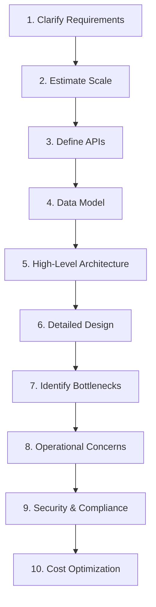
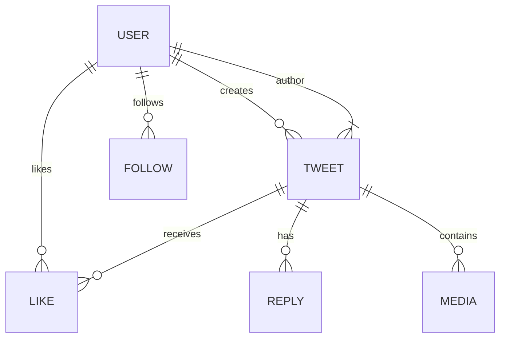
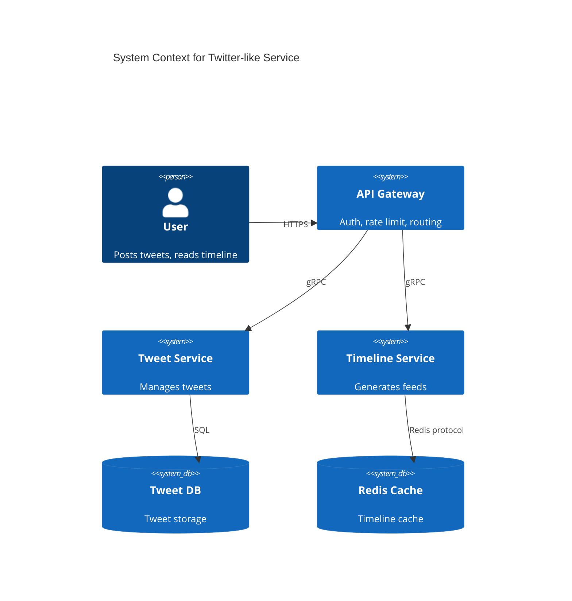
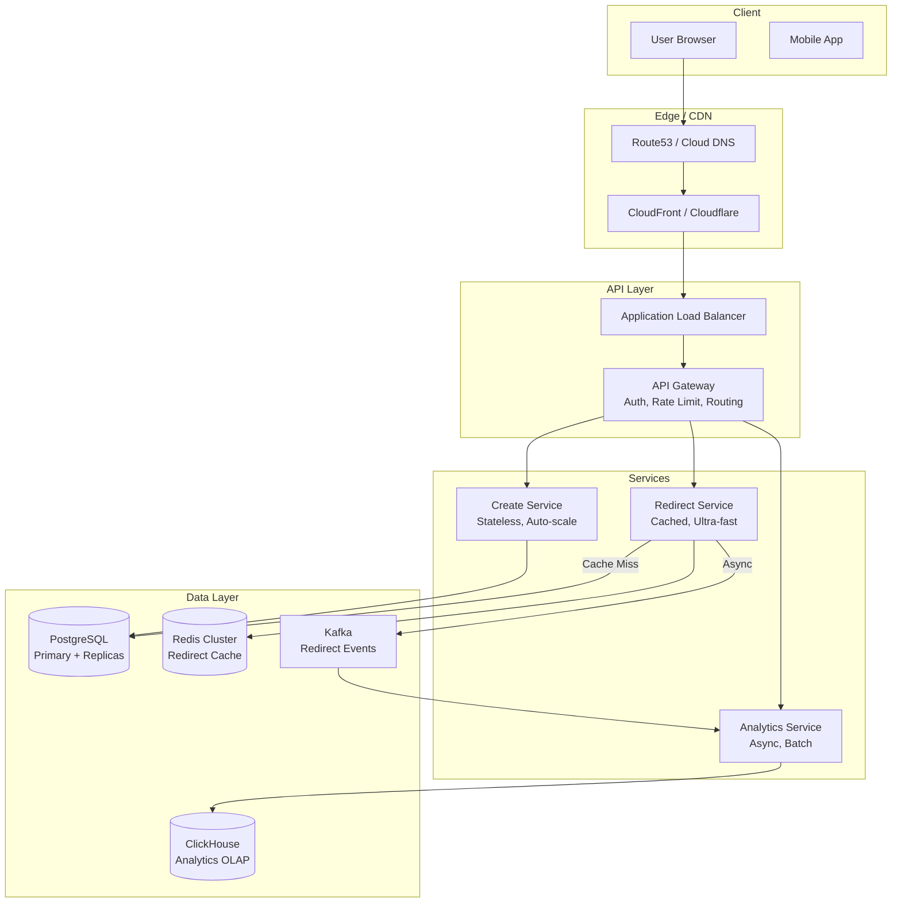

# Chapter 1: System Design Fundamentals

> **Estimated Time:** 4–6 hours | **Prerequisites:** Basic programming, Linux, networking<br>
> **Last reviewed:** 2026-08-31 | **Level:** Foundation → applied → production judgment

---

## 🎯 Learning Objectives

By the end of this chapter, you will be able to:

1. **Define system design** and distinguish it from software design
2. **Apply the system design process** from requirements to deployment
3. **Identify and analyze** functional and non-functional requirements
4. **Estimate system capacity** using back-of-the-envelope calculations
5. **Create architecture diagrams** using standard notation
6. **Evaluate trade-offs** using structured decision frameworks
7. **Connect reliability, security, operability, and cost** to architecture decisions

---

## 1.1 What Is System Design?

### Definition

**System Design** is the process of defining the architecture, components, modules, interfaces, and data for a system to satisfy specified requirements. It bridges the gap between *business needs* and *technical implementation*.

```
┌─────────────────────────────────────────────────────────────────┐
│                    SYSTEM DESIGN SCOPE                          │
├─────────────────────────────────────────────────────────────────┤
│  ┌──────────────┐  ┌──────────────┐  ┌──────────────┐          │
│  │   HIGH-LEVEL │  │   LOW-LEVEL  │  │  OPERATIONAL │          │
│  │  ARCHITECTURE│  │   DESIGN     │  │   DESIGN     │          │
│  ├──────────────┤  ├──────────────┤  ├──────────────┤          │
│  │ • Services   │  │ • APIs       │  │ • Deployment │          │
│  │ • Data flow  │  │ • Schemas    │  │ • Monitoring │          │
│  │ • Protocols  │  │ • Algorithms │  │ • Scaling    │          │
│  │ • Boundaries │  │ • Patterns   │  │ • Recovery   │          │
│  └──────────────┘  └──────────────┘  └──────────────┘          │
└─────────────────────────────────────────────────────────────────┘
```

### System Design vs. Software Design

| Aspect | Software Design | System Design |
|--------|-----------------|---------------|
| **Scope** | Single application/module | Multiple services, infrastructure |
| **Focus** | Code structure, patterns | Architecture, scalability, reliability |
| **Concerns** | Classes, functions, modules | Services, networks, databases, queues |
| **Scale** | Thousands of lines | Millions of requests, petabytes |
| **Team** | 1-10 developers | Cross-functional teams |
| **Lifecycle** | Code → Test → Deploy | Design → Provision → Operate → Evolve |

---

## 1.2 The System Design Process

### Step-by-Step Framework



### 1. Clarify Requirements

**Functional Requirements** — What the system *does*:
- User registration, login, profile management
- Post creation, feed generation, comments
- Real-time messaging, notifications
- Search, filtering, recommendations

**Non-Functional Requirements (NFRs)** — How the system *behaves*:

| Category | Metrics | Example Targets |
|----------|---------|-----------------|
| **Availability** | SLI, SLO, error budget | 99.99% (about 52.6 min/year unavailable) |
| **Latency** | p50, p95, p99 | p99 < 200ms for API calls |
| **Throughput** | QPS, TPS, MB/s | 100K reads/s, 10K writes/s |
| **Consistency** | Strong, eventual, causal | Strong for payments, eventual for feeds |
| **Durability** | Probability of retaining an object | Define per data class and failure model |
| **Scalability** | Horizontal/vertical limits | Auto-scale to 10x traffic |
| **Security** | Identity, encryption, audit | TLS, least privilege, traceable administrative actions |

> **💡 Pro Tip**: Always ask clarifying questions! "How many daily active users?" "What's the read/write ratio?" "Any regulatory requirements?"

### 1.2.1 Requirements Gathering — Stakeholder Interview Template

System design starts with understanding the problem space. Use this structured approach:

| Stakeholder | Key Questions | Expected Output |
|-------------|---------------|-----------------|
| **Product Manager** | What problem are we solving? Who are the users? What's the MVP scope? What are success metrics? | Problem statement, user personas, MVP features, KPIs |
| **Engineering Lead** | What's the current architecture? Any technical constraints? Team expertise? | Technical boundaries, team capacity, existing systems |
| **Security/Compliance** | Data classification? Regulatory requirements (GDPR, PCI, HIPAA)? Audit needs? | Data handling rules, compliance checklist |
| **Operations/SRE** | Availability targets? Incident response process? On-call expectations? | SLOs, runbook requirements, observability needs |
| **Finance/Business** | Budget constraints? Cost per transaction targets? Growth projections? | Cost model, capacity planning horizon |

**Example: URL Shortener Stakeholder Answers**

| Question | Answer |
|----------|--------|
| Who are the users? | Public (anonymous) + registered users for analytics |
| DAU/MAU targets? | 10M DAU, 50M MAU at year 1 |
| Read/Write ratio? | 100:1 (redirects vs creation) |
| Custom aliases? | Yes, for registered users |
| Analytics needed? | Click count, referrer, geo, device |
| Retention policy? | Links never expire; analytics 13 months |
| Geographic distribution? | Global, latency < 200ms p99 |
| Compliance? | GDPR (EU), no PII in URLs |
| Budget? | $50K/month infrastructure at scale |

### 2. Estimate Scale — Back-of-the-Envelope Calculations

#### Power of Two Reference

| Power | Value | Approximation |
|-------|-------|---------------|
| 2¹⁰ | 1,024 | 1 thousand (1K) |
| 2²⁰ | 1,048,576 | 1 million (1M) |
| 2³⁰ | 1,073,741,824 | 1 billion (1B) |
| 2⁴⁰ | 1,099,511,627,776 | 1 trillion (1T) |

#### Illustrative Latency Orders of Magnitude

These values are mental-model aids, not capacity-test results. Hardware,
topology, payload size, queueing, and software overhead can change them by
orders of magnitude. Benchmark the actual deployment before making an SLO or
capacity decision.

| Operation | Time | Notes |
|-----------|------|-------|
| L1 cache reference | 0.5 ns | ~1 CPU cycle |
| L2 cache reference | 7 ns | |
| L3 cache reference | 20 ns | |
| Main memory reference | 100 ns | |
| Compress 1KB with Zstd | 10 µs | |
| Send 1KB over 1 Gbps network | 10 µs | |
| Read 1MB from SSD | 150 µs | |
| Round trip in same datacenter | 0.5 ms | |
| Round trip across continents | 150 ms | |

#### Example: Twitter-like Service Estimation

```
Assumptions:
- 300M monthly active users (MAU)
- 50% DAU = 150M daily active users
- Each user: 10 tweets/day, 200 timeline reads/day
- Tweet: 280 chars + metadata ≈ 500 bytes
- Media: 10% tweets with images (500KB avg)

Calculations:
┌────────────────────────────────────────────────────────┐
│ WRITE PATH                                             │
├────────────────────────────────────────────────────────┤
│ Tweets/day = 150M × 10 = 1.5B tweets/day               │
│ Write QPS = 1.5B / 86400s ≈ 17,361 writes/sec          │
│ Peak factor (3x) = ~52K writes/sec                     │
│ Data/day = 1.5B × 500B = 750 GB/day                    │
│ Media/day = 150M × 500KB = 75 TB/day                   │
├────────────────────────────────────────────────────────┤
│ READ PATH                                              │
├────────────────────────────────────────────────────────┤
│ Reads/day = 150M × 200 = 30B reads/day                 │
│ Read QPS = 30B / 86400s ≈ 347K reads/sec               │
│ Peak factor (3x) = ~1M reads/sec                       │
└────────────────────────────────────────────────────────┘

Storage (1 year):
- Tweets: 750 GB × 365 ≈ 274 TB
- Media: 75 TB × 365 ≈ 27 PB
- With replication (3x): ~822 TB tweets, ~82 PB media
```

### 3. Define APIs

**API Design Principles**:

```yaml
# RESTful Example
POST   /api/v1/tweets              # Create tweet
GET    /api/v1/tweets/{id}         # Get tweet
PATCH  /api/v1/tweets/{id}         # Update tweet
DELETE /api/v1/tweets/{id}         # Delete tweet
GET    /api/v1/users/{id}/tweets   # User's tweets
GET    /api/v1/timeline            # Home timeline (cursor pagination)

# gRPC Example (for internal services)
service TweetService {
  rpc CreateTweet(CreateTweetRequest) returns (Tweet);
  rpc GetTweet(GetTweetRequest) returns (Tweet);
  rpc ListTweets(ListTweetsRequest) returns (stream Tweet);
  rpc DeleteTweet(DeleteTweetRequest) returns (google.protobuf.Empty);
}
```

**API Best Practices**:
- **Versioning**: URL path (`/v1/`) or header (`Accept: application/vnd.api.v1+json`)
- **Pagination**: Cursor-based for large datasets, offset for small
- **Rate limiting**: Token bucket, return `429` with `Retry-After`
- **Idempotency**: define retry semantics explicitly; use an idempotency key for operations such as payment or order creation
- **Observability**: Request IDs, structured logging, distributed tracing

### 4. Data Model

**Entity Relationship Diagram** (Twitter example):



**Schema Design Decisions**:

| Decision | Options | Trade-offs |
|----------|---------|------------|
| **Primary Key** | UUID, UUIDv7, ULID, sequence | UUIDv7 is standardized and time-ordered; sequences are compact but require an allocation strategy |
| **Timestamps** | `created_at`, `updated_at` | Store an unambiguous instant (normally UTC); define display timezone separately |
| **Soft Deletes** | `deleted_at` vs hard delete | Soft: recovery, audit; Hard: storage, GDPR |
| **Denormalization** | Embedded vs referenced | Embed: read performance; Reference: consistency, storage |

---

## 1.3 High-Level Architecture Patterns

### Monolithic Architecture

```
┌────────────────────────────────────────────┐
│           MONOLITH                         │
│  ┌──────┐ ┌──────┐ ┌──────┐ ┌──────┐      │
│  │ Auth │ │ User │ │ Tweet│ │ Feed │      │
│  │ Mod  │ │ Mod  │ │ Mod  │ │ Mod  │      │
│  └──────┘ └──────┘ └──────┘ └──────┘      │
│         │    │    │    │                   │
│         └────┴────┴────┘                   │
│              ▼                              │
│        ┌──────────┐                         │
│        │ Database │                         │
│        └──────────┘                         │
└────────────────────────────────────────────┘
```

| Pros | Cons |
|------|------|
| Simple development, testing, deployment | Coarse-grained scaling can waste capacity |
| Local transactions are straightforward | A single deployment can increase blast radius without redundancy |
| Low latency (in-process calls) | Technology lock-in |
| Easy debugging | Large team coordination overhead |

### Microservices Architecture

```
┌─────────────────────────────────────────────────────────────┐
│                      API GATEWAY                            │
│                    (Auth, Rate Limit, Route)                │
└─────────────────────────────────────────────────────────────┘
          │           │           │           │
    ┌─────▼────┐ ┌────▼────┐ ┌────▼────┐ ┌───▼────┐
    │  Auth   │ │  User   │ │  Tweet  │ │ Feed   │
    │ Service │ │ Service │ │ Service │ │ Service│
    └────┬────┘ └────┬────┘ └────┬────┘ └────┬────┘
         │           │           │           │
    ┌────▼────┐ ┌────▼────┐ ┌────▼────┐ ┌────▼────┐
    │Auth DB  │ │User DB  │ │Tweet DB │ │Feed DB  │
    └─────────┘ └─────────┘ └─────────┘ └─────────┘
         │           │           │           │
         └───────────┴───────────┴───────────┘
                         │
              ┌──────────▼──────────┐
              │   MESSAGE BROKER    │
              │  (Kafka, RabbitMQ)  │
              └─────────────────────┘
```

| Pros | Cons |
|------|------|
| Independent deployability | Distributed system complexity |
| Technology diversity | Network latency, failures |
| Team autonomy | Data consistency challenges |
| Granular scaling | Operational overhead |

### Service-Oriented Architecture (SOA)

Middle ground — coarser-grained services, shared infrastructure (ESB).

### Modular Monolith

```
┌────────────────────────────────────────────┐
│         MODULAR MONOLITH                   │
│  ┌────────┐ ┌────────┐ ┌────────┐         │
│  │ Auth   │ │ User   │ │ Tweet  │  ...    │
│  │ Module │ │ Module │ │ Module │         │
│  └────┬───┘ └────┬───┘ └────┬───┘         │
│       │          │          │              │
│       └──────────┼──────────┘              │
│                  ▼                          │
│         ┌────────────────┐                  │
│         │  Shared Kernel │                  │
│         │  (Domain Model)│                  │
│         └───────┬────────┘                  │
│                 ▼                           │
│         ┌────────────────┐                  │
│         │   Database     │                  │
│         │ (Single Schema)│                  │
│         └────────────────┘                  │
└────────────────────────────────────────────┘
```

> **Default starting point:** Prefer a well-modularized deployment when one
> team can own and scale it. Extract a service only when an independently
> deployable boundary solves a measured scaling, reliability, security, or
> organizational constraint.

---

## 1.4 Key Design Principles

### SOLID Principles (Applied to Systems)

| Principle | System Design Application |
|-----------|---------------------------|
| **Single Responsibility** | Each service owns one business capability |
| **Open/Closed** | Extend via new services, not modifying existing |
| **Liskov Substitution** | API versions backward compatible |
| **Interface Segregation** | Fine-grained APIs per consumer need |
| **Dependency Inversion** | Services depend on abstractions (events, interfaces) |

### CAP Theorem

```
        CONSISTENCY
           /\
          /  \
         /    \
    AVAILABILITY  PARTITION TOLERANCE
       (AP)          (CP)
```

**In practice:** CAP describes behavior during a network partition. For a
particular operation, the system must either reject or delay some requests to
preserve a consistency guarantee, or accept requests that may observe or
create divergent state. CAP is not a permanent label for an entire product;
behavior can differ by operation, configuration, and failure mode.

> **Reality**: Most systems need **both** at different times. Use **tunable consistency** (Cassandra, Cosmos DB) or **hybrid approaches** (strong for payments, eventual for feeds).

### PACELC Theorem

Extends CAP: **P**artition → **A**vailability vs **C**onsistency; **E**lse **L**atency vs **C**onsistency

| System | Classification | Notes |
|--------|----------------|-------|
| Dynamo-style design | PA/EL | Favors availability during partitions and low latency otherwise |
| Majority-quorum design | PC/EC | Preserves a consistency guarantee but may reject minority-side operations |
| Synchronous cross-region replication | PC/EC | Consistency increases steady-state write latency |
| Asynchronous cross-region replication | PA/EL | Lower write latency, with lag and conflict trade-offs |

> Product names alone do not determine a PACELC classification. Read/write
> concern, quorum, replication topology, and client routing all matter.

### BASE vs ACID

| ACID (Traditional) | BASE (Distributed) |
|-------------------|-------------------|
| **A**tomicity | **B**asically **A**vailable |
| **C**onsistency | **S**oft state |
| **I**solation | **E**ventual consistency |
| **D**urability | |

### Design for Failure

```
┌─────────────────────────────────────────────────────────────┐
│                    FAILURE MODES                            │
├─────────────────────────────────────────────────────────────┤
│  □ Network partition    □ Disk failure     □ CPU overload  │
│  □ Memory leak          □ GC pause         □ Clock skew    │
│  □ Dependency timeout   □ Cascading failure□ Byzantine     │
│  □ Config error         □ Deployment bug   □ Human error   │
└─────────────────────────────────────────────────────────────┘

MITIGATION PATTERNS:
┌─────────────────────────────────────────────────────────────┐
│  ✓ Timeouts & Retries (exponential backoff + jitter)       │
│  ✓ Circuit Breakers (fail fast, prevent cascade)           │
│  ✓ Bulkheads (isolate failures, limit blast radius)        │
│  ✓ Idempotency (safe retries)                              │
│  ✓ Graceful Degradation (reduced functionality vs down)    │
│  ✓ Health Checks (liveness, readiness, startup)            │
│  ✓ Chaos Engineering (proactive failure injection)         │
└─────────────────────────────────────────────────────────────┘
```

---

## 1.5 Architecture Documentation

### Architecture Decision Records (ADRs)

```markdown
# ADR 001: Use Event Sourcing for Audit Trail

## Status: Accepted

## Context
Financial transactions require complete audit trail with
temporal queries. Current CRUD approach loses history.

## Decision
Adopt Event Sourcing for Transaction Service:
- Store events in append-only log (Kafka/EventStoreDB)
- Project read models for queries
- Replay for new projections

## Consequences
+ Complete history, temporal queries, debugging
+ Easy to add new read models
- Increased complexity, eventual consistency
- Event schema evolution required
- Storage growth (mitigate: snapshots, compaction)
```

### C4 Model for Diagrams

**Level 1: System Context**


**Level 2: Container Diagram** — Services, databases, message brokers
**Level 3: Component Diagram** — Internal structure of a service
**Level 4: Code Diagram** — Classes, functions (generated from code)

---

## 1.6 Trade-off Analysis Framework

### Decision Matrix Template

| Criteria | Weight | Option A: Microservices | Option B: Modular Monolith | Option C: Serverless |
|----------|--------|------------------------|---------------------------|---------------------|
| Time to Market | 25% | 6 | 9 | 8 |
| Operational Complexity | 20% | 4 | 8 | 7 |
| Scaling Granularity | 15% | 9 | 5 | 10 |
| Team Autonomy | 15% | 9 | 5 | 6 |
| Debugging/Observability | 10% | 5 | 8 | 6 |
| Cost (at scale) | 10% | 6 | 7 | 5 |
| **Weighted Score** | **100%** | **6.1** | **6.9** | **6.9** |

> **Rule**: No perfect architecture exists — only trade-offs aligned with *current* context.

---

## 1.7 Threat Modeling with STRIDE

Integrate security early in the design process. Apply STRIDE per component:

| Threat | Description | Mitigation |
|--------|-------------|------------|
| **Spoofing** | Attacker pretends to be another user/service | mTLS, JWT verification, mutual authentication |
| **Tampering** | Unauthorized data modification | Authorization, integrity checks, signed payloads, append-only audit evidence |
| **Repudiation** | User denies action | Audit logs, non-repudiation signatures |
| **Information Disclosure** | Data exposed to unauthorized parties | Encryption at rest/transit, field-level encryption |
| **Denial of Service** | Service unavailable | Rate limiting, circuit breakers, auto-scaling |
| **Elevation of Privilege** | Gain unauthorized permissions | RBAC, least privilege, regular access reviews |

**Example: URL Shortener Threat Model**

```
Component: Redirect Service
├── Spoofing:  Attacker creates fake short URLs → Validate destination allowlist
├── Tampering:  Modify redirect target in DB     → Immutable redirect records, audit log
├── Repudiation: Deny creating malicious link   → Signed creation events, audit trail
├── Info Disc:  Enumerate all short URLs        → Rate limit, random slug (not sequential)
├── DoS:        Flood redirect endpoint         → CDN caching, rate limit per IP/key
└── Elevation:  Admin panel access              → MFA, IP allowlist, session timeout
```

---

## 1.8 Cost Estimation Framework

Estimate infrastructure cost early to validate business viability.

### Monthly Cost Model Template

Cloud prices vary by provider, region, commitment, data path, and date. Use
current provider calculators for a decision; the table below teaches the
model and deliberately avoids pretending that example prices are durable.

| Cost driver | Quantity model | Questions that change the result |
|-------------|----------------|----------------------------------|
| Compute | instance-hours or vCPU-seconds | Baseline, peak, utilization, commitments, failover reserve |
| Database | node-hours + storage + I/O + backups | HA topology, IOPS, retention, replicas, licenses |
| Object storage | GB-month + requests + retrieval | Tiering, replication, lifecycle, request mix |
| Network | ingress + inter-zone + inter-region + egress | Cache hit rate, client geography, replication path |
| Messaging | broker-hours or operations + retained bytes | Throughput, partitions, replication, retention |
| Observability | ingested and retained bytes + metric series + spans | Sampling, cardinality, retention, query volume |
| Operations | engineering and on-call time | Managed versus self-operated, upgrades, incidents |

```text
monthly_cost = fixed_capacity
             + workload_units × unit_price
             + storage_gb_month × storage_price
             + billable_network_gb × network_price
             + operations_cost
```

> **Tip:** Model normal, expected-peak, and failure scenarios separately.
> Headroom is a measured risk decision—not a universal 3× multiplier.

---

## 1.9 Bottleneck Analysis & Identification

Systematic approach to find and eliminate bottlenecks:

### Latency Budget Breakdown

```
Target: p99 < 200ms

Budget Allocation:
┌─────────────────────┬──────────┬────────────────────────────────┐
│ Component           │ Budget   │ Notes                          │
├─────────────────────┼──────────┼────────────────────────────────┤
│ DNS Resolution      │   5 ms   │ Route 53 / Cloud DNS           │
│ TLS Handshake       │  10 ms   │ Session resumption, 0-RTT      │
│ Load Balancer       │   2 ms   │ ALB / Cloud Load Balancing     │
│ API Gateway         │   5 ms   │ Auth, rate limit, routing      │
│ Service Logic       │  50 ms   │ Business logic, validation     │
│ Cache (Redis)       │   3 ms   │ Local / cross-AZ               │
│ Database (Primary)  │  30 ms   │ Read queries, connection pool  │
│ Database (Replica)  │  15 ms   │ Async replication lag < 50ms   │
│ External API        │  50 ms   │ Payment, email, 3rd party      │
│ Queue Processing    │  20 ms   │ Async, not in critical path    │
│ Network RTT (intra) │  10 ms   │ Same region, cross-AZ          │
├─────────────────────┼──────────┼────────────────────────────────┤
│ **Total (sync)**    │ **165ms**│ Leaves 35ms headroom           │
└─────────────────────┴──────────┴────────────────────────────────┘
```

### Bottleneck Detection Checklist

| Signal | Tool | Action |
|--------|------|--------|
| High p99 latency, low p50 | Percentile analysis | Check for outliers, GC pauses, lock contention |
| CPU saturation with queueing or SLO impact | Platform metrics / Prometheus | Profile first; then optimize or scale the constrained resource |
| Database connections exhausted | DB metrics | Increase pool, add read replicas, optimize queries |
| Falling cache hit ratio with origin saturation | Cache and origin metrics | Segment by key class; inspect TTL, eviction, and workload changes |
| Queue depth growing | Kafka consumer lag / SQS | Scale consumers, optimize processing |
| Error rate spike | Application logs | Check dependency health, circuit breakers |
| Network retransmits | `netstat -s`, `ss -ti` | MTU issues, congestion, buffer bloat |

### Common Bottleneck Patterns

| Pattern | Symptom | Fix |
|---------|---------|-----|
| **N+1 Query** | Linear latency with result count | Batch load, DataLoader, join fetch |
| **Lock Contention** | Latency spikes under load | Reduce critical section, sharding |
| **Hot Partition** | Uneven load on one shard | Better partition key, consistent hashing |
| **Thundering Herd** | Cache miss storm | Request coalescing, stale-while-revalidate |
| **Connection Exhaustion** | "Too many connections" errors | Pool sizing, proxy (PgBouncer), async |
| **Synchronous Chaining** | Latency = sum of calls | Parallelize, async patterns, fan-out |

---

## 1.10 Detailed Worked Example: URL Shortener

Complete end-to-end design walkthrough.

### Problem Statement

Build a URL shortener (bit.ly clone) supporting:
- Anonymous public shortening
- Registered users: custom aliases, analytics dashboard
- Global access, p99 < 200ms redirect
- 10M DAU, 50 new links and 2,500 redirects per active user per day
- Links never expire; analytics retained 13 months
- Budget: ~$50K/month at year 1 scale

### Step 1: Clarify Requirements (from stakeholders)

| Requirement | Detail |
|-------------|--------|
| **Functional** | Create short URL, redirect, custom alias, analytics, delete own URLs |
| **Non-Functional** | 99.99% availability, p99 < 200ms, global < 100ms, GDPR compliant |
| **Scale (Year 1)** | 500M writes/day, 25B redirects/day; no media is stored |

### Step 2: Scale Estimation

```
WRITE PATH:
- 10M DAU × 50 URLs/day = 500M writes/day
- Write QPS = 500M / 86,400 ≈ 5,787 writes/sec
- Illustrative peak factor (3x) = ~17.4K writes/sec
- Data/write = 20 bytes (slug) + 500 bytes (metadata) ≈ 520 bytes
- Write throughput = 5,787 × 520B ≈ 3.0 MB/s

READ PATH:
- 10M DAU × 2,500 redirects/day = 25B reads/day
- Read QPS = 25B / 86,400 ≈ 289K reads/sec
- Illustrative peak factor (3x) = ~868K reads/sec
- Redirect response = 300 bytes (headers + body)

STORAGE (13 months):
- URL records: 500M/day × 520B × 390 days ≈ 101 TB logical
- Analytics events: 25B/day × 200B × 390 days ≈ 1.95 PB logical
- Raw logical total: ~2.05 PB before compression, indexes, replication, and backups
- At this scale, aggregate events early and define whether raw events truly need 13-month retention
```

### Step 3: API Design

```yaml
# Public API (REST)
POST   /api/v1/urls                    # Create short URL (anon or auth)
GET    /{slug}                         # Redirect (highest throughput)
GET    /api/v1/urls/{slug}             # Get URL metadata (auth)
GET    /api/v1/users/me/urls           # List user's URLs (paginated)
DELETE /api/v1/urls/{slug}             # Delete own URL (auth)
GET    /api/v1/urls/{slug}/analytics   # Analytics (auth, paginated)

# Internal gRPC (for analytics pipeline)
service UrlService {
  rpc CreateUrl(CreateUrlRequest) returns (Url);
  rpc GetUrl(GetUrlRequest) returns (Url);
  rpc RecordRedirect(RedirectEvent) returns (google.protobuf.Empty);
}
```

**Idempotency:** The client sends an `Idempotency-Key` for `POST`. The server
atomically binds the key to the authenticated caller, request fingerprint,
status, and response for a documented retry window. Reuse with a different
payload is rejected.

**Rate Limiting**:
- Creation: separate anonymous, authenticated, and API-client quotas
- Redirect: abuse controls at the edge; avoid a low fixed per-IP limit that blocks shared networks
- Token bucket, return `429` with `Retry-After`

### Step 4: Data Model

```sql
-- PostgreSQL (Primary)
CREATE TABLE urls (
    id              BIGSERIAL PRIMARY KEY,
    slug            VARCHAR(16) NOT NULL UNIQUE,  -- base62 encoded
    destination_url TEXT NOT NULL,
    user_id         BIGINT REFERENCES users(id),  -- NULL for anonymous
    custom_alias    BOOLEAN DEFAULT FALSE,
    created_at      TIMESTAMPTZ DEFAULT NOW(),
    deleted_at      TIMESTAMPTZ
);

CREATE INDEX idx_urls_user_created ON urls(user_id, created_at DESC)
    WHERE user_id IS NOT NULL;

-- Analytics (ClickHouse / TimescaleDB / BigQuery)
CREATE TABLE url_analytics (
    slug            VARCHAR(16) NOT NULL,
    event_time      TIMESTAMPTZ NOT NULL,
    referrer        TEXT,
    user_agent      TEXT,
    country         CHAR(2),
    device_type     VARCHAR(20),
    ip_hash         BYTEA  -- hashed, not raw IP
);
-- Partition by month, order by (slug, event_time)
```

### Step 5: High-Level Architecture



### Step 6: Detailed Component Design

#### Redirect Service (Critical Path - p99 < 50ms)

```
┌─────────────────────────────────────────────────────────┐
│                   REDIRECT SERVICE                       │
├─────────────────────────────────────────────────────────┤
│  1. Receive GET /{slug}                                  │
│  2. Check Redis: GET slug → destination_url              │
│     ├─ HIT: 302 Redirect + async emit to Kafka          │
│     └─ MISS:                                             │
│         a. Query PostgreSQL: SELECT destination_url      │
│            FROM urls WHERE slug = ? AND deleted_at IS NULL│
│         b. If found: SET Redis (TTL: 24h) + 302 Redirect │
│         c. If not found: 404 Not Found                   │
│         d. Async emit redirect event to Kafka            │
│  3. Response headers:                                    │
│     - Cache-Control: public, max-age=300                  │
│     - X-Request-ID: {uuid}                               │
└─────────────────────────────────────────────────────────┘
```

**Optimizations**:
- Negative caching for unknown slugs with a short TTL
- Request coalescing to protect the database during hot misses
- Connection-pool sizing derived from concurrency and database capacity
- Regional deployment only where latency SLOs and measured demand justify it

#### Create Service (Write Path)

```
┌─────────────────────────────────────────────────────────┐
│                    CREATE SERVICE                        │
├─────────────────────────────────────────────────────────┤
│  1. Validate Idempotency-Key (Redis, 24hr TTL)           │
│     ├─ EXISTS: Return cached response                    │
│     └─ NEW: Continue                                     │
│  2. Validate URL syntax and allowed schemes; do not fetch│
│     the destination from this request path               │
│  3. Generate slug:                                       │
│     ├─ Custom alias? Check uniqueness (DB unique index)  │
│     └─ Auto: Base62 encode of Snowflake ID               │
│  4. INSERT INTO urls (slug, destination_url, user_id...) │
│  5. Invalidate Redis cache for slug (if custom alias)    │
│  6. Store Idempotency-Key → response mapping             │
│  7. Return 201 Created + short URL                       │
└─────────────────────────────────────────────────────────┘
```

### Step 7: Trade-off Analysis

| Decision | Options | Chosen | Rationale |
|----------|---------|--------|-----------|
| **Slug Generation** | Random vs Sequential vs Snowflake | Snowflake (Base62) | Sortable, distributed, no coordination |
| **Redirect Cache** | Redis vs CDN Edge | Both | Redis for dynamic, CDN for static |
| **Analytics Storage** | PostgreSQL vs ClickHouse vs BigQuery | ClickHouse | Columnar, compression, fast aggregations |
| **Async Processing** | Kafka vs managed queue/stream | Kafka | Retained event log and replay; consumers remain idempotent |
| **Architecture** | Monolith vs Microservices | Modular Monolith → Services | Start simple, extract redirect path first |

### Step 8: Failure Modes & Mitigations

| Failure | Detection | Mitigation | Recovery |
|---------|-----------|------------|----------|
| Redis unavailable | Error rate and origin-load increase | Bounded fallback, request coalescing, load shedding | Restore cache and warm only proven hot keys |
| DB primary unavailable | Write errors and failed health checks | Stop writes or queue only operations that tolerate delay | Promote a verified replica; measure actual RTO |
| Kafka broker down | Consumer lag, ISR shrink | ISR reassignment, min.insync.replicas | Auto-rebalance |
| Slug collision | Unique constraint violation | Retry with new slug (max 3) | Application-level retry |
| Analytics pipeline lag | Consumer lag > 10min | Scale consumers, batch size | Backfill from Kafka retention |

### Step 9: Security Considerations

- **Destination safety:** Accept only documented schemes, normalize safely, and scan or block known malicious destinations. SSRF controls become necessary if a preview, scanner, or unfurl worker fetches the URL.
- **Product semantics:** A URL shortener is intentionally an external redirect service. Apply abuse detection and user warnings instead of describing every external destination as an open-redirect defect.
- **GDPR**: IP hashing in analytics, deletion API for user data, no PII in URLs
- **Rate Limiting**: Per-IP + per-user + per-API-key tiers
- **Audit Log**: All create/delete/admin actions logged to immutable store

### Step 10: Cost Model at Year 1 Scale

Do not treat a short instance list as a defensible estimate for a multi-petabyte,
globally distributed workload. Build the estimate from measured or assumed
billable units:

| Driver | Required input | Validation method |
|--------|----------------|-------------------|
| Redirect compute | 868K peak requests/s, CPU/request, target utilization | Load test one instance, then include failure headroom |
| URL data | ~101 TB logical plus indexes and replicas | Measure representative rows and index amplification |
| Analytics | event sampling/aggregation policy and retained bytes | Prototype compression and representative queries |
| Cache | hot-set size, value size, hit-rate target | Replay production-like popularity distribution |
| Network | response bytes, cache hit rate, geography | Model every billable data path by region |
| Operations | on-call, upgrades, incident and compliance work | Estimate team ownership and managed-service boundaries |

Record the provider, region, price date, discounts, taxes, and excluded costs
next to the resulting estimate. Recalculate before an approval decision.

---

## 1.11 Additional Real-World Case Studies

### E-Commerce Checkout System

**Requirements**:
- 10K orders/min peak (Black Friday)
- Strong consistency for inventory/payment
- Idempotent: duplicate clicks = single order
- Multi-region: US-East, EU-West, AP-Southeast

**Architecture**:
```
API Gateway → Order Service → Payment Service → Inventory Service
                    ↓              ↓                ↓
              Order DB        Payment Gateway    Inventory DB
                    ↓                                    ↓
              Outbox Table ─────────────→ Kafka → Notification Service
```

**Key Patterns**:
- **Saga Orchestration**: Order → Payment → Inventory → Confirm (compensate on failure)
- **Idempotency Keys**: Client-generated, stored with order
- **Inventory Reservation**: Pessimistic lock with TTL (10 min)
- **Read Models**: Separate read replicas for order history

### Payment Processing System

**Requirements**:
- 50K TPS peak
- Effectively-once business outcome: retries must not create a second charge
- PCI DSS Level 1 compliance
- < 500ms p99 end-to-end

**Architecture**:
```
Client → API Gateway → Payment Gateway (Tokenize) → Processor Network
                                        ↓
                              Ledger Service (Event Sourcing)
                                        ↓
                              Reconciliation (Batch, Daily)
```

**Key Patterns**:
- **Tokenization**: Never store PAN; use network tokens
- **Idempotency**: Idempotency-Key per transaction attempt
- **State Machine**: AUTHORIZED → CAPTURED → SETTLED / REFUNDED / VOIDED
- **Dual-write Prevention**: Outbox pattern for ledger + external notifications

### Notification Service (Global)

**Requirements**:
- Email, Push, SMS, Webhook
- 100M notifications/day
- Provider failover (SendGrid → SES → Mailgun)
- Delivery tracking, retry with backoff

**Architecture**:
```
Event Source → Notification API → Queue (Priority) → Workers
                                                    ↓
                                           Provider Router
                                                    ↓
                              ┌─────────┬─────────┴─────────┐
                              ▼         ▼                   ▼
                           Email      Push                  SMS
                        (SendGrid)  (FCM/APNs)           (Twilio)
                              ↓         ↓                   ↓
                        Dead Letter Queue (per provider, per type)
```

**Key Patterns**:
- **Priority Queues**: Transactional > Marketing > Bulk
- **Dead Letter Handling**: Max 3 retries, exponential backoff, DLQ alerting
- **Provider Abstraction**: Interface per channel, swap without code change
- **Deduplication**: Message-ID per notification, idempotent provider APIs

---

## 1.12 Exercises

### Exercise 1 — Foundation: Requirements Clarification
**Scenario**: Design a URL shortener (bit.ly clone).

**Questions to ask**:
1. _________________________________________________
2. _________________________________________________
3. _________________________________________________
4. _________________________________________________
5. _________________________________________________

### Exercise 2 — Foundation: Scale Estimation
**Given:** 100M DAU, each creates 5 short URLs/day and performs 50 redirects/day.
Each URL record averages 520 bytes before indexes and replication.

**Calculate:** Average and peak write/read QPS, logical storage after one year,
and network throughput. State and justify your peak factor, response size, index
overhead, replication factor, and retention assumptions.

### Exercise 3 — Applied: API Design
Design REST + gRPC APIs for the URL shortener. Include:
- Create short URL
- Redirect (with analytics)
- List user's URLs
- Delete URL

### Exercise 4 — Advanced: Architecture Choice
For the URL shortener, choose between:
- Monolith
- Modular Monolith
- Microservices
- Serverless (Cloud Functions + DynamoDB)

**Justify your choice** with a decision matrix.

---

## 1.13 Further Reading

### Books
- *Designing Data-Intensive Applications* — Martin Kleppmann (Ch. 1, 2, 3)
- *System Design Interview* — Alex Xu (Vol 1 & 2)
- *Building Microservices* — Sam Newman
- *Fundamentals of Software Architecture* — Mark Richards & Neal Ford

### Papers
- [CAP Theorem](https://www.cs.berkeley.edu/~brewer/cs262b-2004/PODC-keynote.pdf) — Eric Brewer
- [PACELC](http://www.vldb.org/pvldb/vol3/p1441-abadi.pdf) — Daniel Abadi
- [Dynamo: Amazon's Highly Available Key-value Store](https://www.allthingsdistributed.com/files/amazon-dynamo-sosp2007.pdf)
- [Bigtable: A Distributed Storage System](https://static.googleusercontent.com/media/research.google.com/en//archive/bigtable-osdi06.pdf)

### Resources
- [System Design Primer](https://github.com/donnemartin/system-design-primer)
- [Awesome System Design](https://github.com/ashishps1/awesome-system-design-resources)
- [Architecture Decision Records](https://adr.github.io/)
- [RFC 9110: HTTP Semantics](https://www.rfc-editor.org/rfc/rfc9110.html)
- [RFC 9562: Universally Unique IDentifiers](https://www.rfc-editor.org/rfc/rfc9562.html)
- [C4 Model](https://c4model.com/)
- [AWS Well-Architected Framework](https://docs.aws.amazon.com/wellarchitected/latest/framework/welcome.html)

---

## 1.14 Summary Checklist

- [ ] Can distinguish system design from software design
- [ ] Can apply the 10-step design process
- [ ] Can estimate scale with back-of-the-envelope math (QPS, storage, bandwidth, latency)
- [ ] Can use latency orders of magnitude without treating them as benchmarks
- [ ] Can design REST and gRPC APIs with versioning, pagination, idempotency, rate limiting
- [ ] Understand monolith vs microservices vs modular monolith trade-offs
- [ ] Can apply CAP/PACELC to real decisions
- [ ] Know key failure patterns and mitigations (timeouts, circuit breakers, bulkheads, idempotency)
- [ ] Can write an ADR with context, decision, consequences
- [ ] Can draw C4 diagrams (Context, Container, Component)
- [ ] Can conduct stakeholder requirements gathering interviews
- [ ] Can apply STRIDE threat modeling to a system
- [ ] Can estimate infrastructure costs with a monthly cost model
- [ ] Can perform bottleneck analysis with latency budgets
- [ ] Can identify common bottleneck patterns (N+1, hot partition, thundering herd, etc.)
- [ ] Can design a complete URL shortener end-to-end

---

> **Next Chapter**: [Chapter 2: Network Engineering Fundamentals](../chapters/02-network-engineering-fundamentals.md) — Master the networking foundation every system engineer needs.
