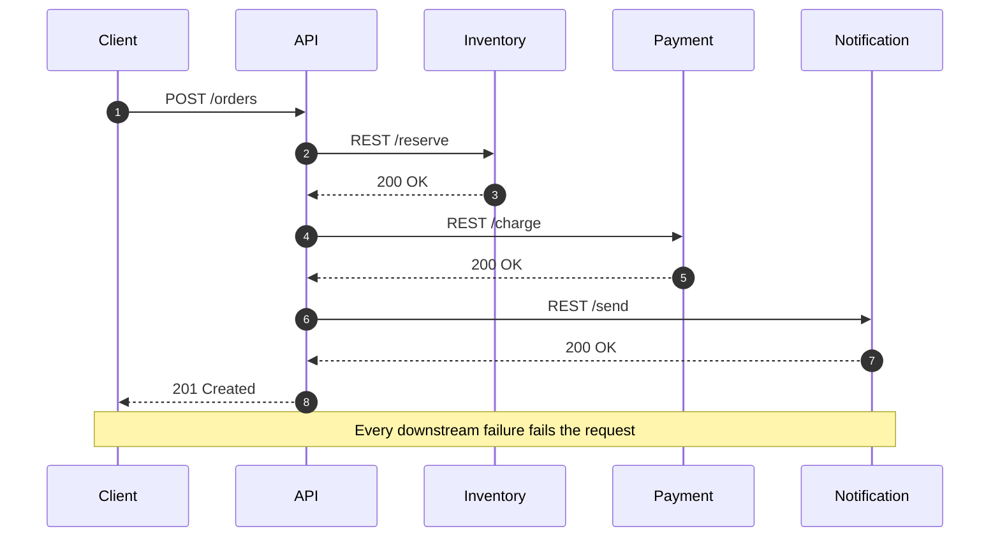

# Chapter 7: Message Queues & Event-Driven Architecture

> **Estimated Time:** 4–6 hours | **Prerequisites:** Chapters 1–6<br>
> **Last reviewed:** 2026-08-31 | **Level:** Foundation → applied → production judgment

---

## Learning Objectives

By the end of this chapter, you will be able to:

1. **Distinguish message queues, pub/sub, and event streaming**
2. **Choose the right messaging pattern** for a given use case
3. **Design event-driven systems** with proper ordering and delivery guarantees
4. **Implement reliable consumers** with explicit retry, offset, idempotency, and reconciliation boundaries
5. **Architect Kafka-based** data pipelines for real-time analytics
6. **Handle backpressure** in asynchronous workflows
7. **Troubleshoot common patterns** such as poison messages, replay, consumer lag, and duplicate delivery

---

## 7.1 Why Messaging Matters

### Synchronous vs Asynchronous Communication



### Monolithic Coupling

```text
SYNCHRONOUS CHAIN:
  Client -> API -> Inventory -> Payment -> Notification
  └──────┬──────┘
         │
         ├─ Problem 1: cascading latency (sum of all RTTs)
         ├─ Problem 2: cascading failure (downstream outage blocks upstream)
         ├─ Problem 3: no load leveling
         └─ Problem 4: brittle runtime contract

COMMUNICATION MATRIX:
  Services that need to talk: N x N direct calls
  10 services -> 45 integrations
  100 services -> 4950 integrations
```

### Asynchronous Coupling

```text
EVENT-DRIVEN / QUEUE-BASED:
  Client -> API -> OrderCreated -> Queue
                               ├─ Inventory (async)
                               ├─ Payment (async)
                               └─ Notification (async)
  ┗━ Each consumer independent
  ┗━ Failure isolation
  ┗━ Natural replay
  ┗━ Load leveling
  ┗━ Loose temporal coupling
```

---

## 7.2 Messaging Model Taxonomy

```text
REQUEST/RESPONSE:
  • HTTP, gRPC, GraphQL
  • Strong temporal coupling
  • Direct caller -> callee

MESSAGE QUEUE (point-to-point):
  • RabbitMQ, SQS, ActiveMQ
  • One producer, one consumer per message
  • Work distribution, task queues, load leveling

PUBLISH/SUBSCRIBE (topic-based):
  • Redis Pub/Sub, MQTT, NATS
  • One message -> many consumers
  • Fanout, notifications, broadcast

EVENT STREAMING (log-based):
  • Kafka, Pulsar, Redpanda, NATS JetStream
  • Retained log, multiple consumer groups
  • Replay, ordering, durable audit
```

```text
MODEL COMPARISON:
┌─────────────────────┬──────────────┬──────────────┬──────────────────┐
│ Property            │ Queue        │ Pub/Sub      │ Event Streaming  │
├─────────────────────┼──────────────┼──────────────┼──────────────────┤
│ Multiple consumers  │ No (1 per    │ Yes (all     │ Yes (multiple    │
│ for same message    │  queue)      │  subscribers)│  consumer groups)│
│ Message retention   │ Until ack    │ No (unbounded│ Yes (configurable│
│                     │              │  or short)   │  retention)      │
│ Replay              │ No           │ No           │ Yes (rewind)     │
│ Ordering            │ Per-queue    │ Per-topic    │ Per-partition    │
│ Scale (msg/sec)     │ 10K-1M       │ 10K-1M       │ 1M-10M+          │
│ Throughput           │ Moderate     │ Moderate     │ Very high        │
│ Memory reroute       │ Slow (queue) │ Fast (push)  │ Fast            │
│ Typical use case     │ Tasks, jobs  │ Alerts, feeds│ Analytics, logs  │
└─────────────────────┴──────────────┴──────────────┴──────────────────┘
```

---

## 7.3 Messaging Use Cases

### Work Distribution

```text
Producer generates webhook deliveries.
Consumer cluster processes webhooks in parallel.

API Gateway ──┐
             │
    ┌────────▼───────┐
    │ Message Queue  │
    │ (RabbitMQ/SQS) │
    │                │
    └────┬─────┬─────┘
         │     │     │
    ┌────▼──┐ ┌▼────┐ ┌▼────┐
    │Worker │ │Worker│ │Worker│
    │  1    │ │  2   │ │  3   │
    └───────┘ └─────┘ └─────┘
```

**Patterns:**
- Competing consumers
- Visibility timeout (SQS)
- Retry + dead letter queue (DLQ)
- Rate limiting per tenant

### Fanout / Notifications

```text
OrderCreated event published to topic "orders"
     │
     ├──► Inventory Service
     ├──► Payment Service
     ├──► Shipping Service
     ├──► Analytics Service
     └──► Notification Service

Definitions:
  • Event = immutable fact, past tense
  • Consumers process independently
  • Loose coupling (unknown downstream consumers)
  • New consumer added without producer changes
```

### Log Aggregation

```text
Web servers -> Kafka topic "access-logs"
ETL consumers -> S3 / Data Lake
Stream processors -> Elasticsearch
Ad-hoc consumers -> Spark / Flink jobs
Replay consumer -> Backfills analytics
```

### Change Data Capture (CDC)

```text
WAL ------------> Debezium/Kafka Connect ------------> Downstream
  (Post)             │
                      ├─► Search (Elasticsearch)
                      ├─► Cache invalidation (Redis)
                      ├─► Analytics (ClickHouse)
                      ├─► Notifications (email/SMS)
                      └─► ML training pipeline
```

---

## 7.4 RabbitMQ Deep Dive

```text
EXCHANGE TYPES:
  Fanout Exchange       ✔
    └── routes to ALL bound queues

  Direct Exchange       ✔
    └── routes to queues with matching routing key

  Topic Exchange        ✔
    └── pattern matches routing key (*, #)

  Headers Exchange      ✔
    └── matches on message headers

  Consistent Hash Exch. ✔
    └── distribution by hash(key)
```

```yaml
Broker: RabbitMQ, ActiveMQ, AmazonMQ
Transport: AMQP 0.9/1.0, MQTT, STOMP
Model: push-based, smart broker, dumb consumer
Persistence: queue/message durability
Ack model: manual ack, requeue on reject (DLQ)
Ordering: per-queue (1 consumer at a time -> strict)
Routing: exchange -> queue bindings
Delivery: depends on publisher confirms, durability, acknowledgements, retry,
          expiry, and dead-letter configuration
```

```python
import aio_pika

async def publish_example():
    connection = await aio_pika.connect_robust("amqp://localhost/")
    async with connection:
        channel = await connection.channel()
        await channel.default_exchange.publish(
            aio_pika.Message(
                body=json.dumps({"order_id": 123}).encode(),
                delivery_mode=aio_pika.DeliveryMode.PERSISTENT,
            ),
            routing_key="orders",
        )
```

---

## 7.5 Amazon SQS Deep Dive

**Use cases:** distributed queues, workload distribution, microservices decoupling

```text
SQS QUEUE TYPES:
┌────────────────────┬────────────────────┬────────────────────┐
│                     │ Standard           │ FIFO              │
├────────────────────┼────────────────────┼────────────────────┤
│ Throughput          │ Service quota and workload dependent    │
│ Delivery order      │ Best-effort        │ Strict FIFO       │
│ Deduplication       │ No                 │ Content-based dedup│
│ Latency             │ Slightly lower     │ Higher            │
│ Use when            │ High throughput    │ ordered processing│
│                     │ order not critical │ per message group │
└────────────────────┴────────────────────┴────────────────────┘
```

```python
import boto3

sqs = boto3.client("sqs", region_name="us-east-1")
queue_url = sqs.get_queue_url(QueueName="orders")["QueueUrl"]

# Send message
sqs.send_message(
    QueueUrl=queue_url,
    MessageBody=json.dumps({"order_id": 123}),
    MessageGroupId="customer_alice",  # required for FIFO parallelism
    MessageDeduplicationId="abc123",  # required for FIFO dedup
)

def consume_sqs():
    while True:
        resp = sqs.receive_message(
            QueueUrl=queue_url,
            MaxNumberOfMessages=10,
            WaitTimeSeconds=20,
        )
        for msg in resp.get("Messages", []):
            try:
                process(msg["Body"])
                sqs.delete_message(
                    QueueUrl=queue_url,
                    ReceiptHandle=msg["ReceiptHandle"],
                )
            except Exception as exc:
                # Message will reappear after visibility timeout
                logger.exception("processing failed: %s", exc)
```

**Notes to avoid pitfalls:**
- Visibility timeout must be longer than maximum processing time
- Too-short timeout = poison loop and DLQ pressure
- FIFO limits: 300/s per message group without batching, up to 3,000/s with batch

```text
SQS DESIGN:
  ✅ Set meaningful wait time (up to 20s)
  ✅ Use batch APIs where possible
  ✅ Use separate DLQ with alarm
  ✅ Avoid short retry intervals that exhaust limits
  ❌ Do not use SQS as a real-time control plane due to latency
```

---

## 7.6 Redis Pub/Sub and Streams

```text
REDIS PATTERNS:
  Pub/Sub:
    - fast, no backlog, high-frequency events
    - use for live notifications, websockets, presence

  Streams:
    - durable, replayable, consumer groups
    - use for persistent job queues and event logs

  List:
    - simple queue semantics, blocking-pop patterns
    - use where Redis Streams API isn't needed
```

```python
import redis.asyncio as redis

redis_client = redis.Redis(host="redis", port=6379, decode_responses=True)

async def stream_example():
    async with redis_client.pipeline(transaction=True) as pipe:
        await pipe.xadd("jobs", {"order_id": "123", "action": "process"})
        streams = await pipe.xpending_range(...)

# Consumer group example
while True:
    msgs = await redis_client.xreadgroup(
        groupname="workers",
        consumername="worker-1",
        streams={"jobs": ">"},
        count=10,
        block=1_000,
    )
    for stream, entries in msgs:
        for entry in entries:
            await redis_client.xack("jobs", "workers", entry[0])
```

### Redis Pub/Sub pitfalls

Publish/subscribe does not persist messages. When a subscriber is not connected, messages are lost. Also, Redis Pub/Sub lacks ordering guarantees independent of publish rate and subscriber capacity.

Use Redis Streams instead in these cases:
- producer and consumers may be out of sync
- consumer must replay from a certain point
- message volume is high and must be persisted

---

## 7.7 Apache Kafka Deep Dive

Kafka is a distributed log providing ordering, replay, and scalable segmented consumers over shared topics. It is frequently the backbone of streaming data platforms.

### Core concepts

```text
TOPIC := named log
  partitions        -> ordered within a partition
  replication factor -> depends on durability SLA

PRODUCER -> writes to partition by key hash or manual choice

CONSUMER GROUP:
  shared subscription across worker tasks
  offset per partition owned by exactly one consumer in group
  adding consumers can rebalance partitions

OFFSET:
  commit to mark message as processed
  manual vs auto commit strategies
  replay by seeking to arbitrary offset

RETENTION:
  time-based and size-based
  enables replay windows and late-joining consumers
```

### Topic design

Preferred topic structures for borderline professional systems:

```text
Domain topics:
  orders, payments, inventory, shipments, notifications

Event granularity:
  order.created, order.reserved, order.cancelled, order.fulfilled
  payment.authorized, payment.captured, payment.refailed

Data types commonly handled by Kafka:
  application events
  metrics
  change data capture events
  audit trail
  feature flag updates
```

### Delivery guarantees in Kafka

- At-most-once attempt: acknowledge or advance before processing; a crash can lose work
- At-least-once attempt: retry and advance only after processing; duplicates remain possible
- Kafka transactional scope: atomically consume and produce Kafka records when configured correctly
- Effectively-once business outcome: enforce an idempotency/business key at every external side effect

---

## 7.8 Delivery Semantics and Idempotency

### Atomicity Has a Boundary

```python
def process(record):
    with db.transaction():
        apply(record)
        store_offset(record.offset, transaction=True)
```

This pattern works only when `store_offset` uses the same transactional
database as the state change and partition ownership is handled correctly. A
Kafka offset commit and an unrelated database transaction are not atomic. Use
Kafka transactions for Kafka-to-Kafka flows, or an inbox/outbox and a unique
business key for external state.

### Duplicates remain possible

Even with Kafka EOS, producers can retry and yield duplicate writes. Consumers can rebalance and reprocess after a crash. Use idempotency keys or business keys to detect duplicates.

```python
def handle_order_event(event):
    event_id = event["event_id"]
    with db.transaction():
        # A UNIQUE constraint makes concurrent duplicate claims atomic.
        if not processed_table.try_insert(event_id):
            return
        apply(event)
```

### Poison messages and DLQs

Retry only failures classified as transient and only within a bounded time
budget. Quarantine permanent or poison records with enough context to replay
them safely; define an owner and a maximum acceptable age.

```text
Recommended pattern:
  bounded automatic retries with exponential backoff and jitter
  then move to <topic-name>.dlq
  maintain failure reason, original timestamp, original offset
  alert on DLQ depth to trigger triage
```

---

## 7.9 Consumer Design Patterns

### Partition assignment and batching

```python
def process_batch(records):
    results = []
    for record in records:
        results.append(transform(record))
    bulk_insert(results)
    commit_offsets([r.offset for r in records])
```

Recommended practices:
- process in batches to amortize transaction cost
- pause the consumer during long processing to avoid rebalancing pressure
- control max poll interval and max.poll.records to fit SLOs

### Rebalance and session management

Rebalance events pause all consumption while partitions move. Mitigate by:
- assigning stateless consumer logic
- keeping processing time under session timeout
- using cooperative rebalancing where supported
- scaling consumer count based on partition count

### Offset retention and governance

```text
Rules that prevent incidents:
  offsets are owned by consumer group, not consumer instance
  do not delete topics during active consumption
  set compression.type=producer on producer side
  monitor consumer lag per partition per group
  alert on lag beyond a threshold aligned with SLA
```

---

## 7.10 Schema and Compatibility

Schema is a contract. Managed topic schemas prevent silent breaking changes.

```text
Compatibility levels:
  BACKWARD: new schema can read old data
  FORWARD: old schema can read new data
  FULL: both directions
  NONE: no validation
```

```python
from confluent_kafka.schema_registry import SchemaRegistryClient

schema_registry = SchemaRegistryClient({"url": "http://schema-registry:8081"})

def register_event_schema(subject, schema_str, compatibility="BACKWARD"):
    schema_registry.register_schema(
        subject,
        schema_str,
        compatibility=compatibility,
    )
```

For schemas:
- version clearly
- integrate into CI so PRs fail when schema is incompatible
- choose avro or protobuf over raw json for efficiency and contract clarity

---

## 7.11 Backpressure and Load Shaping

Backpressure prevents overload and supports systems that cannot keep up with producers.

```text
When producer rate exceeds consumer rate, apply backpressure in order:

1. Kafka level:
   increase partitions for better parallelism
   tune batch.size and linger.ms

2. Consumer level:
   reduce max.poll.records
   add consumer instances

3. Process level:
   inspect processing latency and pause consumer when high
   drop non-critical traffic
   limit in-flight requests per consumer instance

4. System level:
   rate limit per producer
   use separate tiered topics by priority
```

Backpressure is a property of the full request path. Designing for backpressure requires visible metrics such as consumer lag and end-to-end processing latency.

---

## 7.12 Operations and Disaster Recovery

### Monitoring signals

Must-track metrics for messaging infrastructure:
- producer throughput and error rate per topic
- consumer lag per consumer group and partition
- broker disk usage and replication lag
- request latency per broker
- under-replicated partitions count
- offline partition count
- request handler idle ratio

### Disaster recovery practices

- select replication factor and minimum in-sync replicas from the failure model
- use producer acknowledgements and idempotence that match the durability requirement
- design topics for idempotent consumers so replay is cheap
- scripted restore: producers replay from persisted offset instead of reprocessing the exact same business events
- isr shrink policy tuned to fail fast enough to keep SLO

```text
Kafka operations checklist:
  - monitor isr shrink rate
  - configure log retention to meet replay needs
  - enable tiered storage for long-lived large topics
  - set JMX port and integrate with Prometheus exporter
  - follow the deployed release's official rolling-upgrade procedure
```

---

## 7.13 Exercises

### Exercise 1 — Foundation: Pattern Selection

For each scenario, choose the appropriate messaging tool and justify:
- task-based image processing pipeline
- real-time multiplayer game state broadcasts
- financial trade audit trail
- notification service sending email and SMS
- IoT telemetry ingestion and aggregation

### Exercise 2 — Applied: Idempotency Design

Design an idempotent consumer for orders that may be retried. Include offset commit, idempotency key handling, and a DLQ strategy.

### Exercise 3 — Applied: Backpressure Design

A producer can burst up to 200k records per second. Each consumer processes roughly 5k records per second. Design backpressure and scaling mechanisms using Kafka.

### Exercise 4 — Advanced: Reliability Design

Design a cross-region Kafka deployment. Answer:
- replication strategy for geo resilience
- disaster recovery steps for broker loss
- producer and consumer behavior during partition leader failover

---

## 7.14 Further Reading

- *Designing Data-Intensive Applications* — Martin Kleppmann
- *Kafka: The Definitive Guide* — Neha Narkhede
- *Enterprise Integration Patterns* — Gregor Hohpe and Bobby Woolf
- Confluent blog on idempotent producers and transactions
- RabbitMQ tutorial documentation and reliability guide

---

## 7.15 Summary Checklist

- [ ] can explain when to use queues vs pub/sub vs streaming
- [ ] can state the atomicity boundary and design an effectively-once business outcome
- [ ] can choose partition count for a new topic
- [ ] can describe replay scenarios and their operational requirements
- [ ] can reason about consumer lag and its causes
- [ ] can decide between SQS and Kafka for a given workload
- [ ] can explain flow control and backpressure in message-driven systems
- [ ] can define a schema compatibility strategy for shared topics
- [ ] can design a poison message and DLQ handling workflow
- [ ] can describe disaster recovery and replay for messaging infrastructure

---

> Next: [Chapter 8: Load Balancing & Traffic Management](./08-load-balancing-traffic-management.md)
