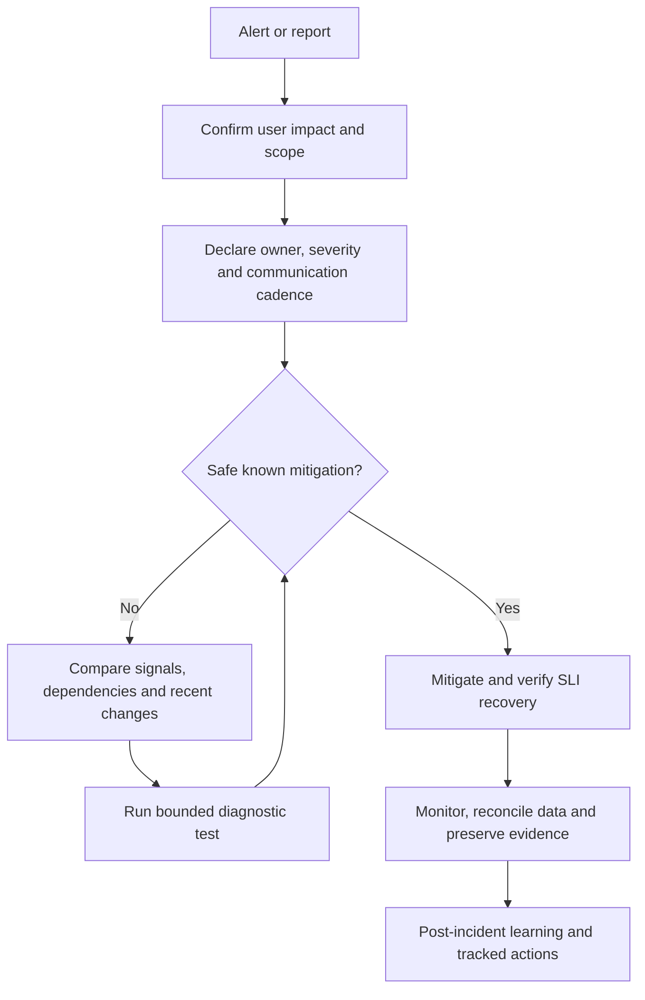

# Chapter 13: System Engineer Cheat Sheets

> **Estimated Time:** 3–4 hours | **Prerequisites:** Chapters 1–12<br>
> **Last reviewed:** 2026-08-31 | **Level:** Operational reference with progressive exercises

---

## Using This Chapter

This chapter is designed as a **quick reference**. Each sheet answers the question a system engineer asks most often. Keep this chapter open during design reviews, war rooms, and migrations.

---

## 13.1 Scale Estimation Cheat Sheet

```text
ILLUSTRATIVE LATENCY ORDERS OF MAGNITUDE (benchmark your hardware/path):
  L1 cache reference                        0.5 ns
  L2 cache reference                        7 ns
  L3 cache reference                       20 ns
  main memory reference                   100 ns
  compress 1KB with Zstd                   10 us
  send 1KB over 1 Gbps network             10 us
  read 1MB sequentially from SSD          150 us
  round trip same datacenter                 0.5 ms
  round trip across continent                150 ms

STORAGE SIZING:
  1 KB         1,024 bytes              1 MB         1,048,576 bytes
  1 GB         1,073,741,824 bytes      1 TB         1,099,511,627,776 bytes

SUFFIXES IN COMPUTING:
  kilo   ~ 1,024
  mega   ~ 1,048,576
  giga   ~ 1,073,741,824
  tera   ~ 1,099,511,627,776
```

```text
BACK OF THE ENVELOPE FORMULAS:
  daily active users = monthly active users * activity_ratio
  QPS = requests per second = total_requests / seconds
  peak QPS = measured peak factor * average QPS
  storage per year = daily_data * 365
  replication traffic = logical writes * remote copies, adjusted for protocol/compression
```

---

## 13.2 Database Selection Cheat Sheet

```text
IF data is:
  structured and relations matter:
    ACID required and moderate scale -> PostgreSQL or MySQL
    huge scale and eventually consistent -> Cassandra, ScyllaDB
    globally distributed SQL -> CockroachDB, TiDB, Spanner

  document oriented and flexible schema:
    moderate scale -> MongoDB or DocumentDB
    serverless with strong consistency -> Firestore

  search and full text:
    search and analytics workload -> Elasticsearch or OpenSearch

  time series:
    metrics and monitoring -> Prometheus, InfluxDB, TimescaleDB
    IoT ingest -> TimescaleDB or InfluxDB

  graph queries:
    Neo4j for small to medium
    Neptune or JanusGraph for distributed

  append only events:
    Kafka or Pulsar for streaming
    EventStoreDB when event sourcing is central
```

---

## 13.3 Caching Cheat Sheet

```text
WHAT NOT TO CACHE:
  - frequently changing prices and inventory at write time
  - data without predictable access patterns
  - personal private data without careful isolation
  - write heavy data with no read amplification

CACHE PATTERNS:
  cache aside              read path adds cache manually
  read through             cache itself reads from source
  write through            write to cache and source synchronously
  write behind             write to cache first, async source
  refresh ahead            refresh stale entries proactively
```

```text
CACHE LAYERS:
  browser -> CDN -> API Gateway cache -> application cache -> distributed cache -> database cache -> OS page cache

TTL GUIDELINES:
  reference data          hours to days
  hot profiles            minutes to 1 hour
  session data            minutes
  computed aggregations  minutes
  write heavy data        do not cache or seconds only
```

---

## 13.4 Load Balancing Cheat Sheet

```text
ALGORITHM CHOICE:
  homogeneous short request      round robin or least connections
  heterogeneous capacity         weighted round robin or least connections
  long lived connections         least connections
  stateful affinity needed       consistent hashing or IP hash
  mixed latency characteristics   least response time
```

```text
L4 VS L7:
  choose L4 for TCP passthrough or maximum throughput
  choose L7 for HTTP routing, WAF, header manipulation, path based rules

HEALTH CHECK:
  /healthz or /ready for readiness
  success = 200
  failure threshold = 2
  recovery threshold = 2
  interval = 5 to 10 seconds
  timeout = 2 seconds
```

---

## 13.5 Messaging Cheat Sheet

```text
CHOOSE BY GUARANTEE:
  at most once with no backlog          Redis Pub/Sub
  at least once with durable backlog    SQS, RabbitMQ
  replay and per-partition ordering     Kafka, NATS JetStream, Pulsar

ONE MESSAGE MUST REACH MANY:
  RabbitMQ fanout exchange, SNS, Redis Pub/Sub
ONE MESSAGE MUST REACH ONE CONSUMER ONLY:
  SQS, RabbitMQ direct queue, Redis List

RETENTION REQUIREMENT:
  bounded retained replay      Kafka, Pulsar
  bounded retry                SQS, RabbitMQ with TTL
```

---

## 13.6 Monitoring Cheat Sheet

```text
GOLDEN SIGNALS:
  latency
  traffic
  errors
  saturation

RED METHOD:
  rate, errors, duration for services

USE METHOD:
  utilization, saturation, errors for resources

ALERT SHOULD PAGE WHEN:
  customer impact is active and high
  SLA breach is imminent if not fixed
  manual intervention required immediately
```

---

## 13.7 DNS and CDN Cheat Sheet

```text
RECORD ESSENTIALS:
  A       IPv4 address
  AAAA    IPv6 address
  CNAME   alias to another name
  MX      mail server
  TXT     verification and policy
  SRV     service location
  CAA     certificate authority allowlist
  PTR     reverse DNS

TTL GUIDELINES:
  static web content      hours to days
  critical failover       minutes
  healthy long lived      hours to days
  experimental change     minutes while testing
```

---

## 13.8 Linux Performance Cheat Sheet

Run read-only commands first. Confirm namespace, cluster/context, permissions,
data sensitivity, and expected load before packet capture, `exec`, tracing, or
commands that enumerate other tenants.

```text
DISK AND FILESYSTEM:
  df -h
  du -sh /path/*
  iostat -xz 1
  iotop -oP

MEMORY:
  free -h
  vmstat -S m 1
  cat /proc/meminfo

CPU:
  top -bn1 | head -20
  mpstat -P ALL 1
  pidstat 1

NETWORK:
  ss -s
  ss -tnp state established
  ss -tuln
  ip -br link show
  ip -br addr show
  nstat -az

SYSTEM:
  uptime
  dmesg | tail -n 50
  journalctl -u unit -n 100
  systemctl status
```

---

## 13.9 Kubernetes Quick Reference

```text
BASICS:
  kubectl get pods,svc,deploy,nodes -o wide
  kubectl describe pod,node,svc
  kubectl logs deploy/service -c container --previous
  kubectl exec -it pod -- sh  # mutating/debug access; audit and restrict

LIVE DEBUG:
  kubectl top pod,node
  kubectl get events --sort-by='.lastTimestamp'
  kubectl get pods -o yaml
  kubectl auth can-i list pods --as system:serviceaccount:default:default

TROUBLESHOOTING:
  kubectl get pods -o wide
  kubectl get endpoints,ep
  kubectl describe svc
```

---

## 13.10 Security Quick Reference

```text
TLS:
  prefer TLS 1.3; allow TLS 1.2 only under current compatibility/security policy
  follow current TLS BCP and platform defaults
  rotate certificates automatically

SECRETS:
  never in code or logs
  short lived credentials preferred
  audit all access

AUTH:
  choose phishing-resistant human auth and short-lived workload credentials
  use mTLS when workload authentication and transport encryption are required
  least privilege with explicit allow lists
```

---

## 13.11 Network Tools Quick Reference

```text
PING AND ROUTING:
  ping
  traceroute
  mtr
  tracepath

TCP STATE AND CONNECTIONS:
  ss -s
  ss -tnp state established
  ss -tuln

DNS:
  dig
  dig +trace
  resolvectl query

TLS:
  openssl s_client -connect host:port
  openssl x509 -in cert.pem -text -noout

CAPTURE AND ANALYSIS:
  tcpdump -i any -nn -w capture.pcap
  tshark -r capture.pcap -Y "tcp.flags.reset==1"
  ngrep port 443
```

---

## 13.12 Release and Rollback Checklist

```text
ROLL FORWARD:
  deploy to staggered instances
  health check after each wave
  traffic shifted incrementally
  canary signals reviewed
  rollback automation armed

ROLLBACK:
  identify committed change and scope
  run rollback automation or manual manifest revert
  validate service recovery
  communicate timeline and customer impact
  preserve artifacts for postmortem
```

---

## 13.13 On-Call Runbook Template



```text
INCIDENT RESPONSE:
  1. acknowledge alert
  2. establish incident commander
  3. create incident channel or bridge
  4. declare severity and customer impact

INVESTIGATION ORDER:
  1. recent changes, deployments, config updates
  2. current metrics, dashboards, SLI status
  3. logs complaining across affected service
  4. dependent services and upstream providers
  5. traffic samples, traces, and access logs

MITIGATION BEFORE ROOT CAUSE:
  - restart only when the failure mode and data-safety impact are understood
  - rollback last change
  - route traffic away from failed region
  - scale out if saturation
  - enable degraded mode if available

COMMUNICATION:
  use a declared cadence appropriate to severity and stakeholder needs
  first message should include impact and triage focus
  update status page when public
  publish the initial summary within the organization's incident policy
```

---

## 13.14 Capacity and Scaling Cheat Sheet

```text
CPU BOUND:
  increase count or CPU size
  optimize hot code path
  use profiling before optimizing

MEMORY BOUND:
  increase memory
  optimize allocation and retention
  use caching to reduce recomputation

IO BOUND:
  increase IOPS and throughput capable storage
  use connection pooling and buffering
  async processing and queue decoupling
  review indexes and queries

SCALING ORDER:
  queries and indexes
  caching layers
  read replicas
  sharding or partitioning
  service extraction
```

---

## 13.15 Exercises

### Exercise 1 — Applied: Performance Triage

You manage a payments API experiencing p99 latency of 620ms and error rate above 1%. Use this chapter to build a prioritized investigation checklist covering load balancer, application, runtime, database, messaging, and network urgency based on time to action.

### Exercise 2 — Foundation: Design Checklist

You design a new feature flag service to manage releases and experiments across 80 services. Use this chapter as a checklist for requirement validation, scale estimation, service design decisions, deployment model, failure mode resilience, and monitoring needs.

### Exercise 3 — Advanced: On-Call Runbook

You receive an alert at 2 AM that API latency has exceeded SLO. Build an on-call runbook for this service including triage steps, mitigation tactics in priority order, rollback criteria, and post-incident review template.

---

## 13.16 Further Reading

- *The Linux Performance Counters and Tracing Guide* — Brendan Gregg
- *System Performance* — Brendan Gregg
- *Kubernetes Documentation* — kubernetes.io
- *AWS Well-Architected Labs* — aws.amazon.com
- *Google SRE Book* — sre.google
- Vendor CLI and service documentation used daily

---

> Next: [Chapter 14: Real-World Case Studies](./14-case-studies.md)
