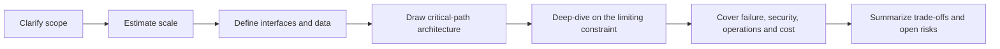

# Chapter 15: Interview Preparation Guide

> **Estimated Time:** 4–6 hours | **Prerequisites:** Chapters 1–14<br>
> **Last reviewed:** 2026-08-31 | **Level:** Foundation → deliberate practice → interview simulation

---

## Learning Objectives

By the end of this chapter, you will be able to:

1. **Structure system design interviews** with a repeatable process
2. **Communicate clearly** under pressure with diagrams and narratives
3. **Answer behavioral questions** using behavioral and situational frameworks
4. **Demonstrate trade-off thinking** instead of one right answer
5. **Strengthen weak areas** with targeted practice problems
6. **Navigate system design questions** from initial requirements to production concerns
7. **Prepare logistics and mindset** for success

---

## 15.1 Interview Formats

### System design interview

```text
FORMAT:
  open-ended design problem presented by interviewer
  45 to 60 minutes
  whiteboard or collaborative editor
  evaluate process, communication, and depth

WHAT IS EVALUATED:
  ability to gather requirements
  ability to decompose problem
  ability to evaluate trade-offs
  ability to consider operational concerns
  communication and collaboration
  technical depth and experience

WHAT TO AVOID:
  jumping to one technology immediately
  monologue without diagrams
  ignoring nonfunctional requirements
  forgetting high availability or security
  ignoring cost and operational burden
```

### Coding interview

```text
FORMAT:
  algorithm or data structure problem
  coding in preferred language
  clean code and tests when expected

PREPARE:
  data structures: arrays, linked lists, hash maps, trees, heaps, graphs
  algorithms: sorting, searching, greedy, divide and conquer, dynamic programming
  system-friendly topics: rate limiting, LRU cache, consistent hashing
```

### Networking and OS interview

```text
TOPICS:
  OSI model and practical implications
  TCP connection lifecycle and tuning
  HTTP semantics and caching headers
  process lifecycle, signals, and file descriptors
  IPC, threads, and async patterns
  container runtime basics
```

---

## 15.2 System Design Framework

### Step-by-step approach



For a 45-minute interview, a useful starting budget is 5 minutes for scope,
5 for estimates/interfaces, 10 for the high-level design, 15 for the requested
deep dive, and 10 for production concerns and summary. Adapt immediately when
the interviewer redirects the discussion.

```text
STEP 1: REQUIREMENTS
  functional requirements
  nonfunctional requirements
  scale estimation
  what could reasonably change before launch

STEP 2: API DESIGN
  resource model
  key operations
  request and response examples
  versioning and backward compatibility

STEP 3: DATA MODEL
  entities and relationships
  primary keys and indexes
  write and read patterns
  consistency needs

STEP 4: HIGH LEVEL ARCHITECTURE
  major components
  data flow
  storage, caching, messaging
  load balancers and edge

STEP 5: DEEP DIVE
  scaling bottleneck analysis
  sharding and partitioning
  replication and consistency
  async processing and backpressure

STEP 6: PRODUCTION CONCERNS
  monitoring and observability
  deployment and rollback
  security
  disaster recovery
  cost
```

### Thinking aloud rules

```text
STATE ASSUMPTIONS:
  say when you assume a constraint
  ask clarifying questions along the way
  prioritize what matters and deprioritize explicitly

EXPLAIN TRADE-OFFS INSTEAD OF JUST ONE CHOICE:
  instead of Cassandra is best, say:
    "A wide-column store may fit known high-write access patterns,
     but it trades away flexible relational queries. If multi-row transaction
     semantics are required, I would evaluate distributed SQL and measure its
     latency, availability, operational, and cost trade-offs."

LEAVE TIME FOR ELABORATION:
  reserve time for the deep dive
  the interviewer will guide where to zoom in

PRODUCE DIAGRAMS AND NUMBERS:
  draw system diagrams
  compute sizes or rates
  numbers reveal whether scale fits assumptions
```

---

## 15.3 Behavioral and Situational Questions

### STAR framework

```text
SITUATION:
  concise context: team size, constraint, stakes

TASK:
  what was your responsibility or decision

ACTION:
  what you actually did
  be specific and describe rationale

RESULT:
  outcome and business impact
  include metric change when possible
  reflection on what you learned
```

### Leadership principles mapping

```text
COMMON THEMES:
  ownership and driving results
  customer obsession
  bias for action and speed
  learning curiosity and humility
  delivering quality
  hiring and mentoring others
  disagree and commit
  dealing with ambiguity and competing priorities
```

### Sample behavioral questions and angle

```text
Tell me about a time you had a production incident.
  emphasize triage, communication, mitigation, postmortem

Tell me about a time you influenced a technical decision against popular opinion.
  focus on evidence, trade-offs, relationships, and outcome

Tell me about a time you had to simplify a complex system.
  focus on identifying complexity, stakeholder management, execution

Tell me about a time you missed a deadline or delivery.
  focus on detection, communication, mitigation, recovery, learning

Tell me about a time you had to collaborate with a difficult teammate.
  focus on understanding, alignment, process, outcome
```

---

## 15.4 Practice Problems by Topic

### System design problems

```text
BEGINNER:
  - design a URL shortener
  - design a rate limiter
  - design a web crawler
  - design a key-value store
  - design a notification system

INTERMEDIATE:
  - design a chat application
  - design a web analytics system
  - design a file sharing service
  - design a parking lot system
  - design a ticket booking system

ADVANCED:
  - design a distributed cache
  - design a search autocomplete system
  - design a distributed message queue
  - design a video streaming service
  - design a global file system
```

### Coding problems for system engineers

```text
- design and implement LRU cache
- design and implement a rate limiter
- design and implement a circular queue or ring buffer
- design and implement Bloom filter
- implement consistent hashing
- implement a simple scheduler with timeout and retry
```

### Network and OS problems

```text
- what happens when you type a URL and press enter
- explain TCP three-way handshake and time wait
- compare WebSocket, long polling, and SSE
- explain HTTP caching headers
- design caching headers for REST API and static assets
- explain how DNS works including recursive and iterative queries
- explain TLS handshake and session resumption
```

---

## 15.5 Evaluation Criteria Self-Assessment

```text
SYSTEM DESIGN:
  can you clarify requirements without being told?
  can you produce component diagrams quickly?
  can you compute and state scale assumptions?
  can you evaluate more than one trade-off?
  can you address availability and security explicitly?
  can you consider cost and operations?

COMMUNICATION:
  do you explain before drawing?
  do you invite the interviewer into the design?
  do you use terms the interviewer can follow?
  do you acknowledge constraints instead of ignoring them?

DEPTH:
  can you explain why one pattern fits better than another?
  can you describe failure modes?
  can you explain latency and throughput impact of a decision?
```

---

## 15.6 Exercises

### Exercise 1 — Foundation: Timed Design

Practice system design for a web crawler in 30 minutes with diagrams and trade-offs.

### Exercise 2 — Applied: Behavioral Practice

Practice behavioral questions with a partner using STAR format for 40 minutes.

### Exercise 3 — Applied: Written Design

Write answers to three common system design questions with diagrams and numbers.

### Exercise 4 — Advanced: Mock Interview

Simulate a behavioral interview covering ownership, ambiguity, and technical influence.

### Exercise 5 — Advanced: Study Plan

Design a three month study plan to address weak areas identified from this chapter.

---

## 15.7 Further Reading

- *System Design Interview* — Alex Xu
- *Designing Data-Intensive Applications* — Martin Kleppmann
- *Grokking System Design Interview* — Inglish and Varma
- High Scalability blog
- Engineering blogs from system design interviewee perspective
- AlgoExpert, System Design Primer repositories

---

## 15.8 Summary Checklist

- [ ] can structure system design answers using the 6 step framework
- [ ] can produce legible diagrams and defensible estimates within the timebox
- [ ] can compare trade-offs instead of picking one right answer
- [ ] can answer behavioral questions using STAR
- [ ] can explain cache, queue, load balancer, database patterns
- [ ] can discuss production concerns during design
- [ ] can identify weak areas and design practice plan
- [ ] can present confidently under time pressure

---

## 15.9 Bonuses for Final Push

```text
DAY BEFORE INTERVIEW:
  review case study cheat sheet
  restudy weak topics only
  avoid last minute cramming of unknown areas

DURING INTERVIEW:
  think aloud
  ask clarifying questions
  draw before diving into implementation details
  acknowledge assumptions
  leave room for interviewer to guide

AFTER INTERVIEW:
  note weak areas
  review solutions from reputable resources
  reattempt problems if permitted
  continue practicing until confidence builds
```

---

> **Congratulations**: You have completed the foundation of modern system and network engineering. The next step is practice, real projects, and teaching others.

> **Return to**: [Table of Contents](./../README.md)

> **Appendices**:
> - [Appendix A: Glossary of Terms](./../appendices/glossary.md)
> - [Appendix B: Recommended Resources](./../appendices/resources.md)
> - [Appendix C: ADR Templates](./../appendices/adr-templates.md)
> - [Appendix D: System Design Checklist](./../appendices/system-design-checklist.md)
